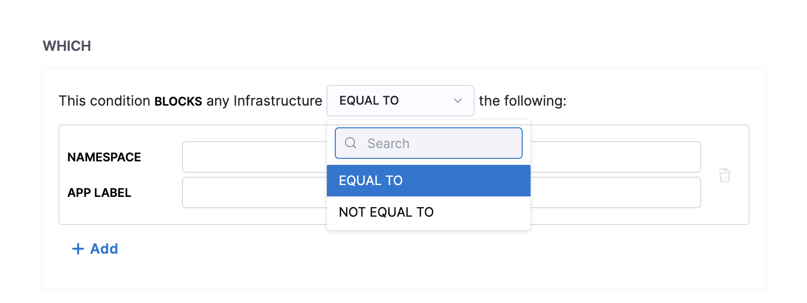
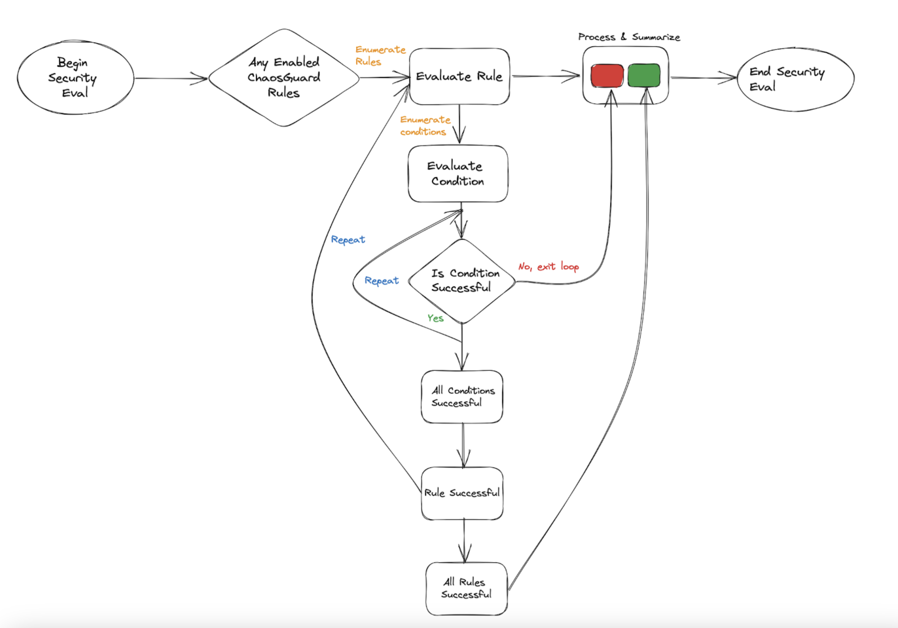

This section walks you through the concepts of [ChaosGuard](/docs/chaos-engineering/features/chaosguard/introduction-to-chaosguard.md) and how they enforce advanced security policies on a chaos-enabled platform.

## Before you begin

[Harness RBAC functionality](/docs/chaos-engineering/architecture-and-security/security/introduction.md) acts as a first-level security check (or deterrent) that you can leverage to prevent config-time security issues. It is a platform-wide, generic framework that counts resources from other Harness modules (such as CI/CD/Cloud Cost/Service Reliability, etc.) under its purview. However, chaos has additional requirements to enforce [execution-time security restrictions](/docs/chaos-engineering/features/chaosguard/introduction-to-chaosguard.md).

## ChaosGuard concepts

ChaosGuard consists two elements: **Condition** and **Rule**.

### Condition

Condition is an execution plane construct that is static, meaning it is often pre-defined (typically configured by the admin personas) and you can store it offline (such as in a conditions library or repository).

The default structure of a condition is to block or deny a fault or set of faults on a given **execution context** associated with a cluster (or namespace), the service(s), and the service account used for the injection process.

* **WHAT** clause describes the attribute (in this case, chaos fault) on which you can apply the condition. This field takes a regex-like pattern, that is, the * symbol, to indicate all characters preceding or succeeding a particular string.

    

* **WHERE** clause describes the name of the Kubernetes infrastructure where you can apply the condition.

    

* **WHICH** clause describes the namespace and the app label in which you can apply the condition. You can have more than one namespace and app label associated with a condition.

    

* **USING** clause describes the service account under which you apply the condition. You can have more than one service account configured for a condition.

    

:::tip
The service account refers to the Kubernetes or Openshift service account. This account is backed by a role (or ClusterRole) and is associated with a native or third-party security policy or admission controller within the cluster, such as PodSecurityPolicy (PSP), SecurityContextConstraint (SCC), Kyverno, OPA Gatekeeper, etc.
With ChaosGuard, by limiting the service account you (as a user) can use within your experiment definitions, HCE limits the privileges you can have within the cluster.
:::

### Rule
Rule is a high-level construct that controls the users to whom a given condition applies and for what period. It can be in an active (enabled) or passive (disabled) state. A rule can contain multiple conditions, and to ensure a successful evaluation, all constituent conditions must be fulfilled.

The example below describes the rule as **applicable on the cluster chaosday-k8s-cluster between [5 PM, Friday, Sept 15th] to [9 AM, Monday, Sept 18th] for the specific condition**.

:::tip
Creating the ChaosGuard rules is subject to Harness RBAC policies. By default, these rules are enabled only for the project admin. However, the admin can delegate this to trusted users (typically in multi- or secondary admin scenarios).

:::

## Flow of control
The security evaluation step iterates over every active (or enabled) rule for every experiment run in the project. If the evaluation is successful, you can proceed with the experiment. Upon failure, you can't iterate further in the experiment. Below is a flowchart that summarizes the flow of control when you enable a ChaosGuard rule for a fault or set of faults.

## Next steps
* [Configuring ChaosGuard](/docs/chaos-engineering/features/chaosguard/configuring-chaosguard.md)