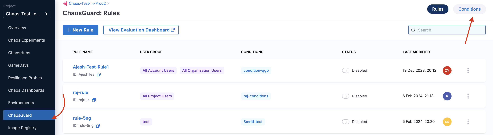
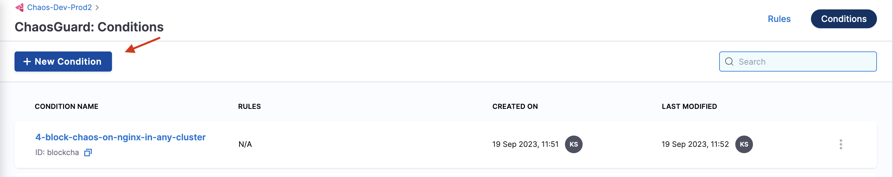
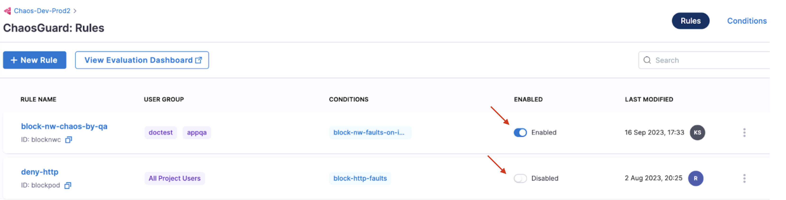

This section walks you through the configuration of ChaosGuard and how to enable it to mitigate potential security threats from chaos-enabled users with malicious intent.

## Before you begin

[Harness RBAC](./introduction-to-chaosguard) (role-based access control) serves as a prerequisite to understanding [ChaosGuard](./chaosguard-concepts), which serves as an execution-time security evaluation. 

## Configuring conditions
Conditions describe a set of constraints that are applied to an execution context. You can use both **'EQUAL'** and **'NOT EQUAL TO'** operators in conditions. You can also use wildcards within the condition entities, which offers flexibility and control in defining conditions.

To configure a condition,

1. Click **ChaosGuard** on the left-hand side of the **Chaos** homepage. Click **Conditions** on the top right corner of the ChaosGuard page. This displays the conditions that you created earlier. You can use one of these or create a new condition. 

2. To create a new condition, click **New condition**.

3. Provide a name, a description (optional), and tags (optional). Click **Save**. This saves the new condition you created.

This creates a blank canvas, and you can define the constraints for the condition using a YAML manifest or using the visual editor. 

### Add conditions using visual editor

1. To add conditions using a visual editor, navigate to the **visual** tab of condition you created earlier. 

	

2. Add the **WHAT** clause. In this case, the condition blocks a fault that is **equal to** (or matches) or **not equal to** (everything else apart from the given value) pod delete.

	

3. Add the **WHERE** clause. In this case, the condition blocks an infrastructure that is **equal to** `prod-2-infra` infrastructure.

	

4. Add the **WHICH** clause. In this case, the condition blocks the infrastructure that has `prod-2-infra` namespace and `app=chaos-exporter` app label.

	

5. Add the **USING** clause. In this case, the condition blocks the `litmus-admin` service account.

	

### Add conditions using visual editor

1. You can add conditions using the YAML too.

	

2. Click **YAML** and specify the relevant values corresponding to the respective names.

	

## Configuring rules

Rules consist of one or more **conditions** that are evaluated as a first step in the experiment run. To configure a rule,

1. Click **New rule**.

2. Specify parameters such as name, description (optional), tags (optional), user group to apply the rule (you can apply the rule to multiple user groups), and time window to apply the rule. You can apply multiple time windows to apply the rule. Click **Next**.

3. Select user groups. Click **Apply Selected**.

4. Select a condition (or multiple conditions) that you wish to apply. Click **Done**.

* Below is a snap that shows a successful evaluation of all the rules in a chaos experiment.

* Below is a snap that shows a failed evaluation of some (or all) rules in a chaos experiment.

## Enable and disable rules

* The image below shows the two different states of a rule (enable and disable).

