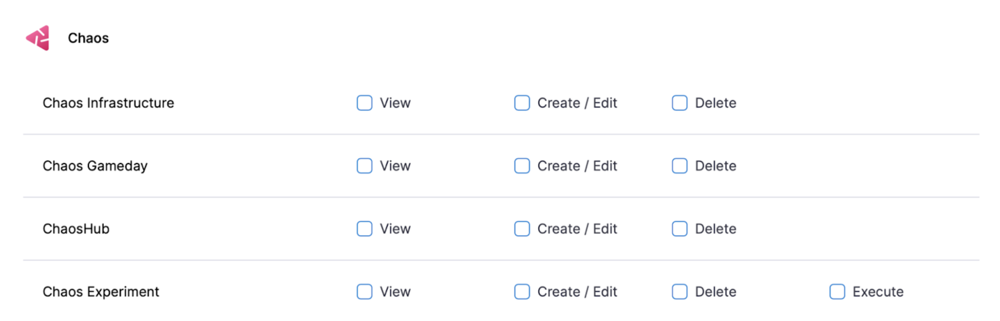
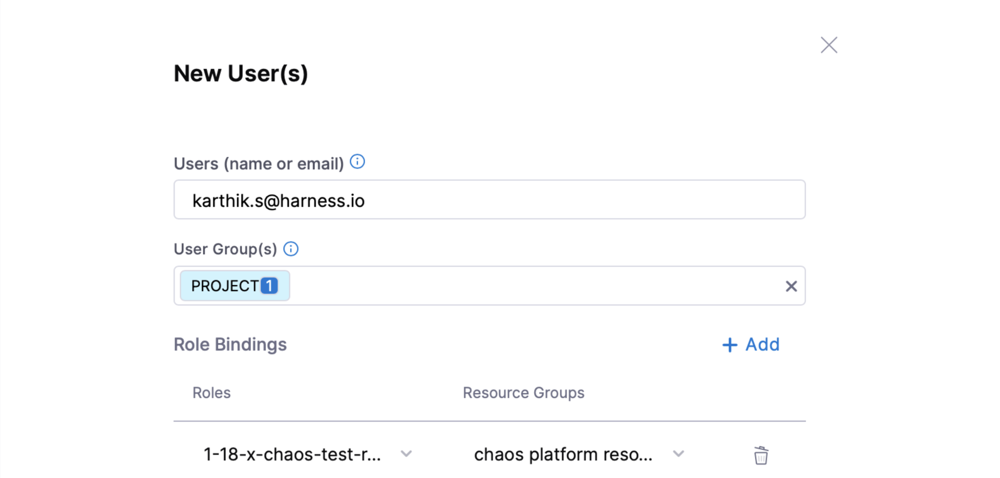

This section introduces you to ChaosGuard and describes how Harness provides RBAC (role-based access control) to users or user groups to access the **chaos resources** at different levels using **ChaosGuard**.

## What is ChaosGuard?

ChaosGuard, as the name suggests, is an additional level of security that guards chaos experiments from chaos-enabled users (users who have permission to execute chaos experiments).

Advanced environments require higher governance policies, and this level of security aims to minimize the blast radius (or disruption) and mitigate potential security threats from **chaos-enabled** users with malicious intent. This way, users with permission to execute chaos experiments will be subjected to further levels of security policy enforcement.

The different levels of security policy enforcement include (but are not limited to):
1. Regulating access to chaos infrastructure (i.e., namespace and clusters) within the environment,
2. Controlling the types of faults that can be used within these infrastructures, 
3. Freezing runtime permissions accorded for experiment execution within the target infrastructure.

## Low-level security governance requirements
The table below elaborates on the regulatory requirements required for advanced environments.

| Constraint | Description                                                                                    | Source                            | Importance                                                                                  |
|------------|------------------------------------------------------------------------------------------------|-----------------------------------|---------------------------------------------------------------------------------------------|
| What       | Faults that are allowed or disallowed                                                          | ChaosHub Fault Spec(s)            | Prevent disruptive faults from being injected                                               |
| Where      | Cluster or namespace where the faults will be injected                                         | User action or Agent manifest     | Protect critical infrastructure                                                             |
| Which      | Workloads or microservices which will be subjected to faults (Service Names, AppNS, AppLabels) | Dynamic or Real-time Discovery    | Isolate faults to lowest possible blast radius                                              |
| How        | The service account on the Kubernetes cluster that is leveraged to run the fault pods          | User Input or Experiment manifest | Prevent malicious code or embedded in "custom" faults from running                          |
| Who        | Users who are subjected to the above conditions                                                | Harness DB or Identity store      | Selective application of conditions to users (for example, contractors, other team members) |
| When       | The time window in which chaos is allowed to be executed                                       | User Input or Harness DB          | Minimize windows for disruptive activity, upon approval/authorization                       |

With ChaosGuard, each experiment run consists of a security step wherein one or more [rules](./chaosguard-concepts#2-rule) are evaluated before execution. Each rule contains one or more [conditions](/docs/chaos-engineering/features/chaosguard/chaosguard-concepts#1-condition) describing the constraints specified in the table above. The experiment can proceed only upon a successful evaluation of all the rules.

## RBAC at different levels

Harness allows users to exercise fine-grained control, which is sufficient for environments that are local to a team or group. You can perform the following operations:

1. View/Add (by connecting to the relevant Git repo)/Edit (the access information, refresh durations, etc.)/Delete the **chaos artifact sources** ([ChaosHub](/docs/chaos-engineering/features/chaos-hubs/add-chaos-hub.md)).

2. View/Add (by installing the chaos agent)/Edit/Delete the target infrastructure, where the chaos experiments are carried out ([Chaos infrastructure](/docs/chaos-engineering/features/chaos-infrastructure/connect-chaos-infrastructures.md)).

3. View/Add (by selecting fault templates and providing app data)/Edit (fault tunables, validation/probe constraints, execution properties)/Execute (run saved experiments)/Delete the chaos experiments ([Chaos Experiment](/docs/chaos-engineering/features/experiments/construct-and-run-custom-chaos-experiments.md)).

4. View/Add (by selecting one or more experiments against one or more target infrastructures)/Edit (objectives, descriptions, tags, selected experiments)/Delete [chaos gamedays](/docs/chaos-engineering/features/gameday/gameday-v2).

    

The Harness project admin persona can create a custom role by selecting the desired permissions against the chaos platform resources and binding it to a user.

## Next steps

* [ChaosGuard concepts](/docs/chaos-engineering/features/chaosguard/chaosguard-concepts.md)
* [Configuring ChaosGuard](/docs/chaos-engineering/features/chaosguard/configuring-chaosguard.md)