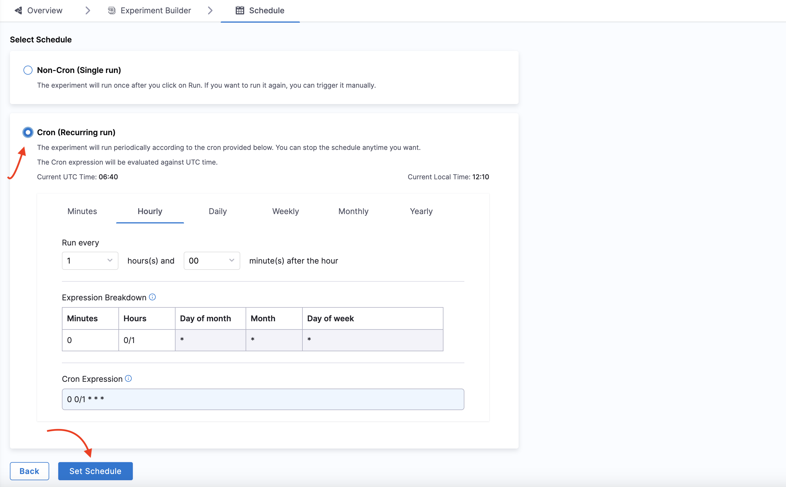
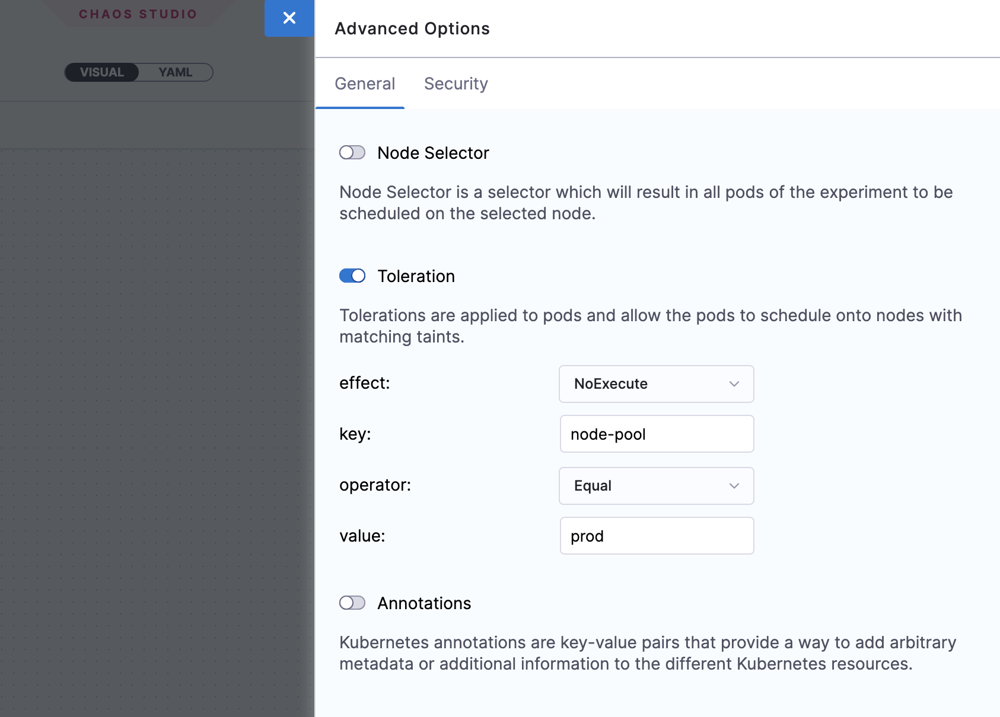

import Tabs from '@theme/Tabs';
import TabItem from '@theme/TabItem';

Harness Chaos Engineering (HCE) gives you the flexibility to create elaborate chaos experiments that help create complex, real-life failure scenarios against which you can validate your applications. At the same time, the chaos experiments are declarative and you can construct them using the Chaos Studio user interface with no programmatic intervention.

A chaos experiment is composed of chaos faults that are arranged in a specific order to create a failure scenario. The chaos faults target various aspects of an application, including the constituent microservices and underlying infrastructure. You can tune the parameters associated with these faults to impart the desired chaos behavior.

For more information, go to [flow of control in a chaos experiment](/docs/chaos-engineering/features/experiments/experiment-execution.md).

<Tabs>
  <TabItem value="Interactive guide">

Here is a interactive guide you can use to understand how to create a chaos experiment with a fault, pod-delete.

<iframe src="https://app.tango.us/app/embed/9ae940fc-dc97-4fb8-aaa9-ab4d373c6ec6"
style={{minHeight:'640px'}}
sandbox="allow-scripts allow-top-navigation-by-user-activation allow-popups allow-same-origin"
title="Creating and Running a Chaos Experiment in Harness"
width="100%"
height="100%"
referrerpolicy="strict-origin-when-cross-origin"
frameborder="0"
webkitallowfullscreen="webkitallowfullscreen"
mozallowfullscreen="mozallowfullscreen"
allowfullscreen="allowfullscreen"></iframe>

</TabItem>
  <TabItem value="Step-by-step">

To add a chaos experiment:

1. In Harness, navigate to **Chaos > Chaos Experiments**. Select **+ New Experiment**.

	

2. 	In the **Experiment Overview**, enter the experiment **Name** and optional **Description** and **Tags**. In **Select a Chaos Infrastructure**, select the infrastructure where the target resources reside, and then click **Next**.

	

:::tip
For more information on infrastructure, go to [Connect chaos infrastructures](/docs/chaos-engineering/features/chaos-infrastructure/connect-chaos-infrastructures.md).
:::

3. This takes you to the **Experiment Builder** tab, where you can choose how to start building your experiment.

	

4. Select how you want to build the experiment. The options, explained later, are:

	* **[Blank Canvas](#using-blank-canvas)** - Lets you build the experiment from scratch, adding the specific faults you want.
	* **[Templates from ChaosHubs](#using-templates-from-chaoshubs)** - Lets you preview and select and experiment from pre-curated experiment templates available in [ChaosHubs](/docs/chaos-engineering/features/chaos-hubs/introduction.md).
	* **[Upload YAML](#upload-yaml)** - Lets you upload an experiment manifest YAML file.

	These options are explained below.

### Using blank canvas

1. The **Experiment Builder** tab is displayed. Click **Add** to add a fault to the experiment

	

2. Select the fault you want to add to the experiment individually.

	

3. For each fault you select, tune the fault's properties. Properties will be different for different faults.

	* To tune each fault:

		* **Specify the target application (only for pod-level Kubernetes faults):** This lets the application's corresponding pods be targeted.

			

		* **Tune fault parameters:** Every fault has a set of common parameters, such as the chaos duration, ramp time, etc., and a set of unique parameters that may be customised as needed.

		* **Add chaos probes:** (Optional) On the **Probes** tab, you can add chaos [probes](/docs/chaos-engineering/features/resilience-probes/overview.md) to automate the chaos hypothesis checks for a fault during the experiment execution. Probes are declarative checks that aid in the validation of certain criteria that are deemed necessary to declare an experiment as **passed**.

		* **Tune fault weightage:** Set the weight for the fault, which sets the importance of the fault relative to the other faults in the experiments. This is used to calculate the [resilience score](/docs/chaos-engineering/features/experiments/resilience-score) of the experiment.

			

### Using templates from ChaosHubs

1. Select an experiment template from a [ChaosHub](/docs/chaos-engineering/features/chaos-hubs/add-chaos-hub).

	* Select **Experiment Type** to see available ChaosHubs to select templates from.
	* Select a template to see a preview of the faults included.

		

:::info note
You can edit the template to add more faults or update the existing faults.
:::

### Upload YAML

1. Upload an experiment manifest YAML file to create the experiment.

:::info note
You can edit the experiment to update the existing faults or add more of them.
:::

Construct the chaos fault using one of the three options mentioned earlier and save the experiment.

	

	* Select **Save** to save the experiment to the Chaos Experiments page. You can add it to a [ChaosHub](/docs/chaos-engineering/features/chaos-hubs/add-chaos-hub.md) later.
	* Select **Add Experiment to ChaosHub** to save this experiment as a template in a selected [ChaosHub](/docs/chaos-engineering/features/chaos-hubs/add-chaos-hub.md).

## Run or schedule the experiment

Now, you can choose to either run the experiment right away by selecting the **Run** button on the top, or select the **Schedule** tab to create a recurring schedule to run the experiment.

### Execute experiment once
Select **Non-Cron(Single run)** and select **Save**. Now select **Run** to execute the experiment.

	

</TabItem>
</Tabs>

### Execute experiment on a schedule
1. To schedule the experiment run for specific periods, select **Cron(Recurring run)**, enter the values based on what you select among **Minutes** or **Hourly** or **Daily** or **Monthly** or **Yearly**. The **Cron Expression** is automatically generated based on how you schedule to run the experiment.

2. Select **Set Schedule**.

	

## Advanced experiment setup options

You can select **Advanced Options** on the Experiment Builder tab to configure the advanced options (described below) while creating an experiment for a Kubernetes chaos infrastructure:

### General options

**Node Selector**

Specifies the node on which the experiment pods will be scheduled. Provide the node label as a key-value pair.

- Can be used with node-level faults to avoid the scheduling of the experiment pod on the target node(s).
- Can be used to limit the scheduling of the experiment pods on nodes that have an unsupported OS.

	

**Toleration**

Specifies the tolerations that must be satisfied by a tainted node to be able to schedule the experiment pods. For more information on taints and tolerations, go to the [Kubernetes documentation](https://kubernetes.io/docs/concepts/scheduling-eviction/taint-and-toleration/).

- Can be used with node-level faults to avoid the scheduling of the experiment pod on the target node(s).
- Can be used to limit the scheduling of the experiment pods on nodes that have an unsupported OS.

	

**Annotations**

Specifies the annotations to be added to the experiment pods. Provide the annotations as key-value pairs. For more information on annotations, go to the [Kubernetes documentation](https://kubernetes.io/docs/concepts/overview/working-with-objects/annotations/).

- Can be used for bypassing network proxies enforced by service mesh tools like Istio.

	

### Security options

**Enable runAsUser**

Specifies the user ID to be used for starting all the processes in the experiment pod containers. By default `1000` user ID is used.

- Allows privileged access or restricted access for experiment pods

	

**Enable runAsGroup**

Specifies the group ID to be used for starting all the processes in the experiment pod containers instead of a user ID.

- Allows privileged access or restricted access for experiment pods

	