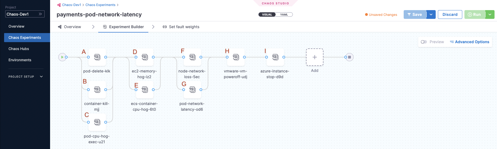

import Launch from '/docs/chaos-engineering/features/shared/launch-experiment-from-hub.md'

import Analyze from '/docs/chaos-engineering/features/experiments/shared/analyze-chaos-experiment.md'

This section describes how to add and execute serial and parallel faults within a single chaos experiment, analyze chaos experiments, and launch an experiment from ChaosHub.

You can add multiple faults in a single chaos experiment to validate the resiliency of the entire application stack.

- HCE scales efficiently in a cloud-native manner to execute these experiments, which can have multiple faults running in serial and/or parallel at any given time.

- While creating these chaos experiments, you must consider the overall impact on the application. Your experience in production environments may differ due to lack of resources when a number of parallel faults are being executed.

## Add serial and parallel faults

1. To add a fault that runs in parallel to another fault, point your mouse below an existing fault, and then select **Add**. You can follow the same process to add a serial fault.

	

:::note
For Linux, experiments with a parallel fault are currently not supported.
:::

The image below shows a single experiment that consists of serial and parallel faults.
* Faults **A**, **B**, and **C** are parallel faults. They begin execution at the same time.
* Faults **A**, **B**, **C** and faults **D** and **E** are serial. **A**, **B**, and **C**  complete execution and then  **D** and **E** begin execution.
* Similarly, faults **H** and **I** are serial faults, where **H** completes execution, and **I** begins.

	

## Analyze chaos experiments

<Analyze />

## Launch an experiment from a chaos hub

<Launch />

