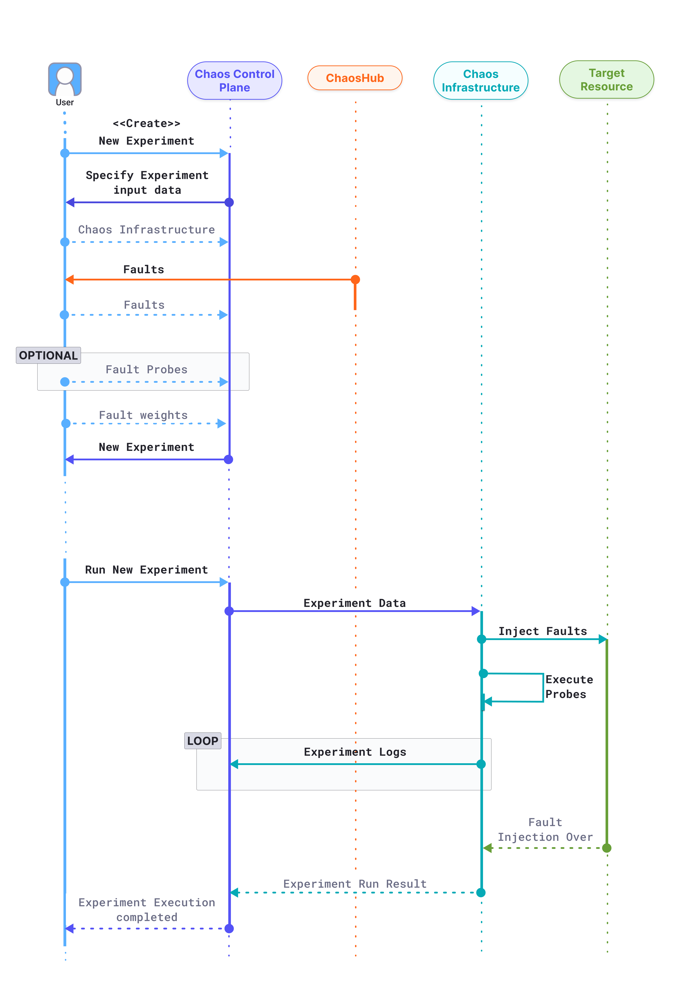

## Add users to a project to run chaos experiments

You must have at least one user in a project, and set up permissions such that the user can perform chaos experiments. The following steps generate an email invitation to the new user(s) to add themselves to the project.

To add a new user to a project:

1. In Harness, select a project.

2. Expand the **Project setup** menu, and select **Access Control**.

	This page lists all the users added to the current project.

3. Select **New User**, and then:

	a. In **New User(s)**, add the email(s) of the user(s) you want to add.

	b. In **User Groups**, select any of the existing user groups to which you can add the user.

	c. Add the roles for the user(s) to enforce their access permissions.

	

4. Select **Apply**.

## Requirements for individual chaos faults

In the [chaos faults reference](/docs/chaos-engineering/chaos-faults/), you'll find fault-specific requirements listed in the **Use cases** section of each fault, as shown, for example, in the use cases for the [Kubelet service kill](/docs/chaos-engineering/chaos-faults/kubernetes/node/kubelet-service-kill#use-cases) fault.

## Experiment execution

The below diagram shows the flow of control when a user creates a new chaos experiment.

1. The user attempts to create a new chaos experiment in the Chaos Control Plane.
2. The Control plane prompts the user to input the required information for the creation a new experiment, such as

   * **Chaos infrastructure:** Which chaos infrastructure will be targeted as part of the experiment.
   * **Fault and fault tunables:** The fault templates can be fetched from any connected chaos hubs, where the tunables can be modified wherever necessary. Multiple faults can be added in any desired order.
   * **Fault probes:** Optionally, additional probes can be defined on top of the default health check probe for a fault, to validate custom hypothesis conditions as part of the experiment.
   * **Fault weights:** Fault weights define the importance of a fault with respect to other faults present in an experiment. More formally, it is used for calculating the experiment's [**resilience score**](/docs/chaos-engineering/features/experiments/resilience-score), a quantitative measure of the target environment's resilience when the respective experiment is performed.

   The experiment is now created and ready to be executed.

3. When the user attempts to run the experiment, the control plane relays the experiment data to the target chaos infrastructure, which undertakes four distinct responsibilities during the experiment execution:

   * **Inject faults:** Faults received as part of the experiment are interpreted and injected into the target resource. Depending on the experiment, multiple faults might be injected simultaneously.
   * **Execute probes:** Respective fault probes are executed as and when the faults execute and their result is stored.
   * **Stream logs:** When an experiment is being executed, real-time logs can be streamed, and retrieved when required.
   Experiment execution logs are streamed and accessible in real-time in the chaos control plane.
   * **Send result:** Finally, the experiment execution result, including the probe execution result, is sent back to the chaos control plane.

   The chaos experiment execution is now concluded.

## Chaos rollback
Chaos rollback causes all the target resources in an experiment to re-attain their steady state after the execution of the experiment, which ensures the safety of all the applications deployed on your Linux machine.
- Chaos rollback is performed at the end of each experiment execution. On-the-fly experiments can be safely aborted and the chaos is reverted.
- In case of a network disruption between the control plane and execution plane during the execution of an experiment, it is gracefully aborted and the chaos is reverted.
- In case of an abrupt exit of the chaos infrastructure process during the execution of an experiment, the daemon service reverts the chaos before restarting the process.
- In case of an abrupt reboot of the machine, after the reboot, the daemon service checks and reverts any remnant inconsistency due to the prior execution of chaos, before starting the chaos infrastructure process.
- In the rare scenario where the revert of chaos itself also leads to an error, an appropriate error message is logged in the experiment log for the manual intervention of the user.

## Fault status
Fault status describes the status of the fault executed as a part of the chaos experiment. A fault can have 0, 1, or more [probes](/docs/chaos-engineering/features/resilience-probes/overview) associated with it. Other steps in a chaos experiment include creating and cleaning up resources.

The fault status in a chaos experiment can be in 6 different states. The fault goes from being in the **running** or **stopped** or **skipped** state to **completed** or **completed with error** or **error** state.

- **Running**: When the fault is currently being executed.
- **Stopped**: When the fault is stopped after running for some time.
- **Skipped**: When the fault is skipped, that is, the fault is not executed.
- **Completed**: Once the fault completes execution without any **failed** or **N/A** probe status, it is considered to be **completed**.
- **Completed with error**: When the fault completes execution with at least one **failed** probe status but no **N/A** probe status, it is considered to be **completed with error**.
- **Error**: When the fault completes execution with at least one **N/A** probe status, it is considered to be **error** because you can't determine if the probe status was **passed** or **failed**. A fault is considered to be in an **error** state when it has 0 probes because there are no health checks to validate the sanity of the chaos experiment.

## Experiment status
Experiment status describes the overall status of the experiment that depends on the status of the probe and the fault. The experiment status in a chaos experiment can be in 7 different states.

- **Completed**: The fault and the probes associated with every fault were completed successfully.
- **Completed with error**: All the faults complete execution, and none of them show **error** status, but one of the faults may show **Completed with error** if the probe associated with the fault fails.
- **Error**: If one of the faults or steps in the experiment results in an **error**, the experiment corresponds to being in an **error** state.
- **Running**: Once the task (or experiment) is picked up by the infrastructure subscriber (pod), it goes to **running** state.
- **Timeout**: If the task is in the queue, but not picked up by the subscriber for execution within a specific duration, the task times out.
- **Queued**: An experiment goes to the **queued** state before it is executed, that is when the task (or experiment) has not been picked up by the infrastructure subscriber (pod) yet. At this point, the task is placed in the queue and is waiting to be picked.
- **Stopped**: If an experiment was stopped by the user, the fault that was being executed then also stops (this results in the fault status being **stopped**). The subsequent faults associated with the experiment don't get executed either.
