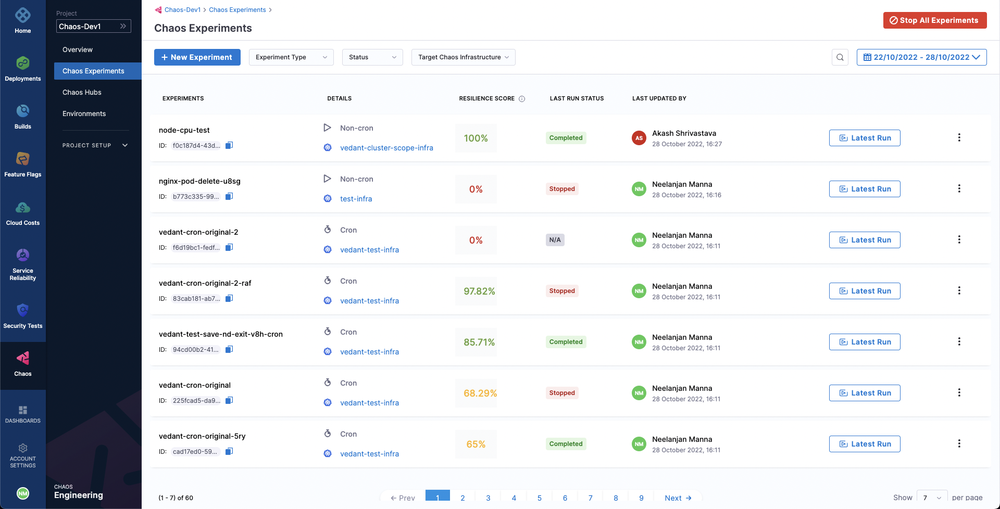

This topic describes how you can halt a chaos experiment.

Halting the execution of a chaos experiment safeguards the target applications against any unwanted and unforeseen consequences due to the experiment. It immediately stops the execution of an experiment and reverts the target resources to their initial state.

* To halt an experiment execution, select the experiment name from the list of experiments accessible under the **Chaos Experiments** page. Then, simply select the `🚫` icon. You'll notice that the state of the experiment will be updated to `Stopped`.

	

* If you have multiple experiments under execution and you want to halt all of them at once, in the **Chaos Experiments** page select the **Stop All Experiments** button. This will bring all the currently executing experiments to a halt.

	

:::info note
- When you stop a cron experiment, the experiment is also disabled. This way, the experiment will immediately stop executing and won't execute as per its cron schedule thereafter.
- When the `stopOnFailure` flag is set to true, the entire experiment is aborted (along with associated faults) when a probe fails. This is applicable only for chaos experiments that use a Kubernetes infrastructure (dedicated infrastructure or Harness Delegate).
:::

Finally, deleting an experiment under execution also causes it to immediately halt but also delete forever. To delete an experiment, select the **`⋮`** icon against the experiment name, and select **Delete Experiment**.