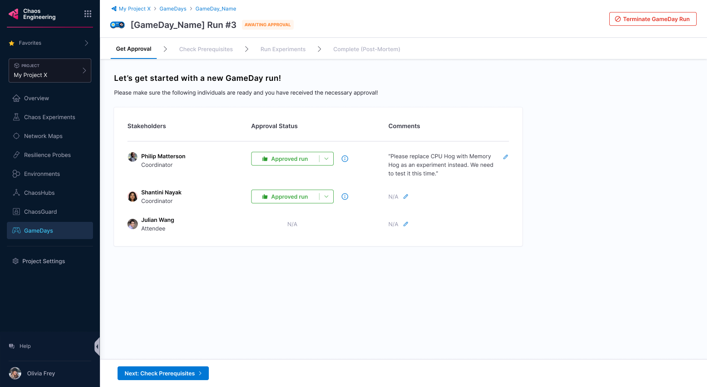
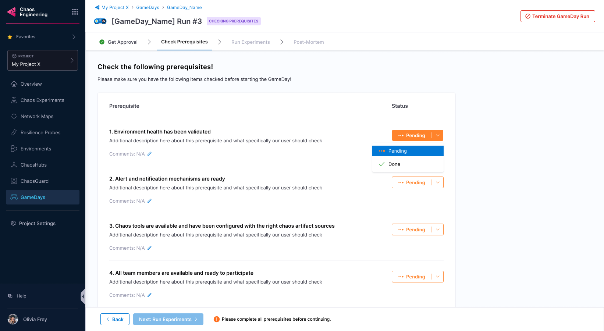
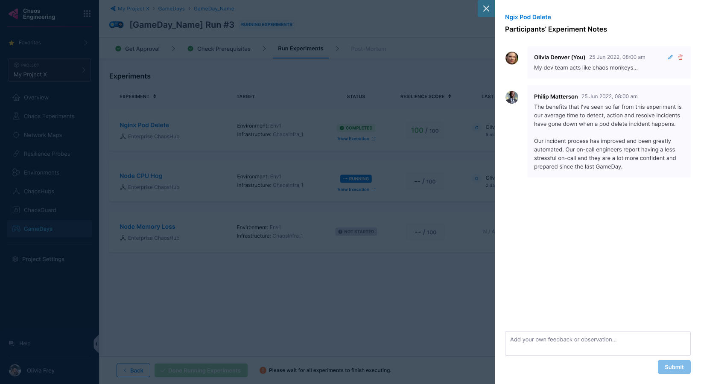

This section describes how to create and execute [GameDay](/docs/chaos-engineering/features/gameday/introduction-to-gameday.md) V2.

- If you are an existing HCE user, head to GameDay V1 to create and execute a GameDay.

- Fulfill the [prerequisites](/docs/chaos-engineering/features/gameday/run-gameday#prerequisites) and [plan your GameDay](/docs/chaos-engineering/features/gameday/run-gameday#plan-your-gameday) before creating one.

### Start a GameDay run

- If you have created your GameDay earlier, select **Start New Run** to run the GameDay; otherwise, [create a GameDay](#create-a-gameday).

 

### Create a GameDay

1. To create a GameDay, click **+New GameDay**.

 

### Add stakeholder and role

2. Add stakeholder names, their roles, and whether they are allowed to approve a GameDay run. Only a stakeholder can approve or reject a GameDay run. Click **Next: Select Prerequisites**.

 

### Create prerequisites

You can create prerequisites for your GameDay that would:
 * Validate environment health.
 * Check the availability of relevant chaos tools.
 * Check if the chaos tools are configured with the right chaos artefact sources.
 * Check the availability of the team members.

3. Select **+ Add prerequisite**.

 

4. Enter a name and a description (optional). Click **Save**.

 

5. Click **Next: Select Experiments** to select chaos experiments to execute.

 

### Select experiments

6. Select an environment, an infrastructure type, an infrastructure, and a ChaosHub. Select the chaos experiment and click **Add Experiment to GameDay**.

 

7. Click **Save** (or **Discard** if you don't want to proceed). You can edit or delete experiments in this step.

 

:::tip
* Click the experiment to view the details of the selected experiment.

 
:::

### Check prerequisites

8. Once the stakeholder approves the GameDay run, you can proceed.

 

:::info note
- A stakeholder can reject the run and state reasons in the comments.

 
:::

9. Click **Next: Check prerequisites** to validate whether the prerequisites you mentioned earlier have been fulfilled.

 

10. HCE checks if the prerequisites are fulfilled. If one of them is not fulfilled, you will not be able to execute the experiments.

 

:::tip
- You can add comments about the prerequisite validation.
 
:::

### Execute experiments

11. Once all the prerequisites are fulfilled, click **Next: Run experiments**.

 

12. Once all the experiments complete execution, click **Done Running Experiments**.

 

:::info note
- Select **Terminate GameDay Run** to stop GameDay execution. Click **Terminate this run** to confirm.

 

- Click **Add/View Notes** to note your findings about the GameDay.

 
:::

13. Once the experiments complete execution, you can view the summary of the runs and the run observations. Click **Complete GameDay Run**.

 

:::info note
- Select **Done Running Experiments** to complete the run. If your chaos experiments have faults that have not run, they will be marked **Skipped**.

 
:::

### Download report

14. Click **Download Run Report** to download the report.

 

### View experiment execution

- Click the experiment in the GameDay to view manifest details. Click **View Execution** to see more.

 

## Conclusion

Congratulations on scheduling (or running) your GameDay! Based on the results, you can take steps to improve the resilience of your application.