This topic describes how to create and execute a [GameDay](/docs/chaos-engineering/features/gameday/introduction-to-gameday.md).

## Prerequisites

1. HCE account
2. Access to a cluster

## Plan your GameDay

Address the following questions before proceeding to run a GameDay:

1. Which services should I test?
2. What is the goal of the GameDay?
3. What should I verify or determine by the end of the GameDay?

Once these questions have a viable answer, you can proceed to create a GameDay.

If you are new to HCE, head to [GameDay V2](/docs/chaos-engineering/features/gameday/gameday-v2.md) and follow the steps to create and run a GameDay

Creating a GameDay involves two steps:
1. Specifying details about the GameDay,
2. Adding chaos experiments to the GameDay.

### Create a GameDay

1. Select **+New GameDay**.

      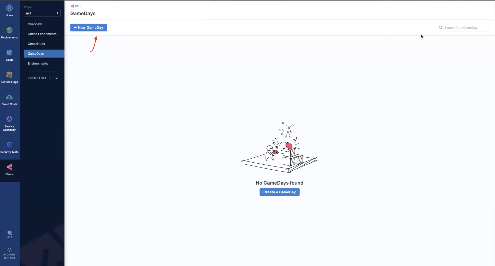

2. Add details such as **GameDay name**, **Objectives**, and **Description** (optional). Select **Next-> Select Chaos Experiments**.

   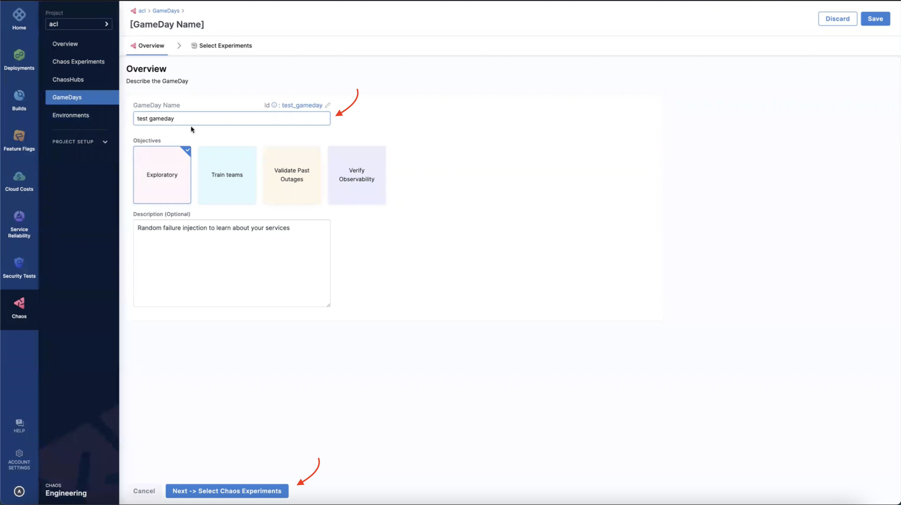

### Add experiments to the GameDay

3. Once you create a GameDay, select **New Chaos Experiment** to add experiments to the GameDay.

   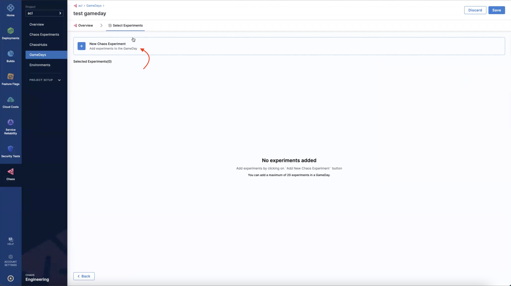

4. Select one or more experiments that are available in the ChaosHub.

   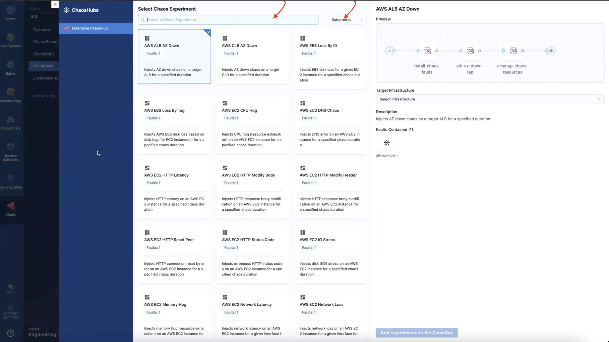

### Add infrastructure

5. Select a chaos infrastructure. Select **Add experiments to the GameDay**.

   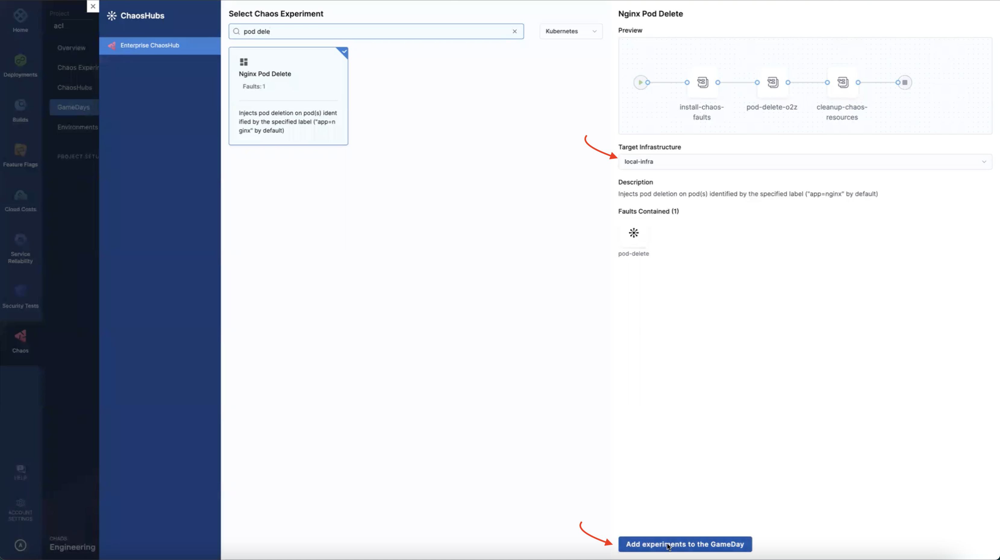

   :::tip
   You can add up to 20 experiments to every GameDay, and every chaos experiment can be executed on a different chaos infrastructure.
   :::

This opens a page that lists the experiments you selected for the current GameDay. You can add or delete experiments from this page.

   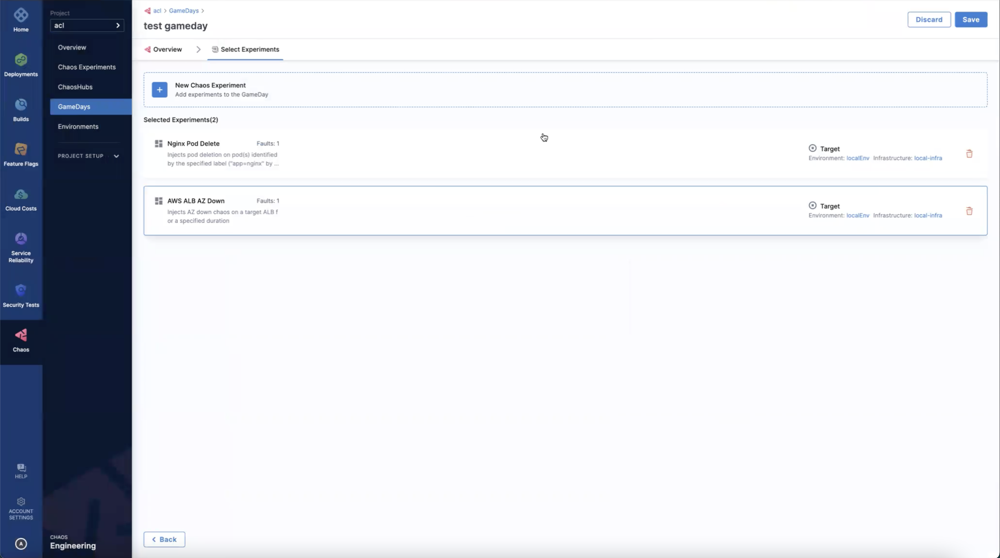

Select the experiment to see a preview of the experiment's pipeline.

   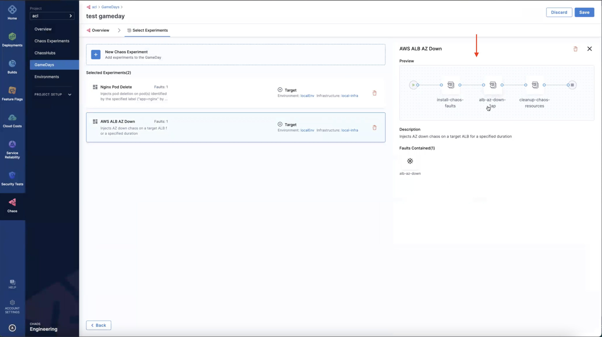

6. After adding the experiments to the GameDay, select **Save**.

   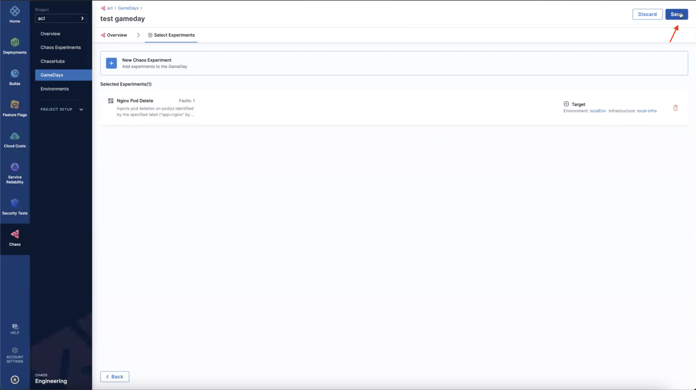

### Schedule or run the GameDay

Now that you have the experiments in the GameDay, you are all set to schedule or run them.

   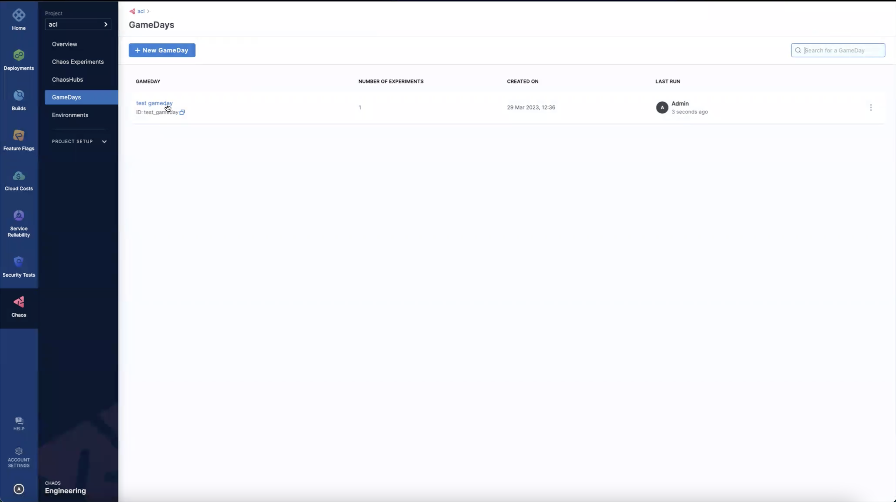

7. Select **Start GameDay**. This creates experiments within your GameDay.

      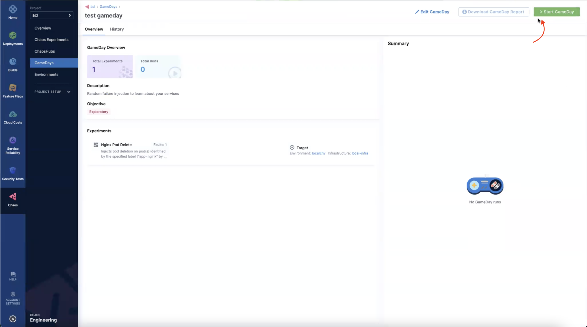

8. Select **GameDay** that opens the page that contains the experiments associated with the GameDay.

      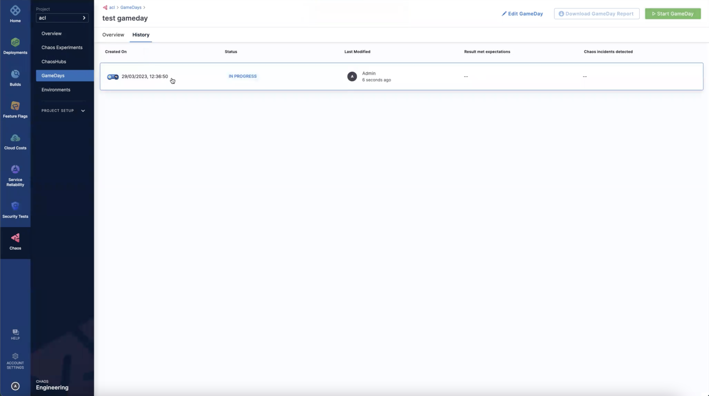

9. On this page, you can **Run** the experiment.

      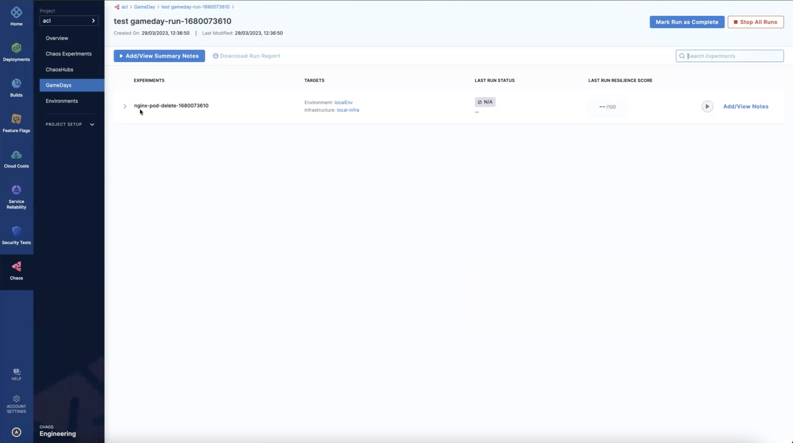

10. Select **Run Experiment**. This begins the execution of the experiment.

      

### Record the conclusion and action items

11. Select **Add/View Notes** to add a summary of the experiments in the GameDay.

      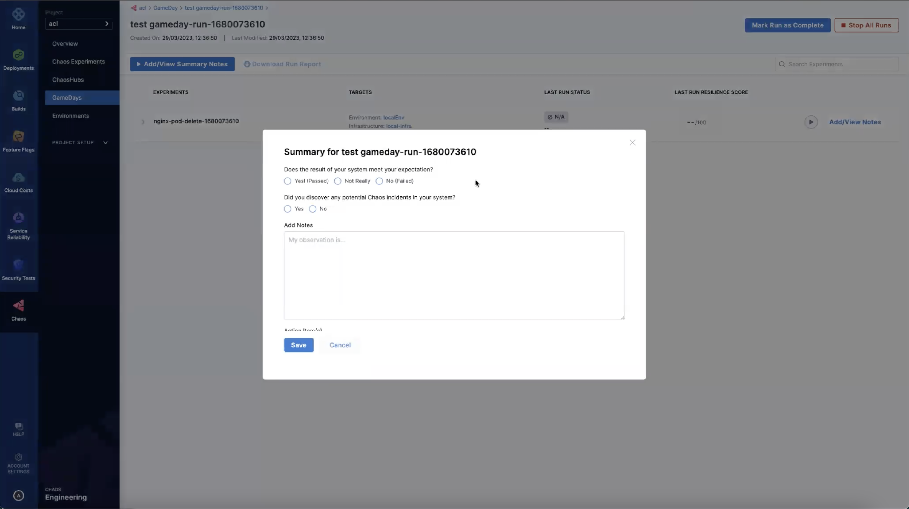

12. Select **Mark Run as Complete** to mark a GameDay run as complete. After this action, you will not be able to rerun the experiments inside the GameDay run. This completed run serves as a checkpoint within the GameDay that helps keep track of how the application fared during a specific situation.

      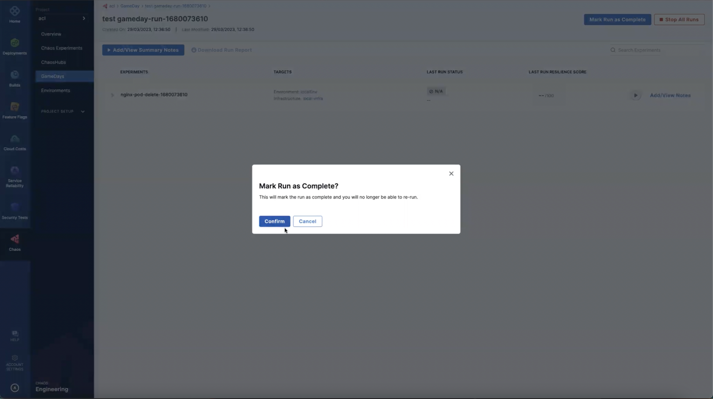

## Conclusion

Congratulations on scheduling (or running) your first GameDay! Based on the results, you can take steps to improve the resilience of your application.