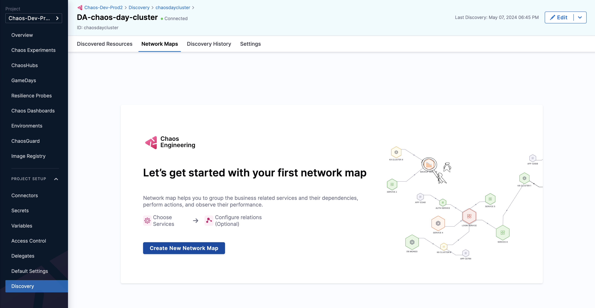
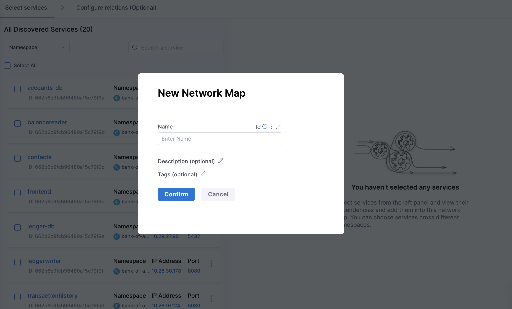
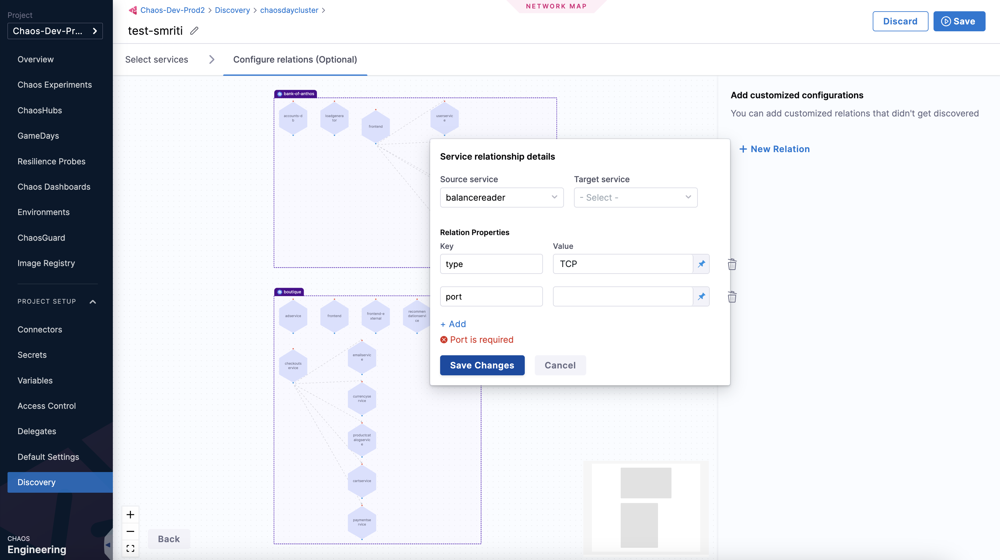
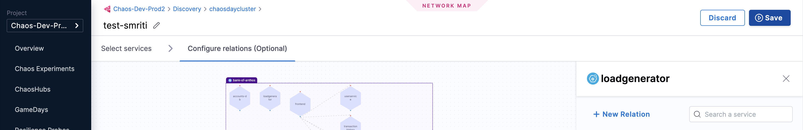
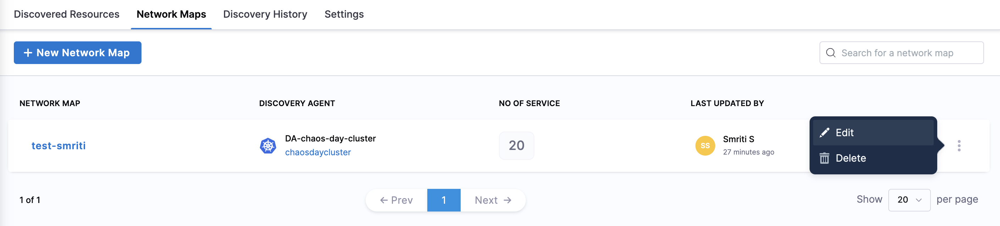
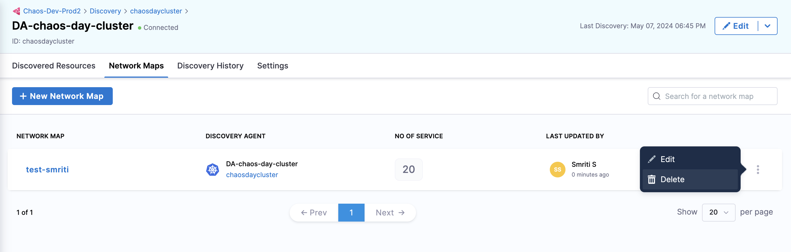
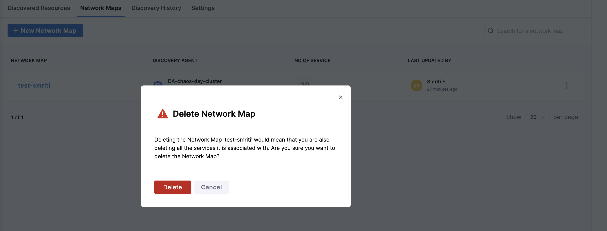

This section describes network maps, their significance, and how to create, edit, and delete them.

## Before you begin

- [Service discovery](/docs/chaos-engineering/features/service-discovery/intro-service-discovery.md)

### What is a network map?

A network map is a resource on the Harness platform (also known as the control plane) used to bind multiple interacting [discovered services](/docs/chaos-engineering/features/service-discovery/intro-service-discovery.md) into a single object, thereby allowing the users to act (test, monitor, deploy, etc.) on a group of services.

### Why is a network map required?

Network maps help:

- Test, monitor, and deploy a group of services.
- Determine the resilience coverage and resilience score for the overall network map and its constituent services
- Manage experiments associated with them.
- Perform trend analysis

### How is a network map used?

Once you have a list of discovered services, HCE creates a network map (using [auto-suggestion or manual service selection](/docs/chaos-engineering/get-started/onboarding/guided-onboarding#create-network-maps)) based on your requirements. You can refer to the real-time topology view to get the connectivity representation.

You can [create](#create-network-map), [edit](#edit-network-map), and [delete](#delete-network-map) network maps.

### Create a network map

1. To create a network map, navigate to **Discovery** and select **Network Maps** tab. Select **Create New Network Map**.

    

2. Specify a name, description (optional), and tags (optional). Select **Continue**.

    

3. Select one or more discovered services and select **Next**.

    

4. Optionally, add service relationship details and select **Save Changes**.

    

5. Select **Save**.

    

### Edit network map

To edit a network map, select the vertical menu and select **Edit**. Make the necessary changes and select **Save**.

### Delete network map

1. To delete a network map, select the vertical menu and select **Delete**.

    

2. To confirm the deletion, select **Delete**.

    