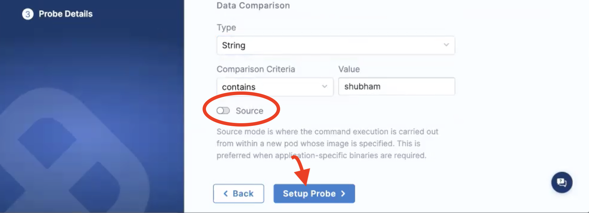

import Tabs from '@theme/Tabs';
import TabItem from '@theme/TabItem';

This section guides you through steps to use the [**command probe**](/docs/chaos-engineering/features/probes/cmd-probe) in **inline mode** and **source mode**.

## Before you begin

* [Probe overview](/docs/chaos-engineering/features/probes/overview)
* [Command probe](/docs/chaos-engineering/features/probes/cmd-probe)

## Command probe details

1. Provide a name for the probe, and other parameters like chaos interval, timeout, and so on. 

2. Enter a command in the **Command** section. In this example, the command entered will print an environment variable on the console. 

<Tabs>
  <TabItem value="Inline">

To use the command probe in the **inline** mode:

3. Enter the **Type**, **Comparison criteria**, **Value**. Toggle to switch off the **Source** mode. Click **Setup probe**.

</TabItem>
  <TabItem value="Source">

To use the command probe in the **source** mode:

3. Enter the **Type**, **Comparison criteria**, **Value**. Toggle to switch oon the **Source** mode. Click **Setup probe**. 

:::tip
You can add other specifications too (example, `imagePullPolicy`). You can reference values from the configMap and secret too. 
:::

</TabItem>
</Tabs>

4. Click **Confirm** to create the probe with the parameters you entered. 

### Validation in inline mode

When the probe in **inline mode** is used in a chaos experiment, you can see that the probe failed. This is because the actual value is an empty value but the expected value is different. The experiment doesn't specify any environment variable that could associate with a user name, so the resultant value is empty. 

### Validation in source mode

When you use the probe in **source mode** in a chaos experiment, you can see that the probe passed because the expected value and the actual value match. You executed the probe on the specific (Ubuntu, in this case) image that you created for this probe. You specified the environment mounted with the specific name in the image, and this image specifications you provided in the **Source** mode matched the expected value.

