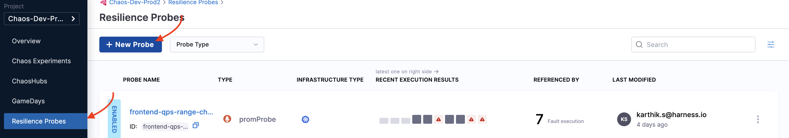

This section walks you through how to configure and add probes to a chaos experiment.

## Before you begin

- [Probe overview](/docs/chaos-engineering/features/probes/overview.md)
- [Chaos faults](/docs/chaos-engineering/chaos-faults)

## Prerequisites

- You should have an active chaos infrastructure where you can schedule the chaos experiment.
- Enterprise Hub connectivity status should be active
- Read/write access to the chaos experiment to schedule or navigate to the probe addition UI.
- Read access to the chaos infrastructure to select a chaos infrastructure when creating an experiment.
- Read access to the chaos hub to select faults from the chaos hub while creating an experiment.

Once the prerequisites are fulfilled, you can configure and add a probe to your experiment using the following steps. 

## Steps to configure and add a probe

### Step 1: Navigate to the chaos experiment creation
Navigate to the **Create Experiment View** by clicking `+ New Experiment` button. Provide a name, description and tag for your experiment. The description and tag are optional fields. 

Choose the active chaos infrastructure on which this experiment would be scheduled. This step is required so that we can proceed to the fault selection step where probes can be configured.


And then click on `Start with blank canvas` once you see the start off drawer pop out.


### Step 2: Select a fault

Select the `+` icon to open the fault selection drawer and choose the fault to execute in your chaos experiment based on the hypothesis decided.

Once you select a fault, a **Tuning drawer** opens up. Navigate to the last tab `Probes`. A default health check command probe will already be present. You can either add or replace the existing probe with a new one by selecting `+ Deploy new Probe` button.


### Step 3: Add a probe

Once the `Add Probe` screen opens up, provide a name, the type of the probe (HTTP or Command or Kubernetes or Prometheus) and the mode in which you want to run the probe.


Now, the screen shows common probe properties, such as `Probe timeout`, `Retry`, `Interval`, and so on. Enter relevant values, and select `Continue`.


Provide the required probe attributes. In this case, you have chosen HTTP probe, which shows attributes associated with it, such as `URL`, `Method`, `Criteria`, and so on. Enter relevant values, and select `Setup the probe`.


### Step 4: Save the probe

Once you have added the parameters for the probe, select `Setup the Probe >`. The newly configured probe is saved and appended to the manifest. To view the configurations that you saved, hover over `View` of the respective probe.


### Using YAML

The entire manifest is available as a YAML file, which can be accessed by switching over to the YAML view in chaos studio. Below is a sample manifest for the pod delete fault.

```yaml
kind: Workflow
apiVersion: argoproj.io/v1alpha1
spec:
 templates:
    - name: pod-delete-lmx
     inputs:
       artifacts:
         - name: pod-delete-lmx
           path: /tmp/chaosengine-pod-delete-lmx.yaml
           raw:
             data: |
               apiVersion: litmuschaos.io/v1alpha1
               kind: ChaosEngine
               spec:
                 experiments:
                   - name: pod-delete
                     spec:
                       probe:
                         - name: healthcheck
                           type: cmdProbe
                           mode: Edge
                           runProperties:
                             probeTimeout: 180
                             retry: 0
                             interval: 1
                             stopOnFailure: true
                           cmdProbe/inputs:
                             command: ./healthcheck -name pod-level
                             source:
                               image: chaosnative/go-runner:ci
                               inheritInputs: true
                             comparator:
                               type: string
                               criteria: contains
                               value: "[P000]"
                         - name: check-endpoint-probe
                           type: httpProbe
                           mode: SOT
                           httpProbe/inputs:
                             url: https://myapp.local.svc:5000
                             insecureSkipVerify: false
                             method:
                               get:
                                 criteria: ==
                                 responseCode: "200"
                           runProperties:
                             probeTimeout: 1000
                             interval: 2
                             retry: 1
                             probePollingInterval: 2
                             initialDelaySeconds: 3
                             stopOnFailure: false
```
## Add a probe while creating an experiment

### Step 1. Add a probe
To add a probe for a fault while constructing an experiment, once you add a fault to the experiment you'll be prompted to configure it. You can simply switch to the **Probes** tab to access the list of probes for the fault. By default, most of the experiments will have a default target application health check.


### Step 2. Deploy a probe
Select **Deploy new Probe** to add a new probe. Next, you will need to specify the name, type, and mode of the probe.Select **Continue**. Then specify the probe properties. Select **Continue**. Finally, specify the probe specific details and select **Setup the Probe** to add the probe. 


## Create resilience probes from Resilience Probes tab

### Step 1: Navigate to Resilience Probes
Navigate to **Resilience Probes** and click **New Probe**.



### Step 2: Select the infrastructure and type
HCE allows you to create probes for two infrastructures, namely, Kubernetes and Linux. The type of probes allowed on each of these infrastructures is listed below.

| Kubernetes | Linux     |
|------------|-----------|
| HTTP       | HTTP      |
| Command    | Command   |
| Datadog    | Datadog   |
| Dynatrace  | Dynatrace |
| SLO        |           |
| Prometheus |           |
| Kubernetes |           |


### Step 3: Enter relevant parameters

Based on the type of probe you select, enter the values to set up the probe.

**You can:**
- Use any number of probes within a chaos experiment.
- Use the same probes for two faults within the same chaos experiment.
- Use Kubernetes-based probes for Kubernetes experiments.
- Use Linux-based probes for Linux experiments.

**You can't:**
- Repeat the same probe multiple times in the same fault in the same experiment.

## Resilience probes support
Resilience probes are supported by the following features:
- Resilience Tab
- Chaos Studio
- Experiments/Run Reports
- Linux and Kubernetes experiments
- GameDays
- Sandbox environment

## Default/System resilience probes

- You can create system (default probes) at the project level **only once**. 
- Once you create a default probe, you can't delete or disable or update it.
- If you have more that one resilience probe in your chaos experiment, you can disable, delete or update the system probe. 
- Default probes are a part of resilience probes and are entered as annotations in the experiment manifest.

## Legacy probes support (Backward compatibility)

Users can use legacy probes.

## Audit integration

There are no audit events for resilience probes.

## Access control permissions division

ACL is mapped to the experiment ACL. 

## License

Resilience probes are not a part of any subscription, and hence you don't have any limit on the number of probes you can create. With respect to usability, 1,000 probes can be executed in a month.