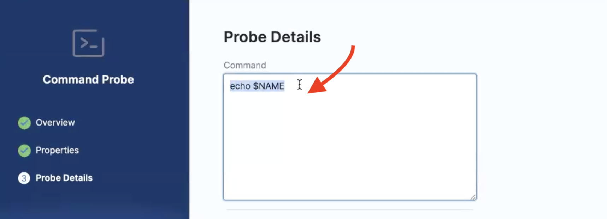
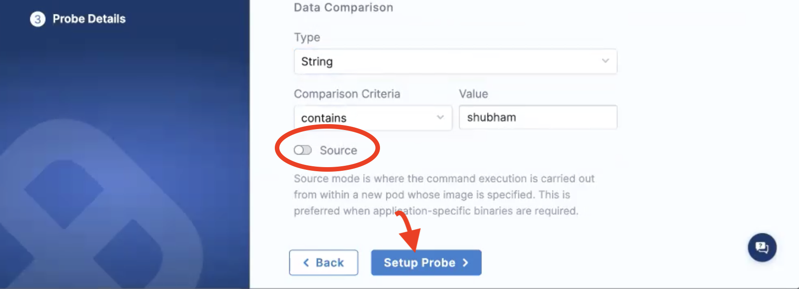
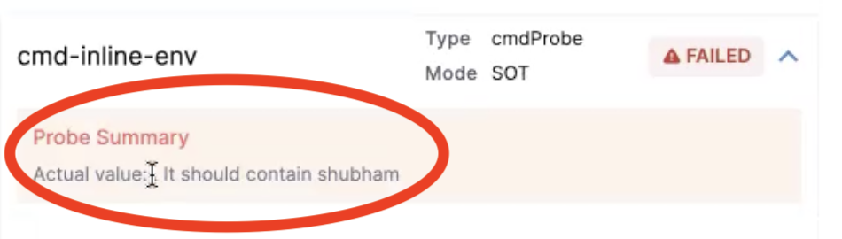
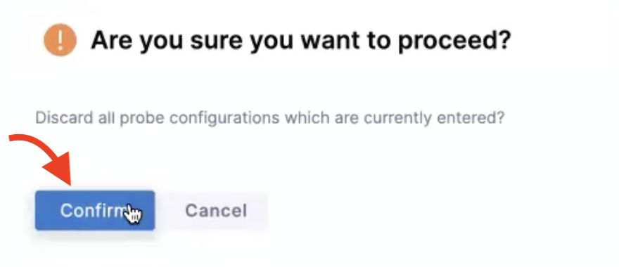
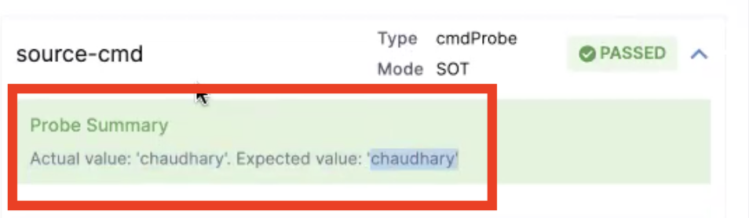

This topic guides you through steps to use the [**command probe**](/docs/chaos-engineering/features/resilience-probes/cmd-probe) in **inline mode** and **source mode**.

## Before you begin

* [Probe overview](/docs/chaos-engineering/features/resilience-probes/overview)
* [Command probe](/docs/chaos-engineering/features/resilience-probes/cmd-probe)

To understand the steps to create a probe, go to [create a probe](/docs/chaos-engineering/features/resilience-probes/use-probe#create-a-resilience-probe), where you can specify a name for the probe, and other parameters like chaos interval, timeout, and so on.

In the final step of creating a probe, provide details specific to that resilience probe (such as a command for the command probe, a query to the Prometheus probe, and so on).

### Specify the command to the command probe

In this example, you will specify details of the command probe, that is, provide a command to the command probe.

1. In the **Probe Details** modal, enter a command in the **Command** section. In this example, the command you enter will display a value on the console.

 

### Command probe in inline mode

To use the command probe in the **inline** mode:

2. Enter the **Type**, **Comparison criteria**, and the **Value**. Toggle to switch off the **Source** mode. Click **Setup probe**.

 

### Validation in inline mode

When the probe in **inline mode** is used in a chaos experiment, you can see that the probe failed. This is because the actual value is an empty value but the expected value is different. The experiment doesn't specify any environment variable that could be associated with a user name, so the resultant value is empty.

 

### Command probe in source mode

To use the command probe in the **source** mode:

3. Enter the **Type**, **Comparison criteria**, **Value**. Toggle to switch on the **Source** mode. Select **Setup probe**.

 

:::tip
You can add other specifications too (for example, `imagePullPolicy`). You can reference values from the ConfigMap and secret too.
:::

4. Select **Confirm** to create the probe with the parameters you specified.

 

### Validation in source mode

When you use the probe in **source mode** in a chaos experiment, you can see that the probe passed because the expected value and the actual value match. You executed the probe on the specific image (Ubuntu, in this case) that you created for this probe. You specified the environment mounted with the name in the image, and the image specifications you provided in the **Source** mode matched the expected value.

 

## Known limitations of resilience probes

* Command probes in the **source** mode for Kubernetes is available for both SMP and HCE SaaS.
* Command probes in the **source** mode is not available for Linux in HCE SaaS.
* In SMP (self-managed platform), command probe in the **source** mode is only available for Linux.