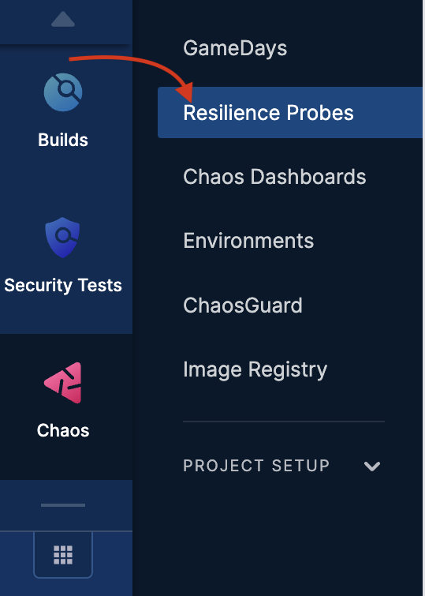
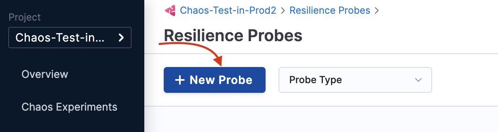
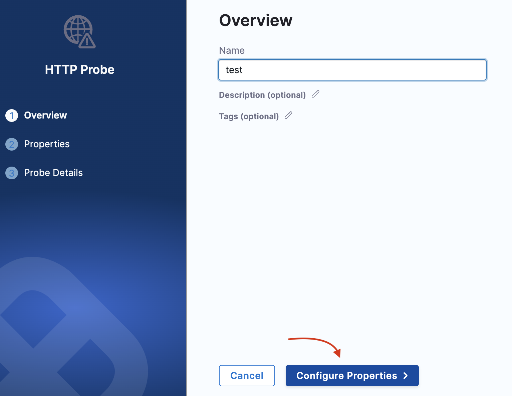
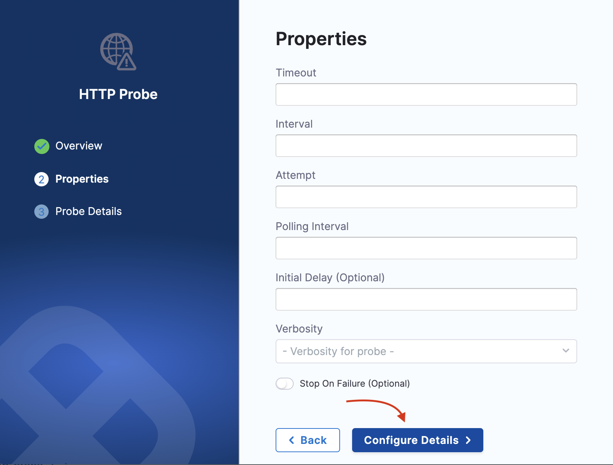
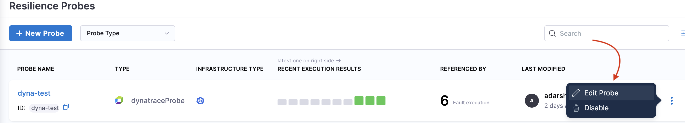
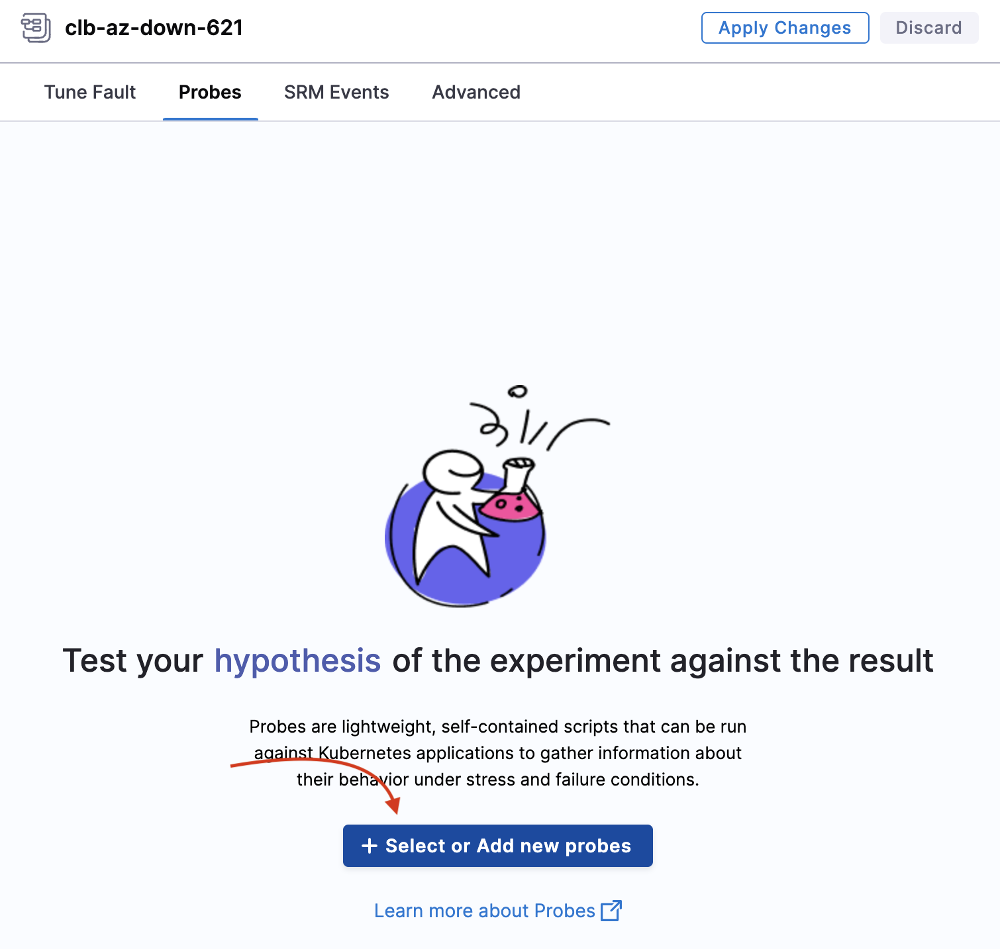
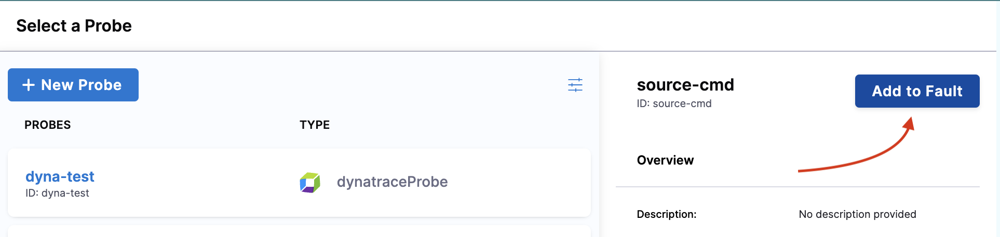
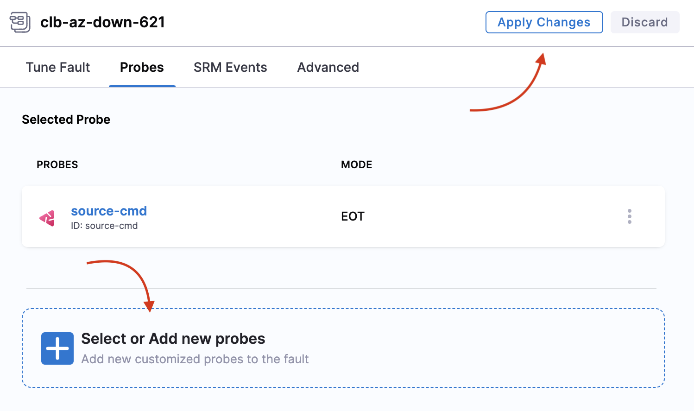

This topic describes the steps you can follow to create and use a resilience probe in your chaos experiment.

## Before you begin

- Go to [probe overview](/docs/chaos-engineering/features/resilience-probes/overview) to understand about probes.
- Go to [chaos faults](/docs/chaos-engineering/chaos-faults) to understand where you can use resilience probes.
- Permission to edit a [chaos experiment](/docs/chaos-engineering/features/experiments/edit-chaos-experiment).

:::tip
Currently, resilience probes are behind the feature flag `CHAOS_PROBE_ENABLED`. Contact [Harness support](mailto:support@harness.io) to enable it.
- If you are an existing customer, you will see the old flow of control in resilience probes by default and you have the choice to upgrade to the new flow.
- If you are a new customer, the feature flag is turned on by default and you will see the new flow of control in the resilience probes.
:::

## Create a resilience probe

### Step 1: Navigate to resilience probes

* Select the **Chaos** module and navigate to **Resilience probes**.

  

* Click **New probe**

  

### Step 2: Select probe and enter details

* Select the desired infrastructure (Kubernetes or Linux) and the probe type.

  

* Based on the probe type you choose, the fields will vary. You can find details about every probe in their respective documentation. After you enter the details, click **Configure properties**.

  

* Enter further details and click **Configure details**.

  

* Enter URL, authorization type, and click **Setup Probe**. Click **Confirm** when the screen prompts you to confirm creating the probe with specified details.

  

:::tip
If you are a first-time chaos module user or a Platform user who has not used resilience probes, you can create a resilience probe directly from the Chaos Studio drawer (from within an experiment). For this, you will see an option to add a system probe (which is a health check system probe) as a one-click button. This will not be present if you have configured at least one resilience probe.
:::

## Edit a resilience probe

* You can edit a resilience probe by navigating to the probe you wish to edit. Click the three vertical dot menu to the extreme right of the probe, and choose **Edit probe**. Modify the properties you wish to, and click **Save**.

  

## Use a resilience probe

### Step 1: Navigate to chaos experiment

* Navigate to the chaos experiment for wish you wish to set up probe/s. Move to **probes** tab and click **+Select or Add new probes**.

  

### Step 2: Select or create probe

* You can choose to [create a new probe](#create-a-resilience-probe) or add a probe that you created earlier.

  

### Step 2: Add to fault

* Once you select a probe, click **Add to Fault** to associate the resilience probe with a chaos fault.

  

* Click **Apply changes** or continue to add or create probes based on your requirement.

  

:::tip
- Based on the type of probe you select, enter the values to set up the probe.

	**You can:**
	- Use any number of probes within a chaos experiment.
	- Use the same probes for two faults within the same chaos experiment.
	- Use Kubernetes-based probes for Kubernetes experiments.
	- Use Linux-based probes for Linux experiments.

	**You can't:**
	- Repeat the same probe multiple times in the same fault in the same experiment.
:::

## Create probe using YAML

The entire manifest is available as a YAML file, which can be accessed by switching to the YAML view in Chaos Studio. Below is a sample manifest for the pod delete fault.

```yaml
- name: pod-cpu-hog-dqt
      inputs:
        artifacts:
          - name: pod-cpu-hog-dqt
            path: /tmp/chaosengine-pod-cpu-hog-dqt.yaml
            raw:
              data: |
                apiVersion: litmuschaos.io/v1alpha1
                kind: ChaosEngine
                metadata:
                  annotations:
                    probeRef: '[{"mode":"Continuous","probeID":"cart-svc-availability-check"},{"mode":"Edge","probeID":"boutique-website-latency-check"},{"mode":"Edge","probeID":"cart-pods-status-checks"},{"mode":"EOT","probeID":"ping-google"}]'
                  creationTimestamp: null
                  generateName: pod-cpu-hog-dqt
                  labels:
                    context: pod-cpu-hog
                    workflow_name: boutique-cart-cpu-hog
                    workflow_run_id: '{{ workflow.uid }}'
                  namespace: '{{workflow.parameters.adminModeNamespace}}'
                spec:
                  appinfo:
                    appkind: deployment
                    applabel: app=cartservice
                    appns: boutique
                  chaosServiceAccount: litmus-admin
                  components:
                    runner:
                      resources: {}
                  engineState: active
                  experiments:
                  - name: pod-cpu-hog
                    spec:
                      components:
                        env:
                        - name: TOTAL_CHAOS_DURATION
                          value: "61"
                        - name: CPU_CORES
                          value: "2"
                        - name: PODS_AFFECTED_PERC
                          value: "100"
                        - name: CONTAINER_RUNTIME
                          value: containerd
                        - name: SOCKET_PATH
                          value: /run/containerd/containerd.sock
                        resources: {}
                        securityContext:
                          containerSecurityContext: {}
                          podSecurityContext: {}
                        statusCheckTimeouts: {}
                      rank: 0
                  jobCleanUpPolicy: retain
                status:
                  engineStatus: ""
                  experiments: null
```

## Update resilience probes
You can [update (or edit) a probe](/docs/chaos-engineering/features/resilience-probes/use-probe#edit-a-resilience-probe) from within an experiment or from the **Resilience Probes** tab.

:::tip
Resilience probe names act as unique identifiers for a probe, which means you can't edit them. If you manually add the name of a probe in the manifest, this same name should be entered in the annotation as ID.
:::

When you want to enter the probe name in the manifest (manually) as a probeRef annotation, follow the below format:

```
probeRef: '[{"probeID":"ID","mode":"SOT"}]'
```
Here, `ID` is the unique ID of your probe.

If you use the user interface, this step is not required.

## Resilience probes status matrix

Probe status is the single source of truth when executing a chaos experiment. The probe status in a chaos experiment can be in 4 different states.

- **AWAITED**: A probe status is in 'awaited' state until the fault is being executed, that is, the fault is still running. Once it has completed execution, it can be in the 'passed', 'failed' or 'N/A' state.
- **PASSED**: A probe status is considered 'passed' when the success criteria is met.
- **FAILED**: A probe status is considered 'failed' when the success criteria is not met.
- **RUNNING**: A probe status is considered 'running' when the probe is currently in execution.
- **N/A**: A probe status is in the 'N/A' state when the result of the fault could not be determined.

:::info notes
- ChaosHub support for resilience probes is not available yet.
:::

## Force delete resilience probes

- When you force delete a probe, it will not be available for use. You will lose the history of that probe, but experiment runs that used the probe will contain the history of the probe.
- Once you delete a probe, information about the probe reference is also deleted from all the manifest references, that is, the probe is removed from the probeRef annotation. This ensures that the next possible run will not schedule the probe.
Only when you **hard delete** a probe, you can reuse the name of that probe.

## Resilience probes support
Resilience probes are supported by the following features:
- Resilience Tab
- Chaos Studio
- Experiments/Run Reports
- Linux and Kubernetes experiments
- GameDays
- Sandbox environment

## Default/System resilience probes

- You can create system (default probes) at the project level **only once**.
- Once you create a default probe, you can't delete, disable, or update it.
- If you have more than one resilience probe in your chaos experiment, you can disable, delete, or update the system probe.
- Default probes are a part of resilience probes and are entered as annotations in the experiment manifest.

## Image registry support
- You can configure the image registry to be used with the default probes. If you haven't configured a probe yet, the experiment will use the default image registry.
- HCE doesn't currently provide image registry support for default probes.


:::info notes
- **Legacy probes support (Backward compatibility)***: Users can still use [legacy probes](/docs/chaos-engineering/features/resilience-probes/cmd-probe).
- **Audit integration**: Audit events are available for resilience probes.
- **Access control permissions division**: ACL is mapped to the experiment ACL.
:::

## License

- Resilience probes are not a part of any subscription, and hence you don't have any limit on the number of probes you can create. Concerning usability, 1,000 probes can be executed in a month.

## Next steps

* [HTTP probe](/docs/chaos-engineering/features/resilience-probes/http-probe)
* [Command probe](/docs/chaos-engineering/features/resilience-probes/cmd-probe)
* [Kubernetes probe](/docs/chaos-engineering/features/resilience-probes/k8s-probe)
* [Prometheus probe](/docs/chaos-engineering/features/resilience-probes/prom-probe)
* [Datadog probe](/docs/chaos-engineering/features/resilience-probes/datadog-probe)
* [SLO probe](/docs/chaos-engineering/features/resilience-probes/slo-probe)
* [Dynatrace probe](/docs/chaos-engineering/features/resilience-probes/dynatrace-probe)