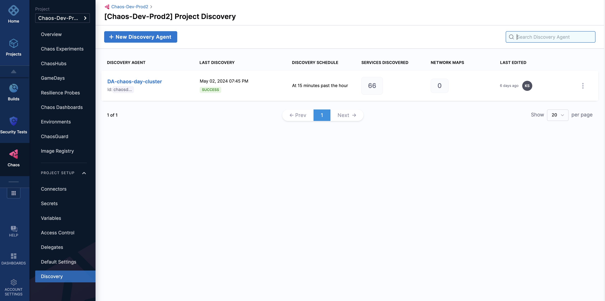
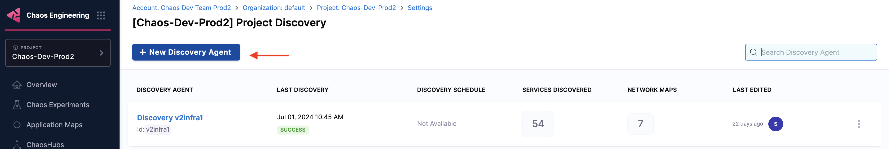
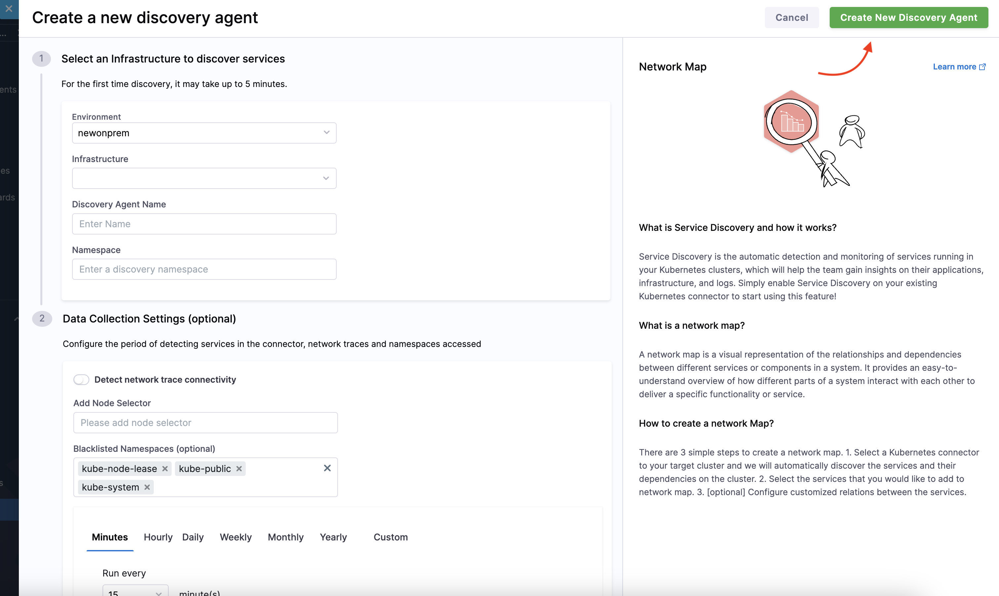
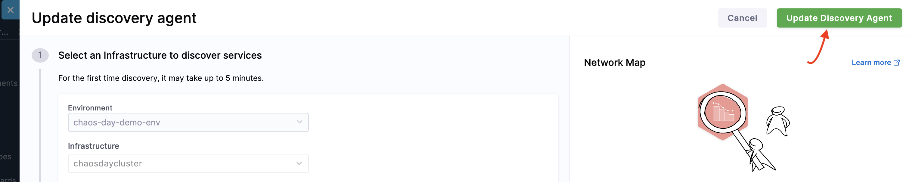
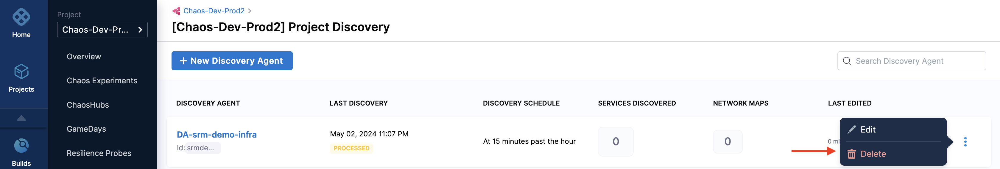
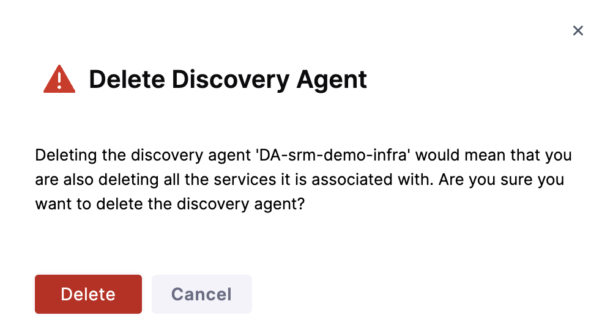

This topic describes how you can [create](#customize-discovery-agent), [edit](#edit-discovery-agent), and [delete](#delete-discovery-agent) a discovery agent.

### Before you begin

- Review the [introduction to service discovery](/docs/chaos-engineering/features/service-discovery/intro-service-discovery.md)

When you are onboarding, one of the steps involves discovering services. HCE creates the discovery agent that automatically discovers services for your application.

If you want to customize the discovery agent, follow the steps below.

### Customize discovery agent

1. To customize the discovery agent, navigate to **Chaos**, select **Project Settings** and select **Discovery**.

    

2. Click **New Discovery Agent**.

    

3. Select an **environment**, **infrastructure**, **Discovery Agent Name** and **namespace**. The next step (optional) requires information such as node selector, blacklisted namespaces, and period of detecting the services. Select **Create New Discovery Agent**.

    

### Edit discovery agent

1. To edit a discovery agent, navigate to the agent and click **Edit**. Make the necessary changes to the required fields.

    

2. Select **Update Discovery Agent**.

    

### Delete discovery agent

1. To delete a discovery agent, navigate to the agent you want to delete and select **Delete**.

    

2. Select **Delete**.

    