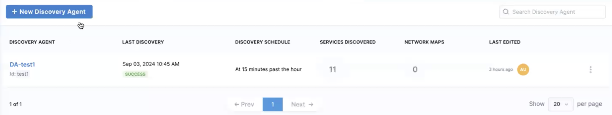
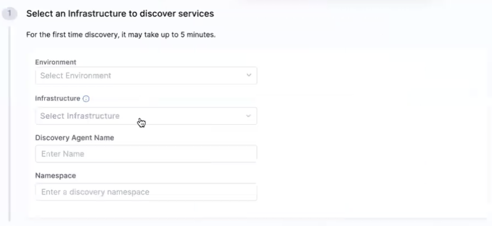
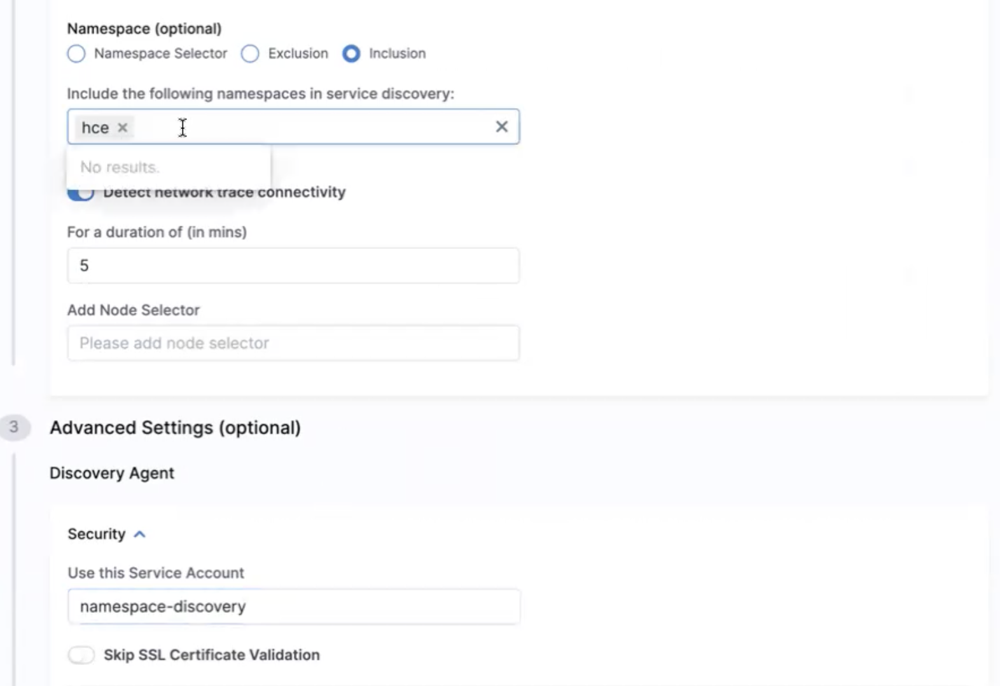
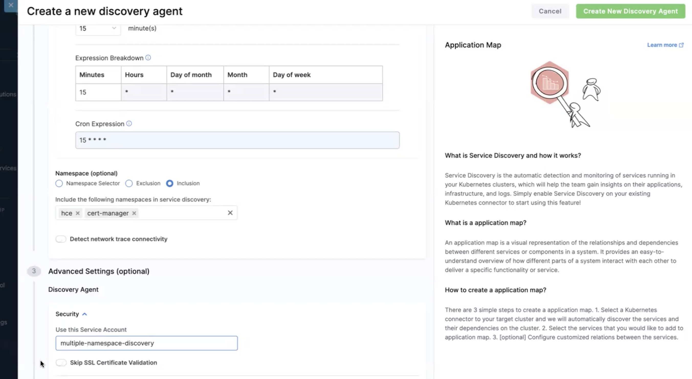

This topic describes how you can use user-defined service accounts in different scopes to discover services in two ways:
- YAML manifest
- From the UI

## Using YAML manifest

This section describes how you can create service accounts in different scopes to discover services.

### Single Namespace Scope
When you want to discover resources from a particular namespace, you can create a service account with the role, `da-mgmt`. This role is bound to the service account.

The role `da-mgmt` is required during the process of service discovery to manage the discovery process.

To manage the entire process of discovery, it is required to create pods that are transient. Hence, the role `da-mgmt` is created (that is common to all modes) that is described below. The next YAML describes creating a role `da-discovery` in the namespace `hce-sa`.

```yaml
apiVersion: v1
kind: ServiceAccount
metadata:
  name: namespace-discovery
---
apiVersion: rbac.authorization.k8s.io/v1
kind: Role
metadata:
  name: da-mgmt
  namespace: hce-sa
rules:
- apiGroups:
  - ""
  resources:
  - pods
  verbs:
  - create
  - delete
  - get
  - list
- apiGroups:
  - ""
  resources:
  - pods/log
  verbs:
  - get
  - list
  - watch
- apiGroups:
  - apps
  resources:
  - deployments
  verbs:
  - create
  - delete
  - get
  - list
  - patch
  - update
---
apiVersion: rbac.authorization.k8s.io/v1
kind: Role
metadata:
  name: da-discovery
  namespace: hce-sa
rules:
- apiGroups:
  - apps
  resources:
  - deployments
  - replicasets
  - daemonsets
  - statefulsets
  verbs:
  - watch
  - list
  - get
- apiGroups:
  - ""
  resources:
  - pods
  - replicationcontrollers
  - services
  - statefulsets
  verbs:
  - watch
  - list
  - get
- apiGroups:
  - batch
  resources:
  - jobs
  - cronjobs
  verbs:
  - watch
  - list
  - get
```

The YAML below describes how the `da-mgmt` RoleBinding is applied to service account `namespace-discovery`.

```yaml
apiVersion: rbac.authorization.k8s.io/v1
kind: RoleBinding
metadata:
  name: da-mgmt
  namespace: hce-sa
roleRef:
  apiGroup: rbac.authorization.k8s.io
  kind: Role
  name: da-mgmt
subjects:
- kind: ServiceAccount
  name: namespace-discovery
  namespace: hce-sa
```

The YAML below describes how the `da-discovery` role is bound to service account `namespace-discovery`.

```yaml
apiVersion: rbac.authorization.k8s.io/v1
kind: RoleBinding
metadata:
  name: da-discovery
  namespace: hce-sa
roleRef:
  apiGroup: rbac.authorization.k8s.io
  kind: Role
  name: da-discovery
subjects:
- kind: ServiceAccount
  name: namespace-discovery
  namespace: hce-sa
```

### Cluster Scope
In this scope, the service account is created by default and the discovery runs in cluster scope by default.

To create a service account with added permissions, such as providing role and role binding, create the `da-mgmt` role as mentioned [here](#namespace-scope) that helps manage the process of service discovery.

:::tip
The `da-mgmt` role is common to all ways creating service account for discovered services because managing the discovery is required for all scopes.
:::

```yaml
apiVersion: v1
kind: ServiceAccount
metadata:
  name: cluster-discovery
---
apiVersion: rbac.authorization.k8s.io/v1
kind: Role
metadata:
  name: da-mgmt
  namespace: hce-sa
rules:
- apiGroups:
  - ""
  resources:
  - pods
  verbs:
  - create
  - delete
  - get
  - list
- apiGroups:
  - ""
  resources:
  - pods/log
  verbs:
  - get
  - list
  - watch
- apiGroups:
  - apps
  resources:
  - deployments
  verbs:
  - create
  - delete
  - get
  - list
  - patch
  - update
```

The YAML below describes how the role `da-discovery` is created in cluster scope by default and how RoleBinding is used with the role `da-mgmt`, and how ClusterRoleBinding is used with the role `da-discovery`.

```yaml
apiVersion: rbac.authorization.k8s.io/v1
kind: ClusterRole
metadata:
  name: da-discovery
rules:
- apiGroups:
  - apps
  resources:
  - deployments
  - replicasets
  - daemonsets
  - statefulsets
  verbs:
  - watch
  - list
  - get
- apiGroups:
  - ""
  resources:
  - pods
  - replicationcontrollers
  - services
  - statefulsets
  - nodes
  - namespaces
  verbs:
  - watch
  - list
  - get
- apiGroups:
  - batch
  resources:
  - jobs
  - cronjobs
  verbs:
  - watch
  - list
  - get
---
apiVersion: rbac.authorization.k8s.io/v1
kind: RoleBinding
metadata:
  name: da-mgmt
  namespace: hce-sa
roleRef:
  apiGroup: rbac.authorization.k8s.io
  kind: Role
  name: da-mgmt
subjects:
- kind: ServiceAccount
  name: cluster-discovery
  namespace: hce-sa
---
apiVersion: rbac.authorization.k8s.io/v1
kind: ClusterRoleBinding
metadata:
  name: da-discovery
roleRef:
  apiGroup: rbac.authorization.k8s.io
  kind: ClusterRole
  name: da-discovery
subjects:
- kind: ServiceAccount
  name: cluster-discovery
  namespace: hce-sa
```

### Multiple Namespaces

The `da-mgmt` role remains constant, to help manage service discovery process.

```yaml
apiVersion: v1
kind: ServiceAccount
metadata:
  name: multiple-namespace-discovery
---
apiVersion: rbac.authorization.k8s.io/v1
kind: Role
metadata:
  name: da-mgmt
  namespace: hce-sa
rules:
- apiGroups:
  - ""
  resources:
  - pods
  verbs:
  - create
  - delete
  - get
  - list
- apiGroups:
  - ""
  resources:
  - pods/log
  verbs:
  - get
  - list
  - watch
- apiGroups:
  - apps
  resources:
  - deployments
  verbs:
  - create
  - delete
  - get
  - list
  - patch
  - update
---
apiVersion: rbac.authorization.k8s.io/v1
kind: ClusterRole
metadata:
  name: da-discovery
rules:
- apiGroups:
  - apps
  resources:
  - deployments
  - replicasets
  - daemonsets
  - statefulsets
  verbs:
  - watch
  - list
  - get
- apiGroups:
  - ""
  resources:
  - pods
  - replicationcontrollers
  - services
  - statefulsets
  verbs:
  - watch
  - list
  - get
- apiGroups:
  - batch
  resources:
  - jobs
  - cronjobs
  verbs:
  - watch
  - list
  - get
---
apiVersion: rbac.authorization.k8s.io/v1
kind: RoleBinding
metadata:
  name: da-mgmt
  namespace: hce-sa
roleRef:
  apiGroup: rbac.authorization.k8s.io
  kind: Role
  name: da-mgmt
subjects:
- kind: ServiceAccount
  name: multiple-namespace-discovery
  namespace: hce-sa
```

If you want to have multiple namespaces when discovering services, you can create RoleBindings to bind the role with the specific namespace.
To enable discovery for two namespaces, say `hce` and `cert-manager`, you need two role bindings. These bindings should point to the particular discovery cluster role that you previously created.
The YAML below describes how you can achieve this.

```yaml
apiVersion: rbac.authorization.k8s.io/v1
kind: RoleBinding
metadata:
  name: da-discovery
  namespace: hce
roleRef:
  apiGroup: rbac.authorization.k8s.io
  kind: ClusterRole
  name: da-discovery
subjects:
- kind: ServiceAccount
  name: multiple-namespace-discovery
  namespace: hce-sa
---
apiVersion: rbac.authorization.k8s.io/v1
kind: RoleBinding
metadata:
  name: da-discovery
  namespace: cert-manager
roleRef:
  apiGroup: rbac.authorization.k8s.io
  kind: ClusterRole
  name: da-discovery
subjects:
- kind: ServiceAccount
  name: multiple-namespace-discovery
  namespace: hce-sa
```

### Added Permissions for Multiple Namespaces

To discover traffic on multiple namespaces, additional permissions are necessary.
Without the additional permissions, connectivity can't be discovered in single and multiple namespaces.

Let us take an example to understand why additional permissions are necessary.
In [cluster-scoped discovery](#cluster-scope), the resources were cluster-scoped, and they included resources `nodes` and `namespaces`. In case of [multiple namespace discovery](#multiple-namespace-discovery), you will not be able to discover nodes and namespaces since they are cluster-scoped.

But you can discover `nodes` (and other resources if required) in multiple namespaces if you provide the necessary permissions.
The YAML below describes how you can specify resources and provide ClusterRoleBinding for the role.


```yaml
apiVersion: rbac.authorization.k8s.io/v1
kind: ClusterRole
metadata:
  name: da-discovery-extra
rules:
- apiGroups:
  - ""
  resources:
  - nodes
  verbs:
  - watch
  - list
  - get
---
apiVersion: rbac.authorization.k8s.io/v1
kind: ClusterRoleBinding
metadata:
  name: da-discovery-extra
roleRef:
  apiGroup: rbac.authorization.k8s.io
  kind: ClusterRole
  name: da-discovery-extra
subjects:
- kind: ServiceAccount
  name: multiple-namespace-discovery
  namespace: hce-sa
```

## From the UI

1. Go to **Chaos** module and select **Projects**. Select **Discovery** and click **New Discovery Agent**.

  

2. Provide the **Environment**, **Infrastructure**, **Discovery Agent Name**, and **Namespace**.

  

### Single Namespace Scope
To use single namespace, select **Inclusion** and provide the namespace.

  

### Multiple Namespace Scope

To use multiple namespaces, disable the **Detect network trace connectivity** (it is enabled by default that corresponds to single namespace scope). Provide multiple namespaces and click **Create New Discovery Agent**.

  