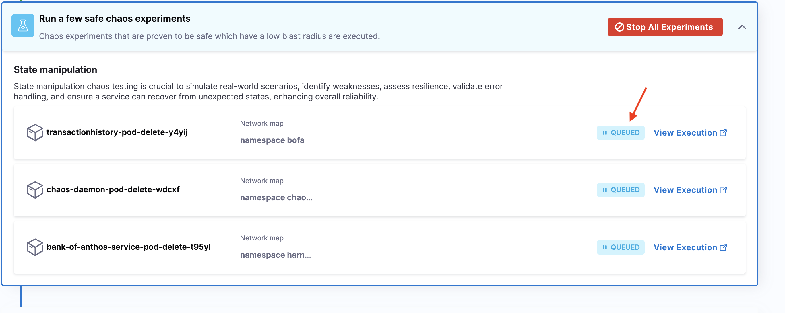

This guide guides you through setting up the chaos infrastructure, executing chaos experiments, and viewing the resilience dashboard with single clicks.

## Before you begin

* [Overview of HCE onboarding](/docs/chaos-engineering/get-started/onboarding/hce-onboarding.md)

### Execute chaos experiments

1. Navigate to the left nav bar and click **Overview**. Click **Select a Cluster** to choose a cluster so that you can execute chaos experiments.

2. Select an environment from the list and click **Next**.

3. Select the target infrastructure on which you want to execute the chaos experiments. Click **Apply**.

4. Based on your inputs earlier, HCE discovers services in your cluster (that is, **service discovery**) to create chaos experiments.

5. HCE automatically creates chaos experiments and selects a few experiments to execute.

6. HCE chooses to execute safe chaos experiments, that is, experiments that have a low blast radius.

### View logs and resilience dashboard

7. You can see the status of the chaos experiment execution, as well as view the experiment execution. You can also see the resilience score of the experiment if you click **View Resilience Dashboard**.

8. To view the experiment execution logs, click **View Execution** which opens on a new page. Here, you can see the logs of the experiment.

### View the progress of an experiment

1. You can view the progress of a chaos experiment you created earlier. Click **View Progress**.

2. Click **View** on the infrastructure where you executed the chaos experiment.

## Conclusion
Congratulations! You completed the guided HCE onboarding. Now you are all set to explore the chaos faults and build resilience of your application.
