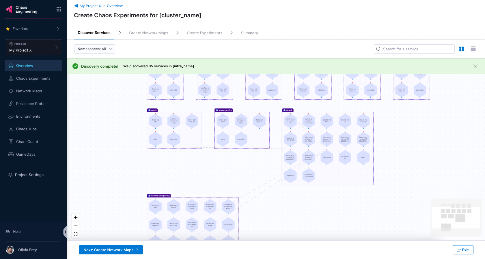
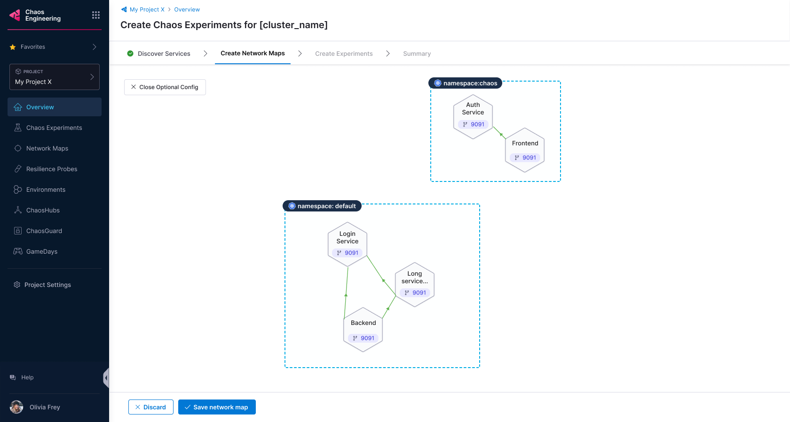
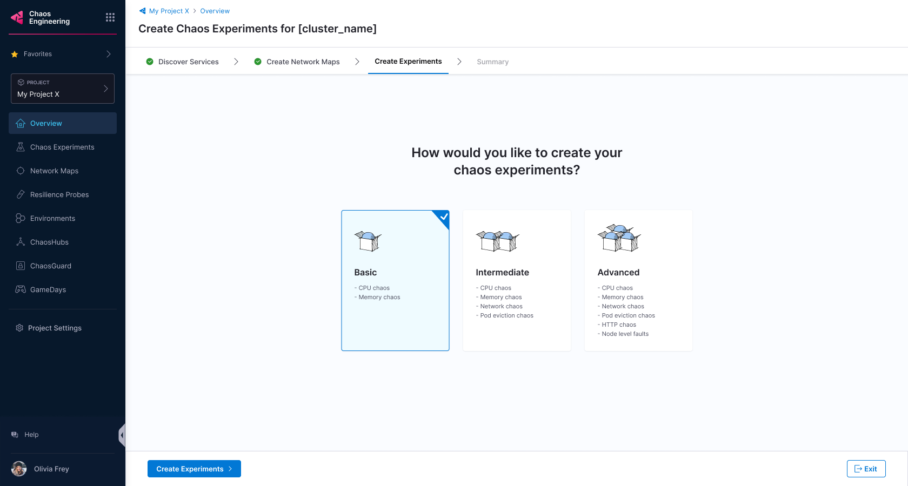

import Tabs from '@theme/Tabs';
import TabItem from '@theme/TabItem';

This topic describes how you can create network maps (with a single click) and choose the experiments to run in a chaos environment and infrastructure of your choice.

## Before you begin

* [What is chaos engineering?](/docs/chaos-engineering/get-started/overview)
* [Onboarding overview](/docs/chaos-engineering/get-started/onboarding/hce-onboarding.md)
* [HCE single-click onboarding](/docs/chaos-engineering/get-started/onboarding/single-click-onboarding.md)

## Steps to discover services, create network maps and execute chaos experiments

1. Navigate to **Chaos** module and click **Overview** to find the onboarding option.

    

### Choose between automatic and customizable experiment creation

2. In this topic, you will create network maps and execute chaos experiments, so select **No, I will choose**.

    

### Select chaos environment

3. As the first step, select a chaos environment. You can select one from a list of environments (that you previously created), and click **Next**.

    

### Select chaos infrastructure
4. It may take a while to set up the environment. In the second step, select a chaos infrastructure. You can select one from the list of chaos infrastructures, and click **Next**.

    

5. The next step verifies certain permissions by running pre-configured checks, after which you can click **Next**.

    

### Configure Discovery Agent

6. To configure the **Discovery Agent**, enter a **Discovery Agent Name** and **Tags** (optional). The next step is optional, and it collects information such as blacklisted namespaces, service discovery period, etc.

    

7. Once you complete the steps mentioned earlier, HCE looks for services in your cluster (which may take a while).

    

### Create Network Maps

8. Once HCE discovers the services, the UI lists them for your reference. Click **Create Network Maps**.

    

9. HCE prompts you to select one of the options- whether you wish to create network maps automatically, or no.

<Tabs>
  <TabItem value="Automatic">

9a. Select **Yes** to automatically create network maps. Click **Create Network Maps**.

    

9b. Based on the services you discovered earlier, HCE recommends some network maps for you.

    

</TabItem>

<TabItem value="Customize">

9a. Select **No** and click **Create Network Maps**.

        

9b. Enter a **Network Map Name**, **Tag** (optional), and **Description** (optional). Click **Confirm**.

    

9c. This creates network maps and lists them on the UI.

    

9d. To select and save some or all the created network maps, click **Save network map**.

    

</TabItem>
</Tabs>

### Create chaos experiments

10. HCE lists the network maps for you to choose from. Select one and click **Next: Create Chaos Experiments**.

    

11. Choose between **Basic**, **Intermediate**, and **Advanced** chaos experiments. The distinction is based on the blast-radius of the chaos experiment. Click **Create Experiments**.

    

12. Based on your choice, chaos experiments are created and network maps associated with the experiments are listed on the UI. Click **Complete** or **Exit**.

    

### Execute chaos experiments

13. Click **Run** to execute the chaos experiments.

    

14. Congratulations! You have successfully:

    - Discovered services
    - Created network maps
    - Created chaos experiments
    - Executed the chaos experiments
        

### View resilience score

Once the experiments you selected complete their execution, you can see the resilience score of these experiments.

    

You can check the resilience summary once you fulfill the checklist requirements.

    

You can click **View** to see the progress of different clusters executing various chaos experiments.

    

## Next steps

Don't forget to check other walkthroughs! Some of them are right here.

* [Run your first chaos experiment](/docs/chaos-engineering/get-started/tutorials/first-chaos-engineering.md)
* [Executing experiments in a sandbox](/docs/chaos-engineering/certifications/run-experiments-in-sandbox.md)
* [Create chaos experiments from scratch](/docs/chaos-engineering/get-started/tutorials/chaos-experiment-from-blank-canvas.md)
