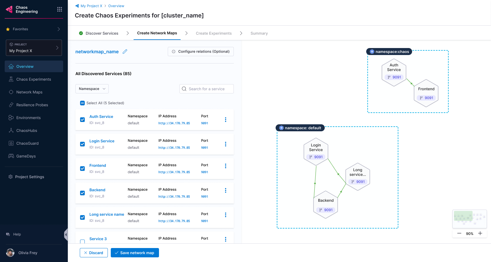
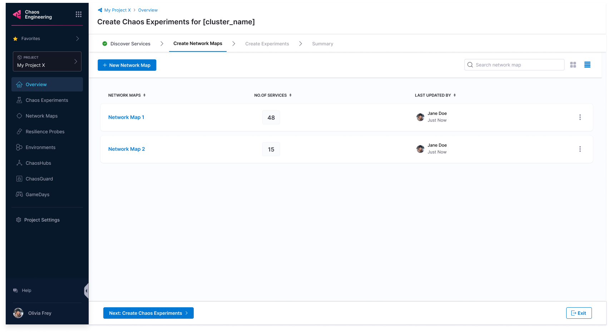

import Tabs from '@theme/Tabs';
import TabItem from '@theme/TabItem';

This topic describes the following operations:
1. [Create an environment.](#select-an-environment)
2. [Create an infrastructure.](#select-an-infrastructure)
3. [Automatically discover services on your cluster.](#automatically-create-discovery-agent)
4. [Create network maps with a single click.](#create-network-maps)
5. [Choose the chaos experiments to run.](#create-chaos-experiments)
6. [View the resilience of chaos experiments.](#view-resilience-score)

## Before you begin, review the following:

* [What is chaos engineering?](/docs/chaos-engineering/get-started/overview)
* [Onboarding overview](/docs/chaos-engineering/get-started/onboarding/hce-onboarding.md)
* [HCE single-click onboarding](/docs/chaos-engineering/get-started/onboarding/single-click-onboarding.md)

:::tip
Currently, this feature is behind the feature flag `CHAOS_V2_ENABLED`. Contact [Harness support](mailto:support@harness.io) to enable the feature
:::

## Discover services, create network maps, and execute chaos experiments

If you chose to onboard with guidance, follow the steps below.

### Select an environment

1. Select an environment from a list of environments and select **Next**. It may take a while to set up the environment.

    

### Select an infrastructure

2. Select an infrastructure from the list of infrastructure and select **Next**.

    

3. The next step verifies some permissions by running pre-configured checks, after which you can select **Next**.

    

### Automatically create Discovery Agent

4. HCE creates the discovery agent that automatically discovers services for your application. The next step (optional) collects information about blocked namespaces, service discovery periods, etc. To know how to use a custom discovery agent, go to [customize discovery agent](/docs/chaos-engineering/features/service-discovery/service-discovery-usage.md).

5. Once you complete the steps mentioned earlier, HCE looks for services in your cluster (which may take a while).

    

### Create Network Maps

6. Once HCE discovers the services, the UI lists them for your reference. Select **Create Network Maps**.

    

7. HCE prompts you to select one of the options to create network maps automatically or not.

### Choose between automatic and customizable network map creation

<Tabs>
 <TabItem value="Automatic">

7a. Select **Yes** to automatically create network maps. Select **Create Network Maps**.

    

7b. You will find network map recommendations from HCE based on the discovered services.

    

</TabItem>

<TabItem value="Customize">

7a. Select **No, I will choose** to customize network map creation and select **Create Network Maps**.

    

7b. Enter a **Network Map Name**, **Tag** (optional), and **Description** (optional). Select **Confirm**.

    

This creates network maps and lists them on the UI.

    

7c. To select and save some or all the created network maps, select **Save network map**.

    

</TabItem>
</Tabs>

### Create chaos experiments

8. HCE lists the network maps for you to choose from. Choose one and select **Next: Create Chaos Experiments**.

    

9. You can choose between **Basic**, **Intermediate**, and **Advanced** chaos experiments (categorized based on their blast radius). Select **Create Experiments** to initiate the process.

    

10. Based on your choice, HCE creates chaos experiments and lists the network maps associated with the experiments on the UI. Select **Complete** or **Exit**.

    

### Execute chaos experiments

11. Select **Run** to execute the chaos experiments.

    

Congratulations! You have successfully:

 - Discovered services
 - Created network maps
 - Created chaos experiments
 - Executed the chaos experiments
    

### View resilience score

- Once the experiments you selected complete their execution, you can see the resilience score of these experiments.

    

- You can check the resilience summary once you fulfill the checklist requirements.

    

- You can select **View** to see the progress of different clusters executing various chaos experiments.

    

## Next steps

Don't forget to check other walkthroughs! Some of them are listed below.

* [Run your first chaos experiment](/docs/chaos-engineering/get-started/tutorials/first-chaos-engineering.md)
* [Executing experiments in a sandbox](/docs/chaos-engineering/certifications/run-experiments-in-sandbox.md)
* [Create chaos experiments from scratch](/docs/chaos-engineering/get-started/tutorials/chaos-experiment-from-blank-canvas.md)
