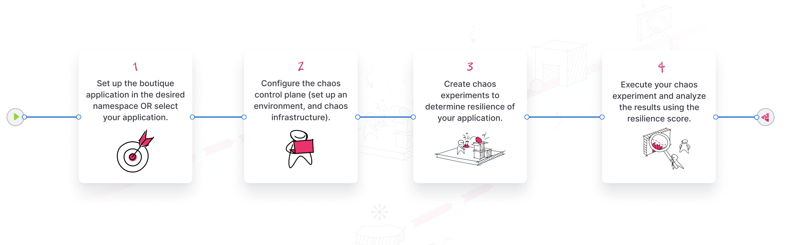

Welcome to Harness Chaos Engineering (HCE)! This section introduces you to the following:
1. [Basics of chaos engineering](#what-is-chaos-engineering);
2. [Importance of chaos engineering](#why-is-chaos-engineering-important);
3. [Advantages of HCE](#benefits-of-hce); and
4. [Chaos engineering implementation](#how-to-implement-chaos-engineering-to-build-resilient-applications) to improve the resilience of your application.

## Introduction
Cloud-native applications are highly distributed, elastic, resistant to failure, and loosely coupled. You need to ensure that your application performs as expected under different failure conditions.

Chaos engineering is a technique that is **relevant** to all types of systems, including legacy applications and infrastructure. This is particularly important for cloud-native applications since they carry multiple points of failure due to their distributed, and elastic nature.

## What is chaos engineering?

In simple terms, Chaos engineering is the technique of inducing chaos, that is, unexpected failures in the application.

The consensus is that something **will** go wrong in an application, so it would be better to practice what actions to take when something goes wrong and ensure that everything recovers.

The idea is that the design of an application should be resilient and handle any failure. By introducing constant chaos during the engineering phase and the production phase, you may come across issues and potential failure points that you never thought of.

A **formal definition** is: _"Chaos engineering is the discipline of performing experiments on software to build confidence in the system's capability to withstand turbulent and unexpected conditions. Failures are intentionally injected into applications to build resilience. By proactively introducing controlled chaos into systems, you can identify weaknesses in your application and prevent catastrophic failures."_

:::tip
Chaos engineering isn't the same as software testing (manual or automated) which verifies that your system is working as expected.
:::

Chaos experiments target a steady-state system and simulate conditions that might induce failure in components such as infrastructure, networks, and services. For example, a chaos experiment might terminate a pod in a functional Kubernetes cluster, shut down a working load balancer to validate failover, or induce CPU spikes on a server, and then observe how the system responds.

## Why is chaos engineering important?

In the current landscape of fast-paced technology, system failures have a significant impact on businesses, customers, and stakeholders. Chaos engineering is a way to identify potential issues before they become major problems, helping organizations minimize downtime, mitigate risks, and improve reliability.

### Shift left chaos engineering

The initial principles of chaos engineering suggest performing experiments in production (which is relevant and recommended), which is viewed as a means to validate resilience beforehand, that is, as a quality gate for larger deployment environments.
This is accelerated by a need to build confidence in a highly dynamic environment in which application services and infrastructure are subject to frequent and independent upgrades. The resulting paradigm is:

- Increased ad-hoc/exploratory chaos testing by application developers and QA teams;
- Automating chaos experiments within continuous delivery (CD) pipelines.

## How to implement chaos engineering to build resilient applications?

You can build resilient applications by following the steps below:

1. **Choose** or **build** your application;
2. **Configure** the **chaos control plane**, that is:
    1. Set up an **environment**;
    2. Set up a **chaos infrastructure**;
3. **Create chaos experiments** in your application;
4. **Execute** the chaos experiments;
5. **Analyze** the result.

This suggests that chaos experiments need the appropriate observability infrastructure to aid the validation of the hypotheses around the steady state. The practice of chaos engineering consists of performing experiments repeatedly, by injecting a variety of potential failures (called **chaos faults**) to simulate real-world failure conditions carried out against different resources (called **targets**).

Harness Chaos Engineering (HCE) simplifies the chaos engineering practices for your organization. The diagram below describes the steps that you can perform to induce chaos into an application.

### Standard chaos experiment flow of control

The standard chaos experimentation flow involves the following steps:
1. Identify the steady state of the system or application under test and specify its service-level objectives (SLOs);
2. Hypothesize around the impact a particular fault or failure would cause;
3. Inject this failure (or chaos fault) in a controlled manner (with a pre-determined and minimal blast radius);
4. Validate whether the hypothesis is proven and if the system meets the SLOs, and take appropriate actions if a weakness is found.

## Benefits of HCE

HCE doesn't simply focus on fault injection, it helps you set up a fully operational chaos function that is based on the original [principles of chaos](https://principlesofchaos.org/), and addresses several enterprise needs around its practice, which include:

1. Cloud native approach to chaos engineering which supports declarative definition of experiments and [Git-based chaos artifact sources](/docs/chaos-engineering/features/chaos-hubs/add-chaos-hub.md) (chaos-experiments-as-code).
2. Extensive fault library and robust suite of [ready-to-use experiments](/docs/chaos-engineering/chaos-faults), with support to construct complex custom experiments with [multiple faults](/docs/chaos-engineering/features/experiments/create-complex-chaos-experiments.md) in the desired order.
3. Centralized control plane that supports a variety of targets (such as [Kubernetes-based microservices](/docs/chaos-engineering/chaos-faults/kubernetes/kubernetes.md), [cloud services such as [AWS](/docs/chaos-engineering/chaos-faults/aws/aws.md), [Azure](/docs/chaos-engineering/chaos-faults/azure/azure.md), [GCP](/docs/chaos-engineering/chaos-faults/gcp/gcp.md), [Cloud Foundry](/docs/chaos-engineering/chaos-faults/cloud-foundry/cloud-foundry.md)], and [VMware infrastructure](/docs/chaos-engineering/chaos-faults/vmware/vmware.md)).

4. Governance enforcement for chaos experimentation using:

    a. Dedicated workspaces that isolate chaos experiments and resources for different teams or projects;

    b. [Additional security enforcement](/docs/chaos-engineering/features/chaosguard/introduction-to-chaosguard.md), ChaosGuard that executes a set of conditions before executing the chaos experiment, thereby adding a layer of security to chaos-enabled users;

    c. Chaos teams that indicates a group of users who are authorized to access and execute chaos experiments in a workspace. By using chaos teams, you can control who has access to chaos resources and ensure that only authorized users can execute chaos experiments;

    d. Access control refers to fine grained permissions for chaos resources and actions. This includes controlling access to chaos infrastructure, controlling the types of faults that can be used, and regulating the runtime permissions for experiment execution within the target infrastructure.

5. Native integration with [Harness Continuous Delivery (CD) pipelines](/docs/chaos-engineering/integrations/hce-and-cd/chaos-cd).
6. [Hypothesis validation using probes](/docs/chaos-engineering/features/resilience-probes/use-probe) and SLO management using integration with Harness Continuous Verification (CV).
7. [Guided GameDay execution](/docs/chaos-engineering/features/gameday/introduction-to-gameday) with detailed analytics and reporting based on experiment execution and application resilience.
8. Chaos events, metrics, and logs (audit and execution) to aid in the [instrumentation of APM (Application Performance Monitoring)](/docs/chaos-engineering/integrations/use-chaos-with-srm.md) dashboards with chaos context to monitor the impact of chaos faults on the service/application health.

:::tip
Harness Chaos Engineering is available in **SaaS** and **self-managed** versions.

1. **SaaS (Software-as-a-service)**: You either sign up or get invited to a specific project. You can also create a project if you have the necessary permissions. HCE helps manage the cluster.
2. [**SMP (Self-managed platform)**](/docs/chaos-engineering/get-started/ce-on-smp/ce-smp-roadmap.md): You create, manage and maintain your clusters. You are responsible for providing permissions to projects and handling issues associated with them.
:::

## Try Chaos Engineering today

* [Run your first chaos experiment](/docs/chaos-engineering/get-started/tutorials/first-chaos-engineering.md)
* [Executing experiments in a sandbox](/docs/chaos-engineering/onboarding/certifications/run-experiments-in-sandbox)
* [Create chaos experiments from scratch](/docs/chaos-engineering/get-started/tutorials/chaos-experiment-from-blank-canvas)

