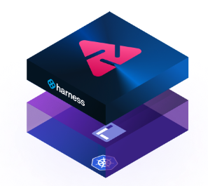

Harness Chaos Engineering (CE) is powered by the open source CNCF chaos engineering project [LitmusChaos](https://github.com/litmuschaos/litmus). Harness CE adds additional features to make the practice of chaos engineering for enterprises easy.

Go to [Harness CE versus LitmusChaos](#harness-ce-versus-litmuschaos) for a quick comparison.

## Common capabilities of CE and LitmusChaos
Following are the common features between Litmus and Harness Chaos Engineering:

1. Scalable platform
2. Declarative chaos fault architecture
3. Kubernetes chaos faults
4. Chaos faults as CRDs
5. Chaos metrics
6. Chaos hubs
7. Chaos infrastructure architecture
8. Chaos experiments structure
9. Scheduling chaos experiments
10. Resilience probes

## Additional capabilities of Harness CE

Harness CE module has the following additional capabilities:

1. [Kubelet density chaos fault](../technical-reference/chaos-faults/kube-resilience/kubelet-density)
2. [VMware chaos faults](../technical-reference/chaos-faults/vmware/)
3. [AWS chaos faults](../technical-reference/chaos-faults/aws/)
4. [GCP chaos faults](../technical-reference/chaos-faults/gcp/)
5. [Azure chaos faults](../technical-reference/chaos-faults/azure/)
6. [Linux chaos faults](../technical-reference/chaos-faults/linux/)
7. Teaming around chaos hubs
8. Additional resilience probes

## Integrations with other Harness modules

In addition to the above features, CE integrates with these Harness modules:

- Continuous Delivery (CD). Go to [Use CE with CD](/docs/chaos-engineering/integrations/chaos-cd).
- Feature Flags (FF). Go to [Use CE with FF](/docs/chaos-engineering/integrations/chaos-ff).
- Service Reliability Management (SRM). Documentation coming soon.

## Harness CE versus LitmusChaos

This section describes the differences between Harness Chaos Engineering (CE ) and the open-source CNCF incubation project, LitmusChaos.

### Chaos management - Basic 
<table>
    <tr>
        <td><b>Feature</b></td>
        <td><b>Litmus</b></td>
        <td><b>CE  (SaaS)</b></td>
    </tr>
   <tr>
        <td>Centralized chaos portal</td>
        <td>✅</td>
        <td>✅</td>
    </tr>
    <tr>
        <td>Chaos hubs</td>
        <td>Public hub</td>
        <td>Enterprise hub</td>
    </tr>
    <tr>
        <td>Chaos metrics to Prometheus</td>
        <td>✅</td>
        <td>✅</td>
    </tr>
    <tr>
        <td>YAML-based support for chaos experiments</td>
        <td>✅</td>
        <td>✅</td>
    </tr>
    <tr>
        <td>Run chaos faults in parallel</td>
        <td>✅</td>
        <td>✅</td>
    </tr>
    <tr>
        <td>Experiment control parameters through the tag in the UI</td>
        <td>❌</td>
        <td> ✅ </td>
    </tr>
    <tr>
        <td>Event driven chaos injection</td>
        <td>✅</td>
        <td>✅ (via Harness webhooks)</td>
    </tr>
    <tr>
        <td>Ability to halt all ongoing chaos experiments using the <b>halt</b> button</td>
        <td>❌</td>
        <td>✅</td>
    </tr>
    <tr>
        <td>BYOC (Bring Your Own Chaos)</td>
        <td>✅</td>
        <td>✅</td>
    </tr>
</table>

### Chaos management - Advanced

<table>
  <tr>
        <td><b>Feature</b></td>
        <td><b>Litmus</b></td>
        <td><b>CE  (SaaS)</b></td>
    </tr>
  <tr>
        <td>Chaos experiments CRUD</td>
        <td>Partial</td>
        <td>✅</td>
    </tr>
    <tr>
        <td>Chaos experiments for multiple clusters</td>
        <td>❌</td>
        <td>✅ (GameDays and pipelines)</td>
    </tr>
    <tr>
        <td>Run chaos experiments in parallel</td>
        <td>❌</td>
        <td>✅ (GameDays and pipelines)</td>
    </tr>
    <tr>
        <td>Out-of-the-box chaos experiments</td>
        <td>❌</td>
        <td>✅</td>
    </tr>
    <tr>
        <td>OOTB API templates for chaos experiments</td>
        <td>❌</td>
        <td>✅</td>
    </tr>
    <tr>
        <td>Export chaos experiments to chaos hubs</td>
        <td>❌</td>
        <td>✅</td>
    </tr>
    <tr>
        <td>Schedule chaos scenarios directly from a chaos hub</td>
        <td>❌</td>
        <td>✅</td>
    </tr>
    <tr>
        <td>GameDay portal</td>
        <td>❌</td>
        <td>✅</td>
    </tr>
</table>

### Administration
<table>
  <tr>
        <td><b>Feature</b></td>
        <td><b>Litmus</b></td>
        <td><b>CE  (SaaS)</b></td>
    </tr>
    <tr>
        <td>Rest/GraphQL APIs</td>
        <td>✅</td>
        <td>✅</td>
    </tr>
    <tr>
        <td>Built-in user management and authentication</td>
        <td>Basic</td>
        <td>✅</td>
    </tr>
    <tr>
        <td>Single Sign-On (SSO) with OAuth 2.0</td>
        <td>❌</td>
        <td>✅</td>
    </tr>
    <tr>
        <td>Single Sign-On (SSO) with SAML</td>
        <td>❌</td>
        <td>✅</td>
    </tr>
    <tr>
        <td>Provision users with Okta (SCM)</td>
        <td>❌</td>
        <td>✅</td>
    </tr>
    <tr>
        <td>Provision Azure AD Users and Groups (SCIM)</td>
        <td>❌</td>
        <td>✅</td>
    </tr>
    <tr>
        <td>Provision users and groups with OneLogin (SCIM)</td>
        <td>❌</td>
        <td>✅</td>
    </tr>
    <tr>
        <td>Multiple projects</td>
        <td>❌</td>
        <td>✅</td>
    </tr>
    <tr>
        <td>Multiple Organisations</td>
        <td>❌</td>
        <td>✅</td>
    </tr>
</table>

### Security
<table>
  <tr>
        <td><b>Feature</b></td>
        <td><b>Litmus</b></td>
        <td><b>CE  (SaaS)</b></td>
    </tr>
    <tr>
        <td>Two-factor authentication</td>
        <td>❌</td>
        <td>✅</td>
    </tr>
    <tr>
        <td>RBAC (Role Based Access Control)- Built-in roles</td>
        <td>Basic</td>
        <td>✅</td>
    </tr>
    <tr>
        <td>RBAC (Role Based Access Control)- Custom roles</td>
        <td>❌</td>
        <td>✅</td>
    </tr>
    <tr>
        <td>Audit trail (2 year data retention)</td>
        <td>❌</td>
        <td>✅</td>
    </tr>
    <tr>
        <td>Integrated secrets management with Harness Secrets Manager</td>
        <td>❌</td>
        <td>✅</td>
    </tr>
    <tr>
        <td>IP Address whitelist management</td>
        <td>❌</td>
        <td>✅</td>
    </tr>
</table>

### Integrations
<table>
<tr>
        <td><b>Feature</b></td>
        <td><b>Litmus</b></td>
        <td><b>CE  (SaaS)</b></td>
    </tr>
    <tr>
        <td>Integration with Harness CD Pipelines</td>
        <td>❌</td>
        <td>✅</td>
    </tr>
    <tr>
        <td>Integration with Harness CV</td>
        <td>❌</td>
        <td>✅</td>
    </tr>
</table>

### Kubernetes pod-level chaos faults

Go to [Pod faults](/docs/category/pod) for more information.
<table>
  <tr>
        <td><b>Feature</b></td>
        <td><b>Litmus</b></td>
        <td><b>CE  (SaaS)</b></td>
    </tr>    
    <tr>
        <td>Pod delete</td>
        <td>✅</td>
        <td>✅</td>
    </tr>
    <tr>
        <td>Pod DNS error</td>
        <td>✅</td>
        <td>✅</td>
    </tr>
    <tr>
        <td>Pod DNS spoof</td>
        <td>✅</td>
        <td>✅</td>
    </tr>
    <tr>
        <td>Pod I/O stress</td>
        <td>✅</td>
        <td>✅</td>
    </tr>
    <tr>
        <td>Container kill</td>
        <td>✅</td>
        <td>✅</td>
    </tr>
    <tr>
        <td>Disk fill</td>
        <td>✅</td>
        <td>✅</td>
    </tr>
    <tr>
        <td>Pod HTTP reset peer</td>
        <td>✅</td>
        <td>✅</td>
    </tr>
    <tr>
        <td>Pod HTTP status code</td>
        <td>✅</td>
        <td>✅</td>
    </tr>
    <tr>
        <td>Pod HTTP modify body</td>
        <td>✅</td>
        <td>✅</td>
    </tr>
    <tr>
        <td>Pod HTTP modify header</td>
        <td>✅</td>
        <td>✅</td>
    </tr>
    <tr>
        <td>Pod HTTP latency</td>
        <td>✅</td>
        <td>✅</td>
    </tr>
    <tr>
        <td>Pod memory hog</td>
        <td>✅</td>
        <td>✅</td>
    </tr>
    <tr>
        <td>Pod memory hog exec</td>
        <td>✅</td>
        <td>✅</td>
    </tr>
    <tr>
        <td>Pod CPU hog</td>
        <td>✅</td>
        <td>✅</td>
    </tr>
    <tr>
        <td>Pod CPU hog exec</td>
        <td>✅</td>
        <td>✅</td>
    </tr>
    <tr>
        <td>Pod network loss</td>
        <td>✅</td>
        <td>✅</td>
    </tr>
    <tr>
        <td>Pod network partition</td>
        <td>✅</td>
        <td>✅</td>
    </tr>
    <tr>
        <td>Pod network latency</td>
        <td>✅</td>
        <td>✅</td>
    </tr>
    <tr>
        <td>Pod network corruption</td>
        <td>✅</td>
        <td>✅</td>
    </tr>
    <tr>
        <td>Pod network duplication</td>
        <td>✅</td>
        <td>✅</td>
    </tr>
    <tr>
        <td>Pod autoscaler</td>
        <td>✅</td>
        <td>✅</td>
    </tr>
</table>

### Kubernetes node-level chaos faults

Go to [Node faults](/docs/category/node) for more information.

<table>
  <tr>
        <td><b>Feature</b></td>
        <td><b>Litmus</b></td>
        <td><b>CE  (SaaS)</b></td>
    </tr>
    <tr>
        <td>Docker service kill</td>
        <td>✅</td>
        <td>✅</td>
    </tr>
    <tr>
        <td>Kubelet service kill</td>
        <td>✅</td>
        <td>✅</td>
    </tr>
    <tr>
        <td>Node drain</td>
        <td>✅</td>
        <td>✅</td>
    </tr>
    <tr>
        <td>Node I/O stress</td>
        <td>✅</td>
        <td>✅</td>
    </tr>
    <tr>
        <td>Node CPU hog</td>
        <td>✅</td>
        <td>✅</td>
    </tr>
    <tr>
        <td>Node memory hog</td>
        <td>✅</td>
        <td>✅</td>
    </tr>
    <tr>
        <td>Node restart</td>
        <td>✅</td>
        <td>✅</td>
    </tr>
    <tr>
        <td>Node taint</td>
        <td>✅</td>
        <td>✅</td>
    </tr>
    <tr>
        <td>Kubernetes node network latency</td>
        <td>❌</td>
        <td>✅</td>
    </tr>
    <tr>
        <td>Kubernetes node network loss</td>
        <td>❌</td>
        <td>✅</td>
    </tr>
    <tr>
        <td>Kubernetes stress - Kubelet density </td>
        <td>❌</td>
        <td>✅</td>
    </tr>
  </table>

### AWS chaos faults

Go to [Chaos faults for AWS](/docs/chaos-engineering/technical-reference/chaos-faults/aws) for more information.
<table>
  <tr>
        <td><b>Feature</b></td>
        <td><b>Litmus</b></td>
        <td><b>CE  (SaaS)</b></td>
    </tr>
    <tr>
        <td>ALB AZ down</td>
        <td>❌</td>
        <td>✅</td>
    </tr>
    <tr>
        <td>CLB AZ down</td>
        <td>❌</td>
        <td>✅</td>
    </tr>
    <tr>
        <td>EBS loss by ID </td>
        <td>✅</td>
        <td>✅</td>
    </tr>
    <tr>
        <td>EBS loss by tag </td>
        <td>✅</td>
        <td>✅</td>
    </tr>
    <tr>
        <td>EC2 DNS chaos</td>
        <td>❌</td>
        <td>✅</td>
    </tr>
    <tr>
        <td>EC2 instance stop by ID</td>
        <td>✅</td>
        <td>✅</td>
    </tr>
    <tr>
        <td>EC2 instance stop by tag</td>
        <td>✅</td>
        <td>✅</td>
    </tr>
    <tr>
        <td>AWS SSM chaos by ID</td>
        <td>✅</td>
        <td>✅</td>
    </tr>
    <tr>
        <td>AWS SSM chaos by tag</td>
        <td>✅</td>
        <td>✅</td>
    </tr>
    <tr>
        <td>EC2 network loss</td>
        <td>❌</td>
        <td>✅</td>
    </tr>
    <tr>
        <td>EC2 network latency (Jitter/Abort)</td>
        <td>❌</td>
        <td>✅</td>
    </tr>
    <tr>
        <td>EC2 CPU hog</td>
        <td>❌</td>
        <td>✅</td>
    </tr>
    <tr>
        <td>EC2 memory hog</td>
        <td>❌</td>
        <td>✅</td>
    </tr>
    <tr>
        <td>EC2 I/O stress</td>
        <td>❌</td>
        <td>✅</td>
    </tr>
    <tr>
        <td>EC2 HTTP latency</td>
        <td>❌</td>
        <td>✅</td>
    </tr>
    <tr>
        <td>EC2 HTTP modify body</td>
        <td>❌</td>
        <td>✅</td>
    </tr>
    <tr>
        <td>EC2 HTTP modify header</td>
        <td>❌</td>
        <td>✅</td>
    </tr>
    <tr>
        <td>EC2 HTTP reset peer</td>
        <td>❌</td>
        <td>✅</td>
    </tr>
    <tr>
        <td>EC2 HTTP status code</td>
        <td>❌</td>
        <td>✅</td>
    </tr>
    <tr>
        <td>RDS instance delete</td>
        <td>❌</td>
        <td>✅</td>
    </tr>
    <tr>
        <td>RDS instance reboot</td>
        <td>❌</td>
        <td>✅</td>
    </tr>
    <tr>
        <td>ECS instance kill</td>
        <td>❌</td>
        <td>✅</td>
    </tr>
    <tr>
        <td>ECS task stop </td>
        <td>❌</td>
        <td>✅</td>
    </tr>
    <tr>
        <td>ECS invalid container image</td>
        <td>❌</td>
        <td>✅</td>
    </tr>
    <tr>
        <td>ECS network restrict </td>
        <td>❌</td>
        <td>✅</td>
    </tr>
    <tr>
        <td>ECS container network latency</td>
        <td>❌</td>
        <td>✅</td>
    </tr>
    <tr>
        <td>ECS container network loss</td>
        <td>❌</td>
        <td>✅</td>
    </tr>
    <tr>
        <td>ECS agent stop</td>
        <td>❌</td>
        <td>✅</td>
    </tr>
    <tr>
        <td>ECS container CPU hog </td>
        <td>❌</td>
        <td>✅</td>
    </tr>
    <tr>
        <td>ECS container memory hog</td>
        <td>❌</td>
        <td>✅</td>
    </tr>
    <tr>
        <td>ECS container I/O stress</td>
        <td>❌</td>
        <td>✅</td>
    </tr>
    <tr>
        <td>ECS update container resource limit</td>
        <td>❌</td>
        <td>✅</td>
    </tr>
    <tr>
        <td>ECS update container timeout </td>
        <td>❌</td>
        <td>✅</td>
    </tr>
    <tr>
        <td>ECS update task role </td>
        <td>❌</td>
        <td>✅</td>
    </tr>
    <tr>
        <td>Windows EC2 blackhole chaos </td>
        <td>❌</td>
        <td>✅</td>
    </tr>
    <tr>
        <td>Windows EC2 CPU hog </td>
        <td>❌</td>
        <td>✅</td>
    </tr>
    <tr>
        <td>Windows EC2 memory hog </td>
        <td>❌</td>
        <td>✅</td>
    </tr>
  </table>

### AWS serverless chaos faults

Go to [Chaos faults for AWS](/docs/chaos-engineering/technical-reference/chaos-faults/aws) for more information.

<table>
  <tr>
        <td><b>Feature</b></td>
        <td><b>Litmus</b></td>
        <td><b>CE  (SaaS)</b></td>
    </tr>
    <tr>
        <td>Lambda delete function concurrency</td>
        <td>❌</td>
        <td>✅</td>
    </tr>
    <tr>
        <td>Lambda toggle event mapping state</td>
        <td>❌</td>
        <td>✅</td>
    </tr>
    <tr>
        <td>Lambda delete event source mapping</td>
        <td>❌</td>
        <td>✅</td>
    </tr>
    <tr>
        <td>Lambda update function memory </td>
        <td>❌</td>
        <td>✅</td>
    </tr>
    <tr>
        <td>Lambda update function timeout</td>
        <td>❌</td>
        <td>✅</td>
    </tr>
    <tr>
        <td>Lambda update role permission </td>
        <td>❌ </td>
        <td>✅</td>
    </tr>
</table>

### GCP chaos faults

Go to [Chaos faults for GCP](/docs/chaos-engineering/technical-reference/chaos-faults/gcp) for more information.
<table>
  <tr>
        <td><b>Feature</b></td>
        <td><b>Litmus</b></td>
        <td><b>CE  (SaaS)</b></td>
    </tr>
    <tr>
        <td>GCP disk loss</td>
        <td>✅</td>
        <td>✅</td>
    </tr>
    <tr>
      <td>GCP disk loss by label</td>
      <td>❌</td>
      <td>✅</td>
    </tr>
    <tr>
    <td>GCP VM instance stop</td>
    <td>✅</td>
    <td>✅</td>
    </tr>
    <tr>
    <td> GCP VM instance stop by label </td>
    <td>❌</td>
    <td>✅</td>
    </tr>
</table>

### Azure chaos faults

Got to [Chaos faults for Azure](/docs/chaos-engineering/technical-reference/chaos-faults/azure) for more information.
<table>
  <tr>
        <td><b>Feature</b></td>
        <td><b>Litmus</b></td>
        <td><b>CE  (SaaS)</b></td>
    </tr>
    <tr>
        <td>Azure instance stop</td>
        <td>✅</td>
        <td>✅</td>
    </tr>
    <tr>
      <td> Azure disk loss </td>
      <td>✅</td>
      <td>✅</td>
    </tr>
    <tr>
        <td>Azure instance CPU hog</td>
        <td>❌</td>
        <td>✅</td>
    </tr>
    <tr>
        <td>Azure instance memory hog</td>
        <td>❌</td>
        <td>✅</td>
    </tr>
    <tr>
        <td>Azure instance I/O stress</td>
        <td>❌</td>
        <td>✅</td>
    </tr>
    <tr>
        <td>Azure web app stop</td>
        <td>❌</td>
        <td>✅</td>
    </tr>
    <tr>
        <td>Web app access restriction</td>
        <td>❌</td>
        <td>✅</td>
    </tr>
</table>

### VMware chaos faults

Go to [Chaos faults for VMware](/docs/chaos-engineering/technical-reference/chaos-faults/vmware) for more information.
<table>
  <tr>
        <td><b>Feature</b></td>
        <td><b>Litmus</b></td>
        <td><b>CE  (SaaS)</b></td>
    </tr>
    <tr>
        <td>VMware VM power off</td>
        <td>✅</td>
        <td>✅</td>
    </tr>
    <tr>
        <td>VMware CPU hog</td>
        <td>❌</td>
        <td>✅</td>
    </tr>
    <tr>
        <td>VMware memory hog</td>
        <td>❌</td>
        <td>✅</td>
    </tr>
    <tr>
        <td>VMware I/O stress</td>
        <td>❌</td>
        <td>✅</td>
    </tr>
    <tr>
        <td>VMware DNS chaos</td>
        <td>❌</td>
        <td>✅</td>
    </tr>
    <tr>
        <td>VMware host reboot</td>
        <td>❌</td>
        <td>✅</td>
    </tr>
    <tr>
        <td>VMware HTTP latency</td>
        <td>❌</td>
        <td>✅</td>
    </tr>
    <tr>
        <td>VMware HTTP reset peer</td>
        <td>❌</td>
        <td>✅</td>
    </tr>
    <tr>
        <td>VMware HTTP response modify</td>
        <td>❌</td>
        <td>✅</td>
    </tr>
    <tr>
        <td>VMware network loss</td>
        <td>❌</td>
        <td>✅</td>
    </tr>
    <tr>
        <td>VMware network latency</td>
        <td>❌</td>
        <td>✅</td>
    </tr>
    <tr>
        <td>VMware process kill</td>
        <td>❌</td>
        <td>✅</td>
    </tr>
    <tr>
        <td>VMware service stop</td>
        <td>❌</td>
        <td>✅</td>
    </tr>
    <tr>
        <td>VMware Windows CPU hog</td>
        <td>❌</td>
        <td>✅</td>
    </tr>
    <tr>
        <td>VMware disk loss </td>
        <td>❌</td>
        <td>✅</td>
    </tr>
</table>

### ALFI for Springboot
<table>
  <tr>
        <td><b>Feature</b></td>
        <td><b>Litmus</b></td>
        <td><b>CE  (SaaS)</b></td>
    </tr>
    <tr>
        <td>Latency</td>
        <td>✅</td>
        <td>✅</td>
    </tr>
    <tr>
        <td>Multiple faults injection </td>
        <td>❌</td>
        <td>✅</td>
    </tr>
    <tr>
        <td>Exceptions</td>
        <td>❌</td>
        <td>✅</td>
    </tr>
    <tr>
        <td>Memory stress </td>
        <td>❌</td>
        <td>✅</td>
    </tr>
    <tr>
        <td>CPU stress</td>
        <td>❌</td>
        <td>✅</td>
    </tr>
    <tr>
        <td>App kill</td>
        <td>❌</td>
        <td>✅</td>
    </tr>
</table>