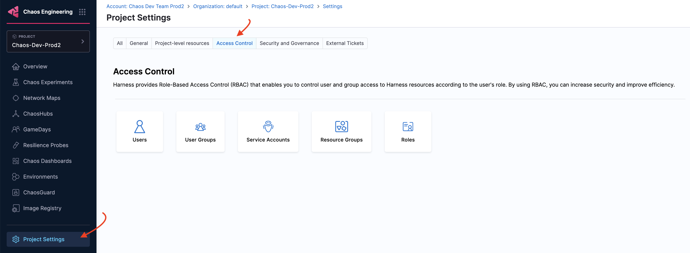

This topic describes the requirements and project-level permissions required to execute chaos experiments on your target environments.

- Obtain the permissions required:
	- Prepare yourself with the right permissions (`Chaos Resources Role Permissions` in `Access Control`).

			

	- Prepare yourself with the right permissions on the cloud account or the [Kubernetes cluster](/docs/category/permissions) or the VM (Kube RBAC, [IAM Roles](/docs/chaos-engineering/chaos-faults/aws/security-configurations/aws-iam-integration)): Depending on the platform where you wish to execute your chaos experiments, you will need specific permissions.

- Enable the necessary Feature Flags (as a general step) and corresponding sanity checks (such as places to click, and entities to see enabled): Some features may be behind a Feature Flag. You can contact [Harness Support](mailto:support@harness.io) to enable the flag feature for your account.

- Prepare the target systems (VMs or K8s): Your target system or application can reside on a VM or a K8s cluster. Based on the application's location, prepare your application.

- Prepare **network connectivity**, identify [**proxy requirements**](/docs/category/configure-proxy-on-self-managed-enterprise-edition), **firewall rules** (if any).

- Identify application (or infrastructure) steady-state parameters (even if this requires manual effort)- [using APMs](/docs/chaos-engineering/features/resilience-probes/cmd-probe/cmd-probe-newrelic) or logs or other methods: You can use resilience probes to monitor your application and validate the data.

- Identify image registry requirements and steps to set up the registry with secrets: Chaos experiments use Docker images that need to be stored in a repository. In HCE, these images are hosted in [image registry](/docs/chaos-engineering/features/image-registry).

- Identify specific needs, especially for Kubernetes. You might need to specify:
	- [Namespace quotas](/docs/chaos-engineering/architecture-and-security/security/namespace-considerations): Ensure that you configure the namespace in the right manner to limit the exposure of all services of your application.
	- Workload-specific labels or annotations
	- Workload resource limits
	- [Proxy environments for outbound container](/docs/chaos-engineering/chaos-faults/cloud-foundry/permissions/)
	- Specific nodes or groups where workloads should reside

- Identify permissions for advanced use cases, which may vary, such as [SCC](/docs/chaos-engineering/architecture-and-security/security/security-templates/openshift-scc), IRSA, etc.: For advanced use cases, you may require the administrator to control the pods in your cluster, that requires security policies, such as [PSP](/docs/chaos-engineering/architecture-and-security/security/security-templates/psp), [Kyverno](/docs/chaos-engineering/architecture-and-security/security/security-templates/kyverno-policies) to enforce runtime security, and so on.

- ChaosHub requirements and connectivity to Git sources.

## Add users to a project to run chaos experiments

You must have at least one user in a project, and set up permissions such that the user can perform chaos experiments. The following steps generate an email invitation to the new user(s) to add themselves to the project.

To add a new user to a project:

1. In Harness, select a project.

1. Expand the **Project setup** menu, and select **Access Control**.

	This page lists all the users added to the current project.

1. Select **New User**, and then:

	1. In **New User(s)**, add the email(s) of the user(s) you want to add.
	1. In **User Groups**, select any of the existing user groups to which you can add the user.
	1. Add the roles for the user(s) to enforce their access permissions.

	

1. Select **Apply**.

## Requirements for individual chaos faults

In the [chaos faults reference](/docs/chaos-engineering/chaos-faults/), you'll find fault-specific requirements listed in the **Use cases** section of each fault, as shown, for example, in the use cases for the [Kubelet service kill](/docs/chaos-engineering/chaos-faults/kubernetes/node/kubelet-service-kill#use-cases) fault.

## Chaos infrastructure requirements

The table below lists the chaos infrastructure execution plane components and the required resources. You can install these components in your target cluster, allowing the chaos infrastructure to run experiments here. Chaos infrastructure runs within your target environment to aid CE in accessing the target resources and injecting chaos at a cloud-native scale.

| Deployment | Container | CPU required | Memory required | Image |
|------------|-----------|-------------------|----------------------|-------|
| chaos-operator-ce  | chaos-operator-ce     | 125m | 300M | chaosnative/chaos-operator          |
| chaos-exporter     | chaos-exporter        | 125m | 300M | chaosnative/chaos-exporter          |
| subscriber         | subscriber            | 125m | 300M | chaosnative/harness-chaos-subscriber|
| workflow-controller| workflow-controller   | 125m | 300M | chaosnative/workflow-controller     |

