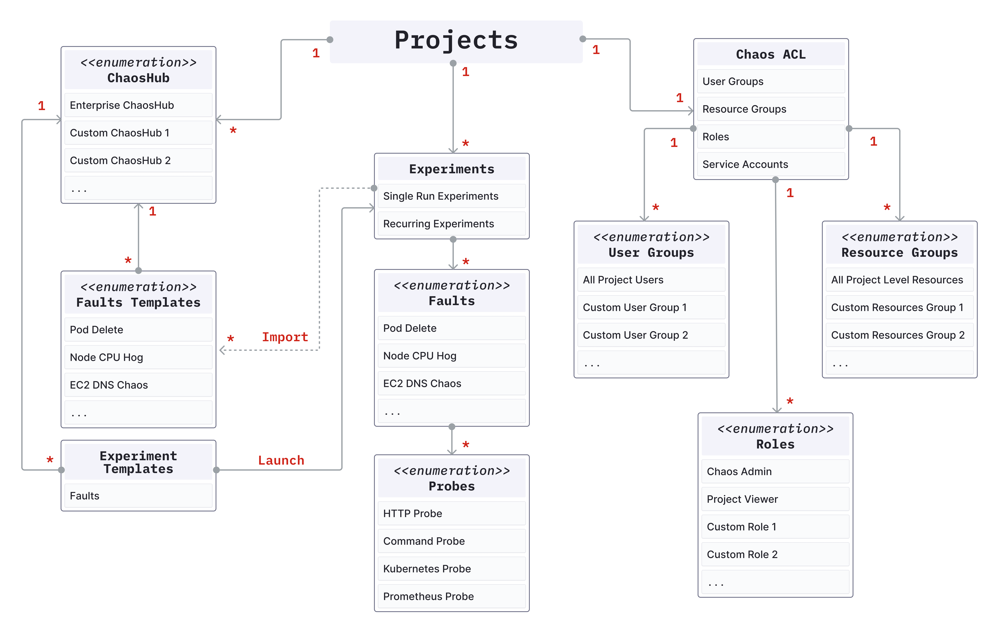

- **Chaos experiment:** A chaos experiment, simply referred as experiment, injects one or more chaos faults into a specified chaos infrastructure and summarizes the result of the chaos execution. The experiment can be defined using the Chaos Studio via the guided UI or by uploading the workflow CR manifest.
- **Chaos fault:** A chaos fault, or simply fault, refers to the failures injected into the chaos infrastructure as part of a chaos experiment. Every fault is scoped to a particular target resource and can be customized using the fault tunables, which are defined as part of the ChaosExperiment CR and ChaosEngine CR. Optionally, one or more probes can be defined as part of a chaos fault.
- **Chaos hub:** Chaos hub is a collection of experiment templates (defined as workflow CRs) and faults (defined as ChaosExperiment CR and ChaosEngine CR) that helps create and execute new chaos experiments against your target resources. Apart from the Enterprise chaos hub, which is present by default, custom chaos hubs can be added for the management and distribution of custom experiment templates and faults.
- **Chaos infrastructure:** Chaos infrastructures represent the individual components of a deployment environment. It is a service that runs within your target environment to aid CE in accessing the target resources and injecting chaos at a cloud-native scale. Multiple chaos infrastructures can be added as part of an environment.
- **Environment:** A Harness environment represents your deployment environment such as Dev, QA, Staging, Production, etc. Each Environment may contain multiple Chaos Infrastructures. It helps isolate the various environments that your engineering, product owners, QA, and automation teams use under a single Harness project. This allows for better segregation of mission-critical infrastructures with several attached dependencies from dev and staging infrastructures for their safety.
- **Chaos centre:** Chaos Studio is used for the creation of new chaos experiments using varied chaos faults and templates from the chaos hub, probes, and custom action steps. New experiments can be created using the guided UI or using the experiment manifest represented by the workflow CR.
- **Resilience score:** The resilience score is a quantitative measure of how resilient the target application is to a chaos experiment. It is [calculated](/docs/chaos-engineering/configure-chaos-experiments/experiments/resilience-score) based on the priority set for every fault in the experiment and the probe success percentage of the faults (if the probes are defined).
- **Probe:** Chaos probes automate the chaos hypothesis validation performed during a fault execution. They are declarative checks that determine the outcome of a fault. Probes are scoped to the faults and you can define as many probes as required as part of each fault.
- **Tunables:** A fault execution can be customized by changing the various tunables or parameters that it accepts. While some of them are common across all the faults, such as the Chaos Duration, every fault has its own set of tunables. Wherever applicable, default tunables have been provided which may need to be updated. Otherwise, mandatory tunables always need to be provided.
- **Chaos interval:** Chaos Interval is a tunable which specifies the duration between successive iterations of chaos, while the elapsed experiment time is less than the chaos duration.
- **Sequence:** The Sequence parameter defines the manner in which chaos shall be injected into the target instances of a fault. It may be configured as Serial to inject chaos in only one target in a single chaos iteration or Parallel to inject chaos in all targets in a single chaos iteration.
- **Chaos duration:** Chaos Duration refers to the total duration through which chaos execution shall take place. This excludes the duration of Pre-Chaos injection and Post-Chaos injection execution time.
- **Probe success percentage:** Probe success percentage refers to the percentage of probes that have been successfully evaluated out of the total number of probes.
- **Experiment templates:** Experiment templates are stored as part of the chaos hub, which can be used for creating new chaos experiments. They can be edited by making changes to the existing fault configuration or by adding new faults. New experiments can also be stored in chaos hub as templates.
- **Result fail step:** When an experiment fails, Fail Step specifies the exact cause of failure for the experiment run. It contains an error code for the classification of the error, a phase for specifying the execution phase during which the error occurred, and finally the reason which is a user-friendly description of the error.
- **Result phase:** Phase determines the status of the overall experiment execution. It may be any one of Awaited, Running, Completed, and Aborted, depending on the experiment outcome.
- **ChaosEngine CR:** The ChaosEngine CR is the user-facing chaos Kubernetes CR which connects a target resource instance with a chaos fault to orchestrate the steps of chaos execution. It allows one to specify run-level details such as overriding fault defaults, provide new environment variables and volumes, options to delete or retain experiment pods, and define probes among others. It is also patched to update the status of the fault execution.
- **ChaosExperiment CR:** ChaosExperiment CR contains the low-level execution information for the execution of a Chaos Fault. The CR holds granular details of a fault such as the container image, library, necessary permissions, and chaos parameters among others. Most of the ChaosExperiment CR parameters are tunables that can be overridden from the ChaosEngine CR.
- **Workflow CR:** A workflow CR is used to define a number of “operations” which are coupled together in a specific sequence to achieve a desired chaos impact. These operations are either chaos faults or any other custom action related to the experiment, such as load generation.