In this tutorial, you will create chaos experiments from scratch and execute them on the sample boutique application.

This experiment follows the same steps of [your first chaos experiment](/docs/chaos-engineering/get-started/tutorials/first-chaos-engineering.md) by creating a chaos environment and infrastructure and using the same boutique application by targeting the pods of the `cart` microservice, except the way you create an experiment. Creating a chaos experiment involves the following steps:

1. Create a project/receiving an invite for a project with relevant access;
2. Create an environment;
3. Create a chaos infrastructure;
4. Create a chaos experiment.

In the last step, instead of choosing a pre-defined experiment, you will choose from a variety of experiments. This way of choosing a chaos experiment from a list will set the foundation for you to understand how to execute different experiments on different platforms with varied targets based on your requirements.

## Before you begin

* [What is chaos engineering?](/docs/chaos-engineering/get-started/overview.md)
* [Prerequisites to execute chaos experiments](/docs/chaos-engineering/onboarding/prerequisites.md)
* [Execute your first chaos experiment using a template](/docs/chaos-engineering/get-started/tutorials/first-chaos-engineering.md)

### Step 1: Set up environment and infrastructure

1. Follow the steps to set up [your environment](/docs/chaos-engineering/get-started/tutorials/first-chaos-engineering#step-2-add-a-chaos-environment) and [chaos infrastructure](/docs/chaos-engineering/get-started/tutorials/first-chaos-engineering#step-3-add-a-chaos-infrastructure).

### Step 2: Construct a chaos experiment from a blank canvas

2. Once you have your environment and chaos infrastructure in place, you can create a chaos experiment. To create an experiment, navigate to **Chaos Experiments** in the left nav, and then select **New Experiment**.

    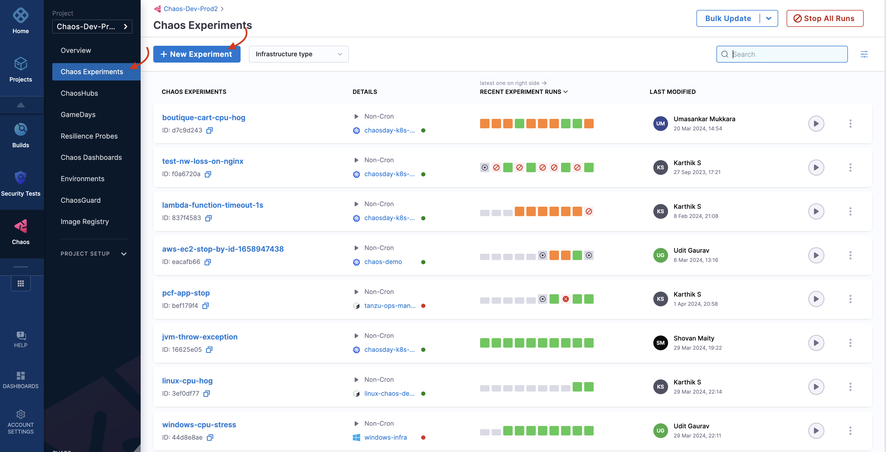

3. Specify the experiment name, a description (optional), and tags (optional). Choose the target infrastructure, click **Apply**, and click **Next**.

    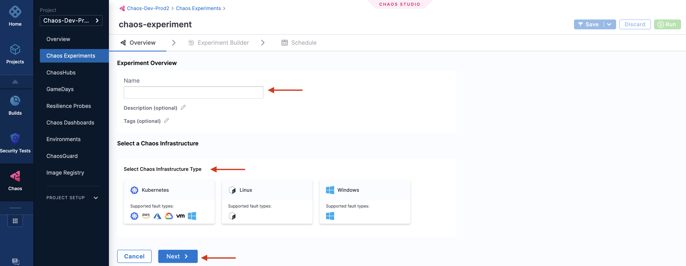

4. In the Experiment Builder, select **Blank Canvas** and click **Start with blank canvas**.

    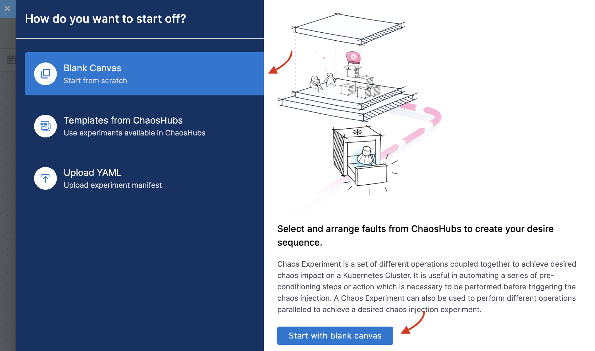

5. This opens the page where you can add chaos faults to your experiment. Click **Add**.

    

6. Search for **"pod delete"** in the search bar and select "Pod Delete" fault from the result of the search.

    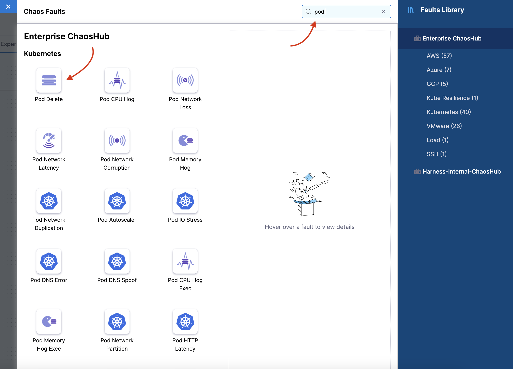

7. Add details in the **Target Application** tab, such as the `hce` namespace, `app=cartservice` label, and application kind `deployment`.

    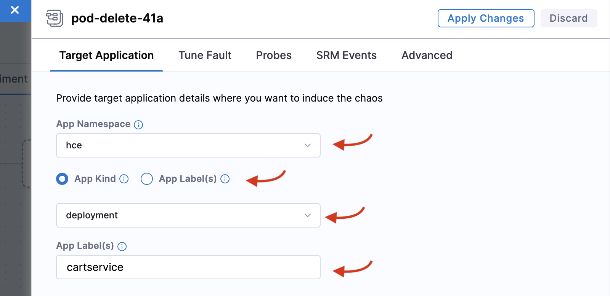

8. In the **Tune Fault** tab, specify **TOTAL CHAOS DURATION** as 30, **CHAOS INTERVAL** as 5, **PODS AFFECTED PERC** as 50, and the default weight to 10.

    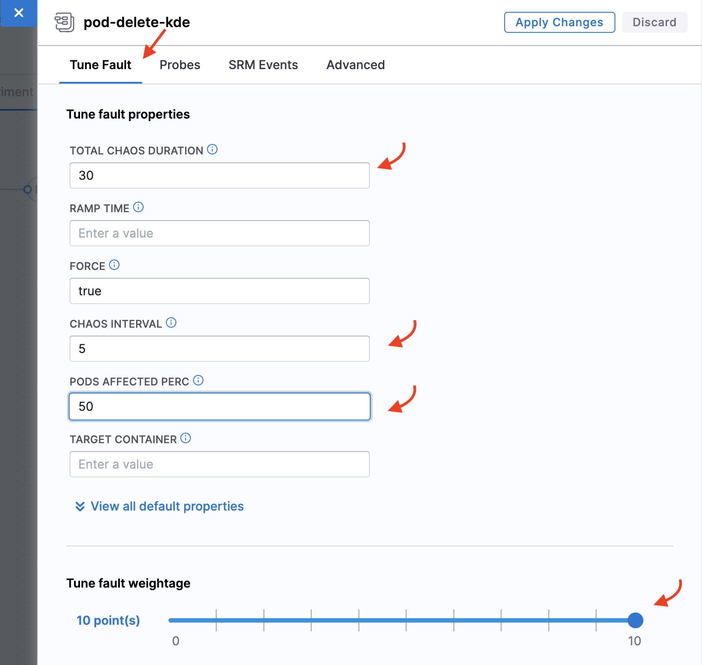

:::tip
The **PODS AFFECTED PERC** describes the percentage of pods that are affected due to the unexpected pod deletion. A minimum of one pod is deleted.
:::

### Step 3: Create a new HTTP probe
8. In the **Probes** tab, you can create a new probe. For this, click **Select or Add new probes**.

    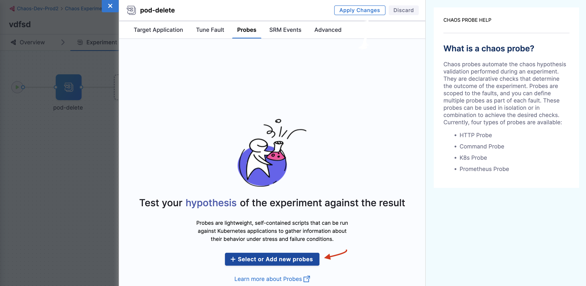

9. Select **New probe**.

    

10. Select **Kubernetes** as the infrastructure type, and **HTTP** as the probe type. This opens the probe configuration screen.

    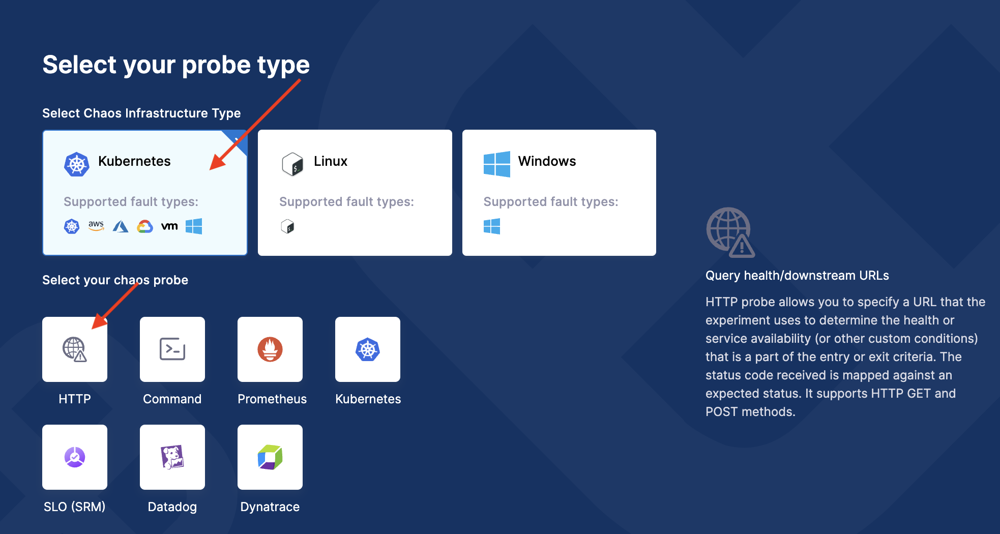

11. Specify the name of the probe, description (optional), and tag (optional). Click **Configure Properties**.

    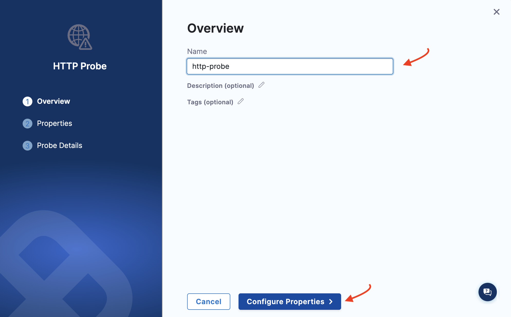

12. Specify the timeout as 5s, attempt as 2, and interval as 10s. Click **Configure Details**.

    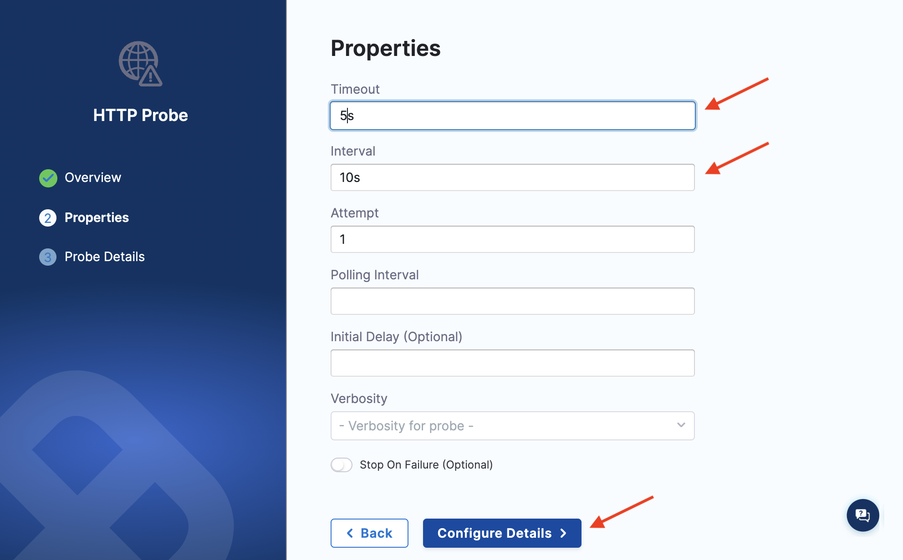

13. Enter the URL as `http://frontend/cart` which is the URL for the cart page.

    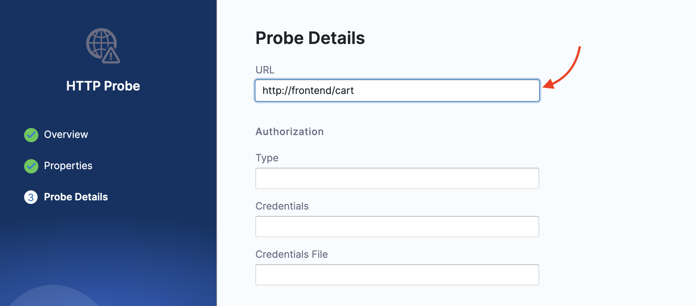

14. Specify the method as `GET` so that the probe can make GET requests at the URL specified earlier. Select **Compare response code**, criteria as **==**, and response code as `200` for the successful validation of the probe. Click **Setup Probe**.

    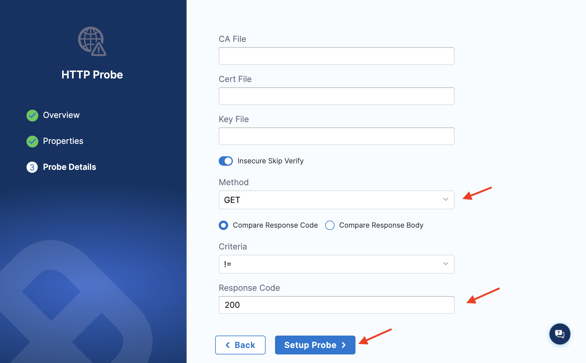

15. Once you create a probe, click it, and select **Add to Fault**.

    

16. Select mode as **Continuous** and click **Apply changes**.

    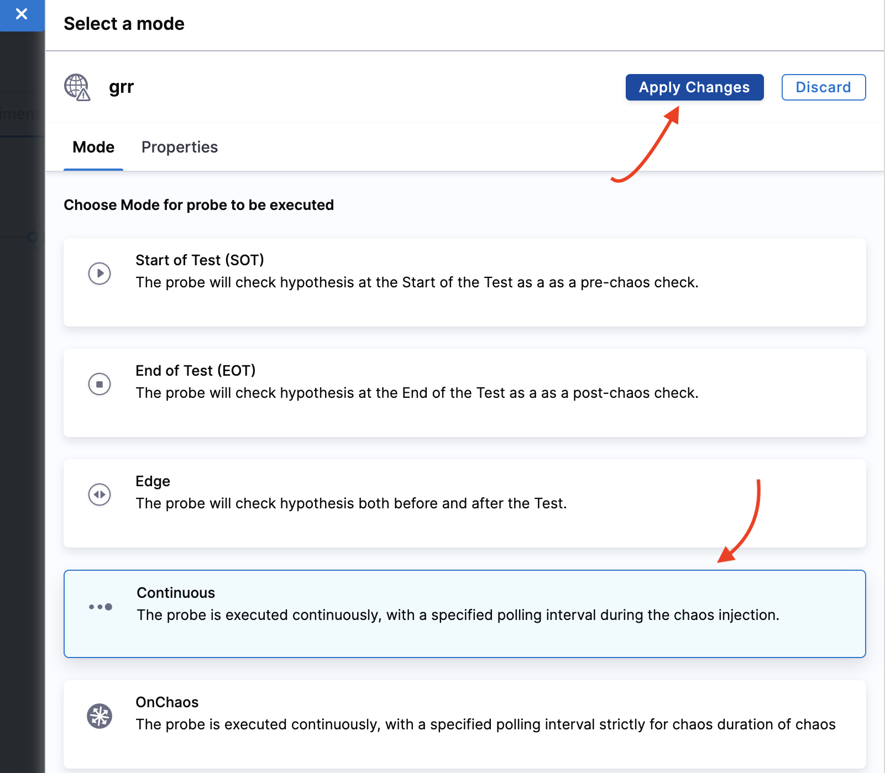

17. Click **Apply changes** again to confirm all parameters configuration. Click **X** to close the overlay modal. Click **Apply changes** again.

    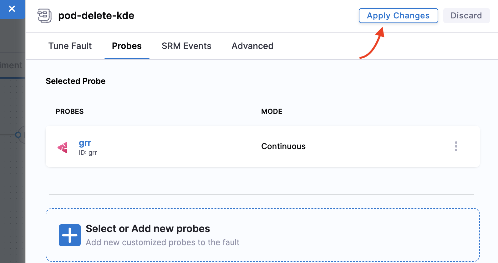

### Step 4: Verify cart page health

18. Before executing the experiment, verify that the cart page is healthy and accessible from the front end, as seen at the `/cart` route.

    

### Step 5: Observe chaos execution

19. When all the prerequisites are fulfilled and parameters are set, you can start the experiment execution by selecting **Run**.

    

:::info note
You can see that once you click **Run**, an experiment run is scheduled. You can see the status of every step in the tab.


:::

20. Select **Recent experiment runs** to view the runs of an experiment. The latest experiment is displayed in the last bar with the status as `RUNNING`.

    

21. You can view the detailed execution (that is, logs) of the experiment by navigating to the experiment run and then the **Logs** tab.

    

22. You can check the status of the cart deployment pod by executing the following command on the terminal.

    ```
    ❯ k get pods -n hce

    NAME                                           READY   STATUS    RESTARTS       AGE
    adservice-68db567bb5-hd47j                     1/1     Running   0              5h41m
    cartservice-6b8f46f64f-lkgs8                   0/1     Running   0              29s
    chaos-exporter-765d6b6674-tkrpm                1/1     Running   0              5h41m
    chaos-operator-ce-678b67c75-l68m5              1/1     Running   0              5h41m
    checkoutservice-7545ff6849-rdl9f               1/1     Running   0              5h41m
    currencyservice-5769b647d5-trx69               1/1     Running   0              5h41m
    emailservice-55c84dcfdc-c9x9q                  1/1     Running   0              5h41m
    frontend-74b7898dd9-x4bzr                      1/1     Running   0              5h41m
    grafana-6f6fb469b7-bm9vh                       1/1     Running   0              5h41m
    loadgenerator-5b875b84dd-pcjdr                 1/1     Running   0              5h41m
    paymentservice-59d87f77bc-fkwjq                1/1     Running   0              5h41m
    productcatalogservice-676d7d7dbc-nx75x         1/1     Running   0              5h41m
    prometheus-blackbox-exporter-6d955c876-l7fdv   2/2     Running   0              5h41m
    prometheus-deployment-779b88bf5d-zf8f9         1/1     Running   0              5h41m
    recommendationservice-6fc8b4d9cf-4s96t         1/1     Running   0              5h41m
    redis-cart-7cd9d8966d-mgbhx                    1/1     Running   0              5h41m
    shippingservice-7b4945b5fc-cbmc9               1/1     Running   0              5h41m
    subscriber-7774bd95d4-4rnwp                    1/1     Running   0              5h41m
    workflow-controller-6d5d75dc7c-v9vqc           1/1     Running   0              5h41m
    ```

The output on the terminal indicates that the cart pod was terminated and a new pod replaced it (whose container is yet to be created).

23. As a consequence, if you try to access the frontend cart page, you will see a `500` error.

    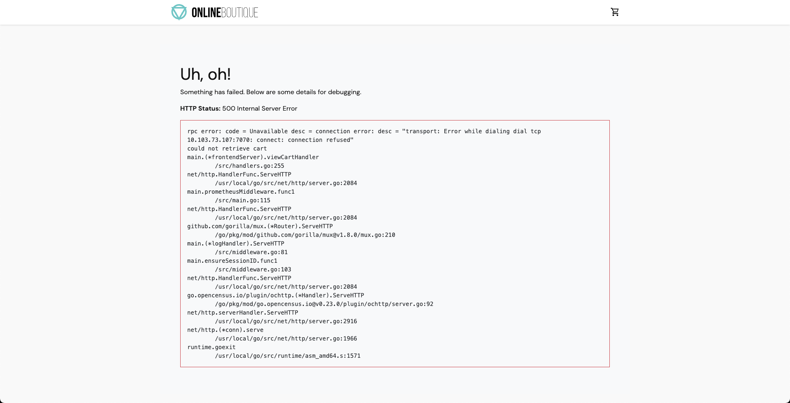

24. You can [validate the behavior](/docs/chaos-engineering/get-started/tutorials/first-chaos-engineering#step-6-observing-chaos-execution) of the application and [evaluate the experiment run](/docs/chaos-engineering/get-started/tutorials/first-chaos-engineering#step-7-evaluate-the-experiment-run).

## Conclusion

With that, you have successfully created and executed a chaos experiment from scratch!

Here are some recommendations:
- [Execute a chaos experiment using API](/docs/chaos-engineering/get-started/tutorials/experiment-using-api.md).
