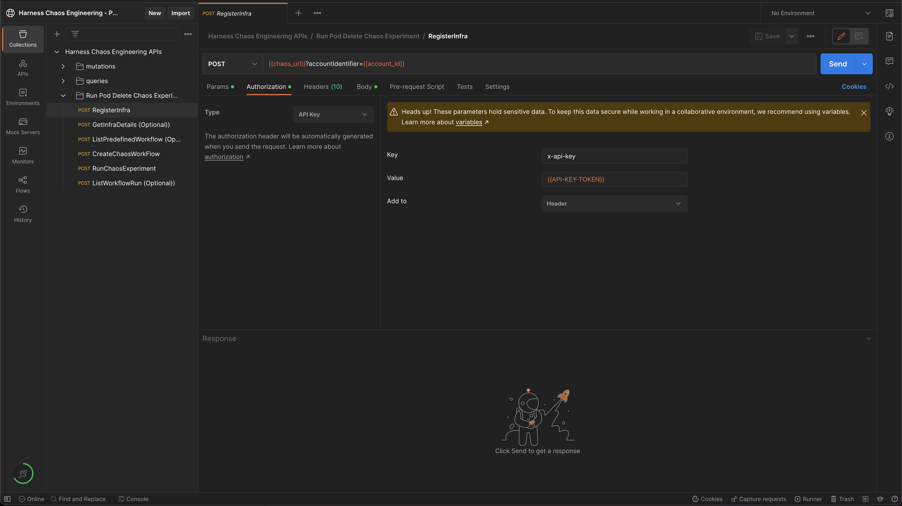
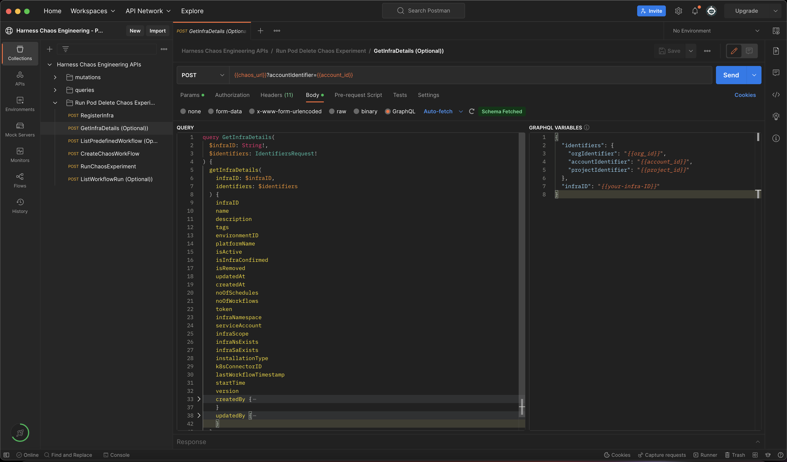
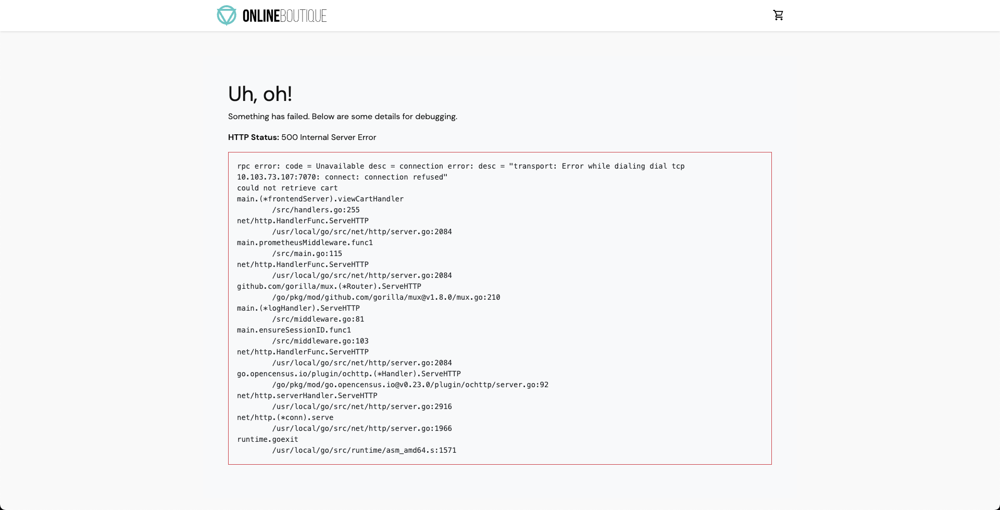

import Tabs from '@theme/Tabs';
import TabItem from '@theme/TabItem';

In this tutorial, you will create and run chaos experiments on Kubernetes using APIs. You can access the chaos API documentation [here](https://apidocs.harness.io/chaos.html). This tutorial uses the publicly available [HCE Postman collection](https://elements.getpostman.com/redirect?entityId=25469526-59b35825-6240-4b45-9974-6bb869741318&entityType=collection) to describe the chaos APIs.

## Before you begin, review the following:

- [HCE overview](/docs/chaos-engineering/get-started/overview.md)
- [HCE prerequisites](/docs/chaos-engineering/onboarding/prerequisites.md)
- [Execute your first chaos experiment](/docs/chaos-engineering/get-started/tutorials/first-chaos-engineering.md)

### Create a project (or be added to a project)

Harness Chaos Engineering (HCE) simplifies the chaos engineering practices for your organization. To get started, create a new project or ask your administrator to add you to an existing project. Once you have access, navigate to the **Chaos** tab that shows an overview of all the experiment runs.

 

### Get variable inputs

You will need the following inputs for variables in the API requests in this tutorial:

* **url**: HCE server URL that serves the chaos API requests. You can find this URL in the chaos API documentation. For instance, [this](https://app.harness.io/gateway/chaos/manager/api/query) is the HCE server URL for the production environment.

 If you are using [chaos Postman collection](https://elements.getpostman.com/redirect?entityId=25469526-59b35825-6240-4b45-9974-6bb869741318&entityType=collection), this value will be pre-filled in two Postman variables as shown below:

 ```
 base_url - https://app.harness.io
 chaos_url - {{base_url}}/gateway/chaos/manager/api/query
 ```

* **account_id**: Harness account Id or a specific Harness account where you want to run chaos experiments. You can get your account ID from any Harness app URL or the **Account Overview** page in Harness.

* **project_id**: Harness project Id where you want to run chaos experiments. To get a project' Id:
 1. Go to `Projects` in [Harness](https://app.harness.io/).
 2. Select the project where you wish to run the chaos experiments or create a new project.
 3. Click on `Overview`.
 4. Copy the value of `ID`.
 5. Ensure that you copy the value of `Organization` since this is required for variable `org_id`.

* **org_id**: Harness organization Id where you want to run chaos experiments. To get your organization Id, follow the same steps you used to get the project Id.

* **API-KEY-TOKEN**: You can use an existing Harness API key token from the same Harness account that you used in the previous steps.

### Create API key token

To create a new API key token, follow the steps below:
 1. Select **MY PROFILE** in [Harness](https://app.harness.io/).
 2. Select **Profile Overview**. Go to **My API Keys** and select **+ API Key** to create a new API Key.
 3. Enter a **Name** for the API Key (optional description/tags) and select **Save**.
 4. Under the newly created API Key, select **+ Token** to generate a new token for this API Key.
 5. Enter the **Name** and select the **Expiration** (time for which this token is valid) and click on **Generate Token**.
 6. Copy the value of the token and store it safely (you won't be able to access this later).

### Use the token

Use this token to create an authorization header with the **API-KEY-TOKEN** value that is required to work with chaos APIs.

1. Navigate to [HCE Postman collection](https://elements.getpostman.com/redirect?entityId=25469526-59b35825-6240-4b45-9974-6bb869741318&entityType=collection).
2. Select **Run Pod Delete Experiment** -> **Authorization** -> **Value**.
3. Enter the token value and select **Send**.

 

:::tip
To work with the HCE Postman collection, fork it under your Postman account and update the required variables.


:::

### Add a chaos infrastructure using APIs

#### Step 1: Create and register chaos infrastructure using APIs

1. [Create (or register) a chaos infrastructure](/docs/chaos-engineering/get-started/tutorials/first-chaos-engineering#step-3-create-an-infrastructure) (Kubernetes infrastructure) to inject faults into the application.

2. Select **Cluster Wide** installation mode so that you can target resources across all the namespaces in your cluster (**Namespace Mode** installation restricts injecting chaos to a certain namespace where infrastructure is installed).

For this tutorial, the infrastructure is installed in the **hce** namespace in **Cluster Wide** mode.

Below is a sample GraphQL query and variable to register/create chaos infrastructure:

GraphQL query: `registerInfra`

```
mutation($identifiers: IdentifiersRequest!, $request: RegisterInfraRequest!) {
 registerInfra(identifiers: $identifiers, request: $request) {
 token
 infraID
 name
 manifest
 }
}
```

GraphQL variables: `registerInfra`

```json
{
 "identifiers": {
 "orgIdentifier": "{{org_id}}",
 "accountIdentifier": "{{account_id}}",
 "projectIdentifier": "{{project_id}}"
 },
 "request": {
 "name": "my-test-chaos-infra",
 "environmentID": "my-test-chaos-env",
 "description": "Test Chaos Environment",
 "platformName": "my-test-platform",
 "infraNamespace": "hce",
 "serviceAccount": "hce",
 "infraScope": "cluster",
 "infraNsExists": false,
 "infraSaExists": false,
 "installationType": "MANIFEST",
 "skipSsl": false
 }
}
```

The above-mentioned values are pre-filled in the HCE Postman collection as shown below.


A successful response to an infrastructure registration contains details about the registered infrastructure.

```json
{
 "data": {
 "registerInfra": {
 "token": "abc123",
 "infraID": "abc123",
 "name": "abc123",
 "manifest": "abc123"
 }
 }
}
```

You will need the **token** and **infraID** values from the response for subsequent API calls.

To retrieve the infrastructure manifest, form the following URL:

```
$chaos_server_url/file/$token.yaml
```
where,
* **$chaos_server_url** corresponds to `https://app.harness.io/gateway/chaos/manager/api/`
* **$token** corresponds to the token value retrieved in response to the **registerInfra** API call as shown in the sample response earlier.

- Below is an example URL to retrieve the infrastructure manifest.

```
https://app.harness.io/gateway/chaos/manager/api/file/token-abc.yaml
```

- Copy and save the YAML file in a file named `infra.yaml`. Save the file on a machine that has `kubectl` installed and has access to your K8s cluster.

- You can deploy your chaos infrastructure by executing the below commands (provided you have access to your Kubernetes cluster via [kubectl](https://kubernetes.io/docs/reference/kubectl/)).

```
kubectl apply -f infra.yaml
```

The infrastructure will be set up in the K8s cluster.

#### Step 2: Check the status of infrastructure using APIs

- Use the **getInfraDetails** query to retrieve the details of your newly registered infrastructure.

- Below is a sample GraphQL query and variables to retrieve infrastructure details.

GraphQL query for `getInfraDetails`:

```
query GetInfraDetails(
 $infraID: String!,
 $identifiers: IdentifiersRequest!
) {
 getInfraDetails(
 infraID: $infraID,
 identifiers: $identifiers
 ) {
 infraID
 name
 description
 tags
 environmentID
 platformName
 isActive
 isInfraConfirmed
 isRemoved
 updatedAt
 createdAt
 noOfSchedules
 noOfWorkflows
 token
 infraNamespace
 serviceAccount
 infraScope
 infraNsExists
 infraSaExists
 installationType
 k8sConnectorID
 lastWorkflowTimestamp
 startTime
 version
 createdBy {
 userID
 username
 email
 }
 updatedBy {
 userID
 username
 email
 }
 }
}
```

GraphQL variables for `getInfraDetails`:

```
{
 "identifiers": {
 "orgIdentifier": "{{org_id}}",
 "accountIdentifier": "{{account_id}}",
 "projectIdentifier": "{{project_id}}"
 },
 "infraID": "{{your-infra-ID}}"
}
```

:::tip
Update the value of the **infraID** field retrieved during the **registerInfra** API call.
:::

A sample response for `getInfraDetails`:

```
{
 "data": {
 "getInfraDetails": {
 "infraID": "4",
 "name": "xyz789",
 "description": "xyz789",
 "tags": ["xyz789"],
 "environmentID": "xyz789",
 "platformName": "xyz789",
 "isActive": true,
 "isInfraConfirmed": true,
 "isRemoved": true,
 "updatedAt": "xyz789",
 "createdAt": "xyz789",
 "noOfSchedules": 123,
 "noOfWorkflows": 123,
 "token": "abc123",
 "infraNamespace": "xyz789",
 "serviceAccount": "abc123",
 "infraScope": "xyz789",
 "infraNsExists": false,
 "infraSaExists": false,
 "installationType": "CONNECTOR",
 "k8sConnectorID": "xyz789",
 "lastWorkflowTimestamp": "xyz789",
 "startTime": "abc123",
 "version": "abc123",
 "createdBy": UserDetails,
 "updatedBy": UserDetails
 }
 }
}
```

:::info
Check the value of the `isActive` field and ensure it is set to `true`. This means the infrastructure is in an `active` state.
:::

- The above values are pre-filled in the HCE Postman Collection as shown below:

 

- To run this API using HCE Postman collection, update the value of the **infraID** variable retrieved during **registerInfra** API call.

### Create a demo application and an observability infrastructure

- You can use your application as a target, or use the [online boutique microservices demo application](https://github.com/GoogleCloudPlatform/microservices-demo) as the target. This tutorial uses the demo application.

- You can install the boutique application (also known as target application) and observability infrastructure (optional) which includes Grafana, Prometheus, and a BlackBox exporter, using the below commands. The observability infrastructure provides a dashboard to validate the health of the application microservices in real-time.

```bash
❯ kubectl apply -f https://raw.githubusercontent.com/chaosnative/harness-chaos-demo/main/boutique-app-manifests/manifest/app.yaml -n hce
```

```bash
❯ kubectl apply -f https://raw.githubusercontent.com/chaosnative/harness-chaos-demo/main/boutique-app-manifests/manifest/monitoring.yaml -n hce
```

- You are all set to inject chaos into your Kubernetes resources. You will execute one of the most popular faults, [**Pod Delete**](/docs/chaos-engineering/chaos-faults/kubernetes/pod/pod-delete.md). This fault deletes the pods of a deployment (or a StatefulSet or a DaemonSet) to determine the resilience of a microservice.

- The resources will be deployed in the existing `hce` namespace.

- The target application and the observability infrastructure pods will be available in the `hce` namespace eventually.

Below is a command that fetches all the pods in the `hce` namespace.

```
❯ kubectl get pods -n hce
```

```
NAME READY STATUS RESTARTS AGE
adservice-68db567bb5-hd47j 1/1 Running 0 5m39s
cartservice-6b8f46f64f-6mrkv 1/1 Running 0 5m39s
chaos-exporter-765d6b6674-tkrpm 1/1 Running 0 11m
chaos-operator-ce-678b67c75-l68m5 1/1 Running 0 11m
checkoutservice-7545ff6849-rdl9f 1/1 Running 0 5m40s
currencyservice-5769b647d5-trx69 1/1 Running 0 5m39s
emailservice-55c84dcfdc-c9x9q 1/1 Running 0 5m40s
frontend-74b7898dd9-x4bzr 1/1 Running 0 5m40s
grafana-6f6fb469b7-bm9vh 1/1 Running 0 5m34s
loadgenerator-5b875b84dd-pcjdr 1/1 Running 0 5m39s
paymentservice-59d87f77bc-fkwjq 1/1 Running 0 5m40s
productcatalogservice-676d7d7dbc-nx75x 1/1 Running 0 5m40s
prometheus-blackbox-exporter-6d955c876-l7fdv 2/2 Running 0 5m34s
prometheus-deployment-779b88bf5d-zf8f9 1/1 Running 0 5m34s
recommendationservice-6fc8b4d9cf-4s96t 1/1 Running 0 5m40s
redis-cart-7cd9d8966d-mgbhx 1/1 Running 0 5m39s
shippingservice-7b4945b5fc-cbmc9 1/1 Running 0 5m39s
subscriber-7774bd95d4-4rnwp 1/1 Running 0 11m
workflow-controller-6d5d75dc7c-v9vqc 1/1 Running 0 11m
```

Below is a command that lists the services available in the `hce` namespace.

```
❯ kubectl get services -n hce
```

```
NAME TYPE CLUSTER-IP EXTERNAL-IP PORT(S) AGE
adservice ClusterIP 10.110.145.128 <none> 9555/TCP 9m48s
cartservice ClusterIP 10.103.73.107 <none> 7070/TCP 9m49s
chaos-exporter ClusterIP 10.103.163.182 <none> 8080/TCP 15m
checkoutservice ClusterIP 10.105.52.42 <none> 5050/TCP 9m49s
currencyservice ClusterIP 10.108.12.130 <none> 7000/TCP 9m49s
emailservice ClusterIP 10.106.79.95 <none> 5000/TCP 9m49s
frontend ClusterIP 10.98.222.239 <none> 80/TCP 9m49s
frontend-external LoadBalancer 10.101.239.201 localhost 80:30963/TCP 9m49s
grafana LoadBalancer 10.96.206.174 localhost 3000:32659/TCP 9m43s
paymentservice ClusterIP 10.106.36.71 <none> 50051/TCP 9m49s
productcatalogservice ClusterIP 10.97.78.9 <none> 3550/TCP 9m49s
prometheus-blackbox-exporter ClusterIP 10.103.118.20 <none> 9115/TCP 9m43s
prometheus-k8s LoadBalancer 10.106.153.10 localhost 9090:32101/TCP 9m43s
recommendationservice ClusterIP 10.106.227.47 <none> 8080/TCP 9m49s
redis-cart ClusterIP 10.103.184.94 <none> 6379/TCP 9m48s
shippingservice ClusterIP 10.109.150.169 <none> 50051/TCP 9m48s
workflow-controller-metrics ClusterIP 10.106.97.173 <none> 9090/TCP 15m
```

- To access the target application frontend in your browser, use the `CLUSTER-IP` of the `frontend-external` LoadBalancer service.

 

- To access the Grafana dashboard:

1. Login using the default credentials: username `admin` and password `admin`.
2. Browse the online boutique application dashboard.

- Before fault execution, all the metrics indicate normal application behavior.

 

### Construct a chaos experiment using APIs

You have successfully created and deployed the target application. You can now target the pods of the cart microservice using the [pod delete](/docs/chaos-engineering/chaos-faults/kubernetes/pod/pod-delete.md) fault.

Before injecting chaos, the cart page will be accessible from the frontend, as seen at the `/cart` route.


#### Create the chaos experiment and workflow using APIs

- [Create the chaos experiment](/docs/chaos-engineering/features/experiments/construct-and-run-custom-chaos-experiments.md) and specify the infrastructure ID that you created earlier.

- This allows you to create your chaos experiment with the [pod delete fault](/docs/chaos-engineering/chaos-faults/kubernetes/pod/pod-delete.md) that is configured to target the online boutique application.

- You can use the **createChaosWorkFlow** API to create the above chaos experiment.

GraphQL query: `createChaosWorkFlow`

```
mutation CreateChaosWorkFlow(
 $request: ChaosWorkFlowRequest!
 $identifiers: IdentifiersRequest!
) {
 createChaosWorkFlow(request: $request, identifiers: $identifiers) {
 workflowID
 cronSyntax
 workflowName
 workflowDescription
 isCustomWorkflow
 tags
 }
}
```

GraphQL variables: `createChaosWorkFlow`

```
{
 "identifiers": {
 "orgIdentifier": "{{org_id}}",
 "accountIdentifier": "{{account_id}}",
 "projectIdentifier": "{{project_id}}"
 },
 "request": {
 "workflowManifest": "$your-new-workflow-manifest",
 "cronSyntax": "",
 "workflowName": "my-pod-delete-experiment",
 "workflowDescription": "This is a cartservice pod delete experiment",
 "weightages": [
 {
 "experimentName": "pod-delete-ji5",
 "weightage": 10
 }
 ],
 "isCustomWorkflow": true,
 "infraID": "{{your-infra-id-from-registerInfra-call}}",
 "tags":["test", "workflow", "gke"]
 }
}
```

:::info
To run this API using HCE Postman collection, update the value of the **infraID** variable retrieved using the **registerInfra** API call.
:::

The value for **workflowManifest** field is pre-filled in the HCE Postman collection. You will need to update this if you are using a different application.

Below is a sample workflow manifest:

```
{
 "kind": "Workflow",
 "apiVersion": "argoproj.io/v1alpha1",
 "metadata": {
 "name": "my-pod-delete-experiment",
 "namespace": "hce",
 "creationTimestamp": null,
 "labels": {
 "infra_id": "e640346b-bff5-40db-a828-68b44e06e2d1",
 "revision_id": "f82e8c99-8efd-4289-a324-eadfd9667574",
 "workflow_id": "80557c8b-531c-49d2-a39e-9f72c4674c2c",
 "workflows.argoproj.io/controller-instanceid": "e640346b-bff5-40db-a828-68b44e06e2d1"
 }
 },
 "spec": {
 "templates": [
 {
 "name": "test-0-7-x-exp",
 "inputs": {},
 "outputs": {},
 "metadata": {},
 "steps": [
 [
 {
 "name": "install-chaos-faults",
 "template": "install-chaos-faults",
 "arguments": {}
 }
 ],
 [
 {
 "name": "pod-delete-ji5",
 "template": "pod-delete-ji5",
 "arguments": {}
 }
 ],
 [
 {
 "name": "cleanup-chaos-resources",
 "template": "cleanup-chaos-resources",
 "arguments": {}
 }
 ]
 ]
 },
 {
 "name": "install-chaos-faults",
 "inputs": {
 "artifacts": [
 {
 "name": "pod-delete-ji5",
 "path": "/tmp/pod-delete-ji5.yaml",
 "raw": {
 "data": "apiVersion: litmuschaos.io/v1alpha1\ndescription:\n message: |\n Deletes a pod belonging to a deployment/statefulset/daemonset\nkind: ChaosExperiment\nmetadata:\n name: pod-delete\n labels:\n name: pod-delete\n app.kubernetes.io/part-of: litmus\n app.kubernetes.io/component: chaosexperiment\n app.kubernetes.io/version: ci\nspec:\n definition:\n scope: Namespaced\n permissions:\n - apiGroups:\n - \"\"\n resources:\n - pods\n verbs:\n - create\n - delete\n - get\n - list\n - patch\n - update\n - deletecollection\n - apiGroups:\n - \"\"\n resources:\n - events\n verbs:\n - create\n - get\n - list\n - patch\n - update\n - apiGroups:\n - \"\"\n resources:\n - configmaps\n verbs:\n - get\n - list\n - apiGroups:\n - \"\"\n resources:\n - pods/log\n verbs:\n - get\n - list\n - watch\n - apiGroups:\n - \"\"\n resources:\n - pods/exec\n verbs:\n - get\n - list\n - create\n - apiGroups:\n - apps\n resources:\n - deployments\n - statefulsets\n - replicasets\n - daemonsets\n verbs:\n - list\n - get\n - apiGroups:\n - apps.openshift.io\n resources:\n - deploymentconfigs\n verbs:\n - list\n - get\n - apiGroups:\n - \"\"\n resources:\n - replicationcontrollers\n verbs:\n - get\n - list\n - apiGroups:\n - argoproj.io\n resources:\n - rollouts\n verbs:\n - list\n - get\n - apiGroups:\n - batch\n resources:\n - jobs\n verbs:\n - create\n - list\n - get\n - delete\n - deletecollection\n - apiGroups:\n - litmuschaos.io\n resources:\n - chaosengines\n - chaosexperiments\n - chaosresults\n verbs:\n - create\n - list\n - get\n - patch\n - update\n - delete\n image: chaosnative/go-runner:3.0.0-saas\n imagePullPolicy: Always\n args:\n - -c\n - ./experiments -name pod-delete\n command:\n - /bin/bash\n env:\n - name: TOTAL_CHAOS_DURATION\n value: \"15\"\n - name: RAMP_TIME\n value: \"\"\n - name: FORCE\n value: \"true\"\n - name: CHAOS_INTERVAL\n value: \"5\"\n - name: PODS_AFFECTED_PERC\n value: \"\"\n - name: TARGET_CONTAINER\n value: \"\"\n - name: TARGET_PODS\n value: \"\"\n - name: DEFAULT_HEALTH_CHECK\n value: \"false\"\n - name: NODE_LABEL\n value: \"\"\n - name: SEQUENCE\n value: parallel\n labels:\n name: pod-delete\n app.kubernetes.io/part-of: litmus\n app.kubernetes.io/component: experiment-job\n app.kubernetes.io/version: ci\n"
 }
 }
 ]
 },
 "outputs": {},
 "metadata": {},
 "container": {
 "name": "",
 "image": "chaosnative/k8s:2.11.0",
 "command": [
 "sh",
 "-c"
 ],
 "args": [
 "kubectl apply -f /tmp/ -n {{workflow.parameters.adminModeNamespace}} && sleep 30"
 ],
 "resources": {}
 }
 },
 {
 "name": "cleanup-chaos-resources",
 "inputs": {},
 "outputs": {},
 "metadata": {},
 "container": {
 "name": "",
 "image": "chaosnative/k8s:2.11.0",
 "command": [
 "sh",
 "-c"
 ],
 "args": [
 "kubectl delete chaosengine -l workflow_run_id={{workflow.uid}} -n {{workflow.parameters.adminModeNamespace}}"
 ],
 "resources": {}
 }
 },
 {
 "name": "pod-delete-ji5",
 "inputs": {
 "artifacts": [
 {
 "name": "pod-delete-ji5",
 "path": "/tmp/chaosengine-pod-delete-ji5.yaml",
 "raw": {
 "data": "apiVersion: litmuschaos.io\/v1alpha1\r\nkind: ChaosEngine\r\nmetadata:\r\n namespace: \"{{workflow.parameters.adminModeNamespace}}\"\r\n generateName: pod-delete-ji5\r\n labels:\r\n workflow_run_id: \"{{ workflow.uid }}\"\r\n workflow_name: my-cart-pod-delete-experiment\r\nspec:\r\n appinfo:\r\n appns: hce\r\n applabel: app=cartservice\r\n appkind: deployment\r\n engineState: active\r\n chaosServiceAccount: litmus-admin\r\n experiments:\r\n - name: pod-delete\r\n spec:\r\n components:\r\n env:\r\n - name: TOTAL_CHAOS_DURATION\r\n value: \"30\"\r\n - name: CHAOS_INTERVAL\r\n value: \"10\"\r\n - name: FORCE\r\n value: \"false\"\r\n - name: PODS_AFFECTED_PERC\r\n value: \"\"\r\n probe:\r\n - name: http-cartservice-probe\r\n type: httpProbe\r\n mode: Continuous\r\n runProperties:\r\n probeTimeout: 10\r\n retry: 1\r\n interval: 1\r\n stopOnFailure: false\r\n httpProbe\/inputs:\r\n url: http:\/\/frontend\/cart\r\n method:\r\n get:\r\n criteria: ==\r\n responseCode: \"200\"\r\n responseTimeout: 15\r\n"
 }
 }
 ]
 },
 "outputs": {},
 "metadata": {
 "labels": {
 "weight": "10"
 }
 },
 "container": {
 "name": "",
 "image": "chaosnative/litmus-checker:2.11.0",
 "args": [
 "-file=/tmp/chaosengine-pod-delete-ji5.yaml",
 "-saveName=/tmp/engine-name"
 ],
 "resources": {}
 }
 }
 ],
 "entrypoint": "test-0-7-x-exp",
 "arguments": {
 "parameters": [
 {
 "name": "adminModeNamespace",
 "value": "hce"
 }
 ]
 },
 "serviceAccountName": "argo-chaos",
 "podGC": {
 "strategy": "OnWorkflowCompletion"
 },
 "securityContext": {
 "runAsUser": 1000,
 "runAsNonRoot": true
 }
 },
 "status": {
 "startedAt": null,
 "finishedAt": null
 }
}
```

:::info
To use your workflow manifest instead of the default manifest from the Postman collection, escape the JSON manifest before providing it as a value to the **workflowManifest** variable.
:::


A sample response: `createChaosWorkFlow`

```
{
 "data": {
 "createChaosWorkFlow": {
 "workflowID": "xyz789",
 "identifiers": Identifiers,
 "cronSyntax": "abc123",
 "workflowName": "abc123",
 "workflowDescription": "xyz789",
 "isCustomWorkflow": false,
 "tags": ["abc123"]
 }
 }
}
```

:::info
Note the value of the **workflowID** which will be required for subsequent API calls.
:::

Now you can inspect the configuration used to create a chaos workflow.

- You will target the cart microservice of the boutique application. The application is present in the **hce** namespace with the **app=cartservice** application label (corresponds to cart microservice).

- Specify the application kind as **deployment**.

```
spec:
 appinfo:
 appns: hce
 applabel: app=cartservice
 appkind: deployment
```

Below is a description of the **fault parameters**:.

* The fault execution duration is defined as **30** seconds with an interval of **10** seconds. This means, that in every **10** seconds, the cart microservice pod(s) are deleted for a total of **30** seconds.
* The ramp time is set to **empty** (**0** by default). This is the period that the fault waits before and after injecting chaos into the application.
* The pod affected percentage is set to **empty** (**1** by default). This parameter specifies the number of pods in the cart deployment that will be targeted.

```
 experiments:
 - name: pod-delete
 spec:
 components:
 env:
 - name: TOTAL_CHAOS_DURATION
 value: "30"
 - name: CHAOS_INTERVAL
 value: "10"
 - name: FORCE
 value: "false"
 - name: PODS_AFFECTED_PERC
 value: ""
```

Below is a description of the parameters in the **Probes** configuration.

* A probe named **http-cartservice-probe** is defined which validates the availability of the **/cart** URL endpoint when the pod delete fault is executed.
* You can see that the probe type is **HTTP** and it is executed in a **Continuous** mode throughout the fault execution.
* In the probe details section, you can see that the URL is `http://frontend/cart` and the response timeout is set to **15** milliseconds.
* Probe execution makes **GET** requests to the specified URL. If no HTTP response is obtained within **15** milliseconds, it indicates probe failure.
* If all the probe executions pass, this indicates that the probe passed.

```
probe:
 - name: http-cartservice-probe
 type: httpProbe
 mode: Continuous
 runProperties:
 probeTimeout: 10
 retry: 1
 interval: 1
 stopOnFailure: false
 httpProbe/inputs:
 url: http://frontend/cart
 method:
 get:
 criteria: ==
 responseCode: "200"
 responseTimeout: 15
```

Below is a description of **Fault Weights**.

* In the above sample workflow manifest, you will see that the default weight for the fault is set to **10**, which is used to determine the resilience score for the experiment run.

### Run the chaos experiment and observe the outcomes

You can use the **RunChaosExperiment** API to run a chaos experiment that is created using the **CreateChaosWorkFlow** API.

#### Step 1: Run the experiment with APIs

GraphQL query: `RunChaosExperiment`

```
mutation RunChaosExperiment(
 $workflowID: String!,
 $identifiers: IdentifiersRequest!
) {
 runChaosExperiment(
 workflowID: $workflowID,
 identifiers: $identifiers
 ) {
 notifyID
 }
}
```

GraphQL variables: `RunChaosExperiment`

```
{
 "workflowID": "{{workflow-id-from-createChaosWorkflow-call}}",
 "identifiers": {
 "orgIdentifier": "{{org_id}}",
 "accountIdentifier": "{{account_id}}",
 "projectIdentifier": "{{project_id}}"
 }
}
```

:::info
The value of **workflowID** should be updated with the value retrieved using the **CreateChaosWorkFlow** API call.
:::

A sample response: `RunChaosExperiment`
```
{
 "data": {
 "runChaosExperiment": {
 "notifyID": "abc123"
 }
 }
}
```

:::info
Copy the value of the `notifyID` field.
:::

#### Step 2: Observe chaos execution on the user interface

- You can observe the experiment added to the list of chaos experiments. It would show **Running** status. Choose **Current Execution** to view the detailed execution.


- When the fault is being executed, you can observe the detailed view and the logs of the experiment.


- You can also see the status of the cart deployment pod. When you execute the below command, it displays all the pods in running state. It indicates that pod delete has deleted the cart pod, and replaced it with a new one, whose container is being created.

```
❯ kubectl get pods -n hce

NAME READY STATUS RESTARTS AGE
adservice-68db567bb5-hd47j 1/1 Running 0 5h41m
cartservice-6b8f46f64f-lkgs8 0/1 Running 0 29s
chaos-exporter-765d6b6674-tkrpm 1/1 Running 0 5h41m
chaos-operator-ce-678b67c75-l68m5 1/1 Running 0 5h41m
checkoutservice-7545ff6849-rdl9f 1/1 Running 0 5h41m
currencyservice-5769b647d5-trx69 1/1 Running 0 5h41m
emailservice-55c84dcfdc-c9x9q 1/1 Running 0 5h41m
frontend-74b7898dd9-x4bzr 1/1 Running 0 5h41m
grafana-6f6fb469b7-bm9vh 1/1 Running 0 5h41m
loadgenerator-5b875b84dd-pcjdr 1/1 Running 0 5h41m
paymentservice-59d87f77bc-fkwjq 1/1 Running 0 5h41m
productcatalogservice-676d7d7dbc-nx75x 1/1 Running 0 5h41m
prometheus-blackbox-exporter-6d955c876-l7fdv 2/2 Running 0 5h41m
prometheus-deployment-779b88bf5d-zf8f9 1/1 Running 0 5h41m
recommendationservice-6fc8b4d9cf-4s96t 1/1 Running 0 5h41m
redis-cart-7cd9d8966d-mgbhx 1/1 Running 0 5h41m
shippingservice-7b4945b5fc-cbmc9 1/1 Running 0 5h41m
subscriber-7774bd95d4-4rnwp 1/1 Running 0 5h41m
workflow-controller-6d5d75dc7c-v9vqc 1/1 Running 0 5h41m
```

Consequently, if you try to access the frontend cart page, it throws an error that indicates that the application is unreachable.

 

You can validate this behavior using the application metrics dashboard. The probe success percentage for the application availability (200 response code) would steeply decrease along with the 99th percentile (green line), queries per second (QPS) and access duration. Also, the mean QPS (yellow line) steeply increases. This is because no pod is available to serve the query requests.

 

#### Step 3: Observe chaos execution using an API

You can use the **ListWorkflowRun** API to observe the current status of your experiment.

GraphQL query: `ListWorkflowRun`

```
query ListWorkflowRun(
 $identifiers: IdentifiersRequest!,
 $request: ListWorkflowRunRequest!
) {
 listWorkflowRun(
 identifiers: $identifiers,
 request: $request
 ) {
 totalNoOfWorkflowRuns
 workflowRuns {
 identifiers {
 orgIdentifier
 projectIdentifier
 accountIdentifier
 }
 workflowRunID
 workflowID
 weightages {
 experimentName
 weightage
 }
 updatedAt
 createdAt
 infra {
 infraID
 infraNamespace
 infraScope
 isActive
 isInfraConfirmed
 }
 workflowName
 workflowManifest
 phase
 resiliencyScore
 experimentsPassed
 experimentsFailed
 experimentsAwaited
 experimentsStopped
 experimentsNa
 totalExperiments
 executionData
 isRemoved
 updatedBy {
 userID
 username
 }
 createdBy {
 username
 userID
 }
 }
 }
}
```

GraphQL variables: `ListWorkflowRun`
```
{
 "identifiers": {
 "orgIdentifier": "{{org_id}}",
 "accountIdentifier": "{{account_id}}",
 "projectIdentifier": "{{project_id}}"
 },
 "request": {
 "notifyIDs": ["{{comma-separated-notifyIDs-from-runChaosExperiment-api-call}}"]
 }
}
```

:::info
The value for **notifyIDs** field was retrieved in the **RunChaosExperiment** API call.
:::

A sample response: `ListWorkflowRun`
```
{
 "data": {
 "listWorkflowRun": {
 "totalNoOfWorkflowRuns": 987,
 "workflowRuns": [WorkflowRun]
 }
 }
}
```

All the workflow runs would be listed under the field **workflowRuns** with all the required details and current status.
For instance, a field named **phase** would tell if a particular workflow is still **RUNNING** or **COMPLETED**.

#### Step 4: Evaluate the experiment run

When the experiment completes execution, you will see a resilience score of 0 %. You will also notice that the pod delete fault step failed.

Before analyzing the experiment results, you can check if the application has come back to the normal state and is accessible.

You can validate this from the Grafana dashboard where you can see visuals that indicate that chaos duration is complete.

 

You can see the chaos result which indicates that the experiment **Failed**, and the probe success percentage is 0%. This happened because the `http-cart-service` probe failed, which is a consequence of the cart pod being unavailable since you injected chaos (pod delete) into the microservice.

 

The failed step specifies "Probe execution result didn't meet the passing criteria", which validates the HTTP probe failure that you previously defined.

 

With that, you have successfully executed your first chaos experiment using chaos APIs.

For the probe checks and experiment to pass, increase the number of experiment pods to 2 so that one of the deployment pods survives the pod delete fault and keeps the application running.

To re-run the experiment, re-trigger the [RunChaosExperiment](#run-the-chaos-experiment-and-observe-the-outcomes) with the existing **workflow ID** and use the **ListWorkflowRun** to observe the experiment execution via API.

## Conclusion

Congratulations! You have successfully executed a chaos experiment using APIs.
Here are some recommendations:

- [Execute experiment as a GitLab pipeline](/docs/chaos-engineering/integrations/experiment-as-gitlab-pipeline.md)
- [Execute experiment as a Jenkins pipeline](/docs/chaos-engineering/integrations/experiment-as-jenkins-pipeline.md)
