In this tutorial, you will apply chaos on a sample boutique application on Kubernetes.

## Before you begin

* [What is chaos engineering?](/docs/chaos-engineering/get-started/overview.md)
* [Key concepts](/docs/chaos-engineering/architecture-and-security/architecture/components)
* [Prerequisites to execute chaos experiments](/docs/chaos-engineering/onboarding/prerequisites.md)

## Step 1: Create a project

1. Create a new project or ask your administrator to add you to an existing project. Once you sign up or log in to your account, you can access the **Chaos** tab on the extreme left, which displays the recent experiments that were executed.

    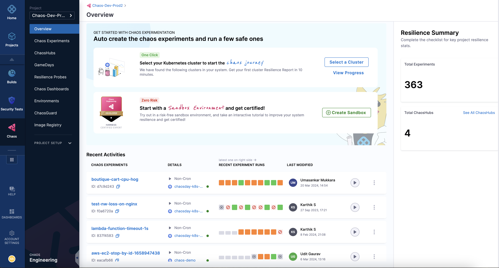

### Step 2: Create an environment

2. A chaos experiment is executed in a chaos infrastructure that is associated with an **environment**. To create a new environment, navigate to the **Environments** page, and choose a **New Environment**. Specify the environment name, a description (optional), and tags (optional). Select the environment type, **Production** or **Non-Production**. Finally, select **Create** to add the new environment.

    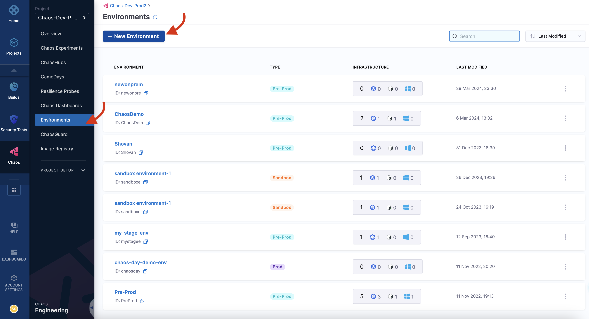

:::tip
You can also select one of the environments from the list of environments if it is available instead of creating an environment.
:::

### Step 3: Create an infrastructure

3. Once you have created an environment, you can add chaos infrastructure to it. Depending on your application, you can select **Kubernetes**, **Linux** or **Windows**. In this tutorial, you can select a Kubernetes infrastructure, which you will use to inject faults into Kubernetes resources. You can use an existing infrastructure or create a new one. In this tutorial, you can create a new infrastructure. For this, select **Enable chaos**.

    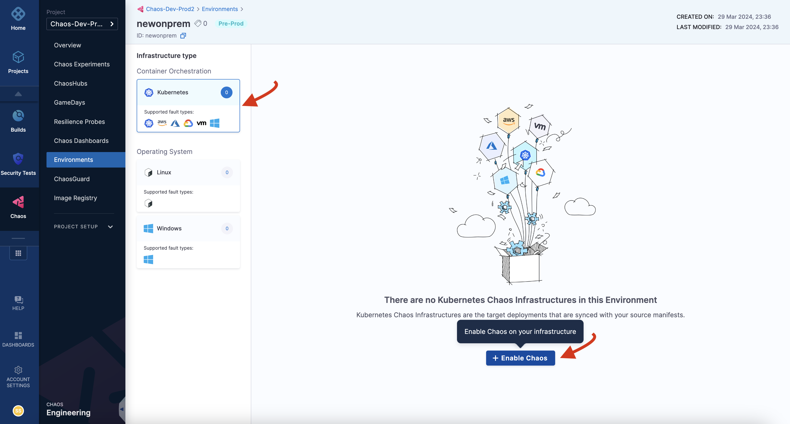

4. This will lead you to a page where you can select an existing infrastructure or create a new infrastructure. Select **On New Infrastructures** and select **Continue**.

    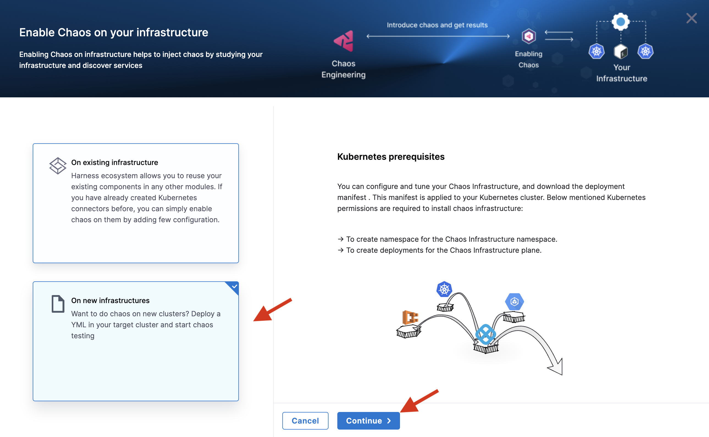

5. Provide a name, a description (optional), and tags (optional) for your chaos infrastructure. Click **Next**.

    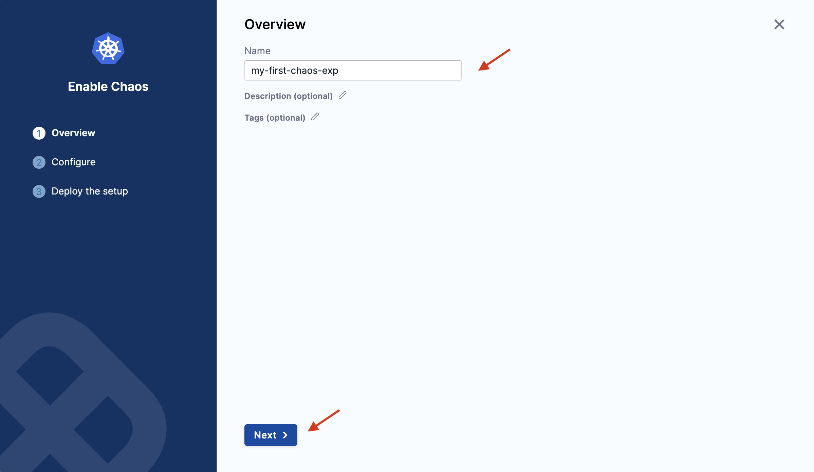

6. In this step, choose the **installation type** as **Kubernetes**, **access type** as **Specific namespace access** (click **Change** to display the **Specific namespace access** access type), **namespace** as **hce**, and **service account name** as **hce**. Select **Next**.

    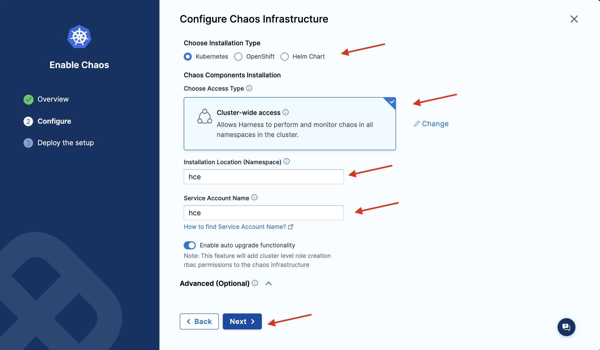

:::tip
The **Cluster-wide access** installation mode allows you to target resources across all the namespaces in your cluster whereas the **Specific namespace access** mode restricts chaos injection to only the namespace in which the delegate is installed.
:::

7. Ensure you have access to your Kubernetes cluster via [kubectl](https://kubernetes.io/docs/reference/kubectl/). Select **Download** to deploy your chaos infrastructure by downloading and applying the given manifest using your terminal. Once done, choose **Done**.

    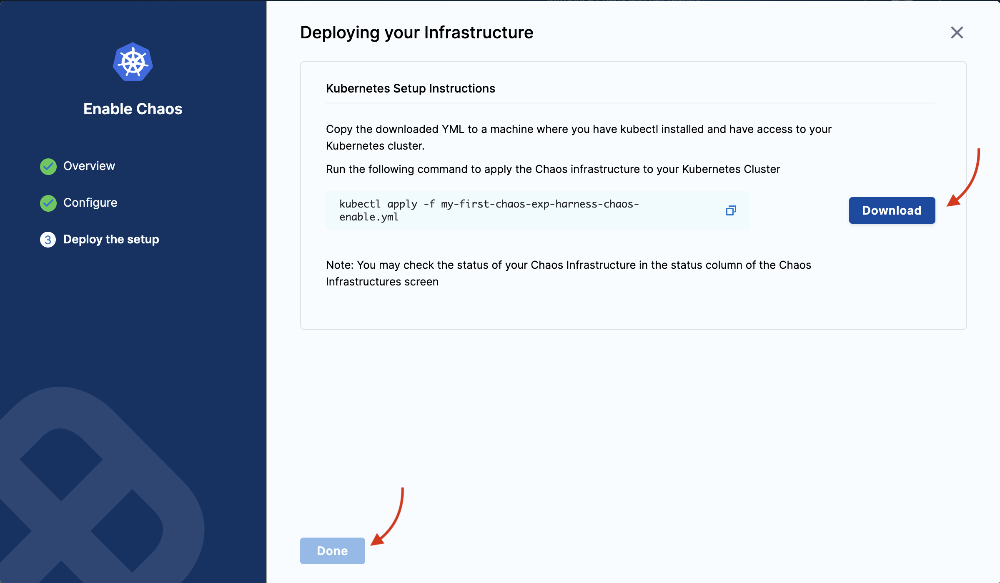

8. It may take some time for the delegate to be set up in the Kubernetes cluster. Navigate to **Environments** and once the delegate is ready, the connection status displays as `CONNECTED`.

    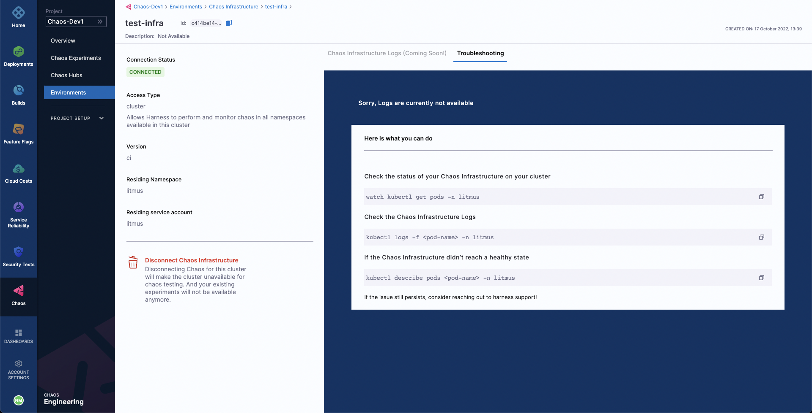

### Step 4: Create a demo application and observability infrastructure

Once you are all ready to target our Kubernetes resources, you can execute the simplest fault, [**Pod Delete**](/docs/chaos-engineering/chaos-faults/kubernetes/pod/pod-delete.md). The "pod delete" chaos fault deletes the pods of a deployment, StatefulSet, DaemonSet, etc, to validate the resiliency of a microservice application.

9. You can use your application as a target, however, in this tutorial, use the [Online Boutique](https://github.com/GoogleCloudPlatform/microservices-demo) microservices demo application as the target.

10. Before you set up the chaos experiment, install the target application. Run the following commands to set the target application microservices and observability infrastructure (optional), including Grafana, Prometheus, and a BlackBox exporter. Installing the observability infrastructure (optional) provides a dashboard that helps validate the health of the constituent application microservices in real-time.

```bash
❯ kubectl apply -f https://raw.githubusercontent.com/chaosnative/harness-chaos-demo/main/boutique-app-manifests/manifest/app.yaml -n hce
```

```bash
❯ kubectl apply -f https://raw.githubusercontent.com/chaosnative/harness-chaos-demo/main/boutique-app-manifests/manifest/monitoring.yaml -n hce
```

:::info
* Earlier, you specified the installation mode as **Specific namespace access**, hence the resources are deployed in the `hce` namespace.
* The target application and observability infrastructure pods are available in the `hce` namespace
:::

11. To view the pods in the `hce` namespace, execute the command below:

    ```
    ❯ kubectl get pods -n hce

    NAME                                           READY   STATUS    RESTARTS        AGE
    adservice-68db567bb5-hd47j                     1/1     Running   0               5m39s
    cartservice-6b8f46f64f-6mrkv                   1/1     Running   0               5m39s
    chaos-exporter-765d6b6674-tkrpm                1/1     Running   0               11m
    chaos-operator-ce-678b67c75-l68m5              1/1     Running   0               11m
    checkoutservice-7545ff6849-rdl9f               1/1     Running   0               5m40s
    currencyservice-5769b647d5-trx69               1/1     Running   0               5m39s
    emailservice-55c84dcfdc-c9x9q                  1/1     Running   0               5m40s
    frontend-74b7898dd9-x4bzr                      1/1     Running   0               5m40s
    grafana-6f6fb469b7-bm9vh                       1/1     Running   0               5m34s
    loadgenerator-5b875b84dd-pcjdr                 1/1     Running   0               5m39s
    paymentservice-59d87f77bc-fkwjq                1/1     Running   0               5m40s
    productcatalogservice-676d7d7dbc-nx75x         1/1     Running   0               5m40s
    prometheus-blackbox-exporter-6d955c876-l7fdv   2/2     Running   0               5m34s
    prometheus-deployment-779b88bf5d-zf8f9         1/1     Running   0               5m34s
    recommendationservice-6fc8b4d9cf-4s96t         1/1     Running   0               5m40s
    redis-cart-7cd9d8966d-mgbhx                    1/1     Running   0               5m39s
    shippingservice-7b4945b5fc-cbmc9               1/1     Running   0               5m39s
    subscriber-7774bd95d4-4rnwp                    1/1     Running   0               11m
    workflow-controller-6d5d75dc7c-v9vqc           1/1     Running   0               11m
    ```

12. To list the services available in the `hce` namespace, execute the command below:

    ```
    ❯ kubectl get services -n hce

    NAME                           TYPE           CLUSTER-IP       EXTERNAL-IP   PORT(S)          AGE
    adservice                      ClusterIP      10.110.145.128   <none>        9555/TCP         9m48s
    cartservice                    ClusterIP      10.103.73.107    <none>        7070/TCP         9m49s
    chaos-exporter                 ClusterIP      10.103.163.182   <none>        8080/TCP         15m
    checkoutservice                ClusterIP      10.105.52.42     <none>        5050/TCP         9m49s
    currencyservice                ClusterIP      10.108.12.130    <none>        7000/TCP         9m49s
    emailservice                   ClusterIP      10.106.79.95     <none>        5000/TCP         9m49s
    frontend                       ClusterIP      10.98.222.239    <none>        80/TCP           9m49s
    frontend-external              LoadBalancer   10.101.239.201   localhost     80:30963/TCP     9m49s
    grafana                        LoadBalancer   10.96.206.174    localhost     3000:32659/TCP   9m43s
    paymentservice                 ClusterIP      10.106.36.71     <none>        50051/TCP        9m49s
    productcatalogservice          ClusterIP      10.97.78.9       <none>        3550/TCP         9m49s
    prometheus-blackbox-exporter   ClusterIP      10.103.118.20    <none>        9115/TCP         9m43s
    prometheus-k8s                 LoadBalancer   10.106.153.10    localhost     9090:32101/TCP   9m43s
    recommendationservice          ClusterIP      10.106.227.47    <none>        8080/TCP         9m49s
    redis-cart                     ClusterIP      10.103.184.94    <none>        6379/TCP         9m48s
    shippingservice                ClusterIP      10.109.150.169   <none>        50051/TCP        9m48s
    workflow-controller-metrics    ClusterIP      10.106.97.173    <none>        9090/TCP         15m
    ```

13. To access the frontend of the target application in your browser, use the `frontend-external` LoadBalancer service.

    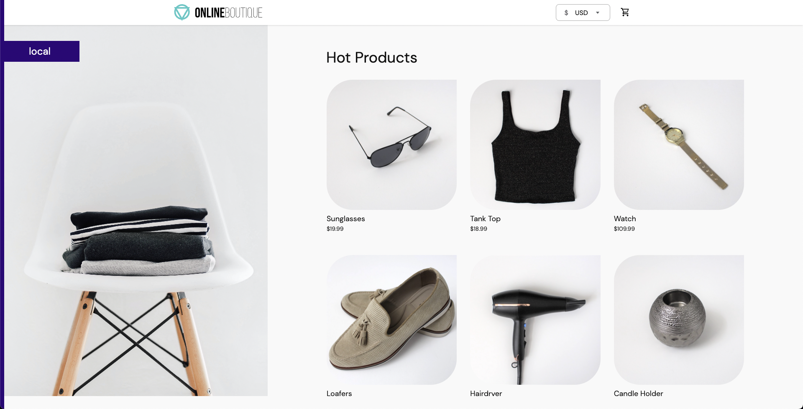

14. Similarly, you can access the Grafana dashboard. Login with the default credentials, that is, username `admin` and password `admin`, and browse the Online Boutique application dashboard. Currently, all the metrics indicate normal application behavior.

    

### Step 5: Construct a chaos experiment

Since the target application has been deployed, you can now create a chaos experiment. You will target the pods of the `carts` microservice with the **pod delete** fault. Currently, the cart page is healthy and accessible from the front end, as seen in the `/cart` route.

    

15. To create a chaos experiment, go to **Chaos Experiments** page and select **New Experiment**.

    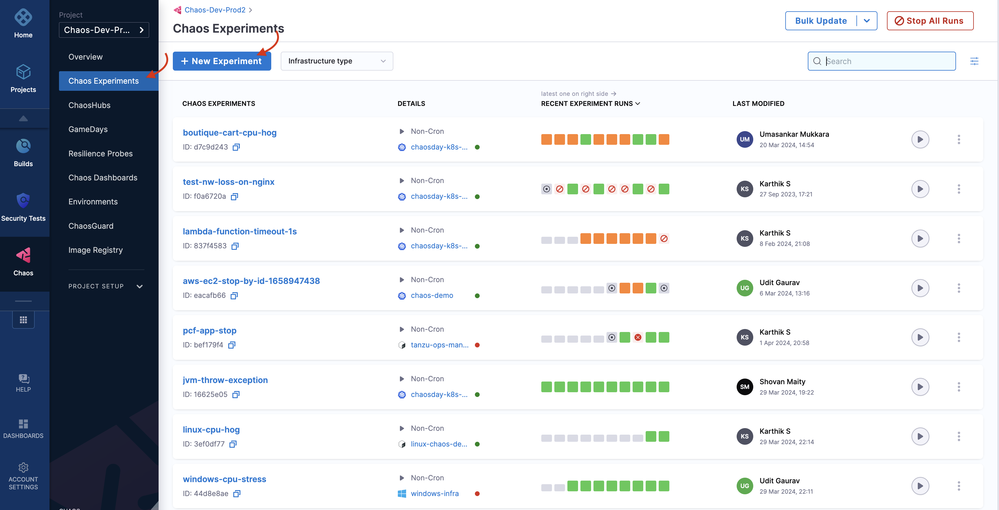

16. Specify the experiment name and a description (optional) and tags (optional). Choose the target infrastructure that you created earlier, click **Apply**, and click **Next**.

    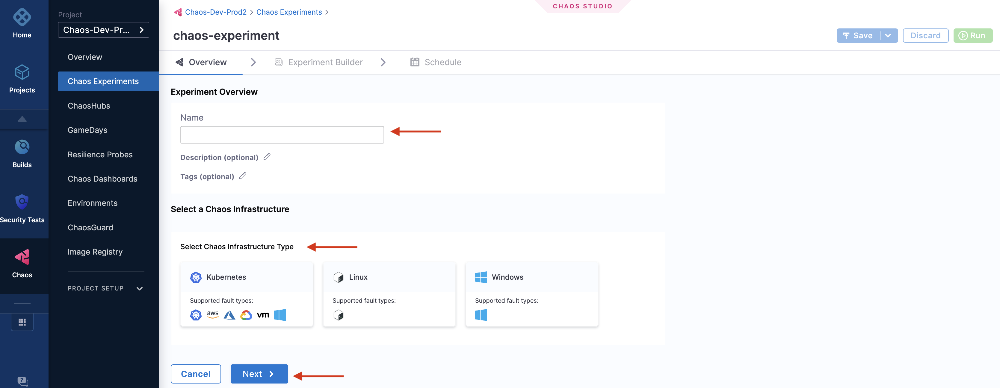

17. In the Experiment Builder, choose **Templates from Chaos Hubs** and select **Boutique cart delete**. This allows you to create a chaos experiment using a pre-defined template that already has a pod delete chaos fault configured to target the online boutique application. Select **Use this template** to continue.

    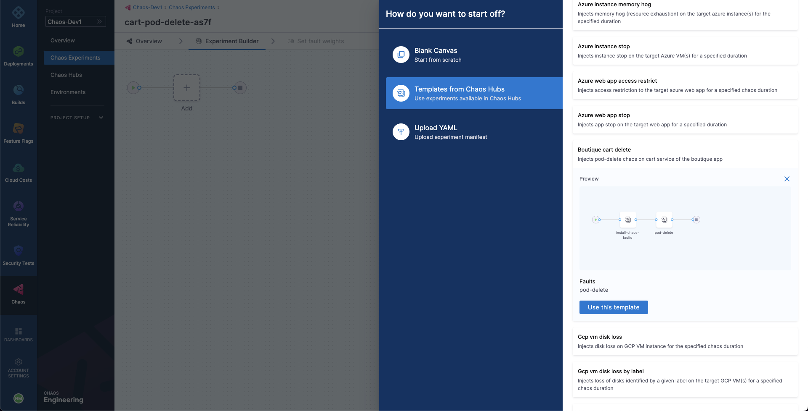

18. Your target is the `carts` microservice. Hence the appropriate `hce` application namespace and the `app=cartservice` application label have been provided here. Also, the application kind is `deployment`. You can discover these entities from within the UI using the search dropdown menu for the respective inputs.

    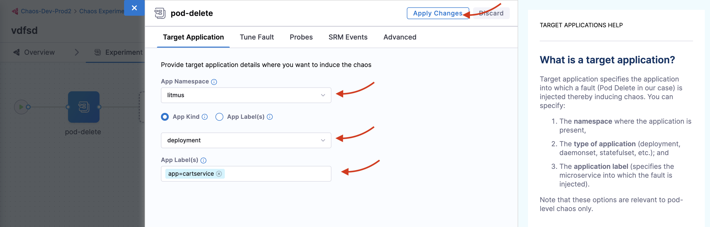

19. Choose the **Tune Fault** tab to view the fault parameters. Here, you can tune the fault parameters. Set **Total Chaos Duration** to 30, **Chaos Interval** to 10, and **Force** to `false`. You can leave the **Pods affected perc** empty for now. The values for `Total Chaos Duration` and `Chaos Interval` indicate that for every value of 10 seconds, the cart microservice pod(s) are deleted for a total of 30 seconds. By default, at least one pod of the cart deployment is targeted.

    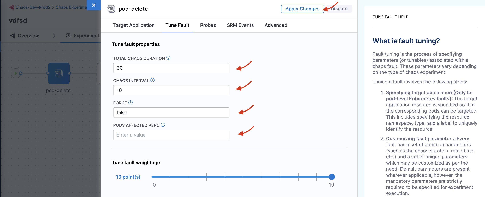

20. Navigate to the **Probes** tab. Here, you can either create a probe or select a pre-defined probe. Click **Select or Add new probes**. In this tutorial, you can create a probe. Select **+New Probe**, select **HTTP** and enter the following details in the respective fields:

    ```
    name: "http-cartservice"
    probeTimeout: "10s"
    interval: "5s"
    attempt: 2
    probePollingInterval: "1s"
    url: "http://service-of-the-user.namespace.svc.cluster-domain.example"
    method: GET
    Select "Compare Response Code"
    criteria: "=="
    responseCode: 200
    ```

    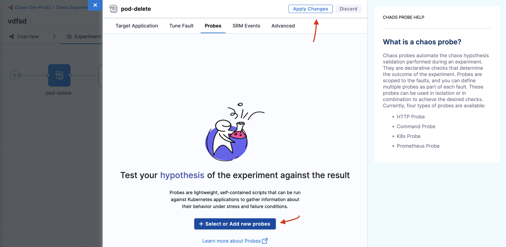

:::tip
- You can given any name and ensure you use the same when referencing or using the probe in other places.
- You can provide your own URL in the `url` field. The format is provided in the above example. For example, if your application targets the "cart-service", your `url` would be `http://cartservice.hce.svc.cluster.local/cart`.
- Go to [create a probe](/docs/chaos-engineering/features/resilience-probes/use-probe) to understand the steps in detail.
:::

21. Once you create the probe, it will be listed in the probe listing section on the left side of the page, as shown below. Select the probe to view the probe details. Click **Add to Fault**.

    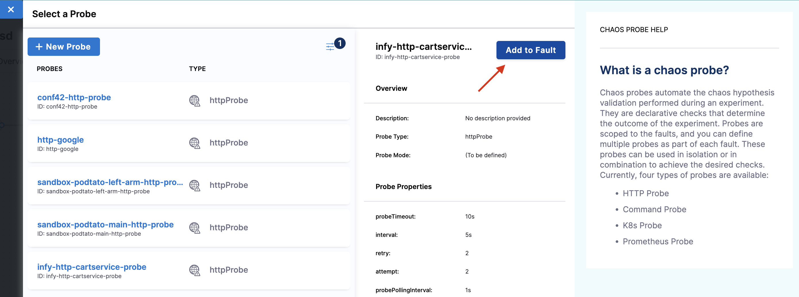

:::info note
Under probe details, you can see that the URL is `http://service-of-the-user.namespace.svc.cluster-domain.example` and the interval is 5s. As a part of the probe execution, `GET` requests are made to the specified URL. If no HTTP response is found within 5s, the probe status is considered as 'failed'. If all the probe executions pass, then the probe status is considered as 'passed'. You can find other probe details in the properties field.
:::

22. Select mode as **Continuous**. Click **Apply changes**.

    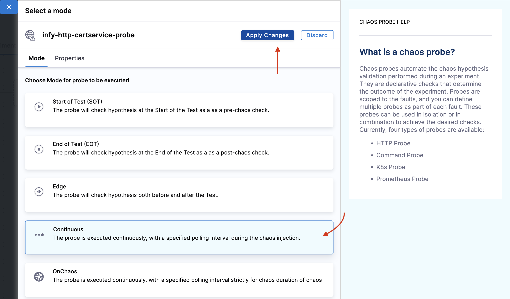

23. This will close the probes tab, and now, you can click **Apply changes** to apply the configuration to the chaos experiment.

    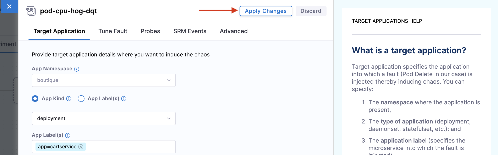

### Step 6: Observing chaos execution

24. To execute the chaos experiment, click **Save**, and then **Run**.

    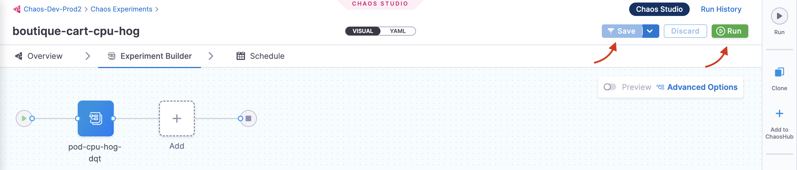

25. You can see that once you click **Run**, an experiment run is scheduled. You can see the status of every step in the tab.

    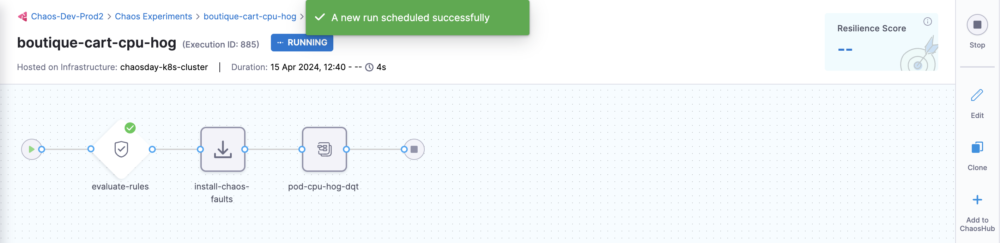

26. Select **Recent experiment runs** to view the runs of an experiment. The latest experiment is displayed in the last bar with the status as `RUNNING`.

    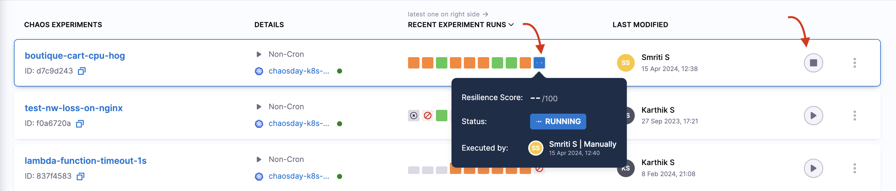

27. To check the status of the cart deployment pod, execute the command below. The pod delete fault terminates the cart pod and replaces it with a new pod, for which a container is yet to be created.

    ```
    ❯ kubectl get pods -n hce

    NAME                                           READY   STATUS    RESTARTS       AGE
    adservice-68db567bb5-hd47j                     1/1     Running   0              5h41m
    cartservice-6b8f46f64f-lkgs8                   0/1     Running   0              29s
    chaos-exporter-765d6b6674-tkrpm                1/1     Running   0              5h41m
    chaos-operator-ce-678b67c75-l68m5              1/1     Running   0              5h41m
    checkoutservice-7545ff6849-rdl9f               1/1     Running   0              5h41m
    currencyservice-5769b647d5-trx69               1/1     Running   0              5h41m
    emailservice-55c84dcfdc-c9x9q                  1/1     Running   0              5h41m
    frontend-74b7898dd9-x4bzr                      1/1     Running   0              5h41m
    grafana-6f6fb469b7-bm9vh                       1/1     Running   0              5h41m
    loadgenerator-5b875b84dd-pcjdr                 1/1     Running   0              5h41m
    paymentservice-59d87f77bc-fkwjq                1/1     Running   0              5h41m
    productcatalogservice-676d7d7dbc-nx75x         1/1     Running   0              5h41m
    prometheus-blackbox-exporter-6d955c876-l7fdv   2/2     Running   0              5h41m
    prometheus-deployment-779b88bf5d-zf8f9         1/1     Running   0              5h41m
    recommendationservice-6fc8b4d9cf-4s96t         1/1     Running   0              5h41m
    redis-cart-7cd9d8966d-mgbhx                    1/1     Running   0              5h41m
    shippingservice-7b4945b5fc-cbmc9               1/1     Running   0              5h41m
    subscriber-7774bd95d4-4rnwp                    1/1     Running   0              5h41m
    workflow-controller-6d5d75dc7c-v9vqc           1/1     Running   0              5h41m
    ```

28. As a consequence, if you try to access the frontend cart page, you will encounter the following error which indicates that the application is now unreachable.

    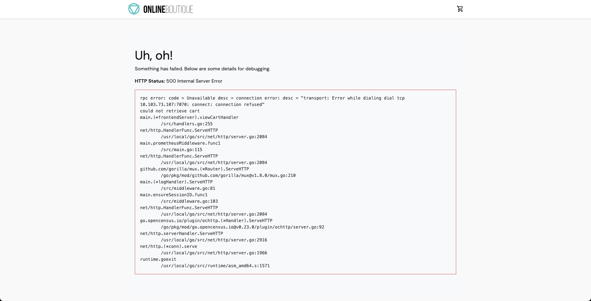

29. You can validate this behavior using the application metrics dashboard too. The probe success percentage for website availability (200 response code) decreases steeply along with the 99th percentile (green line) queries per second (QPS) and access duration for the application microservices. Also, the mean QPS (yellow line) steeply increases. This is because no pod is available at the moment to service the query requests.

    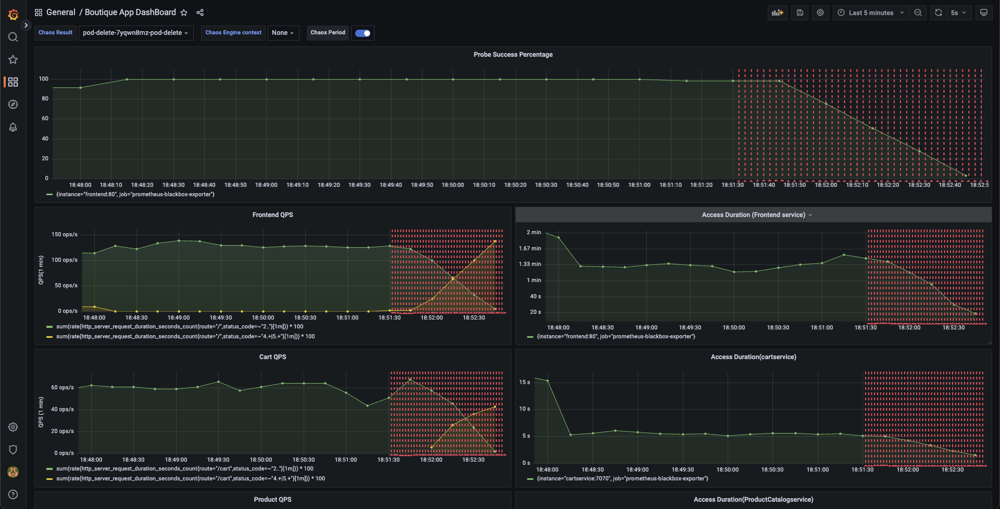

### Step 7: Evaluate the experiment run

30. When the experiment execution concludes, you get a resilience score of 0 %. You will observe that the pod delete fault step failed. Before analyzing the experiment result, you can validate that the application is now again accessible, without any errors. You can validate this from the Grafana dashboard metrics that indicate the app returning to normal as the chaos duration is over.

    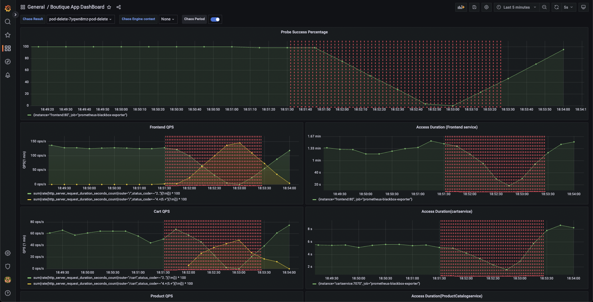

31. You can check the chaos result that shows the pod delete as **Failed**. This is because the 'http-cart-service' probe failed. The failure is due to the unavailability of the cart pod and therefore the `/cart` endpoint, due to injecting the "pod delete" fault.

    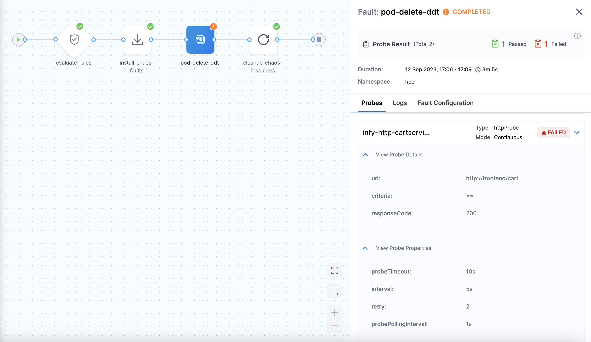

:::info note
You can see that the value expected and the value obtained don't match. Hence, the probe fails.

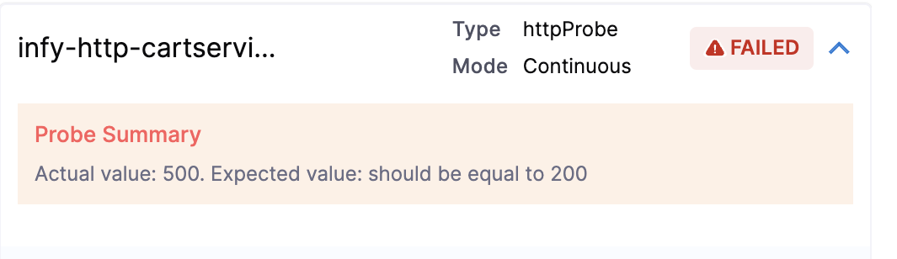
:::

## Conclusion

Congratulations on running your first chaos experiment! Want to know how to remediate the application so as to pass the experiment run and probe checks? Increase the experiment pods to at least two so that at least one deployment pod survives the pod delete fault and helps the application stay afloat. Try running it on your own!

Here are some recommendations:
- [Create chaos experiments from scratch](/docs/chaos-engineering/get-started/tutorials/chaos-experiment-from-blank-canvas.md)
