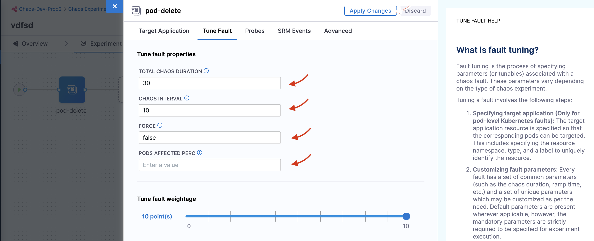

In this tutorial, you will understand how to execute a chaos experiment on Kubernetes for the first time.

## Before you begin

* [HCE overview](/docs/chaos-engineering/get-started/overview.md)
* [Key concepts](/docs/chaos-engineering/get-started/key-concepts.md)
* [Prerequisites](/docs/chaos-engineering/get-started/tutorials/prerequisites.md)

HCE recommends you to visit the [overview](/docs/chaos-engineering/get-started/overview.md), [concepts](/docs/chaos-engineering/get-started/key-concepts.md) and [prerequisites](/docs/chaos-engineering/get-started/tutorials/prerequisites.md) sections to understand what chaos engineering is, why it is important, how it is implemented, the standard chaos experimentation flow, and the permissions required to execute chaos experiments.

## Create a project

1. Create a new project or ask your administrator to add you to an existing project. Once you sign up or login to your account, you can access the **Chaos** tab on the extreme left, which displays the recent experiments that were executed.


### Add a chaos environment

2. A chaos experiment is executed in a chaos infrastructure that is associated with an **environment**. To create a new environment, navigate to **Environments** page, and choose a **New Environment**. Specify environment name, a description (optional) and tags (optional). Select the environment type, **Production** or **Non-Production**. Finally, click **Create** to add the new environment.


:::tip
You can also select one of the environments from the list of environments if it is available instead of creating an environment.
:::

### Add a chaos infrastructure

3. Once you have created an environment, you can add chaos infrastructure to it. Depending on your application, you can select **Kubernetes** or **Linux** or **Windows**. In this tutorial, you can select a Kubernetes infrastructure, which you will use to inject faults into Kubernetes resources. You can use an existing infrastructure or create a new one. In this tutorial, you can create a new infrastructure. For this, click **Enable chaos**


4. This will lead you to a page where you can select an existing infrastructure or create a new infrastructure. Select **On New Infrastructures** and select **Continue**.


5. Provide a name, a description (optional) and tags (optional) for your chaos infrastructure. Click **Next**.


6. In this step, choose the **installation type** as **Kubernetes**, **access type** as **Specific namespace access** (click **Change** to display the **Specific namespace access** access type), **namespace** as **hce**, and **service account name** as **hce**. Click **Next**.


:::tip
The **Cluster-wide access** installation mode allows you to target resources across all the namespaces in your cluster whereas the **Specific namespace access** mode restricts chaos injection to only the namespace in which the delegate is installed.
:::

7. Ensure you have access to your Kubernetes cluster via [kubectl](https://kubernetes.io/docs/reference/kubectl/). Click **Download** to deploy your chaos infrastructure by downloading and applying the given manifest using your terminal. Once done, choose **Done**.


8. It may take some time for the delegate to be setup in the Kubernetes cluster. Navigate to **Environments** and once the delegate is ready, the connection status displays as `CONNECTED`.


### Create a demo application and observability infrastructure

Once you are all ready to target our Kubernetes resources, you can execute the simplest fault, [**Pod Delete**](/docs/chaos-engineering/chaos-faults/kubernetes/pod/pod-delete.md). Pod delete chaos fault deletes the pods of a deployment, statefulset, daemonset, etc, to validate the resiliency of a microservice application.

9. You can use your own application as a target, however, in this tutorial, use the [Online Boutique](https://github.com/GoogleCloudPlatform/microservices-demo) microservices demo application as the target.

Before we setup our chaos experiment, let us install the target application. Run the following commands to setup the target application microservices and observability infrastructure, including, Grafana, Prometheus and a BlackBox exporter. Installation of the observability infrastructure is optional as it doesn't have any role in executing the experiment, however, it will provide us with a dashboard which will help us validate the health of the constituent application microservices in real time.
```bash
❯ kubectl apply -f https://raw.githubusercontent.com/chaosnative/harness-chaos-demo/main/boutique-app-manifests/manifest/app.yaml -n hce

❯ kubectl apply -f https://raw.githubusercontent.com/chaosnative/harness-chaos-demo/main/boutique-app-manifests/manifest/monitoring.yaml -n hce
```

We are deploying these resources in the existing `hce` namespace, since we had specified the Namespace mode of installation.

Eventually, we will have all the target application and observability infrastructure pods available in the `hce` namespace:

```
❯ kubectl get pods -n hce

NAME                                           READY   STATUS    RESTARTS        AGE
adservice-68db567bb5-hd47j                     1/1     Running   0               5m39s
cartservice-6b8f46f64f-6mrkv                   1/1     Running   0               5m39s
chaos-exporter-765d6b6674-tkrpm                1/1     Running   0               11m
chaos-operator-ce-678b67c75-l68m5              1/1     Running   0               11m
checkoutservice-7545ff6849-rdl9f               1/1     Running   0               5m40s
currencyservice-5769b647d5-trx69               1/1     Running   0               5m39s
emailservice-55c84dcfdc-c9x9q                  1/1     Running   0               5m40s
frontend-74b7898dd9-x4bzr                      1/1     Running   0               5m40s
grafana-6f6fb469b7-bm9vh                       1/1     Running   0               5m34s
loadgenerator-5b875b84dd-pcjdr                 1/1     Running   0               5m39s
paymentservice-59d87f77bc-fkwjq                1/1     Running   0               5m40s
productcatalogservice-676d7d7dbc-nx75x         1/1     Running   0               5m40s
prometheus-blackbox-exporter-6d955c876-l7fdv   2/2     Running   0               5m34s
prometheus-deployment-779b88bf5d-zf8f9         1/1     Running   0               5m34s
recommendationservice-6fc8b4d9cf-4s96t         1/1     Running   0               5m40s
redis-cart-7cd9d8966d-mgbhx                    1/1     Running   0               5m39s
shippingservice-7b4945b5fc-cbmc9               1/1     Running   0               5m39s
subscriber-7774bd95d4-4rnwp                    1/1     Running   0               11m
workflow-controller-6d5d75dc7c-v9vqc           1/1     Running   0               11m
```

You can list the services available in the `hce` namespace as following:
```
❯ kubectl get services -n hce

NAME                           TYPE           CLUSTER-IP       EXTERNAL-IP   PORT(S)          AGE
adservice                      ClusterIP      10.110.145.128   <none>        9555/TCP         9m48s
cartservice                    ClusterIP      10.103.73.107    <none>        7070/TCP         9m49s
chaos-exporter                 ClusterIP      10.103.163.182   <none>        8080/TCP         15m
checkoutservice                ClusterIP      10.105.52.42     <none>        5050/TCP         9m49s
currencyservice                ClusterIP      10.108.12.130    <none>        7000/TCP         9m49s
emailservice                   ClusterIP      10.106.79.95     <none>        5000/TCP         9m49s
frontend                       ClusterIP      10.98.222.239    <none>        80/TCP           9m49s
frontend-external              LoadBalancer   10.101.239.201   localhost     80:30963/TCP     9m49s
grafana                        LoadBalancer   10.96.206.174    localhost     3000:32659/TCP   9m43s
paymentservice                 ClusterIP      10.106.36.71     <none>        50051/TCP        9m49s
productcatalogservice          ClusterIP      10.97.78.9       <none>        3550/TCP         9m49s
prometheus-blackbox-exporter   ClusterIP      10.103.118.20    <none>        9115/TCP         9m43s
prometheus-k8s                 LoadBalancer   10.106.153.10    localhost     9090:32101/TCP   9m43s
recommendationservice          ClusterIP      10.106.227.47    <none>        8080/TCP         9m49s
redis-cart                     ClusterIP      10.103.184.94    <none>        6379/TCP         9m48s
shippingservice                ClusterIP      10.109.150.169   <none>        50051/TCP        9m48s
workflow-controller-metrics    ClusterIP      10.106.97.173    <none>        9090/TCP         15m
```

To access the target application frontend in your browser, use the `frontend-external` LoadBalancer service.


Similarly you can access the Grafana dashboard, login with the default credentials username `admin` and password `admin`, and browse the Online Boutique application dashboard. Currently, all the metrics are indicating normal application behavior.


### Constructing a chaos experiment

With our target application deployed, we can now create a chaos experiment. We will be targeting the pods of the carts microservice with the Pod Delete fault. Right now, the cart page is healthy and accessible in the frontend, as seen at the `/cart` route.


To create the chaos experiment, go to **Chaos Experiments** page and choose **New Experiment**. Then, add the experiment name and optionally a description and tags. Then, choose the target infrastructure, which we created previously. Choose **Next**. In the Experiment Builder, choose **Templates from Chaos Hubs** and select **Boutique cart delete**.

This will allow us to create our chaos experiment using a pre-defined template, which already has a pod-delete fault configured to target the Online Boutique application.

Select **Use this template** to continue.


You'll notice that we're currently in the **Chaos Studio**, which helps in constructing varied chaos experiments involving different kinds of chaos probes, faults and custom action steps. Since the template has already defined the pod-delete fault, let us inspect at its configuration.

Select the added pod-delete fault icon.


We are targeting the carts microservice and hence the appropriate `hce` application namespace and the `app=cartservice` application label has been provided here, which corresponds to the cart microservice. Also, application kind is `deployment`. It is worth noting that you can discover these entities from within the UI using the search dropdown menu for the respective inputs.

Then, choose the **Tune Fault** tab to view the fault parameters. Here, we the fault execution duration is defined to be 30 seconds with an interval of 10 seconds, so that in every 10 seconds the cart microservice pod(s) get deleted for a total of 30 seconds. The ramp time is empty and by default 0, which refers to the period to wait before and after chaos injection. Lastly, the pod affected percentage is also empty, and by default at least one pod of the cart deployment will be targeted.



Lastly, switch to the **Probes** tab. Here, we have a probe defined by the name of **http-cartservice-probe**, which will validate the availability of the `/cart` URL endpoint when the pod-delete fault will execute. It can be observed that the probe is of type HTTP Probe and it executes in a Continuous mode throughout the fault execution. Further, under probe details, the URL can be observed as `http://frontend/cart` and the response timeout is 15 milliseconds. Therefore, as part of the probe execution GET requests will be made to the specified URL and if no HTTP response is found within 15 milliseconds, the probe will be declared as failed. If all the probe executions pass, then the probe will be regarded as passed. The interval of probe evaluation, retries upon failure and other parameters, check its properties.


When done, simply close the overlay modal.

In the last step, choose the **Set Fault Weight** tab. Here, we can observe that the default weight for the fault is 10, which we can use for calculating the resiliency score for the experiment run.


### Observing chaos execution

When ready, start the experiment execution by selecting **Run** on the top right corner of the screen. You'll be able to observe the experiment added to the list of chaos experiments and it should be in a `Running` status. Choose **Current Execution** to get a detailed view.


Once the fault is running, we can check for the detailed view of the experiment. We can follow the logs of the experiment run as it gets executed. 


At the same time, we can also check for the status of the cart deployment pod. Upon executing the following command you will get a similar output. It is evident that the Pod Delete fault has caused the cart pod to be terminated and a new pod has recently replaced it, for whose container is yet to be created.

```
❯ kubectl get pods -n hce

NAME                                           READY   STATUS    RESTARTS       AGE
adservice-68db567bb5-hd47j                     1/1     Running   0              5h41m
cartservice-6b8f46f64f-lkgs8                   0/1     Running   0              29s
chaos-exporter-765d6b6674-tkrpm                1/1     Running   0              5h41m
chaos-operator-ce-678b67c75-l68m5              1/1     Running   0              5h41m
checkoutservice-7545ff6849-rdl9f               1/1     Running   0              5h41m
currencyservice-5769b647d5-trx69               1/1     Running   0              5h41m
emailservice-55c84dcfdc-c9x9q                  1/1     Running   0              5h41m
frontend-74b7898dd9-x4bzr                      1/1     Running   0              5h41m
grafana-6f6fb469b7-bm9vh                       1/1     Running   0              5h41m
loadgenerator-5b875b84dd-pcjdr                 1/1     Running   0              5h41m
paymentservice-59d87f77bc-fkwjq                1/1     Running   0              5h41m
productcatalogservice-676d7d7dbc-nx75x         1/1     Running   0              5h41m
prometheus-blackbox-exporter-6d955c876-l7fdv   2/2     Running   0              5h41m
prometheus-deployment-779b88bf5d-zf8f9         1/1     Running   0              5h41m
recommendationservice-6fc8b4d9cf-4s96t         1/1     Running   0              5h41m
redis-cart-7cd9d8966d-mgbhx                    1/1     Running   0              5h41m
shippingservice-7b4945b5fc-cbmc9               1/1     Running   0              5h41m
subscriber-7774bd95d4-4rnwp                    1/1     Running   0              5h41m
workflow-controller-6d5d75dc7c-v9vqc           1/1     Running   0              5h41m
```

Consequently, if we try to access the frontend cart page, we get the following error which indicates that the application is now unreachable. This makes sense since the cart pod has been deleted and a new pod is yet to initialize:


We can validate this behavior using the application metrics dashboard as well. The probe success percentage for website availability (200 response code) is now steeply decreasing along with the 99th percentile (green line) queries per second (QPS) and access duration for the application microservices. Also, the mean QPS (yellow line) is steeply increasing. This is because there's no pod available right now to service the query requests.


### Evaluating the experiment run

When the experiment execution concludes, we get a resiliency score of 0%. We can also observe that the Pod Delete fault step has failed.

Before we analyze the experiment result, we can validate that the application is now again normally accessible, without any errors. This can also be validated from the Grafana dashboard where we can observe the metrics to slowly normalize as the chaos duration is now over.


We can now check the check the chaos result, where it can be observed that the fault verdict is **Failed** and the Probe Success Percentage is 0%. This is because the http-cart-service probe has failed. The failure of this probe can be attributed to the unavailability of the cart pod and therefore the `/cart` endpoint, due to the injection of the Pod Delete fault.


We can also observe that the fail step says "Probe execution result didn't met the passing criteria", referring the the failure of HTTP probe that we had defined.


## Conclusion

Congratulations on running your first chaos experiment! Want to know how to remediate the application so that it passes the experiment run and probe checks? Nump up the experiment pods to at least two so that at least one deployment pod survives the pod delete fault and helps the application stay afloat. Try running it on your own!

Once you've explored this, head over to the next tutorial, where you'll learn how to [create chaos experiments from scratch](./chaos-experiment-from-blank-canvas) and execute them for the same target application.
