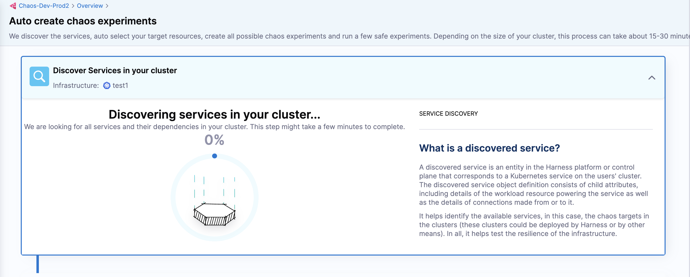
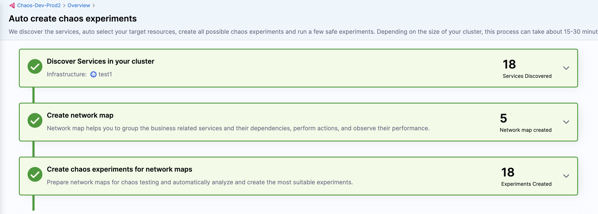
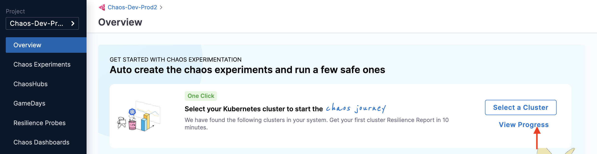
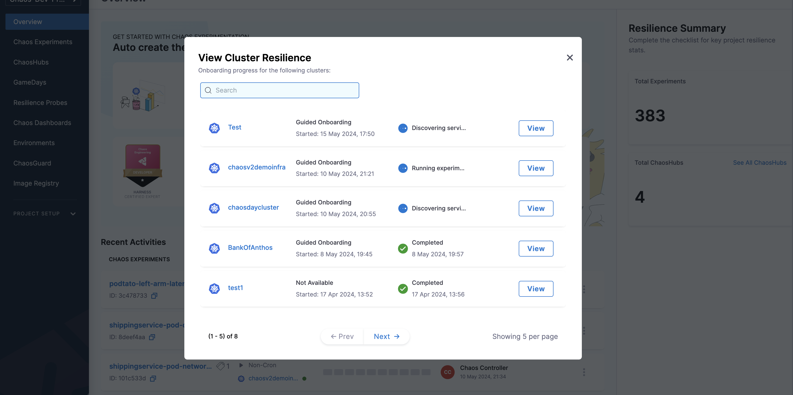

This topic describes the following operations:

1. [Set up environment with a click.](/docs/chaos-engineering/getting-started/onboarding/automated-onboarding#select-an-environment)
2. [Set up the chaos infrastructure with a click.](/docs/chaos-engineering/getting-started/onboarding/automated-onboarding#select-an-infrastructure)
3. [Discover services automatically.](/docs/chaos-engineering/getting-started/onboarding/automated-onboarding#automatically-discover-services)
3. [Create and execute chaos experiments automatically.](/docs/chaos-engineering/getting-started/onboarding/automated-onboarding#automatically-create-experiments)

## Before you begin, review the following

* [Overview of HCE onboarding](/docs/chaos-engineering/getting-started/onboarding/onboarding#prerequisites-to-automated-and-guided-onboarding)
* [Create infrastructure before onboarding](/docs/chaos-engineering/getting-started/onboarding/onboarding#steps-to-create-an-infrastructure-for-onboarding)

### What is Automated Onboarding?

Automated onboarding simplifies the process by automatically creating and executing a chaos experiment. With just a click, HCE sets up an environment, uses existing infrastructure, executes the experiment, and displays the resilience score for the sample application.

### Why Choose Automated Onboarding?
- If you want to quickly start with executing chaos experiments with minimal manual steps, this guide is for you.
- It requires minimal time and effort.
- Select an environment and infrastructure, and HCE handles the rest: discovering services, creating experiments with a low blast radius, executing them, and displaying experiment's progress and resilience score.

### How to Onboard Automatically?

If you chose automated onboarding by selecting **Yes, in a single step** [here](/docs/chaos-engineering/getting-started/onboarding/onboarding#onboarding), follow these steps.

### Select an Environment

1. Choose an environment from the list and select **Next**.

### Select an Infrastructure

2. Choose the target infrastructure on which you want to execute the chaos experiments, then select **Apply**. Infrastructure marked as **Available** are ready for use.

### Automatically Discover Services

3. Based on your previous selections, HCE discovers services in your cluster (known as **service discovery**) to create chaos experiments.

    

### Automatically Create Experiments

4. HCE automatically creates chaos experiments and selects a few experiments to execute.

    

5. HCE prioritizes executing safe chaos experiments- those with a low blast radius.

    

### View Logs and Resilience Dashboard

6. You can see the status of the chaos experiment execution, as well as view the experiment execution. You can also see the resilience score of the experiment if you select **View Resilience Dashboard**.

    

7. To view the experiment execution logs, select **View Execution**. This will open a new page where you can see detailed logs of the experiment.

    

### View Progress of an Experiment

1. To track the progress of a previously created experiment, select **View Progress**.

    

2. Select **View** on the infrastructure where you executed the chaos experiment.

    

## Conclusion
Congratulations! You completed the automated HCE onboarding. Now you are all set to [explore the chaos faults](/docs/chaos-engineering/use-harness-ce/chaos-faults/) and build resilient applications.
