import Tabs from '@theme/Tabs';
import TabItem from '@theme/TabItem';

This topic describes the following operations that constitute the guided onboarding:
1. [Create an environment.](#select-an-environment)
2. [Create an infrastructure.](#select-an-infrastructure)
3. [Automatically discover services on your cluster.](#automatically-create-discovery-agent)
4. [Create application maps with a single click.](#create-application-maps)
5. [Choose the chaos experiments to run.](#create-chaos-experiments)
6. [View the resilience of chaos experiments.](#view-resilience-score)

## Before you begin, review the following

* [All about chaos engineering](/docs/chaos-engineering/concepts/chaos101)
* [Onboarding overview](/docs/chaos-engineering/getting-started/onboarding/introduction)
* [Create infrastructure before onboarding](/docs/chaos-engineering/getting-started/onboarding/introduction#prerequisites-to-automated-and-guided-onboarding)

### What is Guided Onboarding?
Guided onboarding walks you through creating a chaos experiment with minimal decisions required at each step.

For example, when you [select a button to create an environment](/docs/chaos-engineering/getting-started/onboarding/guided-onboarding#select-an-environment), HCE handles the environment creation in the background. Similarly, you can click a button to use a chaos infrastructure in the environment you created earlier.

### Why Choose Guided Onboarding?

- Guided onboarding provides multiple options at each step, helping you understand the entire process of creating and executing a chaos experiment.
- You can either let HCE create entities for you or choose to customize each entity's creation.
- HCE suggests experiments based on earlier steps (such as application maps), but you'll need to manually initiate the experiments by selecting the **Run** button.

### How to Onboard with Guided Onboarding?

If you chose guided onboarding by selecting **No, I will choose** [here](/docs/chaos-engineering/getting-started/onboarding/introduction#onboarding), follow these steps:

### Select an Environment

1. Select an environment from list and click **Next**. It might take a moment to set up the environment.

        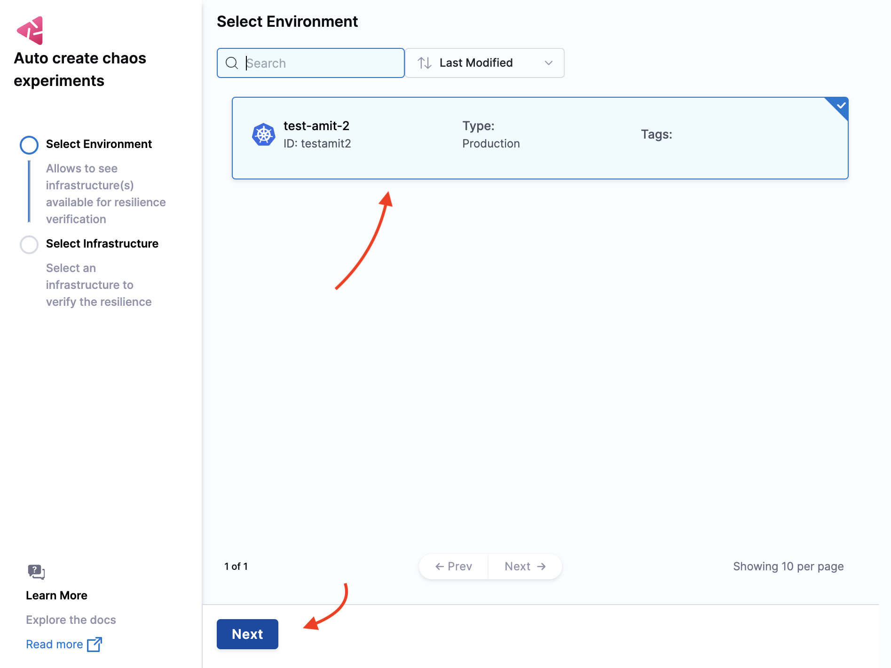

### Select an Infrastructure

2. If the infrastructure says **Already in use**. you'll need to create a new one. Select an available infrastructure from the list and click **Apply**.

        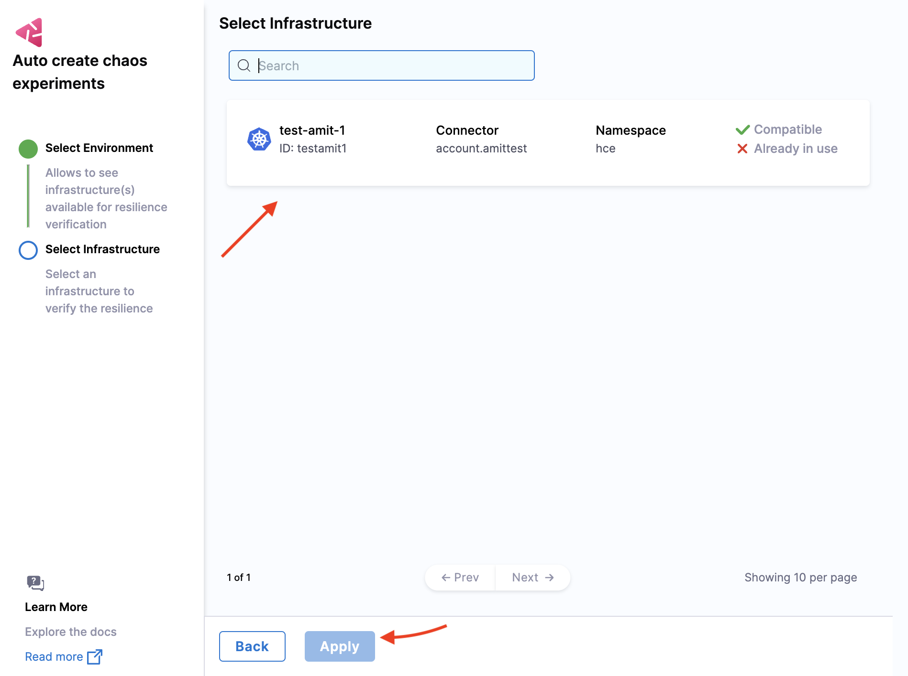

### Automatically Create Discovery Agent

3. HCE creates the discovery agent, which automatically discovers the services for your application. The next step (optional) allows you to collect information about blocked namespaces, service discovery periods, and more. For customizing the discovery agent, see customize discovery agent.

HCE will search for services in your cluster, which might take some time.

    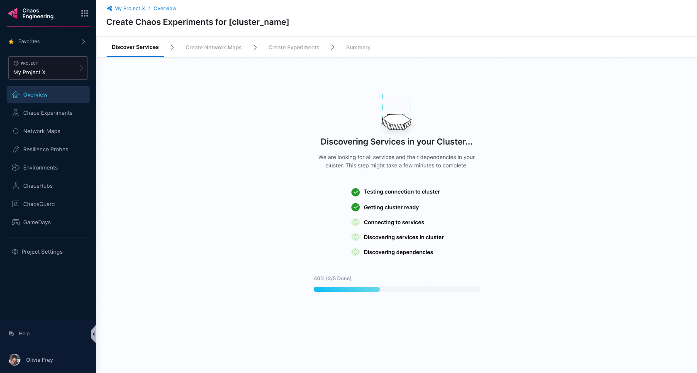

### Create Application Maps

4. Once HCE discovers the services, the UI will list them. Click **Create Application Maps**.

    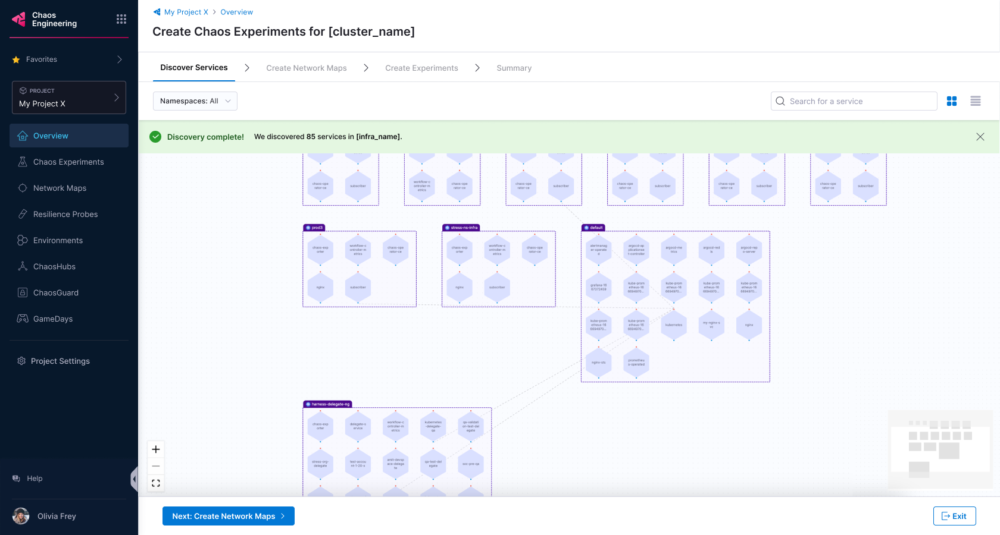

5. HCE will prompt you to choose whether to automatically create application maps.

### Choose Between Automatic and Customizable Application Map Creation

<Tabs>
 <TabItem value="Automatic">

6a. Select **Yes** to automatically create application maps, then click **Create Application Maps**.

    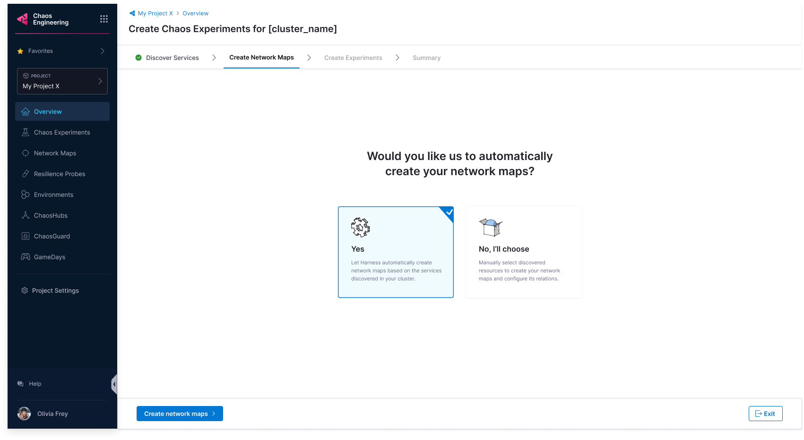

6b. HCE will provide application map recommendations based on the discovered services.

</TabItem>

<TabItem value="Customize">

6a. Select **No, I will choose** to customize application map creation, then select **Create Application Maps**.

    

6b. Enter a **Application Map Name**, **Tag** (optional), and **Description** (optional), then select **Confirm**.

    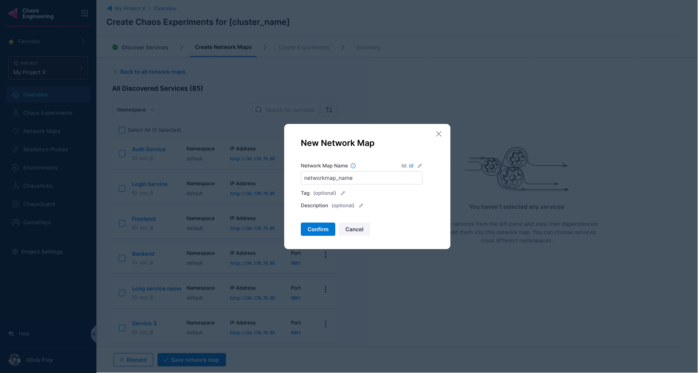

HCE will create the application maps and list them in the UI.

    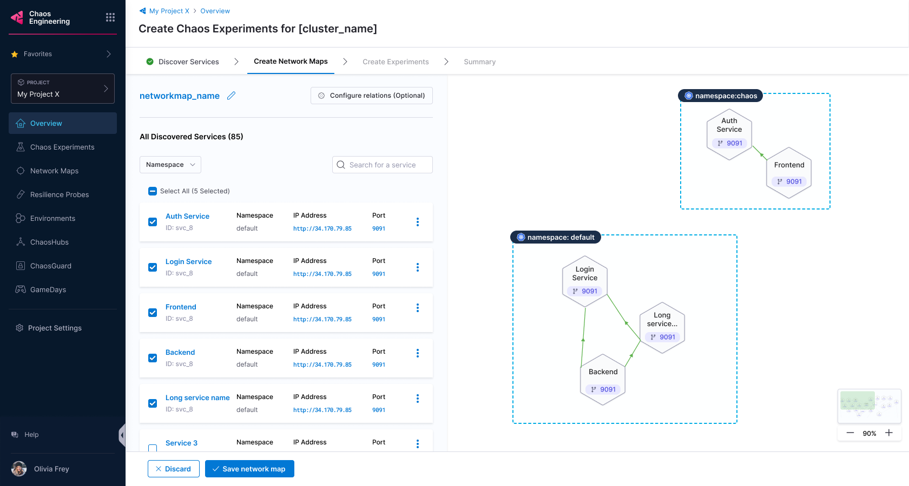

6c. To save some or all of the created application maps, select **Save application map**.

    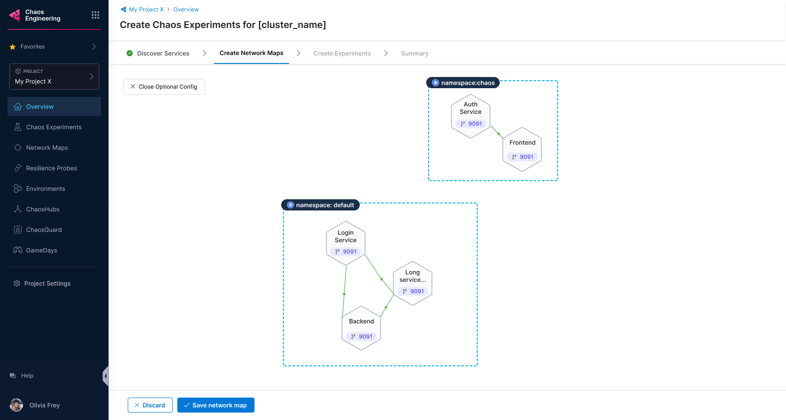

</TabItem>
</Tabs>

### Create Chaos Experiments

7. HCE will list the application maps for you to choose from. Choose one and select **Next: Create Chaos Experiments**.

    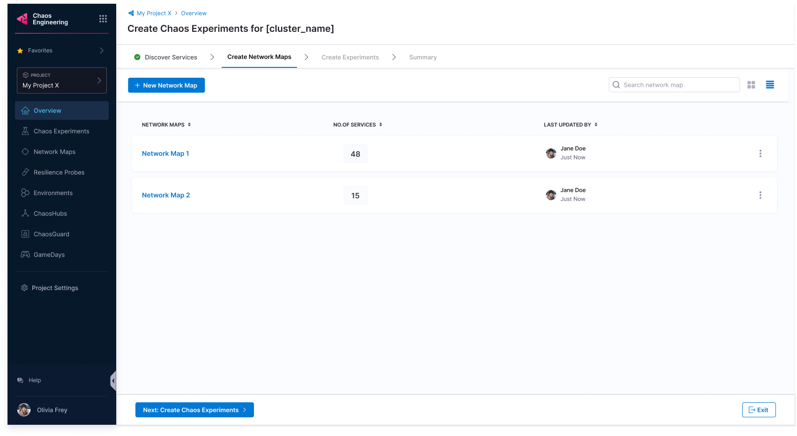

8. HCE will recommend experiments with different levels of complexity, classified by the blast radius of the experiment. You can choose between **Basic**, **Intermediate**, and **Advanced** experiments. Select **Create Experiments** to proceed.

    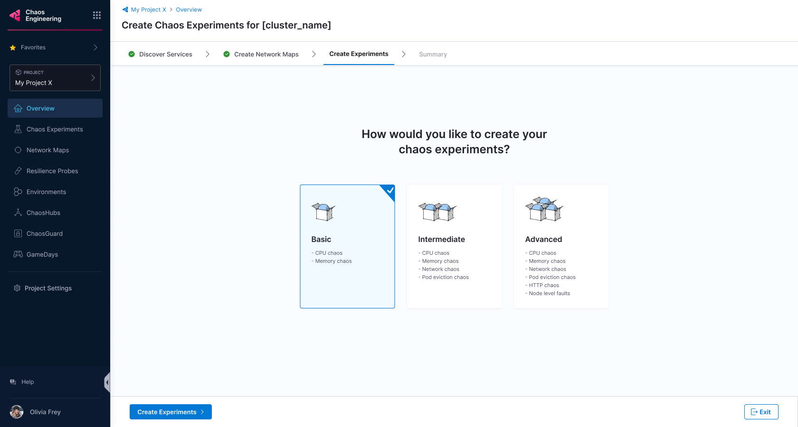

9. Based on your selection, HCE will create chaos experiments and list the associated application maps in the UI. Select **Complete** or **Exit**.

    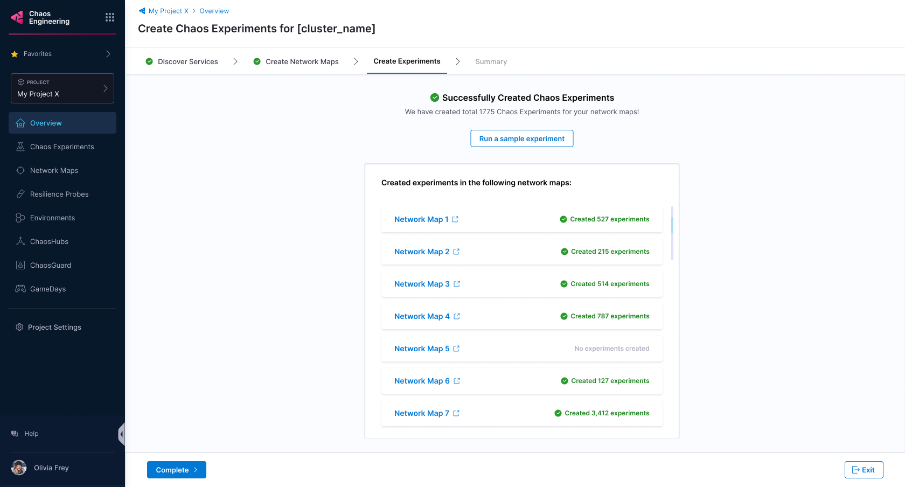

### Execute Chaos Experiments

10. Select **Run** to execute the chaos experiments.

    

Congratulations! You have successfully:

 - Discovered services
 - Created application maps
 - Created chaos experiments
 - Executed the chaos experiments

### View Resilience Score

- Once your selected experiments are complete, you can view the resilience score.

    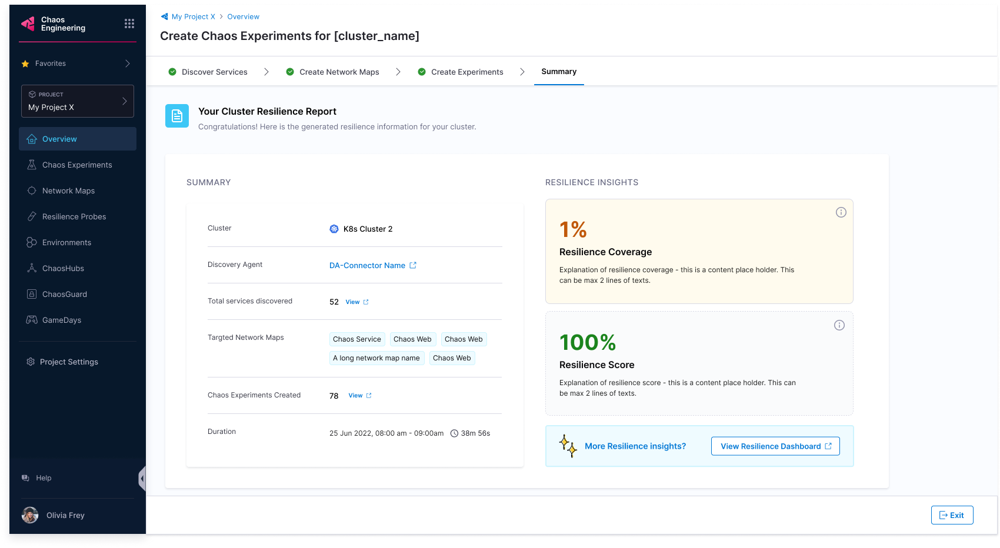

- After completing the checklist requirements, check the resilience summary.

    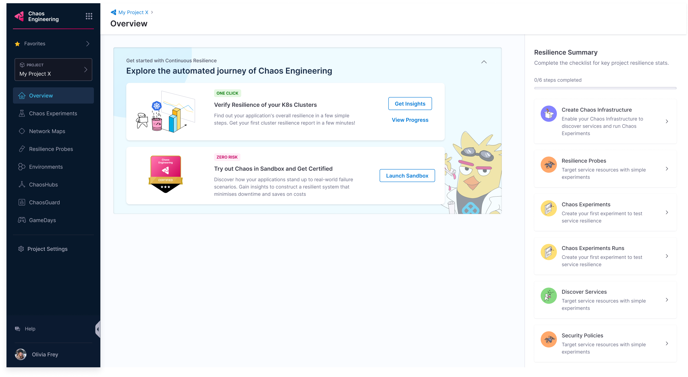

- Select **View** to monitor the progress of different clusters executing various chaos experiments.

    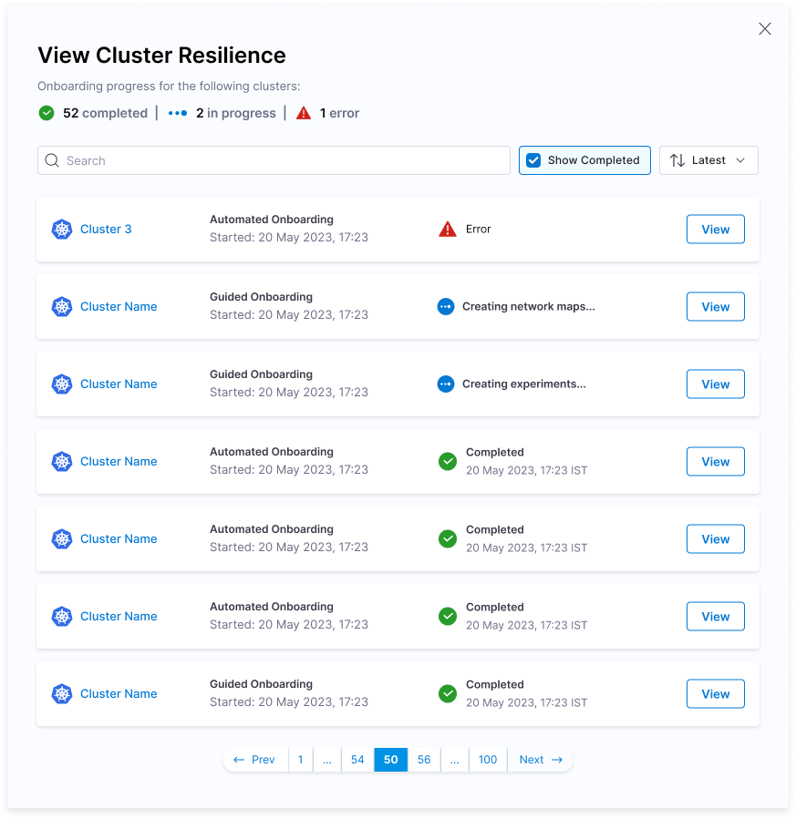

