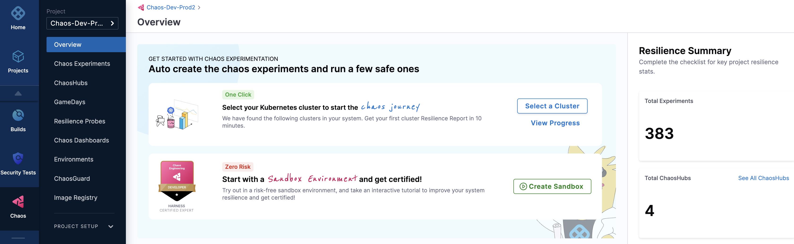
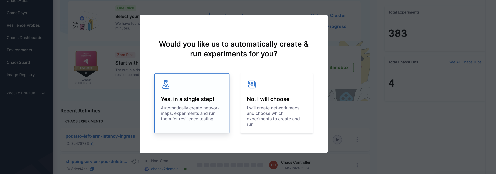
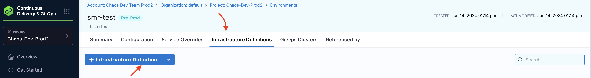
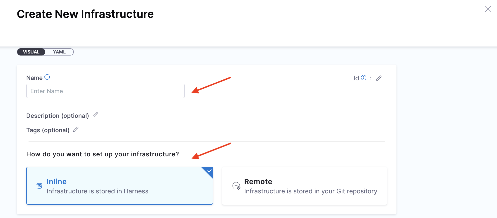
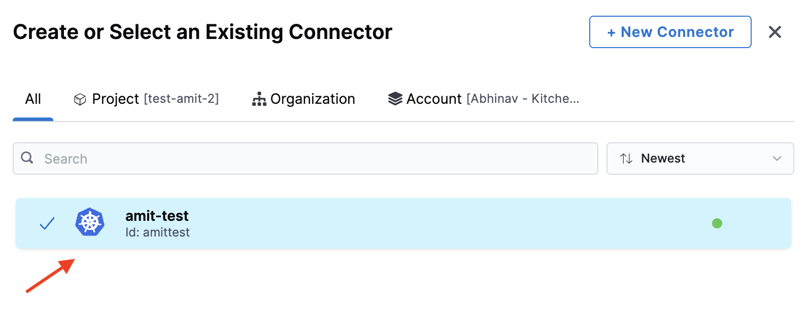
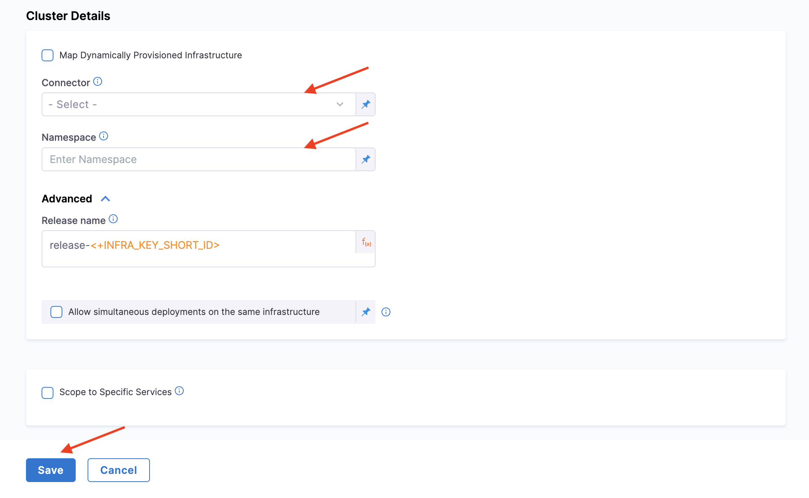

This topic describes how you can get a hands-on experience executing chaos experiments without fulfilling the [prerequisites for HCE SaaS](/docs/chaos-engineering/getting-started/saas/).

## Before you begin, review the following:

- [All about chaos engineering](/docs/chaos-engineering/concepts/chaos101)
- [Explore features](/docs/chaos-engineering/concepts/explore-features)
- [Get Started With HCE](/docs/chaos-engineering/getting-started/)

## Introduction

You can get hands-on experience executing chaos experiments without fulfilling the prerequisites. You can achieve this in two ways:
- [Automated Onboarding](/docs/chaos-engineering/getting-started/onboarding/automated-onboarding)
- [Guided onboarding](/docs/chaos-engineering/getting-started/onboarding/guided-onboarding)

1. Go to the **Chaos** module and select **Overview**. Select **Select a cluster**, where you can choose between [automated](/docs/chaos-engineering/getting-started/onboarding/automated-onboarding) and [guided](/docs/chaos-engineering/getting-started/onboarding/guided-onboarding) onboarding.

    

2. If you choose **Yes, in a single step!**, go to [automated onboarding](/docs/chaos-engineering/getting-started/onboarding/automated-onboarding.md), and if you choose **No, I will choose**, go to [guided onboarding](/docs/chaos-engineering/getting-started/onboarding/guided-onboarding.md).

    

:::tip
- Previously, HCE provided a dedicated chaos infrastructure to execute chaos experiments. With the current updates, the `chaos-runner` is transient and you can execute chaos experiments by installing **Harness delegate**, thereby eliminating the need to install Harness chaos infrastructure and other additional components.
- Once you have installed Harness delegate, you can reuse it to execute experiments, discover services, create application maps and so on.
:::

## Prerequisites to Onboarding

HCE requires that you install a chaos infrastructure in your environment before using one of the onboarding methods. While using one of the onboarding methods, you can simply select the infrastructure (you installed earlier) for use by the chaos experiment.

:::tip
Once you use a chaos infrastructure for one of the onboarding methods, you need to create a new infrastructure for the second onboarding method. You can't use the same infrastructure more than once. The UI shows whether the infrastructure is already in use, if so, create a new one.
:::

### Steps to Create an Infrastructure for Onboarding

1. Navigate to **Continuous Delivery & GitOps** module and select **Environments**.

2. Select one of the environments you created earlier or create a new environment. In this section, you will understand how to use an environment you created earlier. Go to create a new environment to create a new environment.

3. Select **Infrastructure Definitions** tab and select **Infrastructure Definition**. This opens the modal to create a new infrastructure.

    

4. Provide a name, method to set up infrastructure (select **inline**), deployment type (select **Kubernetes**), and infrastructure type (select **Kubernetes**).

    

5. Select a connector, and click **Apply Selected**.

    

6. Provide cluster details such as connector and namespace. Other fields are not mandatory so you can skip specifying values for those. Select **Save**.

    

This creates a new infrastructure in the environment you specify.

## Next steps

* [Automated Onboarding](/docs/chaos-engineering/getting-started/onboarding/automated-onboarding)
* [Guided Onboarding](/docs/chaos-engineering/getting-started/onboarding/guided-onboarding)