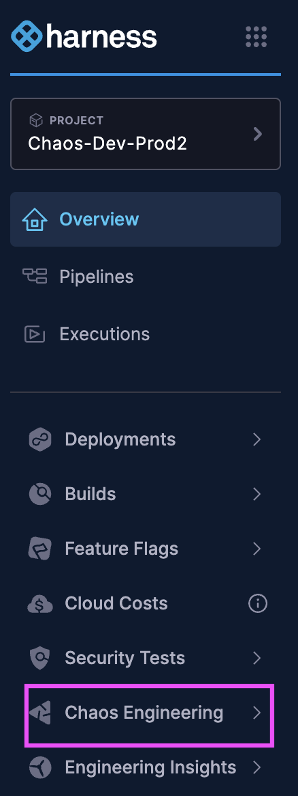

This topic describes generic prerequisites to be fulfilled before executing chaos experiments using Harness Chaos Engineering (SaaS). 

## Access to Harness

- Sign up for a [Harness account](https://app.harness.io) if you don’t already have one.
- Navigate to the **Chaos Engineering** module once you're logged in.

    

## Target System (What You'll Test)

- A running Kubernetes cluster where your app or infrastructure lives.
- Compatible with platforms like GKE, AKS, EKS, or any Kubernetes setup.

## Kubernetes Platform Info

Make sure you know:

- Your Kubernetes version.
- If you're using GKE, are you on **Standard** or **Autopilot**?
- Harness experiments run from a control plane that connects to your target clusters.
- A [delegate](https://developer.harness.io/docs/platform/delegates/delegate-concepts/delegate-overview) is required to establish that connection.

:::info note
- If you want to inject chaos into your AWS resource, use [IRSA](https://developer.harness.io/docs/chaos-engineering/use-harness-ce/chaos-faults/aws/security-configurations/aws-iam-integration/), and set up your execution environment on EKS.
- Harness Chaos Engineering supports injecting faults across different Kubernetes clusters from a single, centralized execution environment (cluster), if there is network connectivity (transient runners/pods on the target clusters).
:::

## Internet Access

- Your clusters must be able to reach `app.harness.io` and other necessary endpoints.
- Is whitelisting required?
- If you're using a proxy or firewall, ensure [outbound access](https://developer.harness.io/docs/platform/networking/networking-overview/) is configured correctly.

## Kubernetes Permissions (RBAC)

- Harness needs permissions to create workloads in your target cluster.
- Use [sample RBAC policies](https://developer.harness.io/docs/chaos-engineering/use-harness-ce/governance/rbac) to control access.
- You can scope permissions to a single namespace.
- You can create custom roles/serviceaccounts on the cloud providers to inject chaos.
- Would [service discovery](https://developer.harness.io/docs/chaos-engineering/use-harness-ce/service-discovery/) and fault injection be restricted to a particular namespace? For example, node faults can't be executed in namespace mode.
- Are approvals required to create roles with specific policies/permissions? Harness CE provides the minimal policy spec based on the resources and faults.

:::info note
- By default, chaos injection is cluster-scoped. Harness CE [discovers services](https://developer.harness.io/docs/chaos-engineering/use-harness-ce/service-discovery/) and injects chaos on workloads across namespaces on a given cluster.
:::

## Image Registries

- Your cluster should be able to pull images from public registries like Docker Hub or GHCR.
- If using a [private registry](https://developer.harness.io/docs/chaos-engineering/use-harness-ce/image-registry/), ensure proper access is set up.
- Check if the target clusters use one or more registries.

## Deployment Options

- You can deploy Harness components via [Helm](https://developer.harness.io/docs/chaos-engineering/use-harness-ce/infrastructures/types/legacy-infra/kubernetes#use-helm-template-to-install-chaos-infrastructure), manifests, or [pipelines](https://developer.harness.io/docs/continuous-integration/get-started/key-concepts).

## Security Policies

- Ensure that security policies like Kyverno or OPA validate workloads during runtime.
- Some chaos experiments (like container kill or network loss) require [privileged access, i.e ChaosGuard](https://developer.harness.io/docs/chaos-engineering/use-harness-ce/governance/governance-in-execution/).

## Service Mesh Considerations

- If you're using a service mesh (for example, Istio or Linkerd), check if sidecar injection is enforced.
- Harness supports sidecar-aware deployments with specific configuration.

## Resource Constraints

- Check if there are resource limits on all containers since Harness workloads require CPU and memory resources.
- If you use quotas or limit ranges, ensure Harness can run within those constraints.

## Health Probes

- Ensure your app has **liveness** and **readiness** probes.
- Harness uses these to determine whether the app recovers after chaos is injected.
- You can define [resilience probes](https://developer.harness.io/docs/chaos-engineering/use-harness-ce/probes/) in your experiment.

## Observability Tools (Optional)

- Harness can integrate with observability tools like Prometheus, Datadog, or New Relic.
- Ensure your metrics systems (endpoints) are accessible from your cluster if you plan to use them.

## Cloud-Specific Permissions

Need permissions for cloud environments like AWS, GCP, or Azure?

- Visit [Platform-Specifics](https://developer.harness.io/docs/chaos-engineering/platform-specifics/) to configure based on your platform.

---

Next, [Run Your First Chaos Experiment](https://developer.harness.io/docs/chaos-engineering/getting-started/execute-your-first-chaos-experiment).