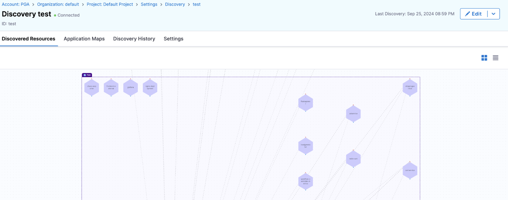
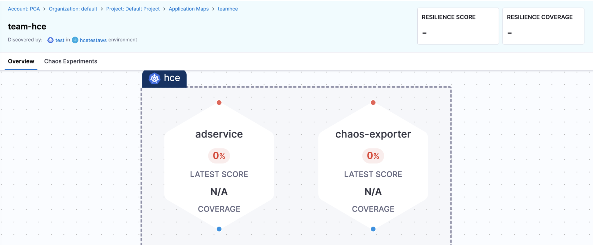
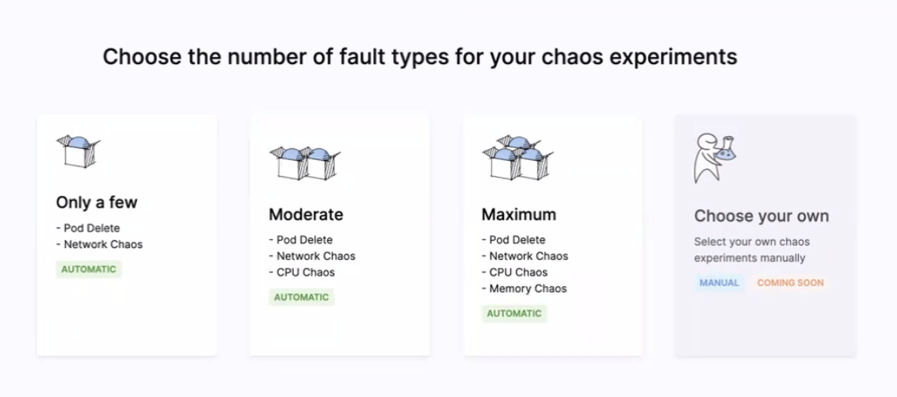
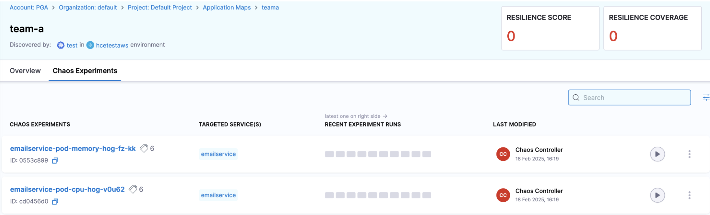

This topic describes how you can use a Harness Delegate along with an agentless chaos execution model to execute a chaos fault on Kubernetes. 

## Before you begin, review the following:

* [Install Delegate](/docs/chaos-engineering/use-harness-ce/infrastructures/types/ddcr/installation)
* [Agentless Chaos Execution Model](/docs/chaos-engineering/concepts/how-stuff-works/agentless-chaos-working#agentless-chaos-execution-model)
* [Centralized Execution Plane](/docs/chaos-engineering/concepts/how-stuff-works/centralized-exec-plane)
* [Application Map](/docs/chaos-engineering/use-harness-ce/application-map#what-is-an-application-map)
* [Service Discovery](/docs/chaos-engineering/use-harness-ce/service-discovery)

## Set up for Delegate-Driven Agentless Fault Injection

### Step 1: Set up your target cluster 

In this step, set up your cluster (where Harness CE executes chaos experiments) with a dedicated namespace for Harness, and go to [Centralized Delegate](/docs/chaos-engineering/use-harness-ce/infrastructures/types/ddcr/centralized-delegate) to inject chaos into a remote target.

### Step 2: Set Up a Discovery agent

[Create a Discovery Agent](/docs/platform/service-discovery/customize-agent).

### Step 3: Harness Discovers Services

The discovery agent may take some time to discover the microservices in your Kubernetes cluster. 

If the microservices in your system are communicating with each other, the agent will discover the connectivity between these microservices. Otherwise, no connectivity is discovered.

However, you can manually create network experiments and tag them to the relevant application map.

Once the services are discovered, the output appears similar to this.

		

### Step 4: Create Application Map

- [Create an application map](/docs/chaos-engineering/use-harness-ce/application-map#create-an-application-map) from the discovery agent.

### Step 5: Harness Auto-Creates Experiments

- Go to **Application Map** in **Project Settings**, and select the application map that you created earlier. It would look similar to the image below.

		

- In the above screen, click **Chaos Experiments** and choose one of **OnlyFew**, **Moderate** and **Maximum** to auto-create experiments. These options describes the number of chaos experiments that would be automatically created.

		

- Based on the option you select, Harness auto-creates the experiments for each discovered service that was selected in the application map. Refresh the page to see the auto-created experiments.

		

## Troubleshooting

- Go to [Troubleshooting Discovery Agent](/docs/chaos-engineering/troubleshooting/#discovery-agent) in case your discovery agent is unable to discover services.	

