Welcome to Harness Chaos Engineering! 

This guide will help you set up a project, environment and infrastructure and execute your first chaos experiment on your application (known as the target).
Fulfill the [prerequisites](/docs/chaos-engineering/getting-started/prerequisites) before executing chaos experiments on Harness CE.

### Step 1: Identify the microservice to target

Identify the microservice in your application that you will target, whose resources will be affected. In this guide, you will delete a Kubernetes pod from your application. Pod delete is the simplest chaos experiment that has a small blast radius.

The diagram below describes the high-level steps to inject chaos into your application.

	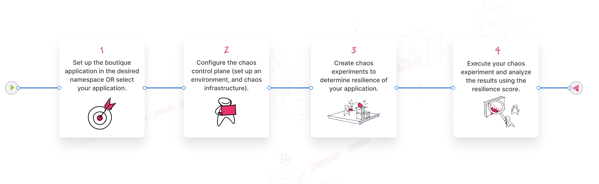

### Step 2: Create a project

1. Create a new project or ask your administrator to add you to an existing project. [Sign up](https://app.harness.io) or log in to your account, and access the **Chaos** tab.

	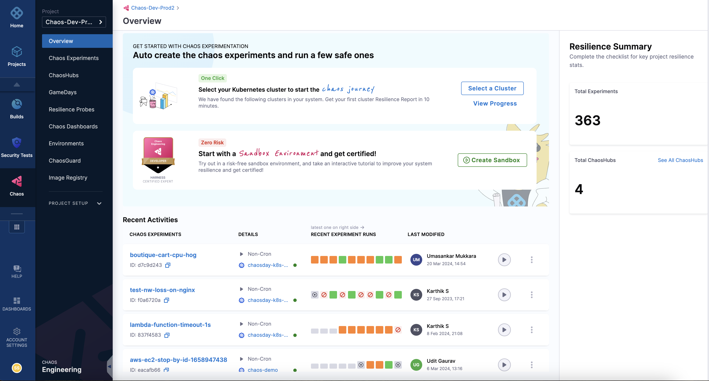

### Step 3: Create an environment

2. A chaos experiment is executed in an infrastructure that is associated with an **environment**. To create a new environment, navigate to the **Environments** page, and choose a **New Environment**. Specify the environment name, a description (optional), and tags (optional). Select the environment type, **Production** or **Non-Production**. Finally, select **Create** to add the new environment.

	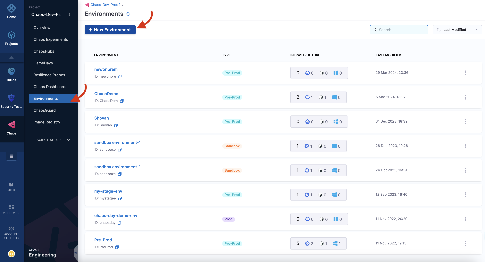

:::tip
You can also select one of the environments from the list of environments if it is available instead of creating an environment.
:::

### Step 4: Create an infrastructure

3. After you create an environment, add an infrastructure to it. Select **+New Infrastructure**. This guide uses a Harness Delegate to execute the experiment. Go to [enable chaos using Delegate](/docs/chaos-engineering/use-harness-ce/infrastructures/enable-disable#enable-chaos) to install a Harness Delegate. Ensure you have access to your Kubernetes cluster via [kubectl](https://kubernetes.io/docs/reference/kubectl/) to apply the manifests from your terminal.

	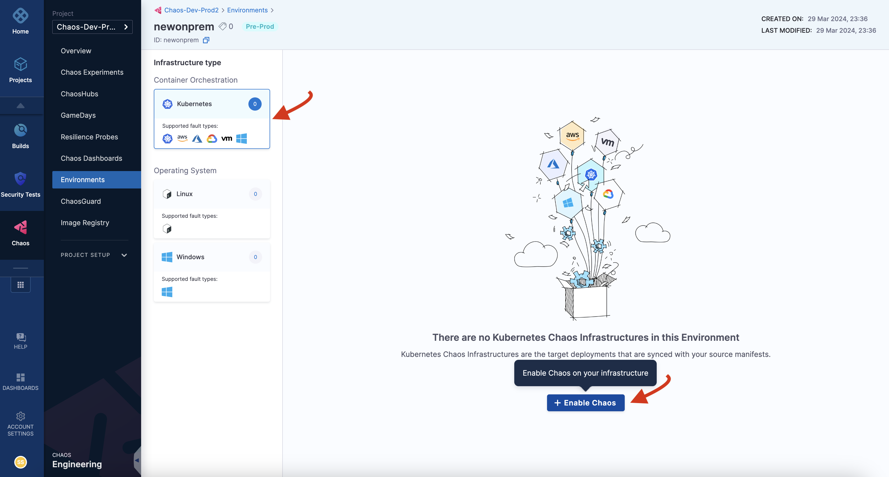

:::tip
The **Cluster-wide access** installation mode allows you to target resources across all the namespaces in your cluster whereas the **Specific namespace access** mode restricts chaos injection to only the namespace in which the delegate is installed.
:::

4. It may take some time for the Delegate to be set up in the Kubernetes cluster. Navigate to **Environments** and select the environment where your infrastructure is being created. Once the Delegate is ready, the connection status displays as `CONNECTED`, and specifies that it is **Supported by Harness delegate**.

	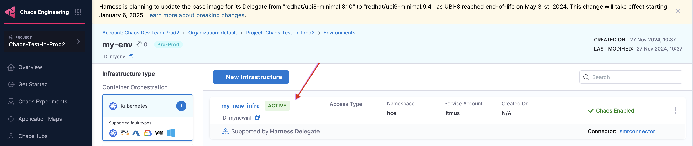

### Step 5: Create observability infrastructure

Once you are all ready to target your Kubernetes resources, execute the simplest fault, [**Pod Delete**](/docs/chaos-engineering/use-harness-ce/chaos-faults/kubernetes/pod/pod-delete) on your application. The **pod delete** chaos fault deletes the pods of a deployment, StatefulSet, DaemonSet, etc, to validate the resiliency of a microservice application.

5. Run the following commands to set the target application microservices and observability infrastructure (optional), including Grafana, Prometheus, and a BlackBox exporter. Installing the observability infrastructure (optional) provides a dashboard that helps validate the health of the constituent application microservices in real-time.

```bash
❯ kubectl apply -f path-to-manifest/app.yaml -n <namespace>
```

```bash
❯ kubectl apply -f path-to-manifest/monitoring.yaml -n <namespace>
```

:::info
* Earlier, you specified the installation mode as **Specific namespace access**, hence the resources are deployed in a specific namespace.
* The target application and observability infrastructure pods are available in the `hce` namespace.
* You can access the monitoring service dashboard to see the status of the application.
* To view the pods in a namespace, execute:

	```
	kubectl get pods -n <namespace>
	```
* To list the services available in a namespace, execute:

	```
	kubectl get services -n <namespace>
	```
:::


### Step 6: Construct a chaos experiment

Once the target application is deployed, create a chaos experiment. Target the pods of the microservice of your choice with the **pod delete** fault. Ensure that the application is healthy before injecting chaos.

6. To create a chaos experiment, go to **Chaos Experiments** page and select **New Experiment**.

	

7. Specify the experiment name and a description (optional) and tags (optional). Choose the chaos infrastructure type (Kubernetes in this case), and click **Select a Chaos Infrastructure**.

	

8. This tab lists different environments available. Select the one you created earlier and click **Next**.

	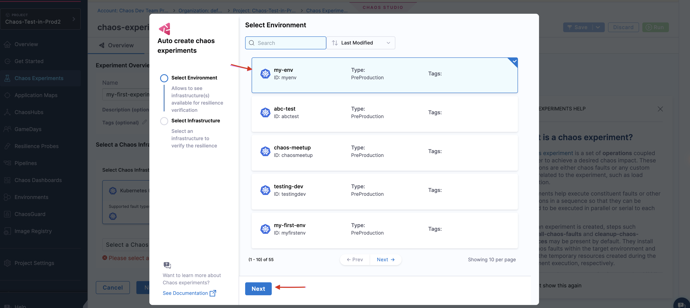

9. Select the infrastructure you created earlier, and click **Apply**.

	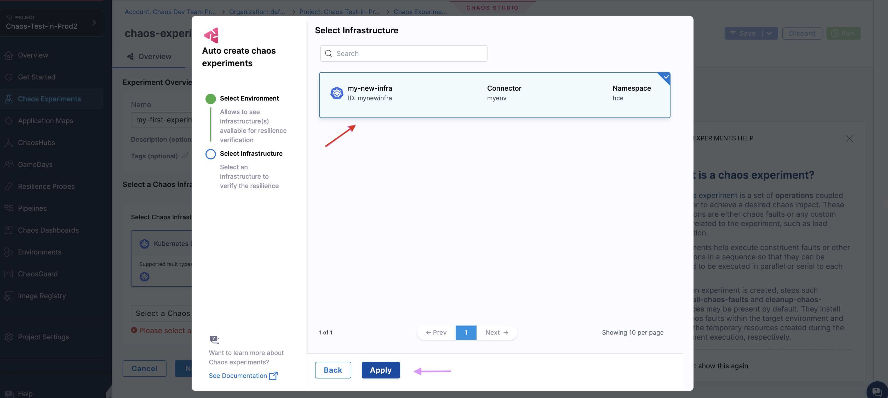

10. In the Experiment Builder, choose **Blank Canvas** and select **Start with blank canvas**. 

	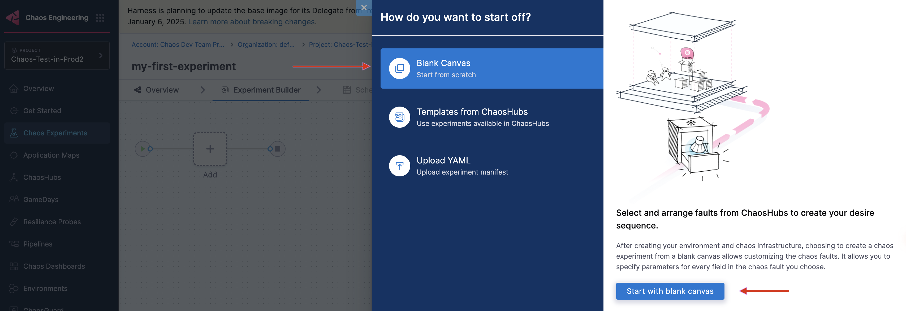

11. Click **+** in the chaos studio.

	

12. Search for "pod delete" in the chaos faults search bar.

	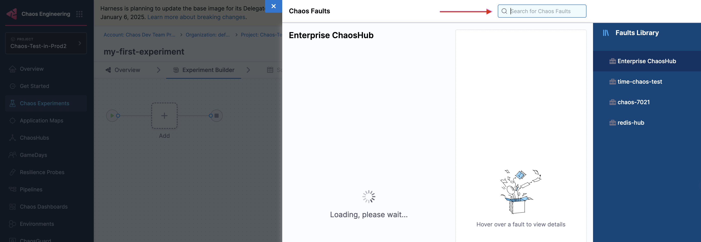

13. In the **Target Application** tab, provide relevant parameters, such as **application kind**, **namespace** (namespace where the application is present), and **Name** (name of the microservice that is targeted).

	

14. In the **Tune Fault** tab, provide fault parameters such as **TOTAL CHAOS DURATION**, **CHAOS INTERVAL**, **FORCE**, **POD AFFECTED PERCENTAGE**, and so on. By default, at least one pod of the application kind is targeted.

	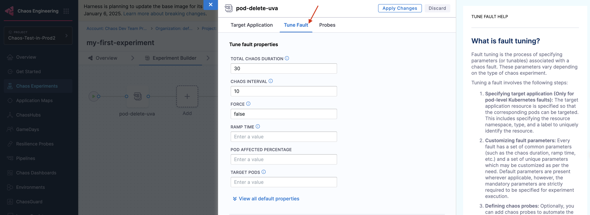

15. Navigate to the **Probes** tab. Click **Select or Add new probes**. Go to [create a probe from the UI](/docs/chaos-engineering/use-harness-ce/probes/use-probe#create-a-resilience-probe-from-ui) for the step-by-step configuration.

	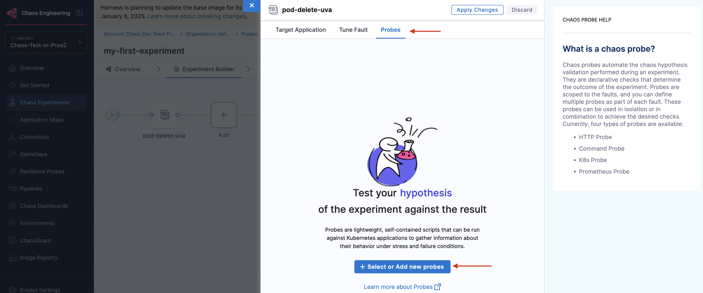

:::tip
- You can give any name for the resilience probe, but ensure you use the same when referencing or using the probe in other places.
- You can provide your own URL in the `url` field. The format is provided in the above example. For example, if your application targets the "cart-service", your `url` would be `http://cartservice.hce.svc.cluster.local/cart`.
- Go to [create a probe](/docs/chaos-engineering/use-harness-ce/probes/use-probe) to understand the steps in detail.
:::

16. Once you create the probe, it will be listed in the probe listing section, as shown below. Select the probe to view the probe details. Click **Add to Fault**.

	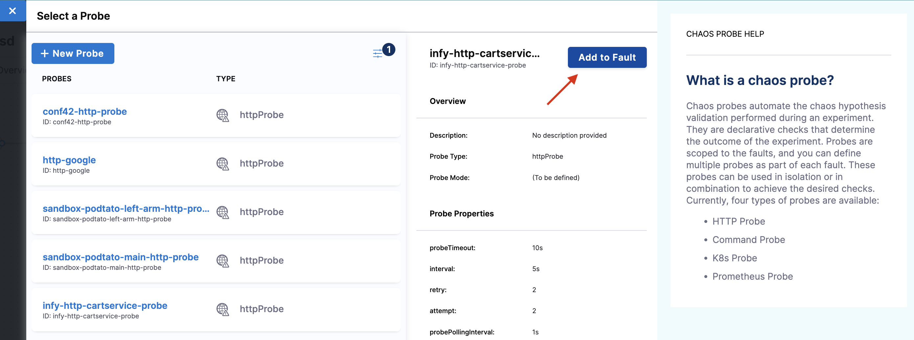

:::info note
Under probe details, you can see that the URL is `http://cartservice.hce.svc.cluster.local/cart` and the interval is 5s. As a part of the probe execution, `GET` requests are made to the specified URL. If no HTTP response is found within 5s, the probe status is considered as 'failed'. If all the probe executions pass, then the probe status is considered as 'passed'. You can find other probe details in the properties field.
:::

17. Select mode as **Continuous**. Click **Apply changes**.

	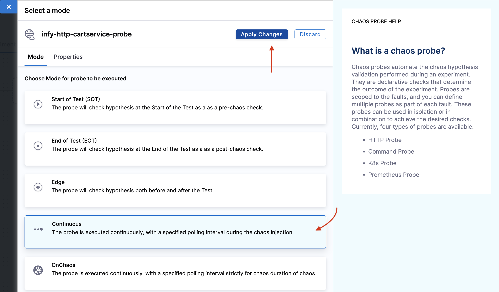

18. This closes the **Probes** tab. Click **Apply changes** to apply the configuration to the chaos experiment.

	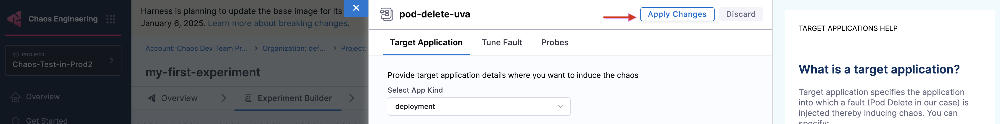

### Step 7: Observing chaos execution

19. To execute the chaos experiment, click **Save**, and then **Run**. This schedules an experiment run. You can see the logs of the experiment in the **Experiment Builder** tab.

	


:::tip
You can view the application's behavior using the application metrics dashboard too. The probe success percentage for website availability (200 response code) decreases steeply along with the 99th percentile (green line) queries per second (QPS) and access duration for the application microservices. Also, the mean QPS (yellow line) steeply increases. This is because no pod is available at the moment to service the query requests.
:::

### Evaluate the experiment run

When the experiment execution concludes, you get a resilience score of 0 %. You will see that the pod delete fault step failed. Before analyzing the experiment result, validate that the application is now again accessible, without any errors.
You can validate this from the Grafana dashboard metrics that indicate the app returning to normal as the chaos duration is over.

You can see the chaos result that shows the pod delete experiment **Failed**. This is because the probe would have failed. The failure is due to the unavailability of the pod, due to "pod delete" fault injection.

## Conclusion

Congratulations on running your first chaos experiment! Want to know how to enhance the resilience of the application and successfully execute the experiment? Increase the experiment pods to at least **two** so that at least one deployment pod survives the pod delete fault and helps the application stay afloat. Try running it on your own!

## Next steps

- [Execute experiment from API](/docs/chaos-engineering/getting-started/saas/experiment-using-api)
- Check out other [chaos experiments](/docs/chaos-engineering/use-harness-ce/chaos-faults/).
- Check out other features such as [ChaosGuard](/docs/chaos-engineering/use-harness-ce/governance/governance-in-execution/), [GameDay](/docs/chaos-engineering/use-harness-ce/GameDay), and so on.
