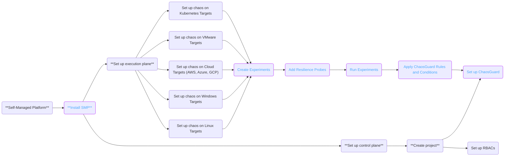

This topic describes features of SMP (Self-Managed Platform).

Feature availability on HCE SaaS and SMP are on par, with minor timeline changes in the SMP feature releases.

The table below outlines the roadmap for the Harness Self-Managed Enterprise Edition of Chaos Engineering:

| **Release version**| **Feature set** | **Deployment infrastructure** | **Supported platforms** | **Supported ingress** |
| --- | --- | --- | --- | --- |
| Limited GA (Current version)| Feature parity with SaaS | <ul><li> Cloud</li><li>Connected</li><li>Airgapped</li><li>Signed certificates</li></ul> | Kubernetes clusters | <ul><li>NGINX</li><li>Istio virtual services</li></ul> |
| General Availability (Coming soon)| Feature parity with SaaS |

:::info note
To install SMP in an air-gapped environment, go to [SMP in air-gapped environment](/docs/self-managed-enterprise-edition/install/install-in-an-air-gapped-environment).
:::

For more information, go to [What's supported](/docs/chaos-engineering/whats-supported.md).

For information on feature releases, go to [SMP Release Notes](/release-notes/self-managed-enterprise-edition).