This topic describes different user personas and their user journeys to achieve resilience in their application.

## User Journey based on User Persona

---

## User Journey based on SMP / SaaS

As a beginner, once you have fulfilled the [prerequisites](https://developer.harness.io/docs/chaos-engineering/getting-started/prerequisites), Harness CE provides usage as Saas version or SMP version.

```mermaid
flowchart TD
  %% Entry point
  START([🚀 Which version of Chaos Engineering do you want to use? ])
  START --> SaaS["Harness SaaS"]
  START --> SMP["Self-Managed Platform (SMP)"]

  %% -------------------------------
  %% SaaS Journey
  subgraph SaaS_Flow [SaaS]
    SaaS --> SaaS_Onboard["Sign Up / Connect Harness Account - this is the control plane"]
    SaaS_Onboard["Sign Up / Connect Harness Account - this is the control plane"] --> del["Install Delegate"]
    del --> connector["Add Connector"]
    connector --> Env["Create Environment"]
    Env["Create Environment"] --> SaaS_Targets["Connect Targets (Linux / Windows / VMware / Cloud / Kubernetes)"]
    SaaS_Targets --> SaaS_Experiments["Create Experiments"]
    SaaS_Experiments --> SaaS_Probes["Add Probes"]
    SaaS_Probes --> SaaS_Run["Run Experiments"]
    SaaS_Run --> SaaS_Analyze["Analyze Results"]
  end

  %% -------------------------------
  %% SMP Journey
  subgraph SMP_Flow [Self-Managed Platform]
    SMP --> SMP_Install["Install SMP"]
    SMP_Install --> SMP_CP["Set up Control Plane"]
    SMP_Install --> SMP_EP["Set up Execution Plane"]
    SMP_EP --> del_smp["Install Delegate"]
    del_smp --> connector_smp["Add Connector"]
    connector_smp --> SMP_Targets["Connect Targets (Linux / Windows / VMware / Cloud / Kubernetes)"]
    SMP_CP --> SMP_Project["Create Project"]
    SMP_Project --> SMP_RBAC["Set up RBACs"]
    SMP_Project --> SMP_Guard["Set up ChaosGuard"]
    SMP_Targets --> SMP_Experiments["Create Experiments"]
    SMP_Experiments --> SMP_Probes["Add Probes"]
    SMP_Probes --> SMP_Run["Run Experiments"]
    SMP_Run --> SMP_Analyze["Analyze Results"]
  end

  %% Styling
  classDef roleStyle fill:#f9f9f9,stroke:#999,color:#333,stroke-width:1px;
  class Dev,QA,SRE,Platform roleStyle;

  style SMP_Install color:#45A7FD, stroke:#AA00FF
  style SMP_Guard color:#45A7FD, stroke:#AA00FF
  style SMP_RBAC color:#45A7FD, stroke:#AA00FF
  style SMP_Experiments color:#45A7FD, stroke:#AA00FF
  style SMP_Run color:#45A7FD, stroke:#AA00FF
  style SMP_Probes color:#45A7FD, stroke:#AA00FF
  style Env color:#45A7FD, stroke:#AA00FF
  style SaaS_Experiments color:#45A7FD, stroke:#AA00FF
  style SaaS_Run color:#45A7FD, stroke:#AA00FF
  style SaaS_Probes color:#45A7FD, stroke:#AA00FF
  style SaaS_Targets color:#45A7FD, stroke:#AA00FF
  style SMP_Targets color:#45A7FD, stroke:#AA00FF
  style del color:#45A7FD, stroke:#AA00FF
  style connector color:#45A7FD, stroke:#AA00FF
  style del_smp color:#45A7FD, stroke:#AA00FF
  style connector_smp color:#45A7FD, stroke:#AA00FF

  click del_smp "https://developer.harness.io/docs/platform/delegates/install-delegates/overview/"
  click connector_smp "https://developer.harness.io/docs/category/cloud-providers"
  click del "https://developer.harness.io/docs/platform/delegates/install-delegates/overview/"
  click connector "https://developer.harness.io/docs/category/cloud-providers"
  click SMP_Install "https://developer.harness.io/docs/category/install"
  click SMP_Guard "https://developer.harness.io/docs/chaos-engineering/use-harness-ce/governance/governance-in-execution/govern-run"
  click SMP_RBAC "https://developer.harness.io/docs/chaos-engineering/use-harness-ce/governance/governance-in-execution/"
  click SMP_Experiments "https://developer.harness.io/docs/chaos-engineering/use-harness-ce/experiments/create-experiments"
  click SMP_Run "https://developer.harness.io/docs/chaos-engineering/use-harness-ce/experiments/run-schedule-exp"
  click SMP_Probes "https://developer.harness.io/docs/chaos-engineering/use-harness-ce/probes/use-probe"
  click Env "https://developer.harness.io/docs/chaos-engineering/use-harness-ce/experiments/create-experiments#create-environment"
  click SaaS_Experiments "https://developer.harness.io/docs/chaos-engineering/use-harness-ce/experiments/create-experiments"
  click SaaS_Run "https://developer.harness.io/docs/chaos-engineering/use-harness-ce/experiments/run-schedule-exp"
  click SaaS_Probes "https://developer.harness.io/docs/chaos-engineering/use-harness-ce/probes/use-probe"
  click SaaS_Targets "https://developer.harness.io/docs/chaos-engineering/use-harness-ce/chaos-faults/"
  click SMP_Targets "https://developer.harness.io/docs/chaos-engineering/use-harness-ce/chaos-faults/"

```

---

## Next steps

- [Prerequisites to Execute your First Experiment](/docs/chaos-engineering/getting-started/prerequisites)
- [Execute your first Chaos Experiment](/docs/chaos-engineering/getting-started/saas)
- [Execute Chaos Experiment using API](/docs/chaos-engineering/getting-started/saas/experiment-using-api)