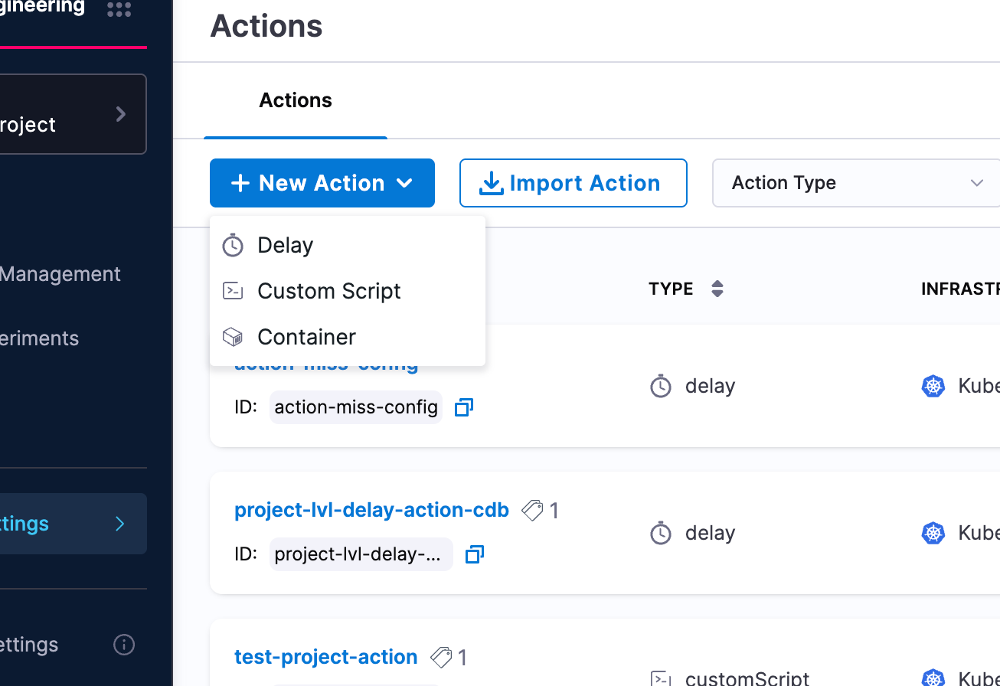
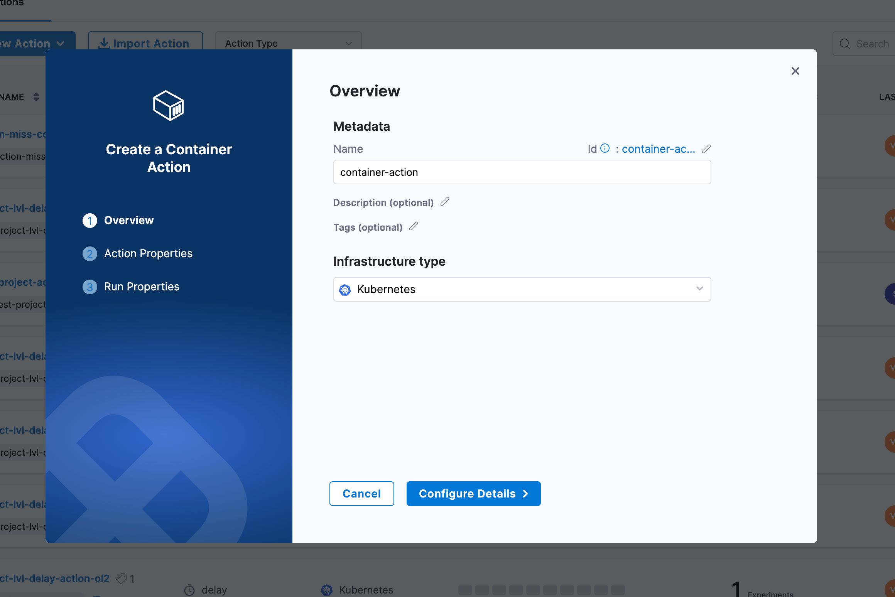
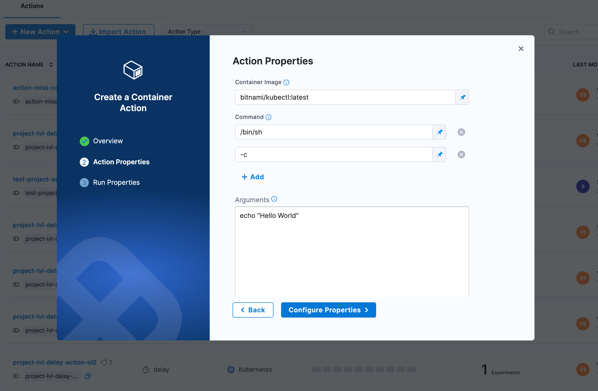
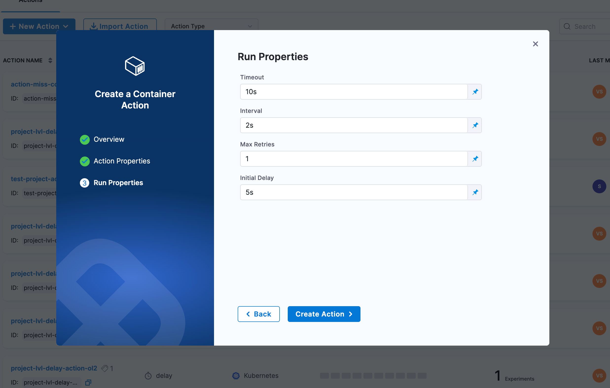

:::info Feature Availability
This feature is available under the `CHAOS_NG_EXPERIENCE` feature flag. For new onboardings, this feature is enabled by default. 

If you are an existing Harness Chaos customer and would like to access this feature, please contact your Harness support representative to have it enabled for your account.
:::

## What is a Container Action?

A **Container Action** allows you to execute commands inside a container during chaos experiment execution. This provides powerful capabilities to:

- Execute custom commands in containerized environments
- Perform application-specific operations during experiments
- Run validation or diagnostic commands
- Interact with containerized applications and services
- Implement custom setup or cleanup operations
- Execute scripts or binaries available in container images

## When to Use Container Actions

Container Actions are particularly valuable in the following scenarios:

### Application Validation
- **Health Checks**: Execute application-specific health check commands
- **State Verification**: Validate application state during chaos events
- **Data Validation**: Check data consistency within containers
- **Process Monitoring**: Verify that critical processes are running

### System Operations
- **Configuration Changes**: Apply configuration changes during experiments
- **Service Restarts**: Restart services or processes within containers
- **Cache Operations**: Clear caches or perform cache-related operations
- **Log Collection**: Gather application logs for analysis

### Environment Setup/Cleanup
- **Pre-experiment Setup**: Prepare the containerized environment before chaos
- **Post-experiment Cleanup**: Clean up resources after experiment completion
- **Test Data Management**: Set up or tear down test data
- **State Preparation**: Configure specific application states

### Diagnostic Operations
- **Network Diagnostics**: Run network connectivity tests from within containers
- **Resource Checks**: Monitor resource usage from inside containers
- **Dependency Validation**: Verify connectivity to dependent services
- **Performance Metrics**: Collect application-specific performance data

## How to configure a Container Action

### Step 1: Create a New Action

1. Navigate to your **Probes & Actions** and go to the **Actions** tab
2. Click **New Action** and select **Container** from the dropdown

### Step 2: Configure Metadata

Configure the following parameters for your container action:

- **Name**: Provide a descriptive name for the container action
- **Description** (optional): Add a description to explain the action's purpose
- **Tags** (optional): Add tags for better organization and filtering
- **Infrastructure Type**: Select the target infrastructure (Kubernetes)

### Step 3: Configure Action Properties

In the Action Properties section, configure the container and command details:

- **Container Image**: Specify the container image to use (e.g., `bitnami/kubectl:latest`, `busybox:latest`, `alpine:latest`)
- **Command**: Specify the command to execute inside the container as an array (e.g., `/bin/sh`, `-c`)
  - You can add multiple command arguments by clicking the **+ Add** button
- **Arguments**: Provide the actual command or script to execute (e.g., `echo "Hello World"`)
- **Environment Variables** (optional): Add environment variables as key-value pairs
  - Click **+ Add** to add new environment variables
- **Namespace**: Specify the Kubernetes namespace (default: `default`)
- **Image Pull Policy**: Define when to pull the image (`IfNotPresent`, `Always`, `Never`)

### Step 4: Configure Advanced Settings (Optional)

Configure advanced settings as needed:

#### Advanced Configuration
- **Service Account Name**: Kubernetes service account to use
- **Image Pull Secrets**: Secrets for private registries
- **Labels** and **Annotations**: Custom metadata for the action container
- **Node Selector**: Node selection constraints
- **Tolerations**: Allow scheduling on nodes with matching taints
- **Node Affinity**: Required or preferred node affinity rules
- **Resource Limits**: Set memory and CPU limits (e.g., `512Mi`, `500m`)
- **Resource Requests**: Set memory and CPU requests (e.g., `256Mi`, `100m`)

#### Volumes
- Add volumes to mount into the action container with volume name, mount path, and volume source

#### Volume Mounts
- Specify additional volume mounts with name, mount path, and optional sub path

#### Security Configuration
- **Host Network**, **HostPID**, **Host IPC**: Use host namespaces
- **Allow Privilege Escalation**: Allow gaining more privileges
- **Read Only Root Filesystem**: Mount root filesystem as read-only
- **Privileged**: Run in privileged mode
- **Run As Non Root**: Ensure non-root execution
- **Run as user** and **Run as group**: Specify user and group IDs
- **FS Group**: Filesystem group ID for volume ownership

### Step 5: Configure Run Properties

Configure the execution behavior:

- **Timeout**: Maximum time for action execution (e.g., `10s`)
- **Interval**: Time between successive executions (e.g., `2s`)
- **Max Retries**: Number of retry attempts (e.g., `1`)
- **Initial Delay**: Delay before first execution (e.g., `5s`)

### Step 6: Position the Action

Place the container action at the appropriate point in your experiment workflow:
- **Pre-experiment**: Setup or validation before chaos injection
- **Mid-experiment**: Operations or validation during chaos
- **Post-experiment**: Cleanup or final validation after chaos
- **Between Phases**: Transition logic between different experiment phases

## Next Steps

- [Learn about Delay Actions](./delay-action)
- [Learn about Custom Script Actions](./custom-script-action)
- [Explore experiment timeline view](/docs/chaos-engineering/guides/chaos-experiments/timeline-view-experiments)
- [Create experiments with actions](/docs/chaos-engineering/guides/chaos-experiments/create-experiments)
