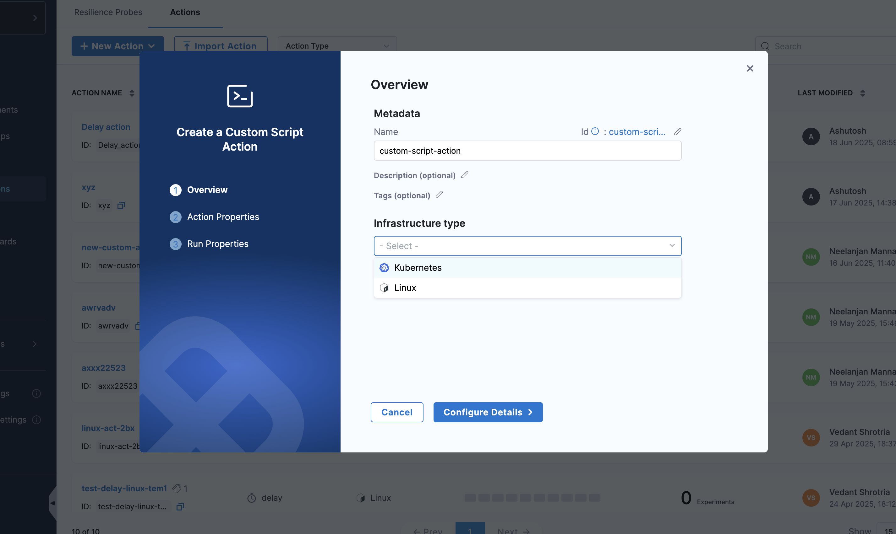
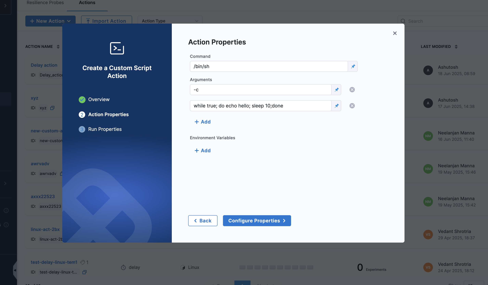

This topic describes the **Custom Script Action** and demonstrates how to use it to execute custom scripts during your chaos experiments.

## What is a Custom Script Action?

A **Custom Script Action** allows you to execute custom scripts or commands during chaos experiment execution. This provides powerful flexibility to:

- Run custom validation logic beyond standard probes
- Perform setup or cleanup operations specific to your environment
- Execute application-specific commands or API calls
- Integrate with external systems, tools, or monitoring platforms
- Implement complex business logic validation
- Perform data collection or analysis during experiments

## When to Use Custom Script Actions

Custom Script Actions are particularly valuable in the following scenarios:

### Custom Validation
- **Business Logic Validation**: Verify application-specific business rules
- **Data Integrity Checks**: Validate data consistency across systems
- **Performance Metrics**: Collect custom performance measurements
- **Complex Assertions**: Implement validation logic that goes beyond simple HTTP checks

### System Integration
- **External API Calls**: Interact with external services or APIs
- **Database Operations**: Perform database queries or validations
- **File System Operations**: Check file system state or perform file operations
- **Network Diagnostics**: Run custom network connectivity tests

### Environment Setup/Cleanup
- **Pre-experiment Setup**: Prepare the environment before chaos injection
- **Post-experiment Cleanup**: Clean up resources after experiment completion
- **State Preparation**: Set up specific system states required for the experiment
- **Resource Management**: Manage test data or temporary resources

### Monitoring and Alerting
- **Custom Metrics Collection**: Gather application-specific metrics
- **Alert Validation**: Verify that alerts are triggered correctly
- **Log Analysis**: Parse and analyze application logs
- **Dashboard Updates**: Update custom dashboards or reporting systems

## How to configure a Custom Script Action

### Step 1: Create a New Action

1. Navigate to your **Probes & Actions**  and go to the **Actions** tab
2. Click **New Action** and select **Custom Script** from the dropdown.

        

### Step 2: Configure Script Parameters

Configure the following parameters for your custom script action:

- **Action Name**: Provide a descriptive name for the custom script action
- **Infrastructure Type**: Select the target infrastructure (e.g., Kubernetes)

        

### Step 3: Configure Action Properties

In the Action Properties section, configure the script details:

- **Command**: Enter the command or script to execute (e.g., `/bin/sh`)
- **Arguments**: Add command arguments or script parameters
  - You can add multiple arguments by clicking the **Add** button
  - Each argument can be edited or removed using the edit/delete icons
- **Environment Variables**: Define environment variables needed by the script
  - Click **Add** to add new environment variables
  - Set key-value pairs for variables your script requires

        

### Step 4: Position the Action

Place the custom script action at the appropriate point in your experiment workflow:
- **Pre-experiment**: Setup or validation before chaos injection
- **Mid-experiment**: Validation or data collection during chaos
- **Post-experiment**: Cleanup or final validation after chaos
- **Between Phases**: Transition logic between different experiment phases

## Next Steps

- [Learn about Delay Actions](./delay-action)
- [Explore experiment timeline view](/docs/chaos-engineering/guides/chaos-experiments/timeline-view-experiments)
- [Create experiments with actions](/docs/chaos-engineering/guides/chaos-experiments/create-experiments)
- [Learn about Probes](/docs/chaos-engineering/guides/probes/)
