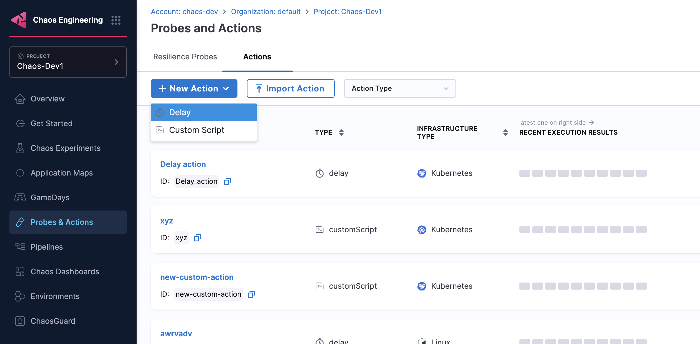
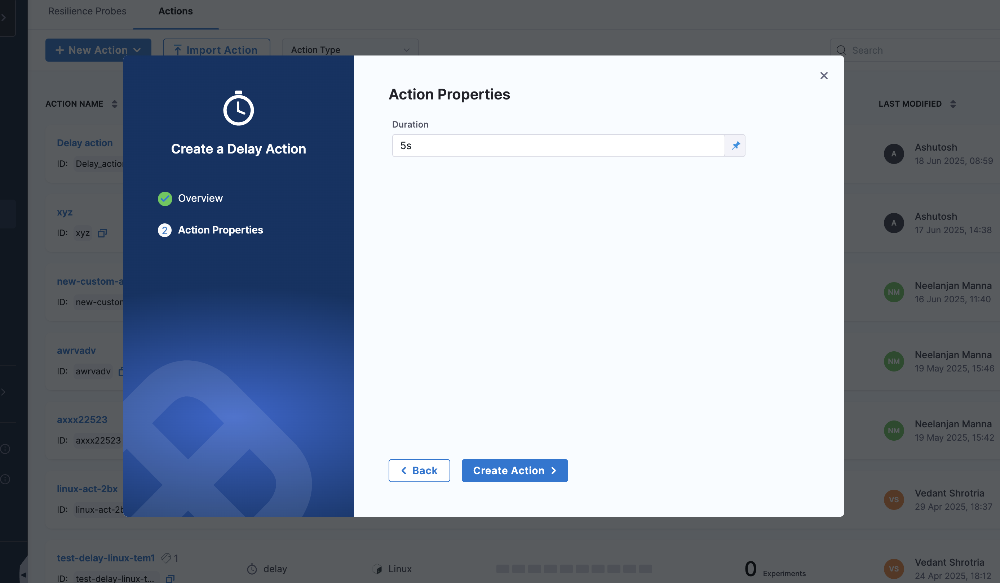

This topic describes the **Delay Action** and demonstrates how to use it to introduce time delays in your chaos experiments.

## What is a Delay Action?

A **Delay Action** introduces a configurable time delay during chaos experiment execution. It pauses the experiment workflow for a specified duration, allowing you to:

- Create time gaps between different experiment phases
- Allow systems to stabilize after fault injection
- Wait for monitoring systems to capture metrics
- Simulate real-world scenarios where operations require time
- Control the timing and pacing of experiment execution

## When to Use Delay Actions

Delay actions are particularly useful in the following scenarios:

### System Stabilization
- **After Fault Injection**: Allow time for systems to react to injected faults
- **Before Validation**: Wait for systems to reach a steady state before running probes
- **During Recovery**: Give systems time to recover from chaos events

### Monitoring and Observability
- **Metric Collection**: Allow monitoring systems to collect sufficient data points
- **Alert Processing**: Wait for alerting systems to detect and process anomalies
- **Dashboard Updates**: Give dashboards time to reflect system state changes

### Realistic Scenarios
- **Gradual Rollouts**: Simulate gradual deployment or rollback scenarios
- **User Behavior**: Model real-world user interaction patterns
- **System Dependencies**: Account for dependencies that have inherent delays

## How to configure a Delay Action

### Step 1: Create a New Action

1. Navigate to your **Probes & Actions**  and go to the **Actions** tab
2. Click **New Action** and select **Delay** from the dropdown.

        

### Step 2: Configure Delay Parameters

Configure the following parameters for your delay action:

- **Action Name**: Provide a descriptive name for the delay action (e.g., "Wait for system stabilization")
- **Infrastructure Type**: Select the target infrastructure (e.g., Kubernetes)

        

- **Duration**: Specify the delay duration

        

### Step 3: Position the Action

Place the delay action at the appropriate point in your experiment workflow:
- **Before Faults**: To prepare systems before chaos injection
- **Between Faults**: To create gaps between different fault injections
- **After Faults**: To allow systems to stabilize before validation

## Monitoring Delay Actions

### Timeline View
- View delay execution in the experiment timeline
- Track delay start and completion times
- Monitor overall experiment duration impact

### Execution Logs
- Review delay action logs for execution details
- Check for any issues during delay execution
- Validate that delays are executed as configured

## Common Patterns

### Progressive Delays
Use increasing delay durations for progressive fault injection:
```
Fault 1 → 30s delay → Fault 2 → 60s delay → Fault 3 → 90s delay
```

### Recovery Windows
Create recovery windows between fault phases:
```
Chaos Phase → 2min delay → Validation Phase → 1min delay → Cleanup Phase
```

### Monitoring Intervals
Align delays with monitoring collection intervals:
```
Fault Injection → 30s delay (metric scrape interval) → Probe Validation
```

## Next Steps

- [Learn about Custom Script Actions](./custom-script-action)
- [Explore experiment timeline view](/docs/chaos-engineering/guides/chaos-experiments/timeline-view-experiments)
- [Create experiments with actions](/docs/chaos-engineering/guides/chaos-experiments/create-experiments)
