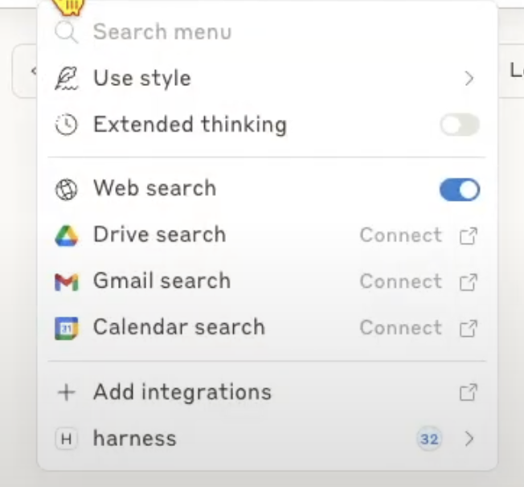
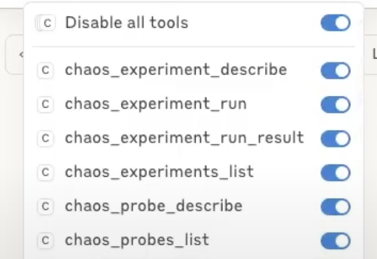

The Harness Chaos Engineering MCP (Model Context Protocol) tools enable users to test application resilience through natural language prompts in AI-powered IDEs and tools. This integration allows DevOps, QA, and SRE teams to discover, learn about, and execute chaos experiments with minimal learning curve across multiple platforms including Claude Desktop, Windsurf, Cursor, and VS Code.

## Video Tutorial

Here's a step-by-step guide on setting up and using the MCP tools:

<DocVideo src="https://www.youtube.com/embed/KMxntN_WXA4" />

## Installation & Configuration

:::info note
For a detailed guide on how to setup Harness MCP server, refer to [Harness MCP Server](/docs/platform/harness-aida/harness-mcp-server/) documentation.
:::

### Prerequisites

- Access to Harness Platform with Chaos Engineering enabled
- Claude Desktop (paid version) or other MCP-compatible AI tools
- Harness API key

### Step 1: Build the MCP Server Binary

1. Clone the [Harness MCP server repository](https://github.com/harness/mcp-server) from GitHub.
2. Build the binary from source code
3. Copy the binary to a directory accessible by Claude Desktop

### Step 2: Configure Claude Desktop

1. Create or modify the claude_desktop_config.json file
2. Add MCP server configuration:

```json
{
  "mcpServers": {
    "harness": {
      "command": "/path/to/harness-mcp-server",
      "args": [],
      "env": {
        "HARNESS_API_KEY": "your-api-key-here",
        "HARNESS_DEFAULT_ORG_ID": "your-org-id",
        "HARNESS_DEFAULT_PROJECT_ID": "your-project-id",
        "HARNESS_BASE_URL": "https://your-harness-instance.harness.io"
      }
    }
  }
}
```

3. Restart Claude Desktop

:::info Other AI Tools
For configuration with other MCP-compatible AI tools like **Windsurf**, **Cursor**, or **VS Code**, refer to the comprehensive [Harness MCP Server](/docs/platform/harness-aida/harness-mcp-server/) documentation which includes detailed setup instructions for all supported platforms.
:::

### Step 3: Verify Installation

1. Open Claude Desktop (or your configured AI tool)
2. Navigate to the Tools/MCP section
3. Verify Harness tools are available

    

4. Chaos-related tools will have "chaos" prefix

    

## Available MCP Tools

| Tool | Purpose | Example Use |
|------|---------|-------------|
| `chaos_experiments_list` | Discover available tests | Find all experiments for your service |
| `chaos_experiment_describe` | Deep dive into specifics | Understand what a test actually does |
| `chaos_experiment_run` | Execute resilience tests | Start testing with auto-configuration |
| `chaos_experiment_run_result` | Analyze outcomes | Get detailed resilience reports |
| `chaos_probe_describe` | Get probe details | Understand monitoring and validation |
| `chaos_probes_list` | List available probes | Discover monitoring capabilities |

## Usage Examples

Here are practical examples of how to interact with the Harness Chaos Engineering MCP tools using natural language:

### Discovery & Learning

**Service-specific experiment discovery:**
> "I am interested in catalog service resilience. Can you tell me what chaos experiments are available?"

*Output:* Filtered list of experiments specific to your service with categorization.

**Understanding experiment details:**
> "Describe briefly what a particular chaos experiment does?"

*Output:* Technical details, target services, expected outcomes, and business impact.

**Resilience scoring insights:**
> "Describe the resilience score calculation details of a specific chaos experiment?"

*Output:* Scoring methodology, performance metrics used, and interpretation guide.

### Execution & Monitoring

**Running targeted experiments:**
> "Can you run a specific experiment for me?"

*Output:* Automatic parameter detection, experiment execution, and monitoring setup.

**Structured experiment overview:**
> "Can you list the network chaos experiments and the corresponding services targeted? Tabulate if possible."

*Output:* Structured table showing experiments, target services, and current status.

**Probe discovery:**
> "Show me all available chaos probes and describe how they work"

*Output:* Complete probe catalog with monitoring capabilities and usage guidance.

### Analysis & Reporting

**Experiment result analysis:**
> "Summarise the result of a particular chaos experiment"

*Output:* Performance impact, resilience score, business implications, and recommendations.

**Probe configuration details:**
> "Describe the HTTP probe used in the catalog service experiment"

*Output:* Probe configuration, validation criteria, and monitoring setup details.

**Comprehensive resilience assessment:**
> "Scan the experiments that were run against particular service in the last one week and summarise the resilience posture for me."

*Output:* Comprehensive resilience report with trends and actionable insights.

## Next Steps

- Start by asking "What chaos experiments are available for my services?"
- Run your first experiment and analyze the results
- For detailed configuration with other AI tools, see [Harness MCP Server Documentation](/docs/platform/harness-aida/harness-mcp-server/)
