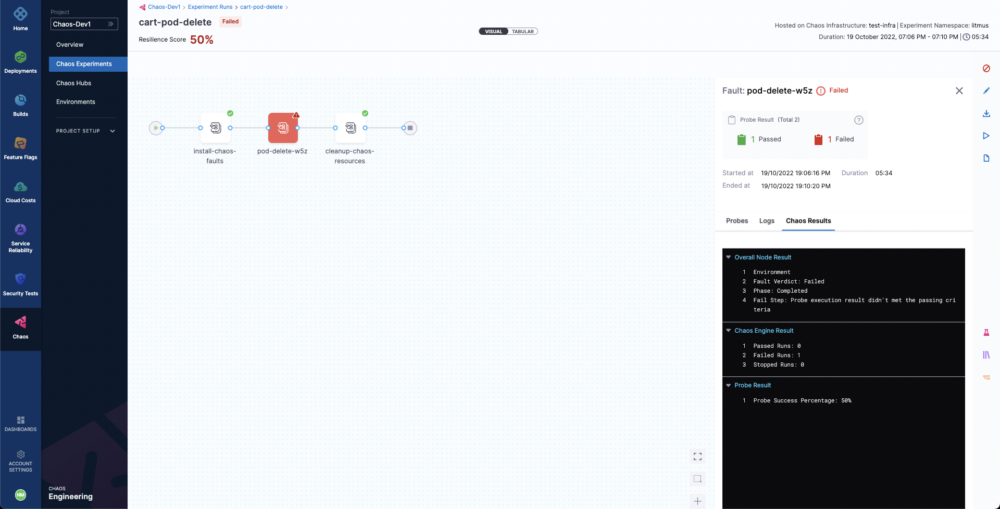

## Prerequisites

- [What is a Chaos Experiment?](/docs/chaos-engineering/guides/chaos-experiments/)
- [Chaos Experiments](/docs/chaos-engineering/guides/chaos-experiments/create-experiments)

## Add Serial and Parallel Faults
You can add multiple faults in a single chaos experiment that is scaled efficiently by Harness CE during execution.

:::tip
Consider the overall impact that these faults have on the application. Your experience in production environments may differ due to lack of resources when a number of parallel faults are being executed.
:::

1. To add a fault that runs in parallel to another fault, point your mouse below an existing fault, and then select **Add**. You can follow the same process to add a serial fault.

   

:::note
For Linux, experiments with a parallel fault are currently not supported.
:::

The image below shows a single experiment that consists of serial and parallel faults.
* Faults **A**, **B**, and **C** are parallel faults. They begin execution at the same time.
* Faults **A**, **B**, **C** and faults **D** and **E** are serial. **A**, **B**, and **C**  complete execution and then  **D** and **E** begin execution.
* Similarly, faults **H** and **I** are serial faults, where **H** completes execution, and **I** begins.

   

## Analyze Experiment
You can observe the status of execution of fault/s of a chaos experiment during its run. The screen shows the experiment pipeline on the right hand side, and details such as **Environment**, **Infrastructure Name**, and the runs that have passed and failed on the left hand side.

When the experiment completes execution, it displays the [**Resilience Score**](/docs/chaos-engineering/guides/chaos-experiments/#determine-the-resilience-of-target-environment-using-resilience-score). This score describes how resilient your application is to unplanned failures.
The **probe success percentage** helps determine the outcome of every fault in the chaos experiment. Probes (if any) associated with the experiment are used to understand how the application fared.

If any of the faults fail, you can find the **Fail Step** that elaborates on the reason why the fault failed.

## Next Steps

- [Advanced Configuration Settings](/docs/chaos-engineering/guides/chaos-experiments/advance-configuration-options)
- [Run or Schedule Experiment](/docs/chaos-engineering/guides/chaos-experiments/run-experiments)