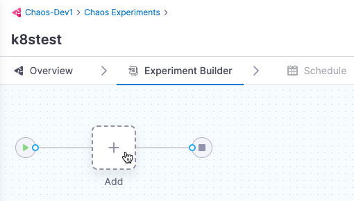
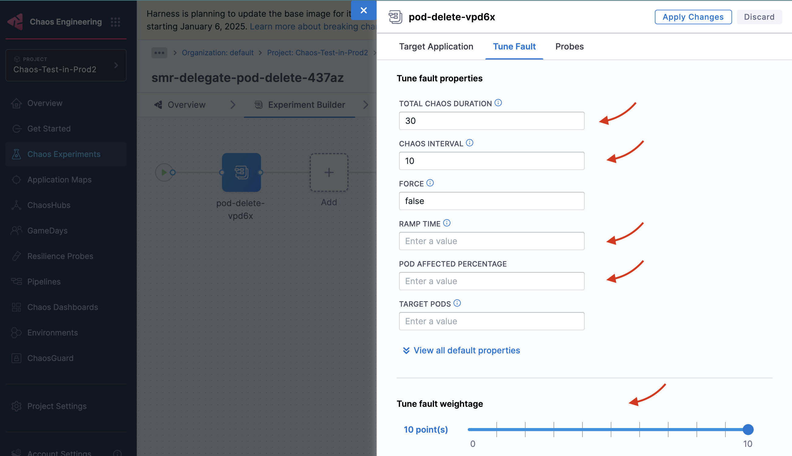

## Prerequisites

- [What is a chaos experiment?](/docs/chaos-engineering/key-concepts)
- [What are chaos faults?](/docs/chaos-engineering/guides/chaos-experiments/)
- [What are resilience probes?](/docs/chaos-engineering/guides/probes/)

## Steps to create an experiment

### Create Environment

Before you create an experiment, you need an environment where you have to [enable a chaos infrastructure](/docs/chaos-engineering/guides/infrastructures/).
Therefore, create an environment.

:::info note
To edit or delete the environment, select the **`⋮`** icon against the name of the environment.

	
:::

### Create an Infrastructure

After creating your environment, create an infrastructure within it. The chaos experiment is executed within this infrastructure. 

## Create Chaos Experiment

You can add one or more chaos faults to a chaos experiment and execute it.

Different ways of building a chaos experiment are described below.

* **[Blank Canvas](#using-blank-canvas)** - Lets you build the experiment from scratch, adding the specific faults you want.
* **[Templates from ChaosHubs](#using-templates-from-chaoshubs)** - Lets you preview and select and experiment from pre-curated experiment templates available in [ChaosHubs](/docs/chaos-engineering/guides/chaoshubs/).
* **[Upload YAML](#upload-yaml)** - Lets you upload an experiment manifest YAML file.

These options are explained below.

#### Using Blank Canvas

1. On the **Experiment Builder** tab, click **Add** to add a fault to the experiment.

	

2. Select the fault you want to add to the experiment.

	

3. For each fault, tune the properties. The properties will vary depending on the faults.

	* To tune each fault:

		* **Specify the target application (only for pod-level Kubernetes faults):** This allows the corresponding pods of the application to be targeted.

			- **App Namespace**: The namespace where your application/services is housed. This is where chaos is injected.

			- **App Kind** or **App Label**: Choose between the type of application or the label associated with it. 
				- **App Kind**: This describes the type of your target application. Choose between "deployment", "statefulset", "daemonset", "deploymentconfig" or "rollout".
				- **App Label**: Label associated with the target service. For example, "nginx" app can have the label as "app=nginx". 

					

		* **Tune fault parameters:** Each fault has a set of common parameters, like **chaos duration** and **ramp time**, and unique parameters that you can customize as needed.

		* **Tune Fault Weightage**: Set the weight for the fault, which determines its importance relative to other faults in the experiment. This weight is used to calculate the experiment's resilience score.

			

		* **Add chaos probes:** On the **Probes** tab, add [resilience probes](/docs/chaos-engineering/guides/probes/use-probe) to automate the chaos hypothesis checks for a fault during the experiment execution. Probes are declarative checks that validate specific criteria, that help determine if an experiment **passed**.

			

		* You can configure [Advanced Settings](/docs/chaos-engineering/guides/chaos-experiments/advance-configuration-options) if required.
#### Using Templates from ChaosHubs

1. Select an experiment template from a [ChaosHub](/docs/chaos-engineering/guides/chaoshubs/add-chaos-hub).

	* Choose **Experiment Type** to see the available ChaosHubs.
	* Select a template to preview the faults included.

		

:::info note
You can edit the template to add more faults or update the existing faults.
:::

#### Upload YAML

1. Upload an experiment manifest YAML file to create the experiment.

:::info note
You can edit the experiment to update the existing faults or add more.
:::

After constructing the chaos experiment using one of the three options, save the experiment.

	

	* Click **Save** to save the experiment to the Chaos Experiments page. You can add it to a [ChaosHub](/docs/chaos-engineering/guides/chaoshubs/add-chaos-hub) later.
	* Select **Add Experiment to ChaosHub** to save this experiment as a template in a selected [ChaosHub](/docs/chaos-engineering/guides/chaoshubs/add-chaos-hub).

## Create Experiment as a Pipeline

1. Go to **Chaos** module and select **Pipelines** and click **+Create a Pipeline**.

	

2. Provide a name, and click **Start**.

	

3. Click the **+** (the stage type), and select **Custom Stage**.

	

4. Provide a name for the stage, and click **Set Up Stage**.

	

5. Click **Add Step** and choose the **Add Step** option.

	

6. Choose **Chaos** from the Step Library.

	

7. Provide a name, select the chaos experiment.

	

8. Choose from the list of chaos experiments, and click **Add to Pipeline**.

	

9. Click **Apply Changes**.

	

10. Click **Save**.

	

For more information, go to [Pipeline concepts](/docs/continuous-integration/get-started/key-concepts) and [Pipeline Modeling Overview](/docs/continuous-delivery/get-started/cd-pipeline-modeling-overview).

## Next Steps

- [Advanced Configurations](/docs/chaos-engineering/guides/chaos-experiments/advance-configuration-options)
- [Edit or Update Experiment](/docs/chaos-engineering/guides/chaos-experiments/edit-chaos-experiment)