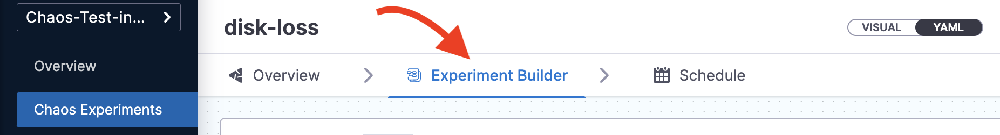
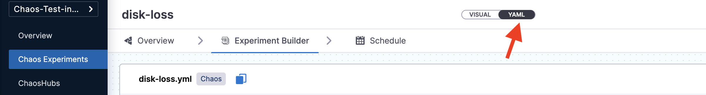
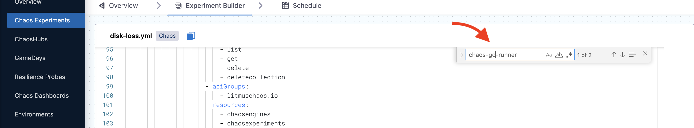

You can edit an existing chaos experiment to update the experiment's metadata, faults, schedule, etc. This section describes three actions:
1. [Edit an experiment](#edit-a-chaos-experiment)
2. [Update old experiment manifests](#update-old-experiment-manifests)
3. [Bulk update CRON schedules](#bulk-update-cron-schedules)

## Edit a Chaos Experiment

1. On the **Chaos Experiments** page, select the **`⋮`** icon against the name of the experiment you want to edit and select **Edit Experiment**.

    

2. You can either update the changes to the same experiment and save it or create a copy of the experiment and then apply the changes to it.

    

## Update Old Experiment Manifests

When you upgrade the chaos infrastructure, you also need to update the images in the experiment manifest (YAML file) corresponding to the updated chaos infrastructure. The upgraded images should match the images in the Enterprise ChaosHub.

When you create a new experiment, the images in the experiment manifest are configured to match the images in the Enterprise ChaosHub.

**What image versions to use?**

To determine the latest version of images, navigate to Enterprise Chaos Hub, and search for **chaos-go-runner**. The value associated with **chaos-go-runner** in the manifest in Enterprise Chaos Hub is the latest version.

To update the experiment manifest, follow the steps below.

1. Select the experiment whose manifest you wish to update, and click the **Experiment Builder** tab.

    

2. The **VISUAL** is usually displayed, click the **YAML** to edit it. Click **Edit Yaml**.

    

    

3. Find **chaos-go-runner** in the manifest and replace the corresponding version with the latest version.

    

4. Once you update the images, click **Save** at the top right.

    

## Bulk Update CRON Schedules

You can update multiple CRON-scheduled chaos experiments at once. 

One important aspect is that you can **bulk update** multiple CRON schedules to a **single value**, that is, the CRON schedules you select to update will all update to a single common value. 

You **can't** map different CRON schedules to their respective values while performing a bulk update.
You can:
1. Bulk disable active schedules
2. Bulk enable inactive CRON schedules
3. Bulk stop running experiments

To reschedule/enable/disable a CRON schedule, 

1. Go to **Chaos Experiments** and select the experiments you wish to change.

2. Choose one of the following options:
    1. **Reschedule CRON**
    2. **Enable CRON**
    3. **Disable CRON**

        

3. Based on the option you chose,
    - Reschedule CRON: You can change the schedule of the experiments by changing the values, and click **Confirm**.
    - Enable CRON or Disable CRON
        - Select one of the options (enable CRON or disable CRON), and click **Confirm**.
        - You will see a confirmation message on your screen about the updated schedule. Click **Close**.

:::info note
You can bulk update (reschedule or enable/disable) not more than 20 experiments in one go.
:::

## Next Steps

- [Alerts for Experiments](/docs/chaos-engineering/guides/chaos-experiments/alert-integration)
- [Runtime Variable Support for Experiments](/docs/chaos-engineering/guides/chaos-experiments/fault-template)