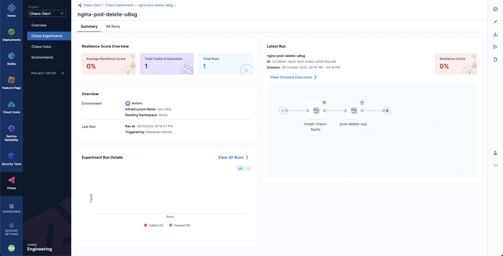
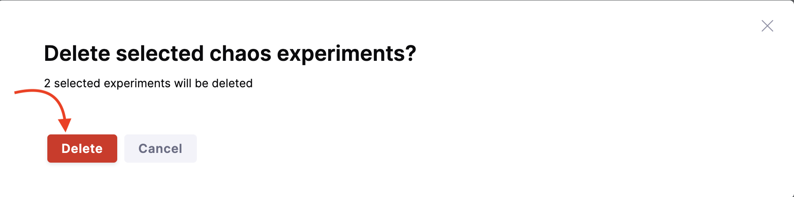

This topic describes how to halt an experiment and how to delete an experiment. 

## Prerequisites
- [Create Experiment](/docs/chaos-engineering/guides/chaos-experiments/create-experiments)
- [Run or Schedule Experiment](/docs/chaos-engineering/guides/chaos-experiments/run-experiments)
- [Edit or Update Experiment](/docs/chaos-engineering/guides/chaos-experiments/edit-chaos-experiment)

Halting the execution of a chaos experiment protects target applications from any unwanted and unforeseen consequences by immediately stopping the experiment and reverting the target resources to their initial state.

Halting a cron experiment disables it, preventing it from executing according to its cron schedule in the future.

## Halt an Experiment

1. To halt an experiment execution, select its name from the list of experiments on the **Chaos Experiments** page. Click the `🚫` icon. The experiment's status will update to `Stopped`.

	

2. If you need to halt multiple experiments simultaneously, go to the **Chaos Experiments** page and click **Stop All Experiments**. This will stop all currently executing experiments.

	

## Delete an Experiment
Deleting an experiment removes it from the **Chaos Experiments** list under the **Chaos** tab.
Deleting an experiment that is currently running will not only stop it immediately but also permanently remove it. To delete an experiment, click the **`⋮`** icon next to the experiment name and select **Delete Experiment**.

	

:::info note
- Deleting an initialized or completed experiment will permanently remove it.
- Deleting a running experiment will both stop the execution and permanently remove the experiment.
- Deleting an experiment does not delete any templates created from that experiment.
:::

### Delete Multiple Experiments

- You can delete multiple experiments by selecting it from the **Chaos Experiments** page and clicking the **Delete** button. 

	

- Confirm by clicking **Delete**.

	

## Next Steps

- [Alerts for Experiments](/docs/chaos-engineering/guides/chaos-experiments/alert-integration)
- [Runtime Variable Support for Experiments](/docs/chaos-engineering/guides/chaos-experiments/fault-template)