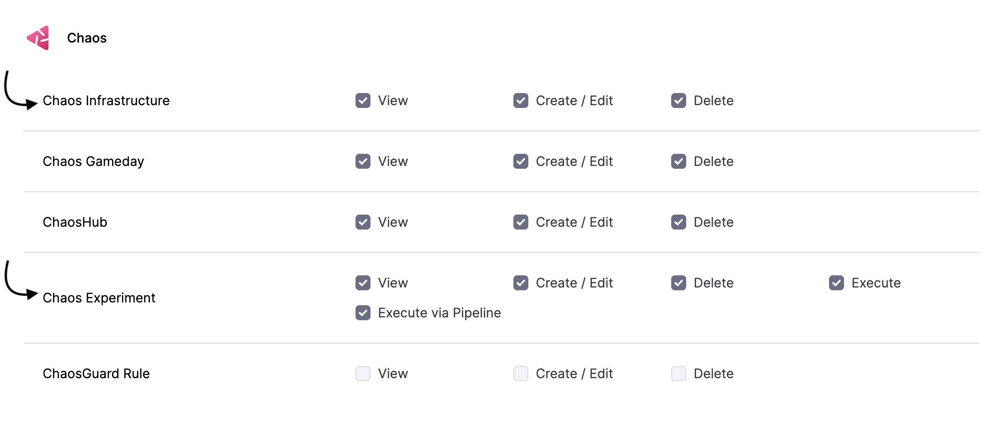
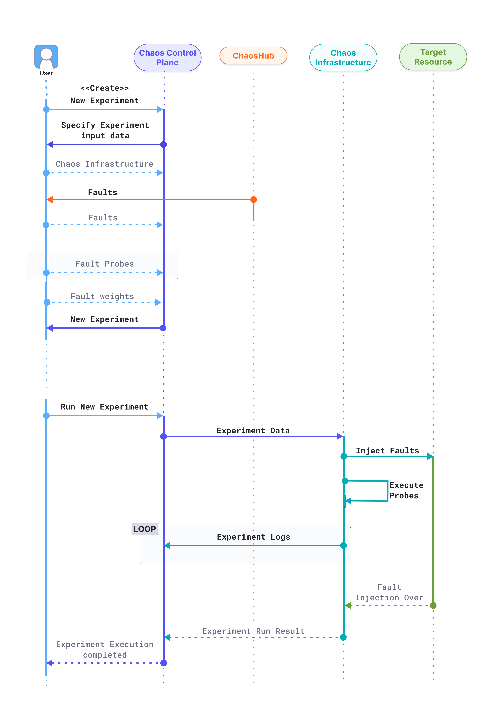

This topic describes chaos experiments, why it is required, the permissions required to execute a chaos experiment, and how the resilience score is determined based on the chaos experiment's execution.

## Prerequisites

Before creating a chaos experiment, [create an environment](/docs/chaos-engineering/guides/chaos-experiments/create-experiments#create-environment) and [enable a chaos infrastructure](/docs/chaos-engineering/guides/infrastructures/types/). This is because a chaos experiment is executed on an infrastructure which is in turn housed in an environment.

## Introduction
Harness Chaos Engineering gives you the flexibility to create elaborate chaos experiments that help create complex, real-life failure scenarios against which you can validate your applications.

An experiment is created in an infrastructure, and an infrastructure is installed within an environment. 
An environment represents your deployment scenario, wherein each environment may contain multiple chaos infrastructures. It helps isolate the various environments that the engineering, product owners, QA, and automation teams use under a single Harness project. 

## What is a Chaos Experiment?
A **chaos experiment** consists of chaos faults arranged in a specific order to create a failure scenario. The chaos faults target various aspects of an application, including the constituent microservices and underlying infrastructure. Tune the parameters associated with these faults to impart the desired chaos behavior.

You can define the experiment using the Chaos Studio, that helps create new experiments using the guided UI.

When an experiment fails, the failed step specifies the exact cause of failure for the experiment run. It contains an error code for the classification of the error, a phase to specify the execution phase during which the error occurred, and a user-friendly description of the error.

Go to [Key Concepts](/docs/chaos-engineering/key-concepts) to understand the flow of control when a chaos experiment is executed.

## Permissions Required

Chaos experiments are executed in a chaos infrastructure, hence you need to have access to **create/edit** and **view** the **chaos infrastructure**. Go to **Project Settings** -> **Access Control** -> **Roles** and create a new role or ask your project admin to create an appropriate role.

## Flow of Control

The diagram below describes the flow of control when a chaos experiment is executed.

	

**1. Initiating a Chaos Experiment**
- You (the user) begin by creating a new chaos experiment in the **Chaos Control Plane**.
- The Control Plane prompts the user to provide key details required for configuring the experiment:

  - **Chaos Infrastructure:** Define the infrastructure where the experiment will be executed.
  - **Faults and Tunables:** Configure tunables as required. Multiple faults can be added in any order.
  - **Fault Probes:** Include probes beyond the default health check probe to validate specific hypotheses.
  - **Fault Weights:** Assign weights to faults to indicate their impact relative to others. These weights help determine the experiment's [**resilience score**](/docs/chaos-engineering/guides/chaos-experiments/), a quantitative measure of system robustness.

- Once all required inputs are provided, the experiment is created and ready for execution.

**2. Executing the Chaos Experiment**
- When the experiment is run, the **Chaos Control Plane** sends the experiment details to the target **chaos infrastructure**.
- The infrastructure manages four key responsibilities during execution:

  - **Fault Injection:** It interprets and injects the specified faults into the target resources. Depending on the experiment setup, multiple faults can be injected concurrently.
  - **Probe Execution:** As faults are injected, the infrastructure runs the corresponding fault probes and records their results.
  - **Log Streaming:** Real-time execution logs are continuously streamed and can be accessed in the **Chaos Control Plane** for monitoring and troubleshooting.
  - **Result Transmission:** Once the experiment concludes, the infrastructure sends back execution results, including probe outcomes, to the Control Plane.

## Experiment Status

Experiment status describes the overall status of the experiment that depends on the status of the probe and the fault. The experiment status in a chaos experiment can be in 7 different states.

	- **Completed**: The fault and the probes associated with every fault were completed successfully.
	- **Completed with Error**: All the faults complete execution, and none of them show **error** status, but one of them may show **Completed with error** if the probe associated with the fault fails.
	- **Error**: If one of the faults or steps in the experiment results in an **error**, the experiment corresponds to being in an **error** state.
	- **Running**: Once the task (or experiment) is picked up by the infrastructure subscriber (pod), it goes to **running** state.
	- **Timeout**: If the task is in the queue, but not picked up by the subscriber for execution within a specific duration, the task times out.
	- **Queued**: An experiment goes to the **queued** state before it is executed, that is when the task (or experiment) has not been picked up by the infrastructure subscriber (pod) yet. At this point, the task is placed in the queue and is waiting to be picked.
	- **Stopped**: If an experiment was stopped by the user, the fault that was being executed then also stops (this results in the fault status being **stopped**). The subsequent faults associated with the experiment don't get executed either.

### Chaos Rollback

Chaos rollback ensures that all target resources in an experiment return to their steady state after the experiment concludes, maintaining the safety of all applications deployed on your machine.

	- Chaos rollback occurs automatically at the end of each experiment. If an on-the-fly experiment is aborted, the chaos is safely reverted.
	- If a network disruption occurs between the Control Plane and Execution Plane during the experiment, the experiment is gracefully aborted, and the chaos is reverted.
	- If the chaos infrastructure process exits abruptly during an experiment, the daemon service reverts the chaos before restarting the process.
	- In the event of an abrupt machine reboot, the daemon service checks for and reverts any inconsistencies from the prior chaos execution before starting the chaos infrastructure process.
	- In the rare scenario where the chaos rollback itself encounters an error, an appropriate error message is logged in the experiment log, prompting the user for manual intervention.

The diagram below describes the flow of control in a chaos experiment.

## Determine Resilience

The **resilience score** is a quantitative measure of how resilient the target application is to a chaos experiment. It is determined by executing a chaos experiment.

The score is calculated based on:

* The weight you give each fault in the experiment.
* The success rate of the probes in each fault.

### Fault Weight

While creating a chaos experiment, you can assign a weight between 1 - 10 to each fault. This represents the priority/importance of the respective fault. The higher the weight, the more significant the fault is.

For example:

- Low Priority: 0 - 3
- Medium Priority: 4 - 6
- High Priority: 7 - 10

### Probe Success Percentage

The **probe success percentage** for a fault is the ratio of successful probes to total probes. For example, if a fault has 4 probes and only 2 of them are successful, then the probe success percentage for this fault is 50%.

### Resilience Calculation

Based on fault weights and probe success rates, you can calculate two types of resilience score (represented as a percentage):

* **Fault resilience** = fault weight * probe success percentage 
* **Experiment resilience** = sum of all fault resilience / sum of all fault weights of the experiments

Below is an example:
**Experiment A** runs, and includes 3 faults. Fault weights, number of probes, and probe success rates are as follows.

   | Fault | Weight | Number of probes | Probes succeeded | Fault resilience |
   |:----:|:---:|:---:|:-------:|:-------:|
   | Fault1 | 2 | 1 | 0 (or 0%) | 0%    |
   | Fault2 | 4 | 2 | 2 (or 100%) | 400%  |
   | Fault3 | 8 | 4 | 3 (or 75%) | 600%   |
   |        | **Sum: 14** |  |    | **Sum: 1000%**   |
 

**Experiment A's total resilience score**

   Divide the sum of all fault resilience by the sum of all fault weights:

   **1000% / 14 = 71%**

## Next Steps

- [Create Experiment](/docs/chaos-engineering/guides/chaos-experiments/create-experiments)
- [Edit Experiments](/docs/chaos-engineering/guides/chaos-experiments/edit-chaos-experiment)
- [Run Experiments](/docs/chaos-engineering/guides/chaos-experiments/run-experiments)
- [Alerts for Experiments](/docs/chaos-engineering/guides/chaos-experiments/alert-integration)
- [Runtime Variable Support in Experiments](/docs/chaos-engineering/guides/chaos-experiments/fault-template)

