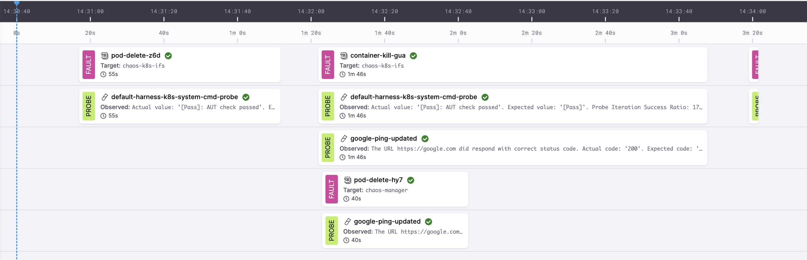
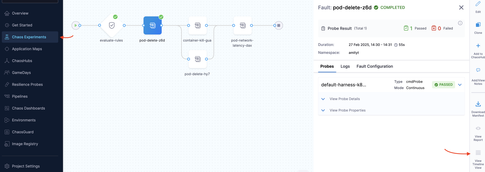
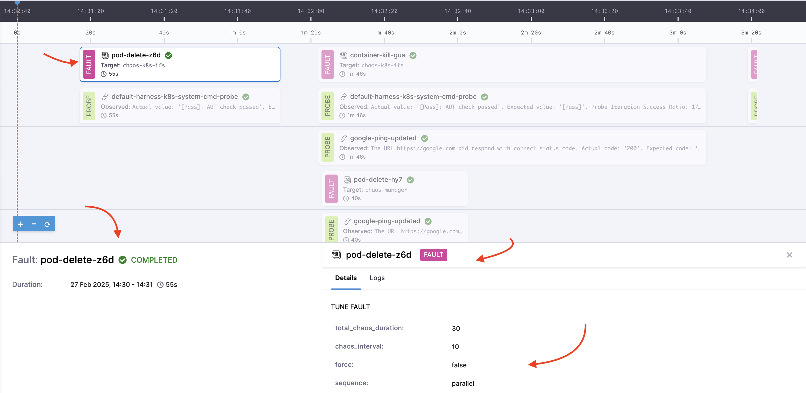
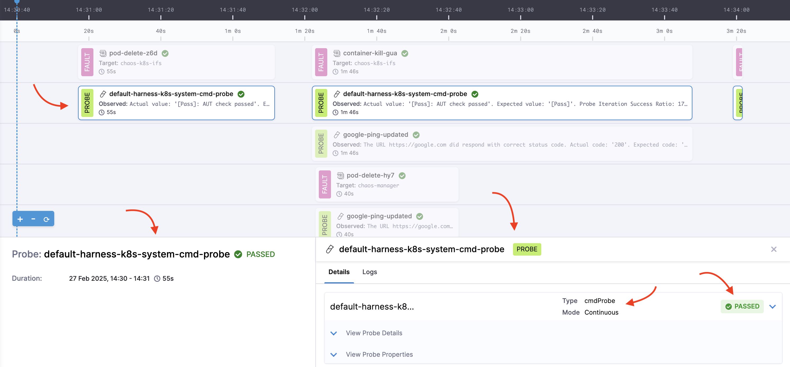

This topic introduces **Timeline View** and demonstrates how you can use it to visually analyze and track the progress of your chaos experiments.

:::info New Chaos Studio Feature
**Timeline View** are part of the enhanced **New Chaos Studio** experience. If you're an existing customer and want access to new features, contact your Harness support representative. For more details, see [New Chaos Studio Features](/docs/chaos-engineering#new-chaos-studio-features).
:::

## What is Timeline View?
**Timeline View** provides a visual representation of all events associated with a **chaos experiment** during execution. It displays each event with their respective **timestamps**. 
For example, if a chaos experiment has a resilience probe configured, the timeline view displays it and the time when the probe execution began.

In the diagram below, you can see pod delete fault and its probe running serially with container kill and pod delete faults (along with their respective probes) running in parallel in the timeline view.

	

The steps outlined below describe the process that occurs from the moment a chaos experiment begins execution until its completion.

- **Step 1:** Chaos injection starts → Begin event logging on the timeline along with timestamp.
- **Step 2:** Probe validation runs → Continue logging.
- **Step 3:** Pod deletion executes → Event appears with metadata.
- **Step 4:** Rollback/Cleanup occurs → Logged with metadata.
- **Step 5:** Experiment completes → Entire sequence available for review.

## Benefits of Timeline View

- **Enhanced Visibility** – Provides a clear chronological view of all experiment-related actions
- **Accurate Debugging** – Easily identify when and where failures occurred during the experiment
- **Event Metadata Access** – Click on events to reveal detailed execution information
- **Real-time Monitoring** – Track experiment progress as it happens
- **Better Analysis** – Understand the effects of chaos faults and probes over time

## How Does Timeline View Work?

Clicking on an event displays the metadata, providing insights such as configuration, parameters provided, status of the experiment/fault (if the execution is complete), logs, and so on helping you track the precise execution flow of the experiment.

1. **Start a Chaos Experiment** – When an experiment begins, Timeline View starts recording events.
2. **Events are Logged with Timestamps** – Each action (for example, chaos injection, probe execution, result) appears on the timeline.
3. **Click on an Event to View Metadata** – Selecting an event displays additional details like:
   - **Event type** (for example, fault injection, probe validation, rollback)
   - **Start and end time**
   - **Execution result (Success/Failure)**
   - **Additional metadata** (logs, system status, error details)
4. **Monitor the Experiment Flow** – The timeline continuously updates in real-time, providing an ongoing overview of the experiment's progress.
5. **Analyze the Experiment Outcome** – Once the experiment completes, use the timeline to review and analyze the execution details.

## How to Access Timeline View

1. Select the experiment you want to run or create one, and click **Run**.
2. Once the experiment begins execution, you can see the **View Timeline** option on the screen. 

	

- Clicking the experiment gives the experiment name, tunables, and status of the experiment.

	

- Clicking the probe gives the details, logs, and status of the probe.
	
	

## Next Steps

- [Create and run chaos experiments](./create-experiments)
- [Learn about Probes](/docs/chaos-engineering/guides/probes/)
- [Explore Actions](/docs/chaos-engineering/guides/actions/)
