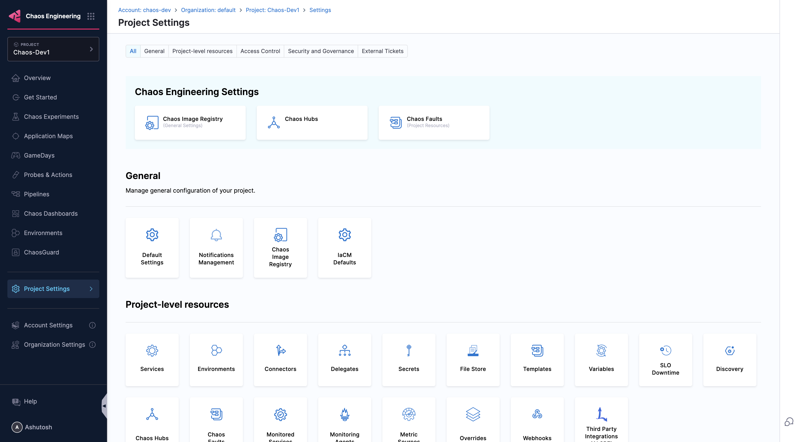
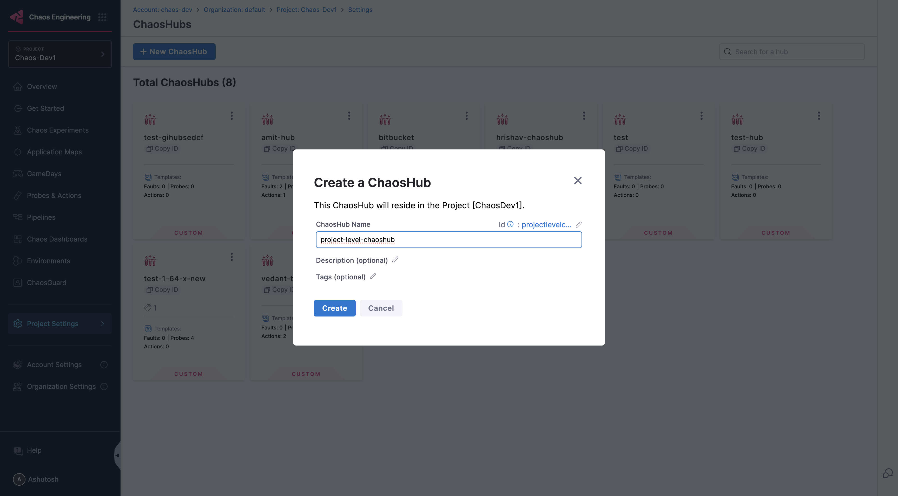

## Chaos Hub Scopes

Harness Chaos supports Chaos Hubs at different organizational scopes, allowing you to manage and share chaos experiments and faults at various levels within your organization. This hierarchical approach provides flexibility in organizing and controlling access to your chaos engineering resources.

:::info Feature Availability
This feature is available under the `CHAOS_NG_EXPERIENCE` feature flag. For new onboardings, this feature is enabled by default. 

If you are an existing Harness Chaos customer and would like to access this feature, please contact your Harness support representative to have it enabled for your account.
:::

### Different available Scopes

Chaos Hubs can be configured at three different scopes:

#### 1. Project Level Chaos Hub

**Scope**: Limited to a specific project within an organization
**Access**: Available only to users within that particular project
**Use Cases**:
- Project-specific experiments and faults
- Team-focused chaos engineering scenarios
- Isolated testing environments
- Custom experiments tailored to specific applications or services

**Benefits**:
- **Isolation**: Experiments are contained within the project boundary
- **Focused Management**: Easier to manage project-specific chaos scenarios
- **Team Autonomy**: Project teams can maintain their own chaos experiments
- **Reduced Complexity**: Smaller scope makes it easier to organize and find relevant experiments

#### 2. Account Level Chaos Hub

**Scope**: Available across all projects within a specific Harness account
**Access**: Accessible to all users within the account (subject to RBAC permissions)
**Use Cases**:
- Cross-project standardized experiments
- Common infrastructure chaos scenarios
- Shared best practices across teams
- Organization-wide chaos engineering templates

**Benefits**:
- **Standardization**: Promote consistent chaos engineering practices across projects
- **Resource Sharing**: Avoid duplication of common experiments across projects
- **Centralized Management**: Single point of control for organization-wide chaos scenarios
- **Knowledge Sharing**: Teams can learn from and build upon each other's experiments

#### 3. Organization Level Chaos Hub

**Scope**: Available across all accounts within a Harness organization
**Access**: Accessible to all users across the entire organization (subject to RBAC permissions)
**Use Cases**:
- Enterprise-wide chaos engineering standards
- Global infrastructure resilience testing
- Cross-account shared experiments
- Corporate governance and compliance scenarios

**Benefits**:
- **Enterprise Governance**: Maintain organization-wide chaos engineering standards
- **Maximum Reusability**: Share experiments across all accounts and projects
- **Global Visibility**: Centralized view of all chaos engineering activities
- **Compliance**: Ensure consistent security and compliance practices

### Scope Hierarchy and Inheritance

The Chaos Hub scopes follow a hierarchical structure:

```
Organization Level (Global)
    ↓
Account Level (Cross-project)
    ↓
Project Level (Team-specific)
```

**Access Pattern**:
- Users at the **Project level** can access: Project-level + Account-level + Organization-level Chaos Hubs
- Users at the **Account level** can access: Account-level + Organization-level Chaos Hubs
- Users at the **Organization level** can access: Organization-level Chaos Hubs

### Choosing the Right Scope

Consider the following factors when deciding on the appropriate scope for your Chaos Hub:

| Factor | Project Level | Account Level | Organization Level |
|--------|---------------|---------------|-------------------|
| **Audience** | Single team/project | Multiple teams in account | Enterprise-wide |
| **Maintenance** | Team responsibility | Account admins | Organization admins |
| **Standardization** | Team-specific | Account-wide | Enterprise-wide |
| **Governance** | Minimal | Moderate | High |
| **Reusability** | Limited | Moderate | Maximum |
| **Complexity** | Low | Medium | High |

### Managing Chaos Hub Scopes

#### Setting Up Scoped Chaos Hubs

1. **Navigate to Chaos Hubs**: Go to the Chaos Engineering module and choose the scope you want to create a Chaos Hub for.

    

2. **Create a Chaos Hub**: Click on the **Chaos Hubs**, then click on **New Chaos Hub**, Enter the name of your Chaos Hub and click **Create**

    

#### Access Control

Chaos Hub access is controlled through Harness RBAC (Role-Based Access Control):

- **Project Level**: Requires project-level permissions
- **Account Level**: Requires account-level permissions  
- **Organization Level**: Requires organization-level permissions

### Next Steps

- [Add a Chaos Hub](./add-chaos-hub) - Learn how to connect a new Chaos Hub
- [Manage Chaos Hub](./manage-hub) - Understand how to manage existing Chaos Hubs
- [Chaos Hub Overview](/docs/chaos-engineering/guides/chaoshubs/) - Get an overview of Chaos Hub concepts

:::tip
Start with Project-level Chaos Hubs for team-specific experiments, then gradually move to Account or Organization level as your chaos engineering practices mature and standardize.
:::
