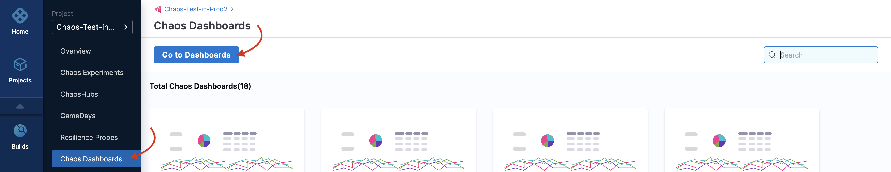
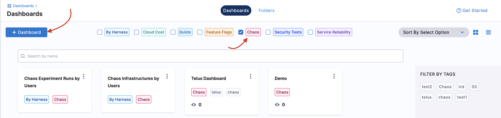
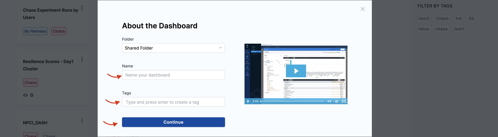
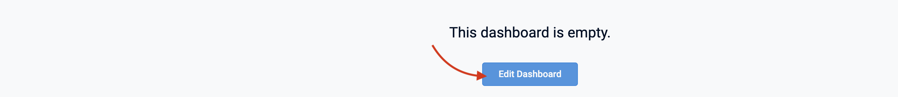
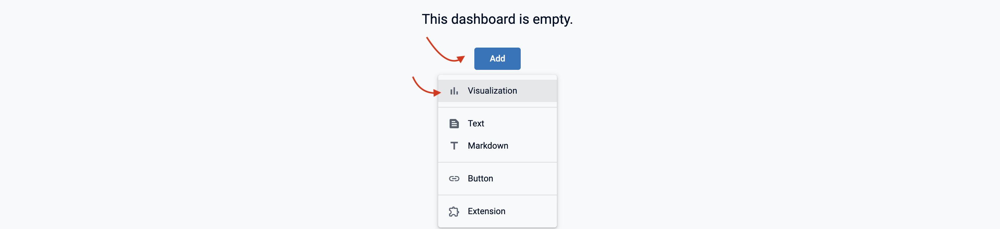
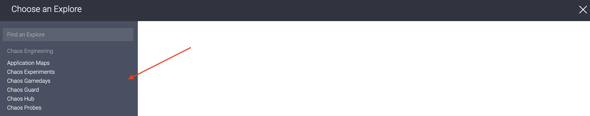
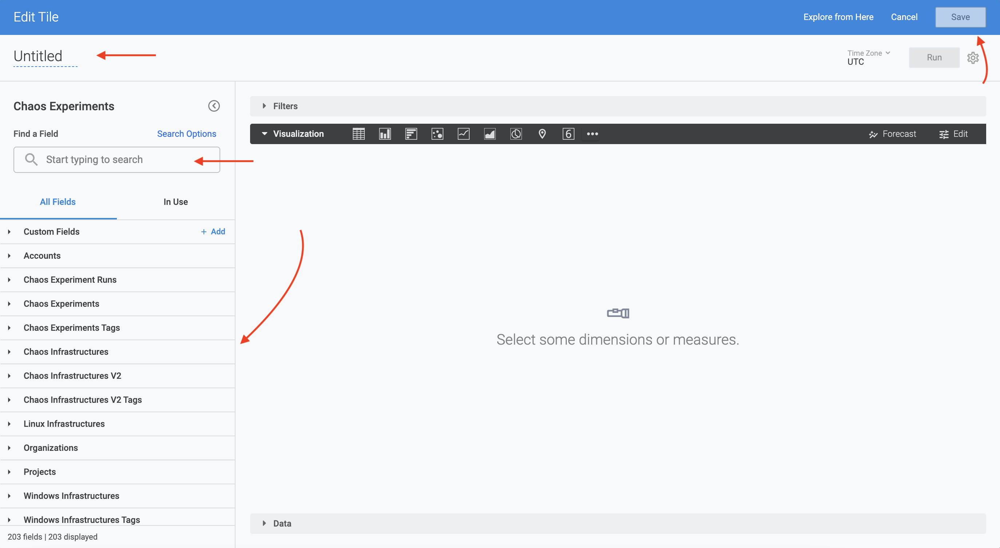
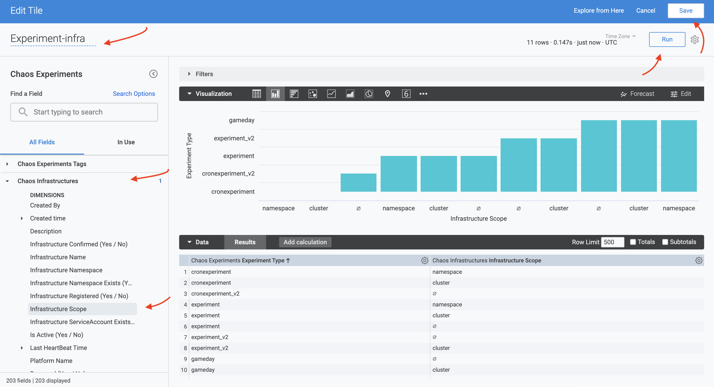
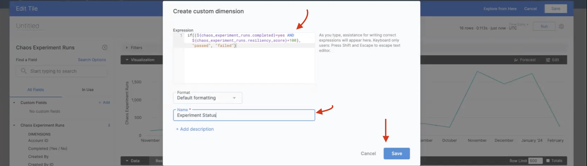

This section will guide you through creating a new chaos dashboard, and creating custom visualizations for various entities of a chaos experiment.

## Before you begin, review the following

- [Chaos Engineering Overview](/docs/chaos-engineering/overview)
- [View Chaos dashboards](/docs/chaos-engineering/guides/dashboards/view-dashboard)

## Create a new visualization

1. To create a new dashboard, navigate to **Chaos Dashboards** and select **Go to Dashboards**.

    

2. Filter by **chaos** dashboards, and click **+ Dashboard** .

    

3. Add values for **Folder**, **Name**, and **Tags** (mandatory). The **Tags** field is used to filter dashboard by modules, hence it is necessary to provide relevant tags. Click **Continue**.

    

4.  This creates an empty dashboard. You can add visualizations (also known as **panels**) by editing this dashboard. Click **Edit Dashboard** to edit the dashboard that you created in the previous step.

	

5. Click **Add** and select **Visualization**.

	

6. Select a table whose fields you wish to visualize. Harness CE currently supports **Application Maps**, **Chaos Experiments**, **Chaos GameDays**, **Chaos Guard**, **Chaos Hub**, and ** **Chaos Probes**. In this example, select **Chaos Experiments**.

    

7. This will display a left bar with different fields. Provide a name for the tile. Search for the field of your choice or select two from the list.

    

8. In this example, select **Experiment Type** from **Chaos Experiments** field and **Infrastructure Scope** from **Chaos Infrastructures** field. Click **Run**. This displays the visualization of the **Infrastructure Scope** versus **Experiment Type**. To save the results, click **Save**.

    

## Customize Fields

To create the query to customize the field, use [lookML](https://cloud.google.com/looker/docs/what-is-lookml) query. Provide a name and click **Save**.

    

## Next steps

* [Best practices to build effective dashboards](/docs/platform/dashboards/dashboard-best-practices.md)