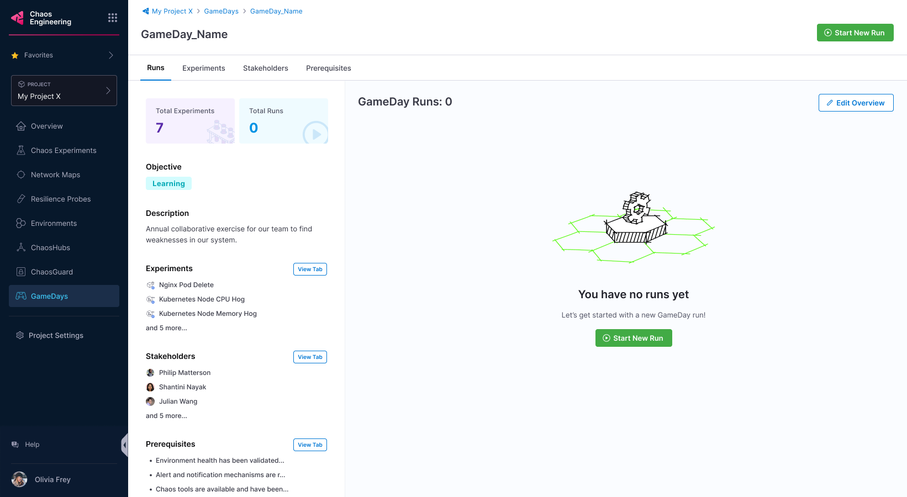
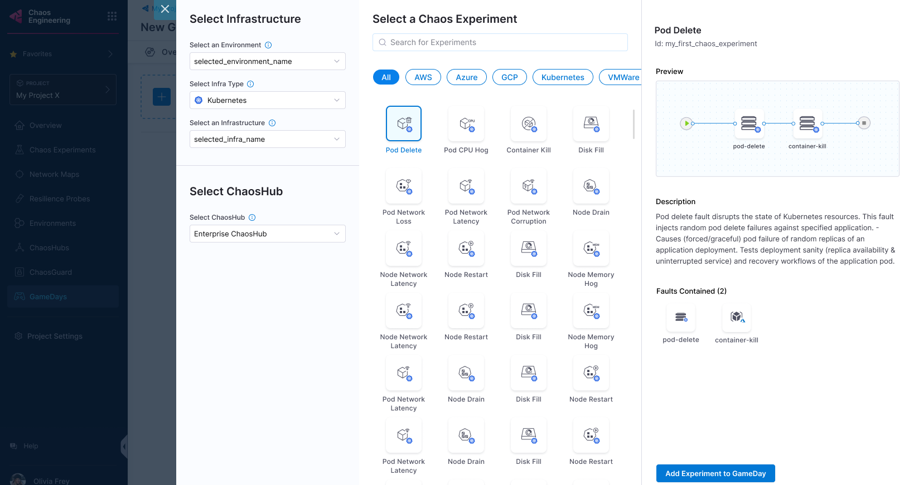
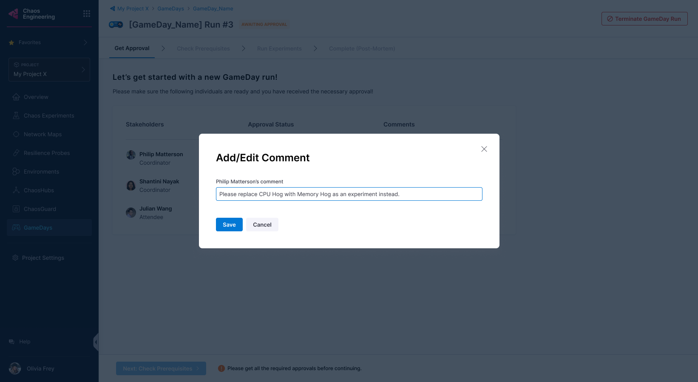
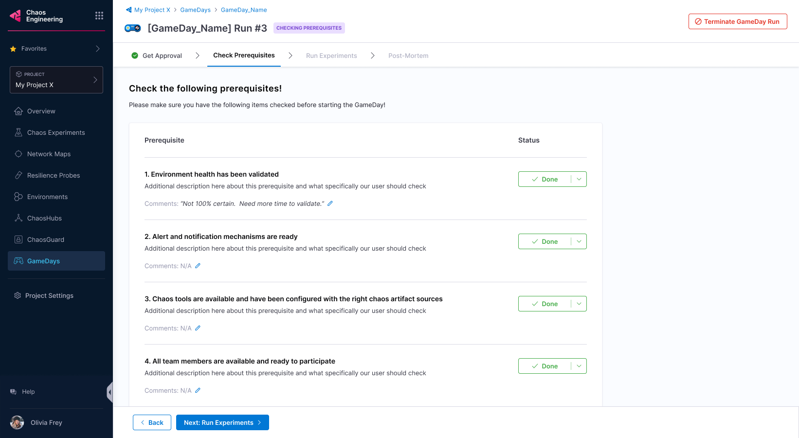

# GameDays

GameDays are structured exercises where teams practice chaos engineering by executing chaos experiments during a specific period. They help determine how well your application responds during outages and how quickly it returns to normalcy.

## What is a GameDay?

GameDay is a methodology used by teams to practice chaos engineering. These teams execute chaos experiments on the application during a specific period. It is a template to schedule and execute one or more chaos experiments across your applications.

It determines the incident response process, that is, how well your application responds/behaves during an outage, and how quickly and effectively it returns to normalcy.

## Why is a GameDay Important?

In general, GameDays help apply a fatal scenario to your application in a safe environment, thereby determining the application's resilience and verifying the system at scale.

At every step in implementing a GameDay, you will either find a glitch in the system that you can address or gain confidence in your application.

## Steps in a GameDay

A GameDay typically involves the following steps:

1. Run chaos experiments on your application
2. Observe the impact of the failure
3. Discuss the technical outcomes

[This video](https://youtu.be/X-4Ripb4e2c) provides a step-by-step walkthrough of GameDay execution.

**Best Practice:** GameDays help decide the type of failure the system would undergo based on the nature of the chaos experiments present within GameDay. Hence, Harness Chaos Engineering strongly recommends you begin with easy use cases with minimal blast radius, such as breaking one container, degrading one instance, and making one availability zone unavailable. Later, you can delve into more complex failures, such as failing an entire service or affecting a large percentage of requests.

## How to Execute a GameDay

Running a GameDay using Harness Chaos Engineering's GameDay feature involves the following steps:

1. Plan your GameDay
2. Create a GameDay and specify the details
3. Add experiments to the GameDay and save it
4. Schedule or run the GameDay
5. Record the conclusion and action items

**Note:** Once you create a GameDay in Harness Chaos Engineering, you can run it multiple times. Harness Chaos Engineering saves information about every run, which includes the date, summary, and any notes you add.

## Prerequisites

Before executing a GameDay, ensure you have:

1. **Harness Chaos Engineering account** with appropriate access
2. **Access to a cluster** where experiments will be executed
3. **Appropriate permissions** to execute GameDays

### Required Permissions

ChaosHubs are associated with chaos experiments, hence you need permissions to create new experiments and modify existing experiments. Chaos experiments, in turn, are executed in a chaos infrastructure, hence you need to have access to **create/edit** and **view** the **chaos infrastructure**. 

Go to **Project Settings** → **Access Control** → **Roles** and create a new role or ask your project admin to create an appropriate role.

## Planning Your GameDay

Address the following questions before proceeding to run a GameDay:

1. Which services should I test?
2. What is the goal of the GameDay?
3. What should I verify or determine by the end of the GameDay?

Once these questions have a viable answer, you can proceed to create a GameDay.

Creating a GameDay involves two steps:
1. Specifying details about the GameDay
2. Adding chaos experiments to the GameDay

## Creating and Running a GameDay

### Start a New GameDay Run

If you have created your GameDay earlier, select **Start New Run** to run the GameDay; otherwise, create a new GameDay.

### Create a GameDay

1. **Navigate to GameDay**
   - Go to **Chaos** module
   - Select **GameDay**
   - Click **+New GameDay**

2. **Add Stakeholders**
   - Add stakeholder names, their roles, and whether they are required to approve a GameDay run
   - Anyone can approve or reject a GameDay run
   - Select **Next: Select Prerequisites**

   

3. **Create Prerequisites**
   
   You can create prerequisites for your GameDay to:
   - Validate environment health
   - Check the availability of relevant chaos tools
   - Check if the chaos tools are configured with the right chaos artifact sources
   - Check the availability of the team members

   - Select **+ Add prerequisite**
   - Enter a title and a description (optional)
   - Select **Save**

   

4. **Select Experiments**
   - Select **Next: Select Experiments** to select chaos experiments to execute

   

   - Select an environment, an infrastructure type, an infrastructure, and a ChaosHub
   - Select the chaos experiment and select **Add Experiment to GameDay**

   

5. **Save GameDay**
   - Select **Save** (or **Discard** if you don't want to proceed)
   - You can add a new experiment, edit or delete existing experiments in this step

   

### Execute GameDay

6. **Get Approval**
   - Once the stakeholders approve the GameDay run, you can proceed

   

   **Note:** A stakeholder can reject the run and state reasons in the comments.

   

7. **Check Prerequisites**
   - Select **Next: Check prerequisites** to validate whether the prerequisites you mentioned earlier have been fulfilled

   

   - You can verify if the prerequisites are fulfilled, and check them
   - If one of them is not fulfilled, you will not be able to execute the experiments

   

   **Tip:** You can add comments about the prerequisite validation.

   

8. **Run Experiments**
   - Once all the prerequisites are fulfilled, select **Next: Run experiments**

   

   - Once all the experiments complete execution, select **Done Running Experiments**

   

   **Options during execution:**
   - Select **Terminate GameDay Run** to stop GameDay execution. Select **Terminate this run** to confirm.

   

   - Select **Add/View Notes** to note your findings about experiments in the GameDay.

   

9. **Complete GameDay**
   - Once the experiments complete execution, select **Complete GameDay Run**
   - You can view the summary of the runs and the run observations

   

   **Note:** Select **Done Running Experiments** to complete the run. If your chaos experiments have faults that have not run, they will be marked **Skipped**.

   

## View GameDay Run Report

To view the GameDay run report, navigate to your GameDay run and select **View Report**.

### Download GameDay Run Report

1. To download the report, select **Download Report** on the page where you view the GameDay run report.

   

2. Select **Save** and specify a name for the file (or use the default name provided).

   

## Best Practices

### GameDay Planning
- **Start with simple scenarios** with minimal blast radius
- **Gradually increase complexity** as team confidence grows
- **Include diverse stakeholders** from different teams
- **Set clear objectives** and success criteria

### Execution
- **Follow the structured process** for consistent results
- **Document observations** throughout the exercise
- **Encourage team participation** and discussion
- **Maintain focus** on learning objectives

### Post-GameDay
- **Conduct thorough debriefs** to capture learnings
- **Create action items** for identified improvements
- **Share results** with broader organization
- **Plan follow-up GameDays** to validate improvements

## Integration with Other Features

### Chaos Experiments
- **Reuse existing experiments** in GameDay scenarios
- **Create experiment collections** for different GameDay types
- **Validate experiment effectiveness** through GameDay execution

### Application Maps
- **Use maps** to plan GameDay scenarios
- **Visualize impact** of planned experiments
- **Coordinate team understanding** of system dependencies

### Probes and Actions
- **Monitor system health** during GameDay execution
- **Automate responses** to experiment outcomes
- **Validate monitoring effectiveness** through GameDay scenarios

## Troubleshooting

### Common Issues

**GameDay approval delays:**
- Ensure all required stakeholders are available
- Set clear approval timelines
- Provide adequate context for approval decisions

**Prerequisite validation failures:**
- Verify environment health before GameDay
- Check tool availability and configuration
- Confirm team member availability

**Experiment execution issues:**
- Validate infrastructure connectivity
- Check experiment permissions and configuration
- Verify chaos infrastructure health

## Next Steps

Ready to organize your first GameDay?

1. **[Plan Chaos Experiments](./chaos-experiments)** - Create experiments for your GameDay scenarios
2. **[Set up Application Maps](./application-maps)** - Visualize systems for better GameDay planning
3. **[Configure Probes](./probes)** - Monitor GameDay effectiveness
4. **[Configure Actions](./actions)** - Automate GameDay responses and notifications

## Conclusion

Congratulations on scheduling (or running) your GameDay! Based on the results, you can take steps to improve the resilience of your application.

GameDays provide a structured approach to chaos engineering that builds both technical resilience and team preparedness for handling real-world incidents.
