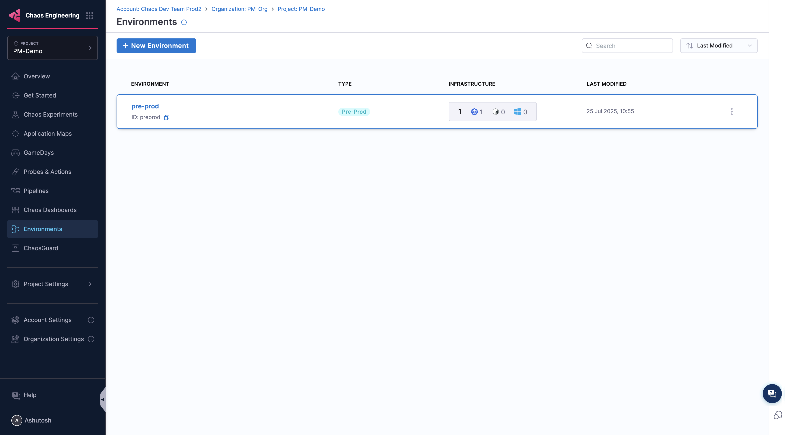
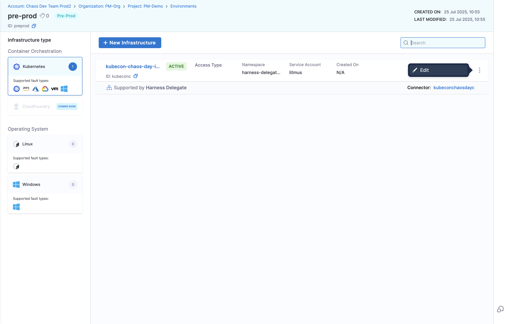
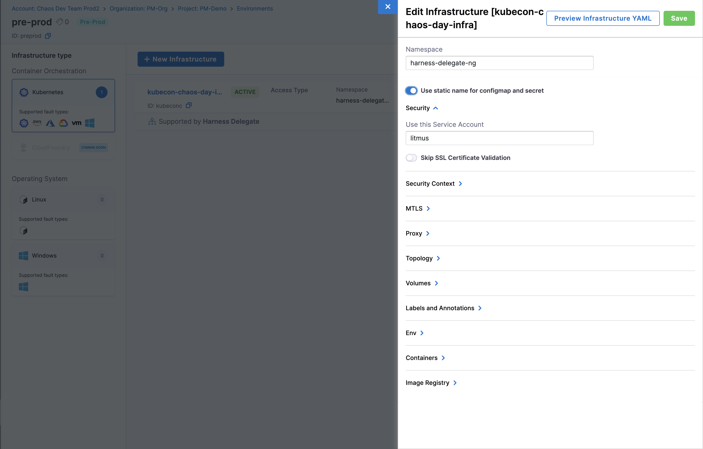
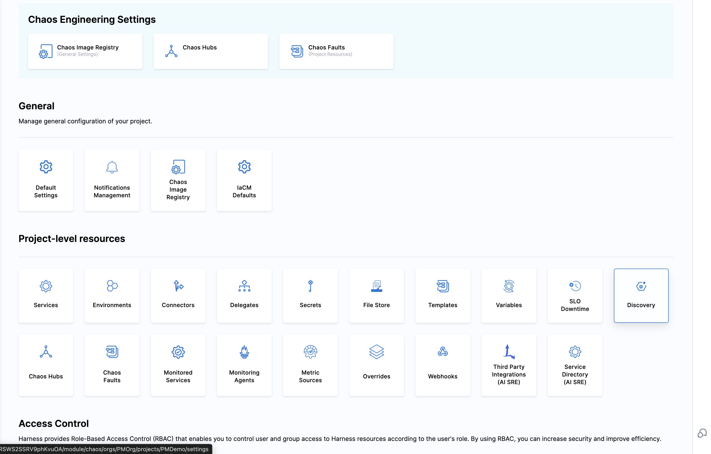
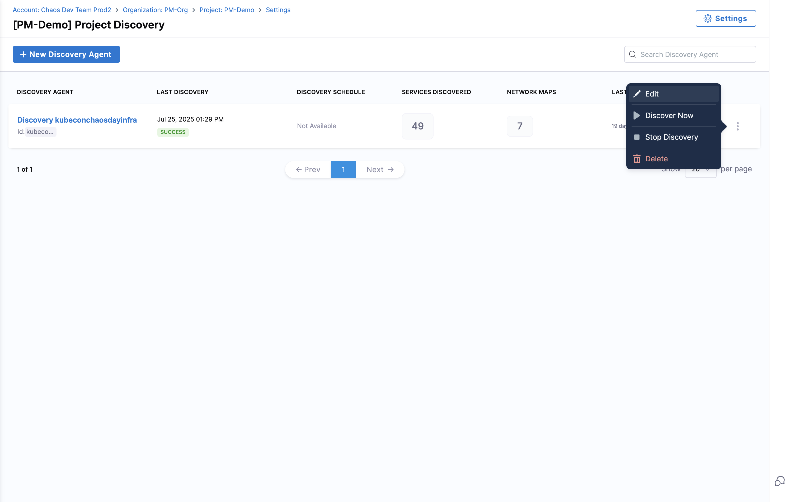
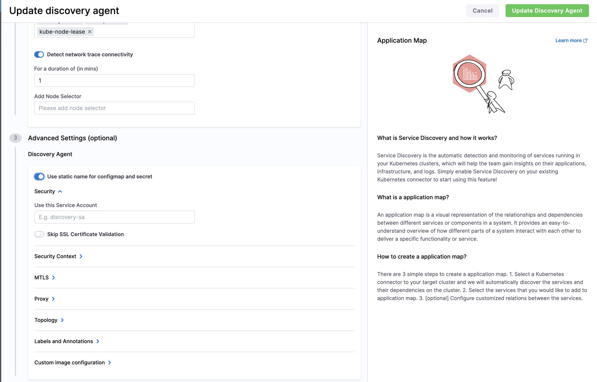

import Tabs from '@theme/Tabs';
import TabItem from '@theme/TabItem';

This guide explains how to set up and run chaos engineering experiments using Harness Chaos Engineering on Google Kubernetes Engine (GKE) Autopilot clusters.

## Overview

[GKE Autopilot](https://cloud.google.com/blog/products/containers-kubernetes/introducing-gke-autopilot) is Google's fully managed Kubernetes service that provides a hands-off experience while maintaining security and compliance. However, Autopilot has specific restrictions compared to standard GKE clusters, including limited permissions and no direct access to nodes.

For additional information about running privileged workloads on GKE Autopilot, see [Google Partner Docs](https://cloud.google.com/kubernetes-engine/docs/resources/autopilot-partners) and [Run privileged workloads from GKE Autopilot partners](https://cloud.google.com/kubernetes-engine/docs/how-to/run-autopilot-partner-workloads).

## Prerequisites

Before you begin, ensure you have:

- A running GKE Autopilot cluster
- `kubectl` access to the cluster with appropriate permissions
- A Harness account with Chaos Engineering module enabled
- Cluster admin permissions to create allowlist synchronizers

## Step-by-Step Setup Guide

### Step 1: Configure GKE Autopilot Allowlist

GKE Autopilot requires an allowlist that defines exemptions from security restrictions for specific workloads. Harness maintains an allowlist for chaos engineering operations that you need to apply to your cluster.

**Required permissions:** You need cluster admin permissions and `kubectl` access to apply the allowlist synchronizer.

Apply the allowlist synchronizer to your GKE Autopilot cluster:

```yaml
kubectl apply -f - <<'EOF'
apiVersion: auto.gke.io/v1
kind: AllowlistSynchronizer
metadata:
  name: harness-chaos-allowlist-synchronizer
spec:
  allowlistPaths:
  - Harness/allowlists/chaos/v1.62/*
  - Harness/allowlists/service-discovery/v0.42/*
EOF
```

Wait for the allowlist synchronizer to be ready:

```bash
kubectl wait --for=condition=Ready allowlistsynchronizer/harness-chaos-allowlist-synchronizer --timeout=60s
```

:::info Version Updates
The allowlist paths include version numbers (e.g., `v1.62`, `v0.42`) that may change with Harness updates. If you encounter issues:

1. Check the [Harness release notes](/release-notes/chaos-engineering) for the latest supported versions
2. Update the allowlist paths accordingly
3. Contact Harness support for the most current allowlist versions
:::

### Step 2: Enable GKE Autopilot Compatibility

After applying the allowlist synchronizer, you need to enable GKE Autopilot compatibility in your existing Harness infrastructure:

:::note Alternative Setup Options
You can also configure the **"Use static name for configmap and secret"** option for GKE Autopilot compatibility during:

- [1-click chaos setup](/docs/chaos-engineering/quickstart#automated-onboarding)
- New discovery agent creation
- For existing discovery agents
:::

#### Configure Infrastructure for GKE Autopilot

1. Navigate to **Chaos Engineering** → **Environments** and select your environment.

        

2. Click the **options menu (⋮)** next to your infrastructure and select **Edit Infrastructure**

        

3. Toggle on **"Use static name for configmap and secret"** and click **Save**

        

#### Configure Service Discovery

1. Navigate to **Project Settings** → **Discovery**

        

2. Click the **options menu (⋮)** next to your discovery agent and select **Edit**

        

3. Toggle on **"Use static name for configmap and secret"** and click **Update Discovery Agent**

        

### Step 3: Start Running Chaos Experiments

Your GKE Autopilot cluster is now ready for chaos engineering. To create and run your first experiment, follow the [Create Experiments](/docs/chaos-engineering/guides/chaos-experiments/create-experiments) guide and choose from any of the supported experiments listed below.

## Supported Chaos Experiments

Harness Chaos Engineering provides comprehensive Kubernetes fault coverage. On GKE Autopilot, experiments are categorized based on compatibility with Autopilot's security model.

### Supported Pod-Level Experiments

These experiments work seamlessly on GKE Autopilot as they operate within container boundaries:

#### **Container Resource Stress**
- **[Pod CPU Hog](/docs/chaos-engineering/faults/chaos-faults/kubernetes/pod/pod-cpu-hog)**: Consumes excess CPU resources of application containers
- **[Pod CPU Hog Exec](/docs/chaos-engineering/faults/chaos-faults/kubernetes/pod/pod-cpu-hog-exec)**: Alternative CPU stress implementation using exec
- **[Pod Memory Hog](/docs/chaos-engineering/faults/chaos-faults/kubernetes/pod/pod-memory-hog)**: Consumes memory resources causing significant memory usage spikes
- **[Pod Memory Hog Exec](/docs/chaos-engineering/faults/chaos-faults/kubernetes/pod/pod-memory-hog-exec)**: Alternative memory stress implementation using exec
- **[Pod IO Stress](/docs/chaos-engineering/faults/chaos-faults/kubernetes/pod/pod-io-stress)**: Causes I/O stress by spiking input/output requests

#### **Container Storage Operations**
- **[Disk Fill](/docs/chaos-engineering/faults/chaos-faults/kubernetes/pod/disk-fill)**: Fills the pod's ephemeral storage
- **[FS Fill](/docs/chaos-engineering/faults/chaos-faults/kubernetes/pod/fs-fill)**: Applies filesystem stress by filling pod's ephemeral storage

#### **Container Lifecycle Management**
- **[Container Kill](/docs/chaos-engineering/faults/chaos-faults/kubernetes/pod/container-kill)**: Causes container failure on specific or random replicas
- **[Pod Delete](/docs/chaos-engineering/faults/chaos-faults/kubernetes/pod/pod-delete)**: Causes specific or random replicas to fail forcibly or gracefully
- **[Pod Autoscaler](/docs/chaos-engineering/faults/chaos-faults/kubernetes/pod/pod-autoscaler)**: Tests whether nodes can accommodate multiple replicas

#### **Network Chaos (Container-Level)**
- **[Pod Network Latency](/docs/chaos-engineering/faults/chaos-faults/kubernetes/pod/pod-network-latency)**: Introduces network delays using traffic control
- **[Pod Network Loss](/docs/chaos-engineering/faults/chaos-faults/kubernetes/pod/pod-network-loss)**: Causes packet loss using netem rules
- **[Pod Network Corruption](/docs/chaos-engineering/faults/chaos-faults/kubernetes/pod/pod-network-corruption)**: Injects corrupted packets into containers
- **[Pod Network Duplication](/docs/chaos-engineering/faults/chaos-faults/kubernetes/pod/pod-network-duplication)**: Duplicates network packets to disrupt connectivity
- **[Pod Network Partition](/docs/chaos-engineering/faults/chaos-faults/kubernetes/pod/pod-network-partition)**: Blocks 100% ingress/egress traffic using network policies
- **[Pod Network Rate Limit](/docs/chaos-engineering/faults/chaos-faults/kubernetes/pod/pod-network-rate-limit)**: Limits network bandwidth using Token Bucket Filter

#### **DNS Manipulation**
- **[Pod DNS Error](/docs/chaos-engineering/faults/chaos-faults/kubernetes/pod/pod-dns-error)**: Injects chaos to disrupt DNS resolution in pods
- **[Pod DNS Spoof](/docs/chaos-engineering/faults/chaos-faults/kubernetes/pod/pod-dns-spoof)**: Mimics DNS resolution to redirect traffic

#### **HTTP/API Fault Injection**
- **[Pod HTTP Latency](/docs/chaos-engineering/faults/chaos-faults/kubernetes/pod/pod-http-latency)**: Injects HTTP response latency via proxy server
- **[Pod HTTP Modify Body](/docs/chaos-engineering/faults/chaos-faults/kubernetes/pod/pod-http-modify-body)**: Modifies HTTP request/response body content
- **[Pod HTTP Modify Header](/docs/chaos-engineering/faults/chaos-faults/kubernetes/pod/pod-http-modify-header)**: Overrides HTTP header values
- **[Pod HTTP Reset Peer](/docs/chaos-engineering/faults/chaos-faults/kubernetes/pod/pod-http-reset-peer)**: Stops outgoing HTTP requests by resetting TCP connections
- **[Pod HTTP Status Code](/docs/chaos-engineering/faults/chaos-faults/kubernetes/pod/pod-http-status-code)**: Modifies HTTP response status codes

#### **API Gateway/Service Mesh Faults**
- **[Pod API Block](/docs/chaos-engineering/faults/chaos-faults/kubernetes/pod/pod-api-block)**: Blocks API requests through path filtering
- **[Pod API Latency](/docs/chaos-engineering/faults/chaos-faults/kubernetes/pod/pod-api-latency)**: Injects API request/response latency via proxy
- **[Pod API Modify Body](/docs/chaos-engineering/faults/chaos-faults/kubernetes/pod/pod-api-modify-body)**: Modifies API request/response body using regex
- **[Pod API Modify Header](/docs/chaos-engineering/faults/chaos-faults/kubernetes/pod/pod-api-modify-header)**: Overrides API header values
- **[Pod API Status Code](/docs/chaos-engineering/faults/chaos-faults/kubernetes/pod/pod-api-status-code)**: Changes API response status codes with path filtering
- **[Pod API Modify Response Custom](/docs/chaos-engineering/faults/chaos-faults/kubernetes/pod/pod-api-modify-response-custom)**: Comprehensive API response modification

#### **File System I/O Manipulation**
- **[Pod IO Attribute Override](/docs/chaos-engineering/faults/chaos-faults/kubernetes/pod/pod-io-attribute-override)**: Modifies properties of files in mounted volumes
- **[Pod IO Error](/docs/chaos-engineering/faults/chaos-faults/kubernetes/pod/pod-io-error)**: Returns errors on system calls for mounted volume files
- **[Pod IO Latency](/docs/chaos-engineering/faults/chaos-faults/kubernetes/pod/pod-io-latency)**: Delays system calls for files in mounted volumes
- **[Pod IO Mistake](/docs/chaos-engineering/faults/chaos-faults/kubernetes/pod/pod-io-mistake)**: Causes incorrect read/write values in mounted volumes

#### **JVM-Specific Chaos (Java Applications)**
- **[Pod JVM CPU Stress](/docs/chaos-engineering/faults/chaos-faults/kubernetes/pod/pod-jvm-cpu-stress)**: Consumes excessive CPU threads in Java applications
- **[Pod JVM Method Exception](/docs/chaos-engineering/faults/chaos-faults/kubernetes/pod/pod-jvm-method-exception)**: Invokes exceptions in Java method calls
- **[Pod JVM Method Latency](/docs/chaos-engineering/faults/chaos-faults/kubernetes/pod/pod-jvm-method-latency)**: Introduces delays in Java method execution
- **[Pod JVM Modify Return](/docs/chaos-engineering/faults/chaos-faults/kubernetes/pod/pod-jvm-modify-return)**: Modifies return values of Java methods
- **[Pod JVM Trigger GC](/docs/chaos-engineering/faults/chaos-faults/kubernetes/pod/pod-jvm-trigger-gc)**: Forces garbage collection in Java applications

#### **Database Integration Chaos**
- **[Pod JVM SQL Exception](/docs/chaos-engineering/faults/chaos-faults/kubernetes/pod/pod-jvm-sql-exception)**: Injects exceptions in SQL queries (Java apps)
- **[Pod JVM SQL Latency](/docs/chaos-engineering/faults/chaos-faults/kubernetes/pod/pod-jvm-sql-latency)**: Introduces latency in SQL queries (Java apps)
- **[Pod JVM Mongo Exception](/docs/chaos-engineering/faults/chaos-faults/kubernetes/pod/pod-jvm-mongo-exception)**: Injects exceptions in MongoDB calls (Java apps)
- **[Pod JVM Mongo Latency](/docs/chaos-engineering/faults/chaos-faults/kubernetes/pod/pod-jvm-mongo-latency)**: Introduces latency in MongoDB calls (Java apps)
- **[Pod JVM Solace Exception](/docs/chaos-engineering/faults/chaos-faults/kubernetes/pod/pod-jvm-solace-exception)**: Injects exceptions in Solace queries (Java apps)
- **[Pod JVM Solace Latency](/docs/chaos-engineering/faults/chaos-faults/kubernetes/pod/pod-jvm-solace-latency)**: Introduces latency in Solace queries (Java apps)

#### **Cache and Data Store Chaos**
- **[Redis Cache Expire](/docs/chaos-engineering/faults/chaos-faults/kubernetes/pod/redis-cache-expire)**: Expires Redis keys for specified duration
- **[Redis Cache Limit](/docs/chaos-engineering/faults/chaos-faults/kubernetes/pod/redis-cache-limit)**: Limits memory used by Redis cache
- **[Redis Cache Penetration](/docs/chaos-engineering/faults/chaos-faults/kubernetes/pod/redis-cache-penetration)**: Sends continuous requests for non-existent keys

#### **System Time Manipulation**
- **[Time Chaos](/docs/chaos-engineering/faults/chaos-faults/kubernetes/pod/time-chaos)**: Introduces controlled time offsets to disrupt system time

### Node-Level Chaos Experiments

Harness Chaos now supports select node-level chaos experiments on GKE Autopilot that operate within the security constraints of the managed environment:

#### **Node Network Chaos**
- **[Node Network Loss](/docs/chaos-engineering/faults/chaos-faults/kubernetes/node/node-network-loss)**: Injects network packet loss at the node level
- **[Node Network Latency](/docs/chaos-engineering/faults/chaos-faults/kubernetes/node/node-network-latency)**: Introduces network latency for node-level traffic

#### **Node Service Management**
- **[Kubelet Service Kill](/docs/chaos-engineering/faults/chaos-faults/kubernetes/node/kubelet-service-kill)**: Stops the kubelet service on target nodes
- **[Node Restart](/docs/chaos-engineering/faults/chaos-faults/kubernetes/node/node-restart)**: Performs controlled restart of Kubernetes nodes

## Next Steps

Now that you have Harness Chaos Engineering set up on your GKE Autopilot cluster:

1. **Create Your First Experiment**: Start with a simple [Pod CPU Hog](/docs/chaos-engineering/faults/chaos-faults/kubernetes/pod/pod-cpu-hog) experiment with low intensity to test your setup

2. **Set Up Application Discovery**: Enable **Service Discovery** in your infrastructure settings and explore **Application Maps** to visualize your services

3. **Add Monitoring**: Configure [probes](/docs/chaos-engineering/guides/probes) to validate your application's resilience during experiments

4. **Explore More Experiments**: Try network chaos like [Pod Network Latency](/docs/chaos-engineering/faults/chaos-faults/kubernetes/pod/pod-network-latency) or JVM faults for Java applications
