This topic describes how you can configure **ChaosGuard** to enforce security policies during chaos experiments execution. An additional layer of security that is executed before running a chaos experiment is [ChaosGuard](/docs/chaos-engineering/use-harness-ce/governance/governance-in-execution/).

[This](https://youtu.be/cHFiBvQPCLU) video provides a walkthrough of configuring the rules and conditions in ChaosGuard.

## Prerequisites

[Install a Harness Delegate or a dedicated chaos infrastructure](/docs/chaos-engineering/use-harness-ce/infrastructures/types/) before creating a condition because a condition is applied to an infrastructure.

## Configure a condition

1. In the **Chaos** module, select **ChaosGuard**, and select **Conditions**. The **Conditions** page lists existing conditions (if any).

	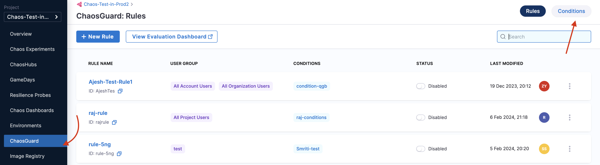

2. To create a condition, click **New condition**.

	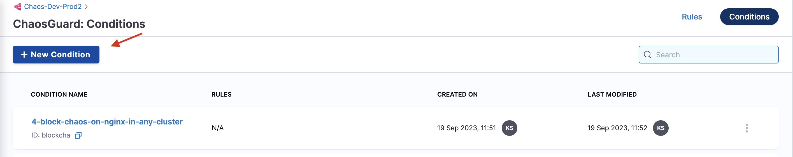

3. Provide a name, a description (optional), and tags (optional). Specify the infrastructure. If you select either **Linux** or **Windows**, click **Save**.

	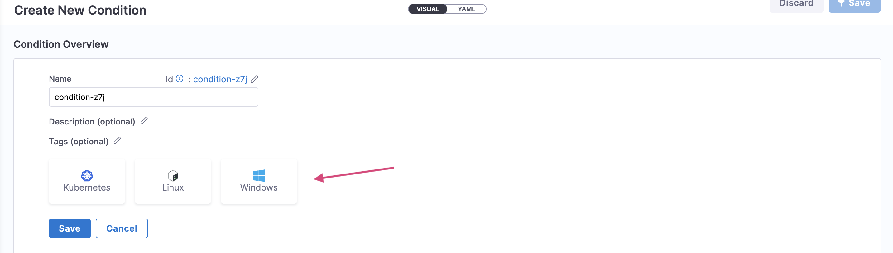

	3a. If you select **Kubernetes**, you can select one of **Harness Infrastructures** (also known as Harness Delegate) or **Dedicated Chaos Infrastructure**. Click **Save**.

		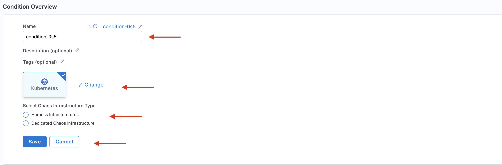

This gives you 3 ways to define a condition from the **Condition Editor**:
- [YAML manifest](#define-constraints-using-yaml)
- [Using the visual editor](#define-constraints-using-the-visual-editor)
- [Harness AIDA](#define-constraints-using-aida)

### Define constraints using YAML

1. Select the **YAML** tab.

	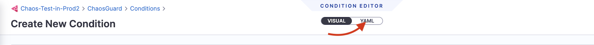

2. Specify the relevant values corresponding to the respective names. Click **Save**. In this example, the YAML configuration indicates that a condition is applied to a fault named **pod-delete** with the specified **label**, **namespace**, and **serviceAccount**.

	

### Define constraints using the visual editor

1. To add conditions using a visual editor, navigate to the **VISUAL** tab of the condition you created earlier.

	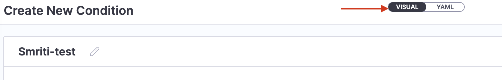

2. Add the **WHAT** clause. It blocks a fault whose name is **EQUAL TO** (or matches) or **NOT EQUAL TO** (everything else apart from the given value) pod delete. You can add more than one **WHAT** clause. This clause also takes the experiment name as input.

	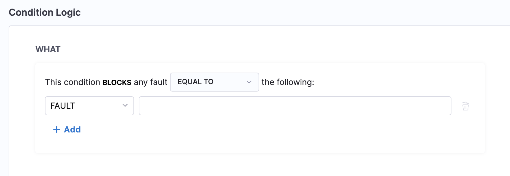

3. Add the **WHERE** clause. It blocks one or more infrastructure. Select more than one infrastructure by hovering over the field.

	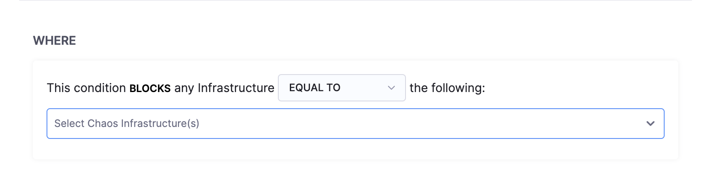

4. Add the **WHICH** clause. It blocks the infrastructure that has specific entries for **APPLICATION MAP**, **SERVICES**, **NAMESPACE** (mandatory), **KIND** (mandatory), and **APP LABEL**. You can add more than one **WHICH** clause.

	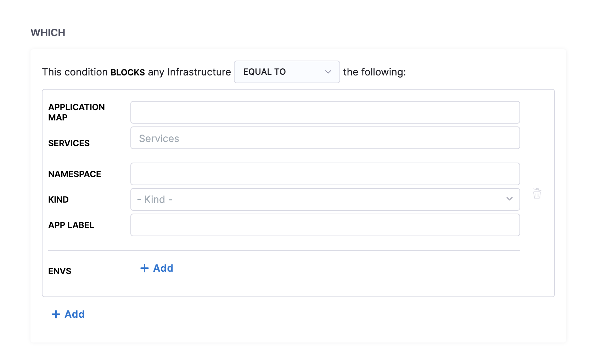

5. Add the **USING** clause. It blocks specific service account. You can add more than one service account by clicking the field and adding service account name to it. Click **Save**.

	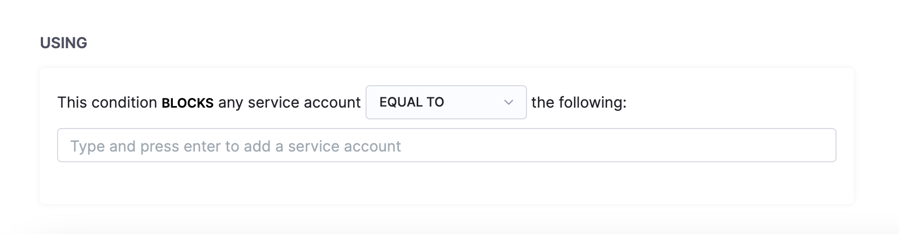

:::tip
- You can use both **'EQUAL'** and **'NOT EQUAL TO'** operators in the condition logic for WHAT, WHERE, WHICH and USING. 
- You can also use wildcards within the condition entities, which offers flexibility and control in defining conditions.
:::

### Define constraints using AIDA

1. Instead of selecting the required parameters, you can generate conditions with the help of Harness AIDA. AIDA assistant shows up when you are configuring a condition. You can choose one of the suggestions provided by Harness AIDA by clicking on it or writing something along the same lines as the suggestions.

    

2. When you type a condition, you will see that AIDA generates a YAML corresponding to your condition. If the YAML generated meets the conditions, you can click **Apply YAML**.

    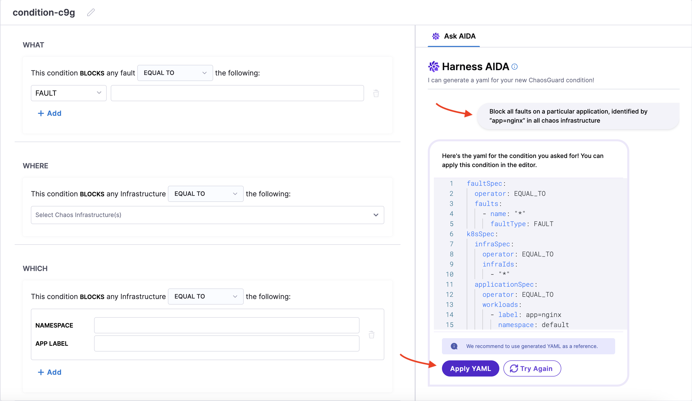

3. If the generated YAML does not meet your conditions, click **Try again**. In the snippet below, you will see that AIDA applies the YAML generated to the editor.

    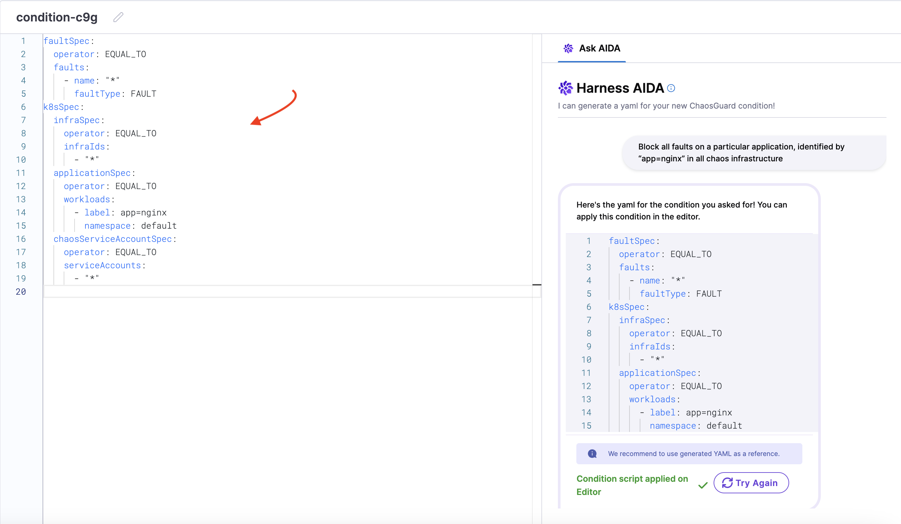

### Save condition

After you define the constraints of a condition either using [YAML](#define-constraints-using-yaml), [visual editor](#define-constraints-using-the-visual-editor), or [AIDA](#define-constraints-using-aida), select **Save**.

    

## Configure a rule

1. Click **New rule**.

	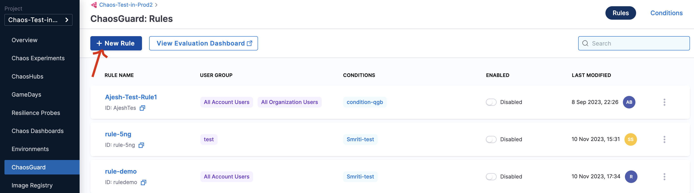

2. Specify parameters such as name, description (optional), tags (optional), user group to apply the rule (you can apply the rule to multiple user groups), and time window to apply the rule. You can apply multiple time windows to apply the rule. Click **Next**.

	

3. Select user groups. Click **Apply Selected**.

	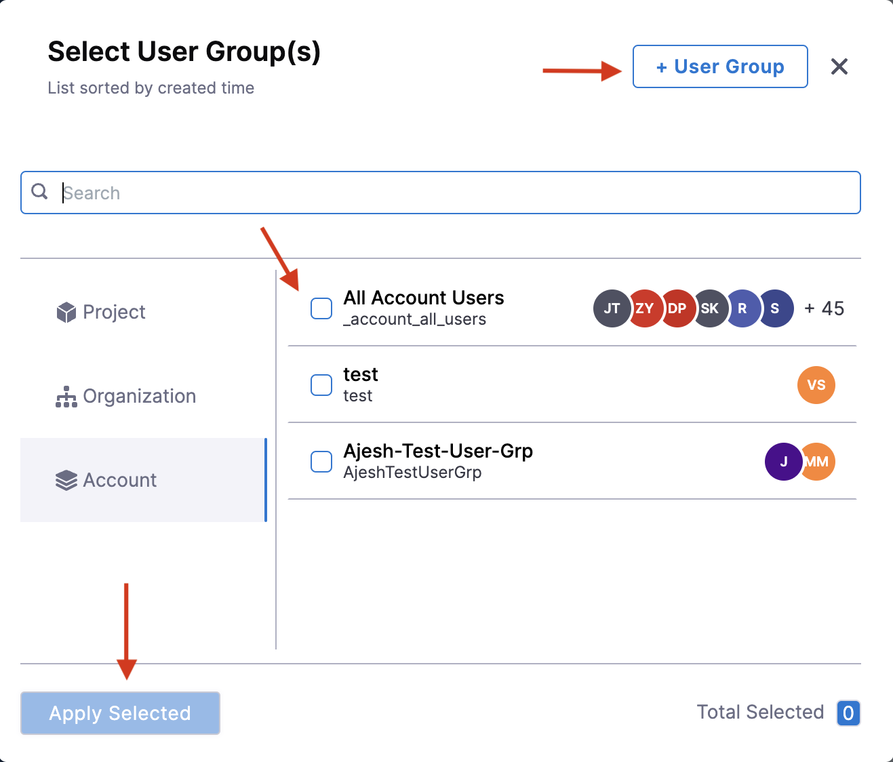

4. Select a condition (or multiple conditions) that you wish to apply. Click **Done**.

	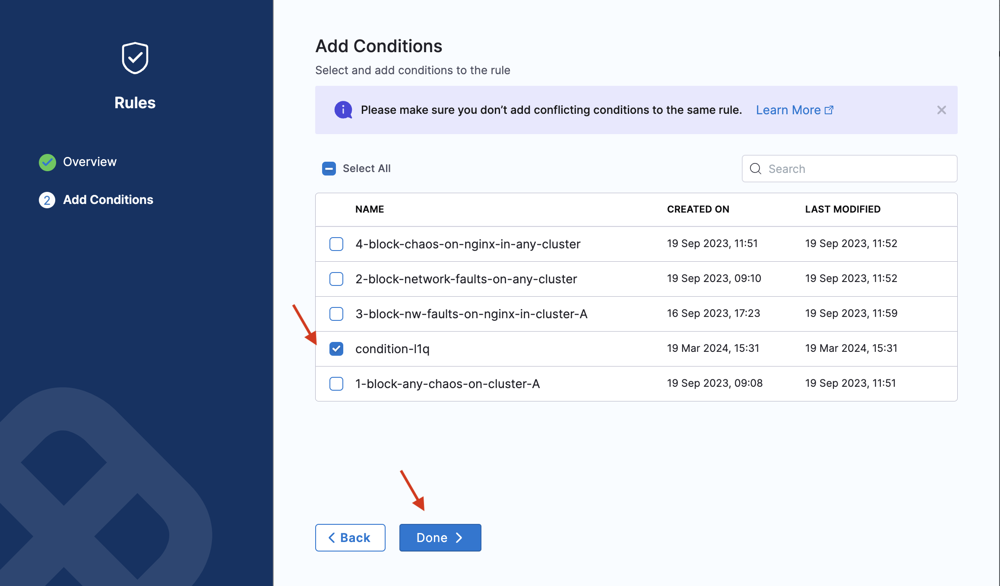

	:::info note
	* Below is a snap that shows a successful evaluation of all the rules in a chaos experiment.

		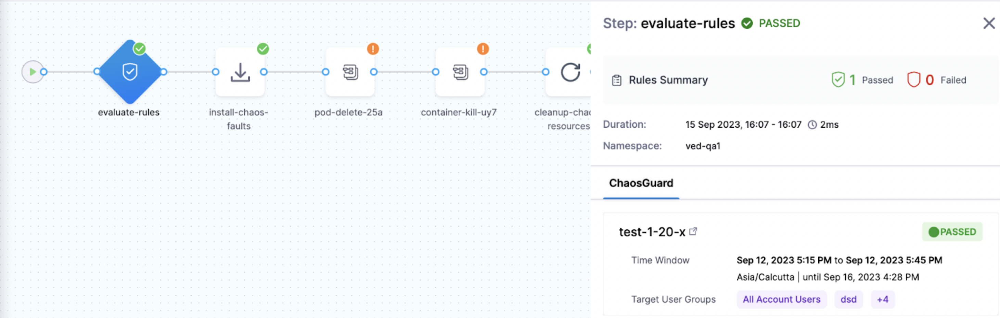

	* Below is a snap that shows a failed evaluation of some (or all) rules in a chaos experiment.

		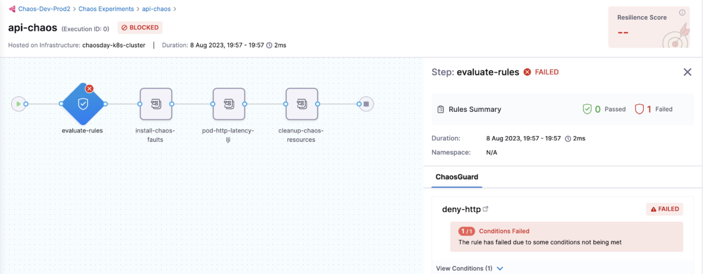
	:::

### Enable and disable rules

* The image below shows the two different states of a rule (enable and disable).

	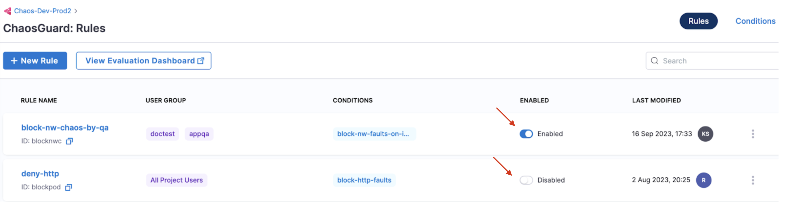